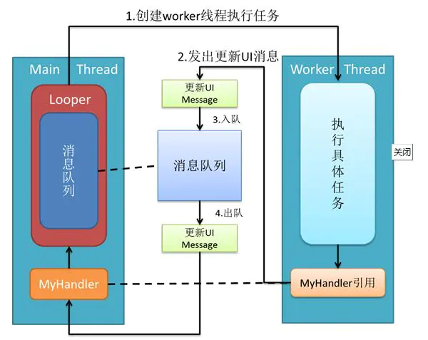

# Handler

UI 控件不是线程安全的。当对 UI 进行操作时，ViewRootImpl#checkThread() 对　UI 操作做了检查，不是主线程就会抛出异常。


1. 加上锁会使 UI 操作的逻辑变得复杂。
2. 锁机制降低了 UI 的访问效率，一旦加锁即使是单线程时，也会有获取锁和释放的耗时操作。

## Handler Looper Message 关系是什么？



Handler 包含一个 MessageQueue 和一个 Looper。

1. 当调用 Handler post 一个 Ranable(最终还是调用　send)或 send 方法时，其实是将消息存入到消息队列。
2. Looper 的 loop 调用时，会不停的循环检查，MessageQueue 中是否有新的需要处理的消息。
3. 当有一个新的消息，并且它的执行时间到了的时候，Loop 将它从队列取出，如果Message 中有 Runnable 回调，则会调用执行任务，否则，Message 同时也持有一个 Handler 的引用，则会获取 Handler 来执行它的 `handleMessage` 方法。


## Messagequeue 的数据结构是什么？为什么要用这个数据结构？

单链表。这是因为，消息的处理并不是一个严格的先进先出的机制。handler 可以在发送任务是 `sendMessageDelayed` 和　`sendMessageAtTime`, `postAtTime`, `postDelayed` 来选择延迟或者定时执行。其机制是在 message 中存储了一个 `when` 的执行时间戳，一个消息到来时，会循环遍历所有的消息，检查这个执行的时间，直到找到一个执行事件比它晚的，插入到执行晚的前面的前面。如果找不到或者队列是空的，才会放入队列末尾。这样的循环检查，插入显然单链表比较方便。而删除的　`next()` 方法是一个循环的，如果没有消息，或者消息时间不到，则会阻塞在这里，直到等到一个消息，然后返回。这样的插入和删除操作，单链表更有优势。


## 如何在子线程中创建 Handler?

1. 调用 Looper.prepare() 为线程创建 Looper 对象。
2. 调用 Looper.loop() 开启消息处理循环。
3. 创建 Handler 对象，如果想要发送的是 message, 则需要复写它的 `handleMessage` 方法处理对象。即可在其他线程中调用 `handler` 的 `post` 发送 `Rannable` 任务或者　`send message` 了。另外，Handler 创建的时候，还能传递一个 CallBack 作为本身的回调。


## Handler post 方法原理？

post 方法其实还是调用的 `sendMessage 方法`，首先调用　`Message.obtain()` 从废弃消息池中获取一个 `Message` 对象，然后将其赋值给 `Message` 的 `callback`才将 `message` 放入到消息队列中。


## ThreadLocal 必备

并不是线程，是一个线程内部的数据存储类。用于在每个线程中存储数据，它能够在不同线程中互不干扰的存储并提供数据。使用 Handler 必须为线程创建一个 Looper。　当调用 `Looper.prepare(true)` 为该线程创建 Looper 时，它并没有返回值，而是将其放在内部单例的 ThreadLocal 中，ThreadLocal 将其自身存放到当前线程的 value 中。　当调用 `Looper.loop()` 时，则从当前线程中获取，然后开始循环。


不同线程调用ThreadLocal时，ThreadLocal 从当前线程获取一个数组，然后根据当前参数索引去查找对应的值。

```Java
public void set(T value) {
    Thread t = Thread.currentThread();
    ThreadLocalMap map = getMap(t);
    if (map != null)
        map.set(this, value);
    else
        createMap(t, value);
}
```

每个 Thread 中都有一个存储 ThreadLocal 数据的变量　`ThreadLocal.value`


应用：

1. 不同线程中存储不同的对象。例如为了防止监听器作为参数传递的很深，可以存储在 ThreadLocal 中。


## 休眠和唤醒

https://www.zhihu.com/question/34652589/answer/89375831

主线程的死循环一直运行是不是特别消耗CPU资源呢？ 其实不然，这里就涉及到Linux pipe/epoll机制，简单说就是在主线程的MessageQueue没有消息时，便阻塞在loop的queue.next()中的nativePollOnce()方法里，详情见Android消息机制1-Handler(Java层)，此时主线程会释放CPU资源进入休眠状态，直到下个消息到达或者有事务发生，通过往pipe管道写端写入数据来唤醒主线程工作。这里采用的epoll机制，是一种IO多路复用机制，可以同时监控多个描述符，当某个描述符就绪(读或写就绪)，则立刻通知相应程序进行读或写操作，本质同步I/O，即读写是阻塞的。 所以说，主线程大多数时候都是处于休眠状态，并不会消耗大量CPU资源。


nativePollOnce

nativeWeak 

在构造native层的Looper时，会通过eventfd函数创建一个唤醒文件描述符，利用(pipe/epoll)IO多路复用机制epoll可以监听该描述符，实现线程间等待/通知。

https://blog.csdn.net/chewbee/article/details/78108201#nativepollonce%E6%96%B9%E6%B3%95


## 详细执行流程查看

https://blog.csdn.net/u014443348/article/details/88193787

