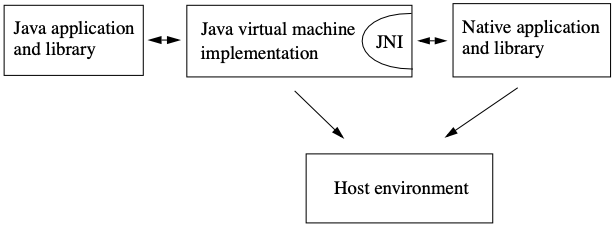

# JNI

JNI 是 Java Native Interface 的缩写，它提供了若干的 API 实现了 Java 和其他语言写的代码进行交互（主要是 C & C++）。从 Java1.1 开始，JNI 标准成为 java 平台的一部分。JNI一开始是为了原生程序语言，尤其是 C 和 C++ 而设计的，但是它并不妨碍你使用其他编程语言，只要调用约定受支持就可以了。使用 java 与原生代码交互，通常会丧失平台可移植性。但是，有些情况下这样做是可以接受的，甚至是必须的。例如，使用一些旧的库，与硬件、操作系统进行交互，或者为了提高程序的性能。JNI 标准规定要保证原生代码能工作在任何 Java 虚拟机环境。

Native Code: 这里翻译为原生代码。指能直接由操作系统运行的代码，它们就像系统的原著名，不需要虚拟机的翻译。



## JNI的副作用

一旦使用 JNI，JAVA 程序就丧失了 JAVA 平台的两个优点：

1、程序不再跨平台。要想跨平台，必须在不同的系统环境下重新编译原生代码。

2、程序不再是内存安全的，原生代码的不当使用可能导致整个程序崩溃。一个通用规则是，你应该让原生方法集中在少数几个类当中。这样就降低了 JAVA 和 C 之间的耦合性。

## 实现原理

原生代码必须编译为一个动态库，在使用时，由 Java 虚拟机加载动态库到内存链接为 Java 虚拟机的一部分。 在调用 Native 方法时 Java 虚拟机查找动态库并调用其中的方法。同样，原生方法对 Java 的回调，也是由虚拟机转到对 Java 的调用。这也是原生代码必须编译为动态库而不是其它格式就能使用的原因。


## 实现步骤

想要使用 C/C++ 的程序，需要将 Native 代码编译为共享库，然后使用 Java 提供的 API，将共享库加载到虚拟机中。共享库的名字有一个约定，使用 `lib<库名>.so`，比如 `libhello.so`。

#### 1. 在 java 程序中加载共享库

```java
// TestJni.java
package test;

public class TestJni {

    // 载入动态库
    static {
        System.out.println(System.getProperty("java.library.path"));
        // 1. 库文件名是　libhello.so，这里要写 hello. 不能带　lib 和　so 后缀
        // 2. 不能带路径，路径通过在运行的时候，-D 参数指定。如
        // java -Djava.library.path=. test.TestJni
        System.loadLibrary("hello");
    }
}
```
static 关键字会让该内容在类加载的时候被执行，这样在第一次使用 TestJni 的时候，共享库会自动被调用。或者你也可以自己在合适的时间点自己加载。加载共享库完成之后，JNI_OnLoad 的方法就会被调用。

[当加载该库的 classloader 被垃圾回收时，共享库被卸载。](https://web.archive.org/web/20140704120535/http://www.codethesis.com/blog/unload-java-jni-dll)

#### 2. 加载库和卸载库默认执行的函数

在调用 `System.loadLibrary` 加载完共享库后，一个默认的函数被 `JNI_OnLoad` 被执行，我们可以在此做一些初始化工作。对应的，当卸载共享库时 `JNI_OnUnLoad` 被执行，用于执行一些清理工作。想要使用这些功能，只需要在共享库总添加如下代码：

```C++
#include <jni.h>
#undef JNIEXPORT
#define JNIEXPORT __attribute__((visibility("default")))


extern "C" jint JNIEXPORT JNICALL JNI_OnLoad(JavaVM* jvm, void* reserved) {
  JNIEnv* jni = nullptr;
  if (jvm->GetEnv(reinterpret_cast<void**>(&jni), JNI_VERSION_1_6) != JNI_OK)
    return JNI_ERR;

  ...
  return JNI_VERSION_1_6;
}

extern "C" void JNIEXPORT JNICALL JNI_OnUnLoad(JavaVM* jvm, void* reserved) {
  ...
}
```

jni.h 是定义了很多我们使用的 JNI 函数和结构体，jint 是 JNI 定义的 int 数据类型，因为 C/C++ 的数据类型在不同平台上定义不同，例如规范规定 int 的最小长度其实 2 字节，在 16 位机上就是 int 类型就是 2 字节而不是 4 字节，这与 Java 中 int 固定 4 字节无法通用。因此 JNI 层定义了自己的数据类型，用于保证 Java 和 Native 的数据在不同平台的对应关系。至于这些数据类型我们在后面介绍。

`extern "C"` 表示 C 代码，这些代码作为 C++ 编译的时候需要添加该标识，用于指示编译器以 C 方式编译函数。因为在 C++ 中允许重载，编译后的函数名会根据参数变化，而 Java 的调用规范没有相应的处理。

`JNIEXPORT` 和 `JNICALL` 是两个宏定义。JNIEXPORT 标记该函数能被外部调用，因此会出现在动态库的 `dynamic table` 中。可以设置 "hidden" 或 "default" 属性。如果该方法没有再动态函数表中，JNI 无法找到该函数，即使是使用 `RegisterNatives`。需要注意的是默认情况下所有的函数都在动态函数表中，则 so 将更容易被反编译。只有被 JNI 调用的函数才需要在函数表中，可以使用编译器参数 `-fvisibility=hidden` 来改变默认值，然后使用 `JNIEXPORT` 标记需要被外部调用的函数。

JNICALL 表示参数的压栈顺序，不同语言对于压栈的顺序约定不一样，C/C++ 参数的压栈顺序由右向左。

JNI_OnLoad 返回的 jint 表示当前使用的 JNI 的版本，JNI 也是在不断升级的，不同的 JNI 版本中定义的的 JNI 函数会有部分不同。如果你的库里面没有写 JNI_OnLoad() 函数，VM 会默认该库使用最老的 JNI 1.1 版本；

这两个方法带有两个参数，其中 `JavaVM*` 为 Java 虚拟机实例。第二个参数 reserved 是预留参数，现在没有使用。


## 3. Java 调用 native 方法

想要调用原生方法，我们需要在 Java 和 Native 中定义一对映射的方法。在 Java 中，定义一个使用 `native` 修饰的方法，并且不用实现（函数体为空）。

函数名严格的映射规则是 JVM 规范定义的。当 Java 调用 Native 方法的时候，其实是由 JVM 虚拟机调用的，JVM 虚拟机其实就是一个 Native 程序，加载的 so 也是作为它的共享库使用的。当 JVM 解析到对 Native 方法的调用的时候，就会根据系统共享库的调用规则来找到对应的函数并执行调用。

例如：
```Java
public class TestJni {
    ...
    // 所有使用 native 关键字修饰的都是对原生方法的声明。
    public native int displayHelloWorld();


    public static void main(String[] args) {
	    new TestJni().displayHelloWorld();
    }
}
```

在 Native 代码中写一个对应的方法，方法名有固定的约定。我们可以使用 Java 编译器能够生成用于　C++ 的头文件。

```shell
 javac -h . TestJni.java
```
生成的头文件 `test_TestJni.h`，文件名不重要，主要是函数名固定，否则调用不到对应的方法。

```C++
// test_TestJni.h

/* DO NOT EDIT THIS FILE - it is machine generated */
#include <jni.h>
/* Header for class test_TestJni */

#ifndef _Included_test_TestJni
#define _Included_test_TestJni
#ifdef __cplusplus
extern "C" {
#endif
/*
 * Class:     test_TestJni
 * Method:    displayHelloWorld
 * Signature: ()I
 */
JNIEXPORT jint JNICALL Java_test_TestJni_displayHelloWorld
  (JNIEnv *, jobject);

#ifdef __cplusplus
}
#endif
#endif
```

我们可以看到 Native 映射函数名的规则是，`JNIEXPORT <返回类型> JNICALL <Java_包名_类名_函数名>(JNIEnv *, jobject[...])`

- 多级包名以下划线做分割

- 返回类型与 Java 有一个映射关系。
    - int -> jint
    - boolean -> jbool
    - 对象 -> jobject.

- 参数开始两个是固定 `JNIEnv *, jobject`，其中 jobject 参数就是该类对象的引用。

然后我们就可以实现该方法了。

```C++
// HelloWord.c

#include <stdio.h>
#include <jni.h>

#include "test_TestJni.h"

JNIEXPORT jint JNICALL Java_test_TestJni_displayHelloWorld(JNIEnv * env, jobject obj)
{
    printf("%s", "Hello World");
    return 0;
}
```

## Native 调用 Java 方法

Java 出现比较晚，Native 调用 Java 方法是由 Java 提供的一套 API 实现的。这些方法其实就是 Java 虚拟机的方法。实现方式不太方便，留作单独的文章总结。

## 运行

### 编译 C/C++ 为动态链接库

1. 静态库

与静态库连接时，静态库中所有被使用的函数的机器码在编译的时候都被拷贝到最终的可执行文件中，并且会被添加到和它连接的每个程序中：
优点：运行起来会快一些，不用查找其余文件的函数库了。
缺点：导致最终生成的可执行代码量相对变多,运行时, 都会被加载到内存中. 又多消耗了内存空间。

2. 动态库

与动态库连接的可执行文件只包含需要的函数的引用表，而不是所有的函数代码，只有在程序执行时, 那些需要的函数代码才被拷贝到内存中。
优点：生成可执行文件比较小, 节省磁盘空间，一份动态库驻留在内存中被多个程序使用，也同时节约了内存。
缺点：由于运行时要去链接库会花费一定的时间，执行速度相对会慢一些。
静态库是时间换空间，动态库是空间换时间，二者均有好坏。
如果我们要修改函数库，使用动态库的程序只需要将动态库重新编译就可以了，而使用静态库的程序则需要将静态库重新编译好后，将程序再重新编译一遍。


so 动态链接库，so文件是linux下的c/c++动态链接库。Java虚拟机会在运行时动态加载so库，并运行。

```
gcc -I <指定头文件地址，这些函数的调用不会被链接进来，在运行时才动态调用> -fPIC -shared HelloWorld.c -o libtest.so
```
但是需要指定jni库和jni_mk库，一般在PATH里并没有配置。需要根据平台单独指定

在　Mac 上

```
gcc -I $JAVA_HOME/include  -I $JAVA_HOME/include/darwin/ HelloWorld.c -fPIC -shared -o libhello.so
```

JAVA_HOME:

```
/Library/Java/JavaVirtualMachines/jdk1.8.0_25.jdk/Contents/Home

```
If you don't know where jni_md.h is, use `find`:

```
find / -name jni_md.h 2>/dev/null
```

Linux 上

```
gcc -I $JAVA_HOME/include -I $JAVA_HOME/include/linux HelloWorld.c -fPIC -shared -o libhello.so

```

###　编译运行　Java 代码

编译并没有什么特别

```
javac -d .　TestJni.java
```

运行　java 程序，此时必须指定要链接的　so　库的地址，因为它没有配置在 `java.library.path` 环境变量里。

```
java -Djava.library.path=. test.TestJni
```

输出　`Hello World`，这就是　Java 调用　C 的全部流程。


## 目录

入门之后想要在项目中使用需要更多的基础知识，如下列出了 Android 平台的一些内容。

- [Native Java 互操作](./native_java_interaction.md)
- [Native Java 对象数据互转](./object_data_conversion.md)
- [引用类型管理](./jni_reference_management.md)
- [Exception](./exception.md)
- [NDK](./ndk.md)
- [配置安卓 Native 项目](./generate_function_decleration.md)
- [编译三方库](./build_third_library.md)
- [常见问题](./QA.md)
- [使用 Rust 做 JNI 开发](./rust.md)
- [JNI 书籍](./jni.pdf)
