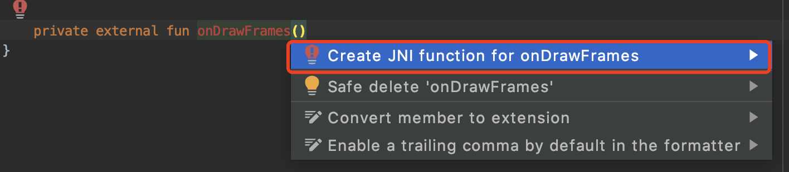

# Android 配置 JNI 开发环境

## Android 项目使用 JNI 有三种方式。

1. 使用编译好的 so 库。这种方式可以是任意的编译方式，只需要将编译好的 so 库放到安卓项目中的 `src/main/jni` 目录下。

2. 使用 MakeFile 编译。Android Studio 支持，可以将源码放在项目中。特别适合需要不断添加新功能代码的 JNI.

3. 使用 CMake 编译，Android Studio 目前主推的编译，用于代替之前的 Makefile 方式。

在同一个模块中，2 和 3 只能使用一种，同时可以和 1 搭配使用。

### 配置 Makefile 编译。

这种方式已不再推荐使用。建议使用 CMake 代替。

安卓为了简化 Makefile 的编写，内置了一个 Makefile 文件，同时留了一个 Android.mk 的接口文件，在这个文件内，只需要简单的配置参数，就能实现编译，而不必写复杂的依赖关系。Application.mk 文件实际上是对应用程序本身进行描述的文件，它描述了应用程序要针对哪些 CPU 架构打包动态 so 包、要构建的是 release 包还是 debug 包以及一些编译和链接参数等。

### 配置 CMake 编译

### 生成 native 方法的声明

javah 不太方便， Android Studio 提供了更好的生成方式。先用 Java 编写 `native` 修饰的函数声明。然后 Alt + Enter 快速生成。能够根据方法逐个生成，方便灵活。

由于编译器还不支持 Rust，如果是使用 Rust 写本地方法，由于 Android Studio 检测不到，会有红色错误提醒。虽然不影响编译运行，但是太刺眼，可以使用 `@Suppress("KotlinJniMissingFunction")` 抑制提示。
