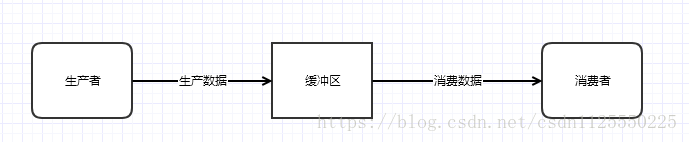
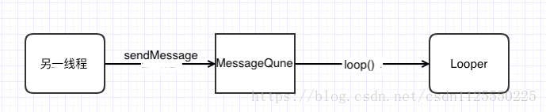

[TOC]

# Handler

## 一、handler是什么？

Handler主要用于异步消息的处理，其本身并不是线程，而是将消息在各个线程中传递： 有点类似辅助类，封装了消息投递、消息处理等接口。当发出一个消息之后，首先进入一个消息队列，发送消息的函数即刻返回，而另外一个部分在消息队列中逐一将消息取出，然后对消息进行处理，也就是发送消息和接收消息不是同步的处理。 这种机制通常用来处理相对耗时比较长的操作。

## 二、使用


1. 在主线程中创建 Handler, 在子线程中调用 Hander 的 post 方法，在其中执行主线程要执行任务。


```Java
public class TestActivity extends AppCompatActivity {
    @Override
    protected void onCreate(Bundle savedInstanceState) {
        super.onCreate(savedInstanceState);
        setContentView(R.layout.activity_test);

        final Handler handler = new Handler();
        System.out.println("Thread id main: " + Thread.currentThread().getId());
        Thread thread = new Thread(new Runnable() {
            @Override
            public void run() {
                System.out.println("Thread id: " + Thread.currentThread().getId());
                handler.post(new Runnable() {
                    @Override
                    public void run() {
                        System.out.println("Thread id: " + Thread.currentThread().getId());
                    }
                });
            }
        });
        thread.start();
    }
}

```

输出
```
System.out: Thread id main: 1
System.out: Thread id: 10700
System.out: Thread id: 1
```

可以看到 Handler 的 post 并不是在子线程中执行的，而是 Handler 对象所在的线程中执行的。 而在 Hander 的文档中说明了 `Handler()
Default constructor associates this handler with the Looper for the current thread.`。

也可以指定线程执行 Hander 的 post 代码，就是在创建时指定 Looper。

```Java
public class TestActivity extends AppCompatActivity {
    Handler handler;
    Handler handler1;

    @Override
    protected void onCreate(Bundle savedInstanceState) {
        super.onCreate(savedInstanceState);
        setContentView(R.layout.activity_test);

        System.out.println("Handler message main: " + Thread.currentThread().getId());
        Thread thread = new Thread(new Runnable() {
            @Override
            public void run() {
                Looper.prepare(); // 必须，因为 Handler 创建时会获取所在线程的 Thread 的 looper。
                handler1 = new Handler();
                handler1.post(new Runnable(){
                    @Override
                    public void run() {
                        System.out.println("Handler message receive : " + Thread.currentThread().getId());

                    }
                });
                Looper.loop(); // 必须执行，用于启动消息处理。
            }
        });
        thread.start();
    }
}

```

或者使用 Android 已经封装好的 HandlerThread

```Java
public class TestActivity extends AppCompatActivity {
    Handler handler;
    Handler handler1;

    @Override
    protected void onCreate(Bundle savedInstanceState) {
        super.onCreate(savedInstanceState);
        setContentView(R.layout.activity_test);

        System.out.println("Thread id main: " + Thread.currentThread().getId());
        HandlerThread thread = new HandlerThread("Work thread"); // 必须使用 HandlerThread，以获取 Looper.
        thread.start(); // 必须在 getLooper() 之前就执行。
        handler = new Handler(thread.getLooper()); // 指定执行线程。
        handler.post(new Runnable() {
            @Override
            public void run() {
                System.out.println("Thread id: " + Thread.currentThread().getId());

                handler1 = new Handler(Looper.getMainLooper());
                handler1.post(new Runnable() {
                    @Override
                    public void run() {
                        System.out.println("Thread id handler1 : " + Thread.currentThread().getId());
                    }
                });
            }
        });
    }
}
```

- 除了立即执行的 post, Hander 还能指定延迟执行。 postAtTime， postDelayed，postAtFrontOfQueue，

- 其实 post 函数也是调用 sendMessageDelayed 将 参数作为一个消息发送到消息队列。

我们先来看下Handler中的post()方法，代码如下所示：

```Java
public final boolean post(Runnable r)
{
   return  sendMessageDelayed(getPostMessage(r), 0);
}
```

原来这里还是调用了sendMessageDelayed()方法去发送一条消息啊，并且还使用了getPostMessage()方法将Runnable对象转换成了一条消息，我们来看下这个方法的源码：

```Java
private final Message getPostMessage(Runnable r) {
    Message m = Message.obtain();
    m.callback = r;
    return m;
}
```

在这个方法中将消息的callback字段的值指定为传入的Runnable对象。咦？这个callback字段看起来有些眼熟啊，喔！在Handler的dispatchMessage()方法中原来有做一个检查，如果Message的callback等于null才会去调用handleMessage()方法，否则就调用handleCallback()方法。那我们快来看下handleCallback()方法中的代码吧：

```Java
private final void handleCallback(Message message) {
    message.callback.run();
}
```


处理上述方法外，对于 UI 操作，还能在使用 UI 中就准备好的方式

1. Handler的post()方法

2. View的post()方法

3. Activity的runOnUiThread()方法

虽然写法上相差很多，但是原理是完全一样的，我们在Runnable对象的run()方法里更新UI，效果完全等同于在handleMessage()方法中更新UI。


然后再来看一下View中的post()方法，代码如下所示：

```Java
public boolean post(Runnable action) {
    Handler handler;
    if (mAttachInfo != null) {
        handler = mAttachInfo.mHandler;
    } else {
        ViewRoot.getRunQueue().post(action);
        return true;
    }
    return handler.post(action);
}
```

原来就是调用了Handler中的post()方法，我相信已经没有什么必要再做解释了。


最后再来看一下Activity中的runOnUiThread()方法，代码如下所示：

```Java
public final void runOnUiThread(Runnable action) {
    if (Thread.currentThread() != mUiThread) {
        mHandler.post(action);
    } else {
        action.run();
    }
}
```

如果当前的线程不等于UI线程(主线程)，就去调用Handler的post()方法，否则就直接调用Runnable对象的run()方法。还有什么会比这更清晰明了的吗？


## Handler.sendMessage

想要与那个线程通信，就调用那个线程绑定的 Handler 的 sendMessage(Message msg) 方法。


```
public class TestActivity extends AppCompatActivity {
    Handler handler;
    Handler handler1;

    @Override
    protected void onCreate(Bundle savedInstanceState) {
        super.onCreate(savedInstanceState);
        setContentView(R.layout.activity_test);

        System.out.println("Handler message main: " + Thread.currentThread().getId());
        HandlerThread thread = new HandlerThread("Work thread");
        thread.start();
        handler = new Handler(thread.getLooper());
        handler1 = new Handler() {
            @Override
            public void handleMessage(Message msg) {
                switch (msg.what) {
                    case 1:
                        System.out.println("Handler message receive : " + Thread.currentThread().getId());
                        break;
                }
            }
        };

        handler.post(new Runnable() {
            @Override
            public void run() {
                Message message = new Message();
                message.what = 1;
                handler1.sendMessage(message);
                System.out.println("Handler message send : " + Thread.currentThread().getId());


            }
        });
    }
}
```

sendMessageAtTime(Message msg, long uptimeMillis)
uptimeMillis参数则表示发送消息的时间，它的值等于自系统开机到当前时间的毫秒数再加上延迟时间


## Handler 线程通信原理解析

> android 为什么要设计只能通过handler机制更新UI？

最根本的目的是解决多线程并发温问题：

假设如果在一个activity当中，有多个线程去更新UI，并且都没有加锁机制，那么会什么样子的问题？更新界面混乱。

如果对更新UI的操作都进行加锁处理的话又会产生什么样子的呢？性能下降。

出于对以上问题的考虑，Android给我们提供了一套更新UI的机制，我们只要遵循这个机制就可以了，根本不用去关心多线程并发的问题，所有的更新UI的操作，都是在主线程的消息队列中去轮训处理的。


Handler 进程间通信，其实就是典型的生产者消费者模型。发送消息的线程为生产者，接受消息的线程为消费者。





- 每个线程仅有一个 MessageQueue
- 每个线程仅有一个 Looper, MessageQueue 对象是在Looper的构造函数中创建的，因此一个Looper也就对应了一个MessageQueue。Loopler.looper方法，就是一个死循环，不断地从MessageQueue取消息，如果有消息就处理消息（调用 Message 对象绑定的 Handler的dispatchMessage 将消息还给 Handler 执行。执行顺序为，Handler 的 runnable，不存在就执行所在线程的 Runnable，不存在就执行 Handler 的 handleMessage() 方法。多个Handler 时，谁发的，就分发给谁，因为发送消息时保存了 Handler 的引用），没有消息就阻塞。
- Handler封装了消息的发送，将消息发送给绑定的线程中的 MessageQueue(从 Looper 中获取)。
