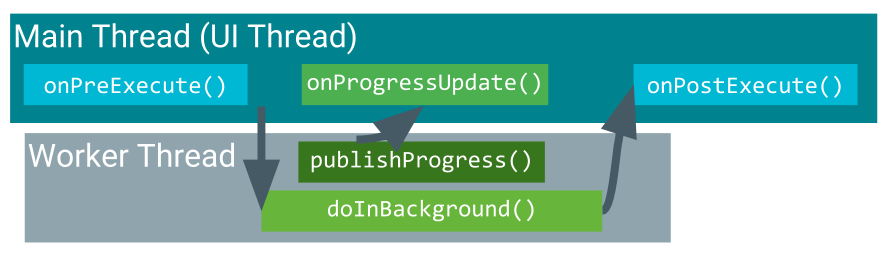

# 安卓的线程

在 App 启动的时候，会创建一个主线程，也就是UI线程，在这个线程中分发用户的操作，到适当的组件。

因为 UI 线程是用于显示绘制和响应用户操作的（超过5s, 系统会弹出是否杀死 APP的提示，即 ANR 问题），因此

> 不要再 UI 线程中执行耗时工作 （小于16ms）

同时 UI 线程是非线程安全的，因此，

> 不能在其他线程中进行UI设置操作，否则会抛出异常。

基于上面两个原因，想要处理一个耗时工作，在安卓中并不是一个简单的过程。但是安卓提供了一些方法，来帮助快速完成这些工作。


Thread & Handler -> AsyncTask -> RxJava

有几种方式用于后台任务

> java 原生进程/HandlerThread & [Handler](handler.md)：

- 自己处理子线程和主线程消息传递，来进行 UI 操作
- 代码分散，阅读性差
- HandlerThread 是Java 原生Thread 封装了Handler. 适用于 API callback，从 API1 就有。
- ThreadPool 执行许多并行任务 -> WorkManager
- Future & Callable 也是 Java 原生的新类。? 待考证


> AsyncTask

- 如果销毁了创建AsyncTask的 Activity(如旋转屏幕)，则AsyncTask不会随之被销毁。新创建的Activity 并不能方便的关联。
- Activity 销毁时，AsyncTask 并不会自动销毁，容易引发内存泄漏。

- 短暂或可被终止的任务。
- 不需要向UI或用户报告结果的任务。
- 低优先级，可以可以放任不结束的任务。

使用Loader，及子类AsyncTaskLoader。已经被（ViewModel + LiveData（数据观察者模式）代替，不再记录）

***无论是 AsyncTask 已经不用于 View 更新，仅将执行的结果放到 LiveData 中，使用 LiveData 来更新 UI, 而ViewModel 用于缓存跟 UI 相关的所有数据。***

> RxJava

- 流式调用
- IntendService 理想的后台任务， 或在 UI 线程之外获取 Intent.


？ 加锁
？ LiveData 用法，能否和 Rxjava 结合使用？


## 进程与线程

默认情况下，当 APP 启动时，系统为它创建一个进程，和一个主线程，主线程用于 UI 的绘制和交互处理。这个主线程也叫 UI 线程。UI线程主要执行绘制UI并使应用程序响应用户输入。如果需要，可以在应用程序中安排不同的组件在不同的进程中运行，并且可以为任何进程创建其他线程。

默认情况下，同一应用程序的所有组件都在同一进程中运行，大多数应用程序不应更改此设置。但是，如果发现需要控制某个组件所属的进程，则可以在 `manifest` 文件中执行此操作。

每种类型的组件元素 - <activity>, <service>, <receiver>, 和 <provider> 的 manifest 条目 - 支持`android：process`属性，该属性可以指定应该运行该组件的进程。您可以设置此属性，以便每个组件在其自己的进程中运行，或者使某些组件共享进程，而其他组件则不共享。您还可以设置`android：process`，以便不同应用程序的组件在同一进程中运行 - 前提是应用程序共享相同的Linux用户ID并使用相同的证书进行签名。

<application>元素还支持android：process属性，用于设置适用于所有组件的默认值。


如果在UI线程上进行所有事情，则网络访问或数据库查询等长时间操作可能会阻止整个UI。从用户的角度来看，应用程序似乎会挂起。更糟糕的是，如果UI线程被阻止超过几秒钟（当前约5秒），则将向用户呈现“应用程序未响应”（ANR）对话框。用户可能决定退出应用并将其卸载。

Android的线程模型有两个规则：
- 不要阻止UI线程。每个UI操作在不到16毫秒的时间内完成所有工作。
- 仅在UI线程上处理 UI 操作，因为 UI 线程是非线程安全的，在子线程更新 UI 会引起异常。

不要在UI线程上运行异步任务和其他长时间运行的任务。相反，使用AsyncTask（用于简短或可中断任务）或AsyncTaskLoader（用于高优先级的任务或需要向用户或UI反馈的任务）在后台线程上实现任务。


## 异步处理方法

### 1. java 线程 + handler

代码分散，阅读性差


### 2. AsyncTask

AsyncTask 是一个抽象类，它包含一个在子线程中执行的 `doInBackground` 方法，和几个在 UI 线程中执行的回调方法。使用它只需要重写响应的方法，它会自己处理子线程和主线程的通信和回调，从而开发者只需关注业务逻辑。




1. onPreExecute() is invoked on the UI thread before the task is executed. This step is normally used to set up the task, for instance by showing a progress bar in the UI.
2. doInBackground(Params...) is invoked on the background thread immediately after onPreExecute() finishes. This step performs a background computation, returns a result, and passes the result to onPostExecute(). The doInBackground() method can also call publishProgress(Progress...) to publish one or more units of progress.
3. onProgressUpdate(Progress...) runs on the UI thread after publishProgress(Progress...) is invoked. Use onProgressUpdate() to report any form of progress to the UI thread while the background computation is executing. For instance, you can use it to pass the data to animate a progress bar or show logs in a text field.
4. onPostExecute(Result) runs on the UI thread after the background computation has finished. The result of the background computation is passed to this method as a parameter.

> 使用注意

- 调用 cancel() 终止，返回 false 表示不能停止，通常是因为已经执行结束了。
- isCancelled() 查看是否已经被终止了。如果任务在正常完成之前被取消，则isCancelled（）方法返回true。
- cancel 后，onPostExecute() 不会调用，而是调用  onCancelled(Object)。
- 默认情况下，允许进程内任务完成。
要允许cancel（）中断正在执行任务的线程，请为mayInterruptIfRunning的值传递true。

**AsyncTask 创建的线程并不是独立的，即不会创建多个线程。当创建多个 AsyncTask 时，他们都在同一个线程中执行，因此会阻塞后创建的任务**

2. 引用导致内存泄漏。

3. Activity 销毁时要自己终止任务，终止时要先判断是否已经终止


#### Limitations of AsyncTask

对于某些用例，AsyncTask是不切实际的：

> 对设备配置的更改会导致问题。

当AsyncTask正在运行时设备配置发生更改时，例如，如果用户更改了屏幕方向，则会销毁并重新创建创建AsyncTask的活动。AsyncTask无法访问新创建的活动，并且不会发布AsyncTask的结果。旧的AsyncTask对象保持不变，您的应用程序可能会耗尽内存或崩溃。

> 如果销毁了创建AsyncTask的 Activity，则AsyncTask不会随之被销毁。

例如，如果您的用户在AsyncTask启动后退出应用程序，则AsyncTask会继续使用资源，除非您调用cancel（）。

何时使用AsyncTask：

- 短期或可中断的任务。
- 不需要向UI或用户报告的任务。
- 可以保留未完成的低优先级任务。
- 对于所有其他情况，请使用AsyncTaskLoader，它是下面描述的Loader框架的一部分。


## 结构

Thread and Runnable 的子类

- HandlerThread: 和 Thread and Runnable 一样，用于执行一次性的任务
- AsyncTask: 一次性的任务，具有进度和结束反馈的回调
- IntentService: 执行多个任务，但同一时刻只有一个在执行。

组件
- ThreadPoolExecutor: 在资源可用时自动执行，或者多个线程同时执行，ThreadPoolExecutor 提供了一个线程池。将任务放入队列，任务会在有可用线程时自动执行。（保证要在多个线程内执行的代码是线程安全的。）


## 获取线程/进程 Id

在分析多线程或多进程的时候，知道当前的在哪个线程或进程执行对于分析有很大帮助

```
Log.e("process Id: ", "" + android.os.Process.myPid())
Log.e("thread Id", "" + Thread.currentThread().id)
```

## 切换到主线程

```
if (Looper.myLooper() != Looper.getMainLooper()) {
    // If we finish marking off of the main thread, we need to
    // actually do it on the main thread to ensucorrect ordering.
    Handler mainThread = new Hand(Looper.getMainLooper());
    mainThread.post(new Runnable() {
        @Override
        public void run() {
            mEventLog.add(tag, threadId);
            mEventLog.finish(this.toString());
        }
    });
}
```

## 非阻塞

由于实现不同，Kotlin 并没有实现 Python 迭代器类似的单线程非阻塞方式。 Kotlin 的非阻塞，其实是通过多线程实现的。
