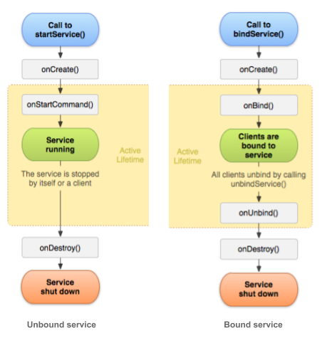

# Service

Service 是安卓上用于执行长时间任务的组件。他没有UI，通常用于在后台执行长时间的任务，如文件下载，上传，音乐播放等。

> Servide 和 Thread 的区别

首先我们要弄明白Service和Thread分别是怎么定义的：

- Thread 是程序执行的最小单元，它是分配CPU的基本单位。可以用 Thread 来执行一些异步的操作。
- Service是Android的四大组件之一，被用来执行长时间的后台任务。默认情况下Service是运行在主线程中的。

二者的使用上的区别

1. 在Android中，Thread只是一个用来执行耗时任务的并发工具类，它可以在Activity中被创建，也可以在Service中被创建。

2. Service组件主要有两个作用：后台运行和跨进程访问。service可以在android系统后台独立运行，线程是不可以。

3. Service类是可以供其他应用程序来调用这个Service的而Thread只是在本类中在使用，如果本类关闭那么这个thread也就下岗了而Service类则不会。

4. 如果需要执行复杂耗时的操作，必须在Service中再创建一个Thread来执行任务。Service的优先级高于后台挂起的Activity，当然也高于Activity所创建的Thread，因此，系统可能在内存不足的时候优先杀死后台的Activity或者Thread，而不会轻易杀死Service组件，即使被迫杀死Service，也会在资源可用时重启被杀死的Service。

> 分类（三类）

- Foreground - 显示一个通知消息
- Background
- Bound

- 绑定: bindService() 启动。绑定服务提供客户端 - 服务器接口，允许组件与服务交互，发送请求和获取结果，有时使用进程间通信（IPC）跨进程发送和接收信息。例如，绑定服务可能处理网络事务，执行文件 I/O，播放音乐或与数据库交互。
    - 只要绑定了另一个应用程序组件，绑定服务就会运行。多个组件可以同时绑定到服务，但是当所有组件解除绑定时，服务将被销毁。
    - 绑定服务通常不允许组件通过调用startService（）来启动它。
    - 5.0 之后，必须使用显式 intent 启动，否则会抛出异常。
    - 绑定服务不需要以启动服务的方式显式停止（使用其他组件调用stopService() 或自己在任务完成后结束自己stopSelf()）。
- 非绑定: startService() 启动。用于后台执行耗时或远程进程。

除非指定运行进程，Service 默认是在主进程执行的。通常，已启动的服务在单独的线程中执行单个操作，并且不会将结果返回给调用者。操作完成后，服务应通过调用stopSelf（）来自行停止，或者另一个组件可以通过调用stopService（）来停止它。

由于26版本的限制，使用 JobIntentService 代替 IntentService 处理多任务任务。

## Service 生命周期

## 前台服务

虽然大多数服务在后台运行，但有些服务在前台运行。前台服务是用户知道正在运行的服务。虽然如果系统内存不足，可以杀死活动和服务，但前台服务优先于其他组件。

前台服务会在通知栏有一个通知，调用 startForeground() 启动一个前台进程。此方法有两个参数：唯一标识通知的整数和状态栏通知的Notification对象。此通知正在进行中，这意味着它无法被删除。它将保留在状态栏中，直到服务停止或从前台删除。

## Background services and API 26

这些限制不会影响前台服务或绑定服务。以下是一些具体的变化：

- 如果针对API 26的应用尝试在不允许创建后台服务的情况下使用该方法，则startService（）方法现在会抛出IllegalStateException。
- 不允许后台应用程序创建后台服务。新的startForegroundService（）方法从应用程序组件启动前台服务。即使应用程序在后台，系统也允许应用程序调用此方法。但是，应用程序必须在创建服务后的五秒内调用该服务的startForeground（）方法来显示新服务的用户可见通知。如果应用程序未在时间限制内调用startForeground（），系统将停止服务并将应用程序声明为ANR（应用程序无响应）。

当应用程序位于前台时，它可以自由地创建和运行前台和后台服务。当应用程序进入后台时，它有几分钟时间仍然可以创建和使用服务。在那段时间结束时，应用程序被认为是空闲的。系统会停止应用程序的后台服务，就像应用程序已调用服务的Service.stopSelf（）方法一样。

## 预定服务

对于API级别21及更高级别，您可以使用JobScheduler API启动服务，并且通过API 26中的后台服务限制，这可能是完全替代服务的替代方案。要使用JobScheduler，您需要注册作业并指定其对网络和计时的要求。系统会在适当的时间安排作业执行。JobScheduler接口提供了许多定义服务执行条件的方法。有关详细信息，请参阅JobScheduler参考。

JobScheduler 只支持 API 21+，如果想要运行在5.0 以下的手机上，可以使用 WorkManager，它

## 疑问

1. 多次启动/绑定 Service，只会创建一个实例吗？
2. 先启动，再绑定一个 Service, 声明周期
3. Activity 进入后台后，绑定 Service 还能够执行。
4. 先启动，后绑定 和 先绑定后启动的声明周期？
