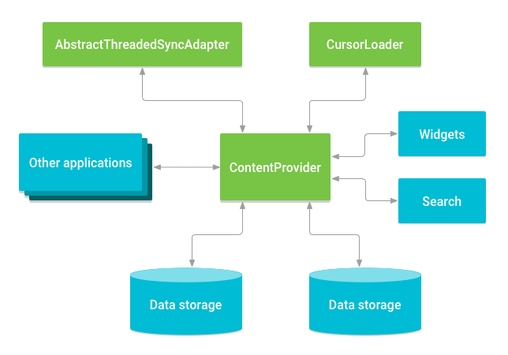

# Content Provider

Content Provider 可以帮助应用程序管理对自身存储，其他应用程序存储的数据的访问，并提供一种与其他应用程序共享数据的方式。它封装数据，并提供保证数据安全性的机制。 Content Provider 是跨进程访问数据的标准接口。

另外，Content Provider 提供了数据存储的上层抽象，这样，即使修改了底层的存储方式，或者数据结构，由于 Content Privider 的隔离，也不会影响到依赖于它的应用。


* Android 系统提供的 音频，视频，图像和个人联系信息之类的数据 content provider 。 可以在android.provider软件包中，以及一些参考文档。

## 访问已有的 Content Provider

Content Provider 将数据作为一个或多个表呈现给外部应用程序，这些表与关系数据库中的表相似。 行代表 `Content Provider` 收集的某种类型的数据的实例，并且行中的每一列代表为实例的单个数据。

有几种不同的 API 或者组件通过 Content Provider 访问数据层：

- 供其他应用访问本应用的数据
- 使用 `AbstractThreadedSyncAdapter` 的实现来向服务器同步数据。
- 使用 `CursorLoader` 为 UI 加载数据
- 向 `Widget` 发送数据
- 使用 `SearchRecentSuggestionsProvider` 访问系统搜索框架来为应用提供用户独特的搜索建议




### 使用 `CursorLoader` 为 UI 加载数据

ContentProvider 查询方法跟 SQL 的查询及其类似，不同的是 SQL 有整条 SQL 语句的解析工具，而这里要通过方法调用来提供 `CRUD(create, retrieve, update, and delete)`。

要访问 Content Provider 的数据，可以使用 `Application#Contenx` 的 `ContentResolver` 对象来执行查询方法。该对象最终会调用 `ContentProvider` 的 `query` 方法。 并返回一个 `Coursor` 

```Kotlin
query(Uri,projection,selection,selectionArgs,sortOrder) 
)
```

默认查询是在主线程中执行的，想要异步加载可以使用 CourseLoader 或者 RxJava, 协程等都可以。

对应关系如下

- Uri --- FROM table_name
- projection --- col,col,col,...
- selection --- WHERE col = value
- selectionArgs --- 选择参数替换？ 选择子句中的占位符。
- sortOrder --- ORDER BY col,col,...

#### Content URI

content URI 标识 provider 中的一张表。它包括标识 content 的标识符和表名。例如 `content://user_dictionary/words`，`user_dictionary` 是 provider 的标识，而 `word` 是表的路径。 始终存在字符串`content://` 是 scheme 用于将其标识为 provider 的URI。URI 的最后还可以添加一行记录的 ID来只获取一条数据。 Resolver 通过解析 URI 来判断调用哪个 provider，然后将参数传递给它。

#### 安全

为了避免 SQL 注入，选择使用 ? 作为用户输入的选择字句。然后将用户输入作为替换字段放入单独的参数中。

### 权限申请

在访问 provider 之前，需要申请权限，以确保正常访问数据。无法在运行时请求此权限；而是必须使用 `<uses-permission>` 元素和 provider 定义的确切权限名称，在 Manifest 中指定需要此权限。以便用户在安装应用时就知道需要此权限。

如果一个 provider 没有声明权限，则其他应用无法访问，而本应用不用声明权限也可以任意访问该 provider。

### 批量访问数据

Batch access: You can create a batch of access calls with methods in the ContentProviderOperation class, and then apply them with ContentResolver.applyBatch().


### Intent 访问数据


