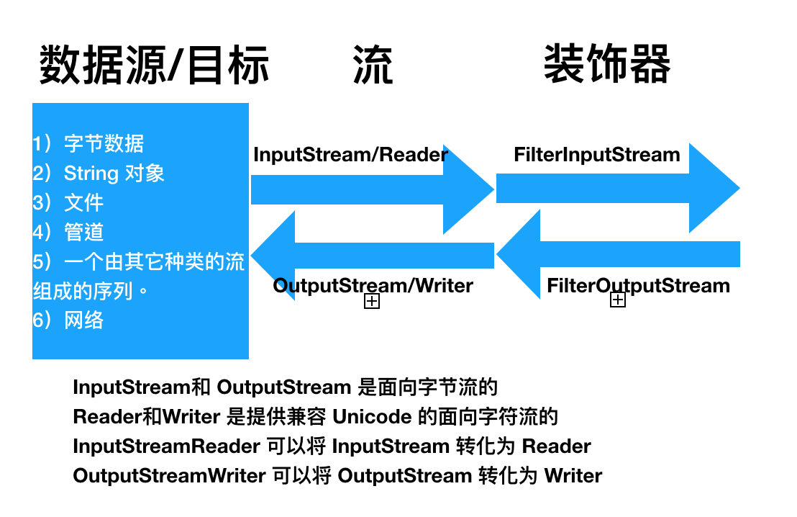

# I/O 

I/O 虽然放到本地存储的分类中，但是它不仅仅可以操作本地文件。凡是向程序的外部输出内容或从外部读取内容的操作都属于 I/O 操作，因此，I/O 包括了文件、终端、网络、其他应用程序的操作。


## Java I/O

- 阻塞式

Java 的 I/O 操作的类系统比较庞杂，这是因为它对整个I/O操作进行了多层的抽象，希望尽量得使用复杂的 I/O 系统变得统一，然而这却造成了大量的类（最初设计者进行抽象复用的初衷，却是想要避免I/O 操作类型过多造成过多的类。），

Java 的 I/O 模型是基于流的，数据从一个方向(内/外)向另一个方向流动，在流动的过程中，经过管道，一个根据需要套接不同的管道，或套接多层管道，从而能达到目的。



```Java
// Stream 和 Writer 都需要关闭
try (FileWriter outputStream = new FileWriter("./test.txt")){
    try(BufferedWriter bufferedOutputStream = new BufferedWriter(outputStream)) {
        bufferedOutputStream.write("sdsd");
        }
    } catch (Exception e) {
        e.printStackTrace();
    }

// 或者

try (FileWriter outputStream = new FileWriter("./test.txt")){
        BufferedWriter bufferedOutputStream = new BufferedWriter(outputStream);
        bufferedOutputStream.write("sdsd");
        bufferedOutputStream.close();
    } catch (Exception e) {
        e.printStackTrace();
    }
```


## NIO

Java 在 1.4 提供了新的 I/O 模型，新 I/O 模型是基于缓冲的 I/O 模型。新 I/O 能够在网络请求中使用非阻塞方式。新的 I/O 模型主要用于提高性能，旧的I/O 已经基于 nio 实现过，即使使用老的方式，也能从中获益。 这点从 nio 的使用方式就能看出。

nio 为了提高性能，其实现结构更接近于操作系统：通道和缓冲器。因此它的操作也是使用字节操作，这使它跟 Stream 的更加相似。实际上，要创建 Cannel 正是使用修改了的 `InputStrem`, `OutputStrem`, `RamdamAccessFile`。由于 Reader 和 Writer 是基于字符的操作，因此并不能产生 `Cannel`， 而 `Cannel` 提供了方法可以产生 `Reader` 和 `Writer`。

```
try (FileChannel fc = new FileOutputStream("./test.txt").getChannel()) {
            fc.write(ByteBuffer.wrap("Some test".getBytes()));
        } catch (Exception e) {
            e.printStackTrace();
        }

```

### buffer 模型

buffer 有三个变量
- capacity: 容量，也是 buffer 的大小
- position: 读/写 buffer 的起点。偏移角标。
- limit: 读/写 的限制点。偏移角标，而不是长度。


```Java
try (FileChannel fc = new FileOutputStream("./test.txt").getChannel()) {
    fc.write(ByteBuffer.wrap("Some test".getBytes()));

} catch (Exception e) {
    e.printStackTrace();
}

try (FileChannel fc = new FileInputStream("./test.txt").getChannel()) {
    ByteBuffer buffer =  ByteBuffer.allocate(1024);
    fc.read(buffer);
    buffer.flip();
    System.out.println(Charset.defaultCharset().decode(buffer));

} catch (Exception e) {
    e.printStackTrace();
}
```

- flip(): 将position 设置为0，limit 设置为字符串的长度
- clear(): 清空。也就是将 limit 设置为 buffer 的长度。


### 网络交互

```Java
try (ServerSocketChannel sc = ServerSocketChannel.open()) {
    sc.bind(new InetSocketAddress(8080));
    sc.configureBlocking(false); // 设置非阻塞
    SocketChannel socketChannel = sc.accept();
    ByteBuffer buffer =  ByteBuffer.allocate(1024);
    while (true) {
        if (socketChannel == null) continue; // 由于是非阻塞的，sc.accept() 没有接受到内容时，返回 null
        if (socketChannel.read(buffer) == -1) break;
        buffer.flip();
        socketChannel.write(buffer);
        buffer.clear();
    }
} catch (Exception e) {
    e.printStackTrace();
}
```


## OKio

也是基于流模型的， 输入源： Source, 目的源 Sink。不强制使用 buffer。

```
try (Source source = Okio.source( new File("./text.txt"))){
    Buffer buffer = new Buffer();
    source.read(buffer, 1024);
    System.out.println(buffer.readUtf8Line());
} catch (Exception e) {
    e.printStackTrace();
}

或者

try (BufferedSource source = Okio.buffer(Okio.source( new File("./text.txt")))){
    System.out.println(source.readUtf8Line());
} catch (Exception e) {
    e.printStackTrace();
}
```

Okio 好用其实好用在 Buffer 上，能够使用 buffer 作为一个数据传递的地方。

```Java
Buffer buffer = new Buffer();
    BufferedWriter bufferedWriter = new BufferedWriter(new OutputStreamWriter(buffer.outputStream()));
    try {
        bufferedWriter.write("Hello");
        bufferedWriter.flush();
    } catch (IOException e) {
        e.printStackTrace();
    }

```

IOio 的 InputStream 和 OutputStream 主要是用于跟传统 I/O 做交互的，主要用于已经存在的接口的对接。如果新建的程序，尽量不要使用 buffer 的 InputStream 和 OutputStream。


### 名词

BIO: block io。阻塞式 IO，大部分指传统的IO。
AIO: Asynchronous IO， 异步IO。 Java7 新出的带有回调的 IO。

