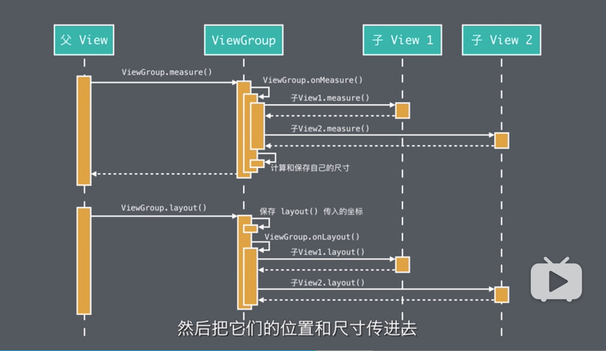

[TOC]

# 布局

确定每个 View 的尺寸和位置

作用： 为绘制(知道绘制位置和大小))和事件分发(触摸应该哪个 View 做响应))做支持

>含义

布局过程，就是把界面中的所有控件，用他们的要求的大小，摆放在正确的位置。更通俗的讲，就是程序在运行时利用布局文件的代码来计算出实际尺寸的过程。

## 安卓的布局过程

包括两个阶段：测量阶段和布局阶段。

1. 测量阶段（计算）：从上到下递归地测量每一级，每一个子 View 的尺寸并计算它们的位置；

2. 布局阶段（保存 父View 传进来的实际尺寸）：依然是从最顶级的 View 向下递归地把测得的它们的 `尺寸` 和 `位置` 赋值给它们。

这样每个 View 的尺寸和位置就确定了，布局过程就算完成了。接下来就是绘制过程了，每个 View 会根据这些得到的尺寸和位置来进行自我绘制。

> 为什么测量的尺寸不是最终尺寸？

测量尺寸只是自己期望的一个尺寸，而父 View 是否有这么多的空间，由父布局来决定，所以需要父布局结合其尺寸，给出最终尺寸，通过 layout 方法传进来，然后保存。

> 为什么要将布局分为测量和布局两个子过程?

其一，由于一些自适应属性的存在，例如 `match_parnent`， 一次测量可能无法得到正确的尺寸，需要多次测量。将测量和布局分开，一是测量过程独立，更加高效。二是过程更加清晰。
其二，就是自己测量的尺寸不是最终的尺寸，需要交给父布局，由父布局结合自己剩余空间来得到最终尺寸，然后由 layout 交给自己。

### 测量过程的调用



深度优先的调用 View 树的 measure() 方法。

1. 当测量过程到来时，一个 View 的 `measure()` 方法会被它的父节点调用（根节点的 View 不是一个 View 对象）。 通知该 View 进行自我测量，而真正进行测量不是 `measure()` 方法，而是调用自己的 `onMeasure()` 方法。 `measure` 是一个调度方法，它会做一些测量的预处理工作，然后调用 `onMeasure()` 来进行真正的测量。

2. 而 `onMeasure()` 的自我测量包含两部分内容，要看这个 View 是 简单的 View 还是 ViewGroup
   - 如果它是一个简单的 View, 它做的事情只有一件，测量出自己的尺寸。
   - 如果它是一个 ViewGroup，它会先调用所有子 View 的 `measure()` 方法。让他们都进行自我测量。然后根据这些子 View 自我测量出的尺寸来计算出他们的位置，并且把他们的尺寸和位置保存下来。同时，根据这些子 View 的尺寸和位置，最终计算出自己的尺寸。
   也就是说，ViewGroup 的尺寸主要由子 View 的尺寸和位置确定的。

### 布局阶段的调用

  一个 View 的 `layout(...)` 方法会被它的父节点所调用，用于对 View 进行内部布局。和 `measure()` 方法一样，`layout(...)` 也只是一个调度方法，实际进行布局的是 `onLayout` 方法。`onLayout` 内部会做两件事。

  - 首先 `layout` 方法是有参数的，它的父几点在调用它的时候回把之前测量阶段保存下来的这个 View 的尺寸和位置通过参数给传进来，而 `layout` 做的第一件事就是把这个尺寸和位置保存下来。测量阶段是父 View 统一保存所有子 View 的尺寸和位置，而到了布局阶段就是 View 保存自己的尺寸和位置了。

  - 第二件事 `onLayout` 对自己进行真正的内部布局。内部布局的意思是，它会调用每一个子 View 的 `layout` 方法，并且把他们的尺寸和位置作为参数传递给它们。对于简单的 View 来处，它的 `onLayout` 什么也不用做，就是一个空方法，之所以也要调用，是逻辑的统一。


### 绘制过程


```Java
  public void draw(Canvas canvas) {
    ...
    // Step 1, draw the background, if needed
    if (!dirtyOpaque) {
      drawBackground(canvas);
    }
    ...
    // Step 2, save the canvas' layers
    saveCount = canvas.getSaveCount();
    ...
    // Step 3, draw the content
    if (!dirtyOpaque) onDraw(canvas);

    // Step 4, draw the children
    cDraw(canvas);

    // Step 5, draw the fade effect and restore layers
    canvas.drawRect(left, top, right, top + length, p);
    ...
    canvas.restoreToCount(saveCount);
    ...
    // Step 6, draw decorations (foreground, scrollbars)
    onDrawForeground(canvas);
  }
```


## 布局过程的自定义

> 就是重写 View 的测量过程和布局过程的相关方法，以此来定制自己想要的尺寸和摆放效果

> 注意： 重写的是 `onMeasure` 和 `onLayout` 方法，因为 `measure` 和 `layout` 是用来调度的，而真实进行测量的布局的是 `onMeasure` 和 `onLayout` 方法。

具体过程可以分为三类

1. 重写 `onMeasure` 来修改已有的 `View` 的尺寸。
2. 重写 `onMeasure` 来全新计算自定义 `View` 的尺寸。
3. 重写 `onMeasure` 和 `onLayout` 来全新计算自定 `ViewGroup` 的内部布局。

### 1. 重写 `onMeasure` 来修改已有的 `View` 的尺寸

这一类是对一些已有的 View 进行修改尺寸。例如，修改 ImageView 的尺寸就属于这一类。他已经有自己的尺寸计算算法了，它的 `onMeasure` 已经正确计算出它的尺寸和位置，你不需要从新进行计算一遍。 只需要根据自己的需要进行相应的调整。做法


1. 在重写的 `onMeasure` 方法中先调用 `super.onMeasure` 方法让它进行一次原有的测量。

2. 然后增加代码，计算得到想要的尺寸。通过  `getMeasuredWidth` 和 `getMeasuredHeight` 获得测得的尺寸，然后重新计算尺寸。

3. 保存新尺寸。计算尺寸并不是通过返回值返回给父 View 的，而是通过 `setMeasuredDimension` 方法把它存在自己内部。所有取的时候也是要用相应的方法来取： `getMeasuredWidth` 和 `getMeasuredHeight`。

**注意，setMeasuredDimension 保存的是一个测得的尺寸，它会之后通过 layout 方法传进来的那个尺寸未必是相等的。这个 setMeasuredDimension 保存的尺寸是一个 View 对自己尺寸的期望值。然后父 View 会根据这个期望值再去判断，至于最终它是否会同意你这么大，还是要求你再去测量一次，或者是给你指派一个新尺寸，这个由父 View 来决定。最终它会通过 layout 的方法的参数来传给你。**


```java

@Override
protected void onMeasure(int widthMeasureSpec, int heightMeasureSpec) {
    // 先执行原测量算法
    super.onMeasure(widthMeasureSpec, heightMeasureSpec);
    // 获得原先的测量结果
    int measuredWidth = getMeasuredWidth();
    int measuredHeight = getMeasuredHeight();

    // 利用原先的测量结果计算出新尺寸。
    if (measuredWidth > measuredHeight) {
        measuredWidth = measuredHeight;
    } else {
        measuredHeight = measuredWidth;
    }
    // 保存计算后的尺寸。
    setMeasuredDimension(measuredWidth, measuredHeight);
}

```


### 2. 重写 `onMeasure` 来全新计算自定义 `View` 的尺寸

 主要用于自定义 View, 这些 View 的绘制完全自己写的，这时，在尺寸上就没有现有的可作为基准的值修改使用。需要完全自己去计算它的尺寸。这种测量和第一种是有点不一样的：

 1. 不需要调用父类的 `onMeasure` 方法，而是完全自己计算尺寸。计算所有内部绘制的他们的间距，边距，得到最后的尺寸即可。

 2. 全新计算 View 尺寸，需要保证自己计算出的尺寸满足父布局的限制: 就是 `onMeasure` 方法的参数，父布局在调用子 view 的 `measure` 方法时，会将父布局对子 View 的限制作为参数传递过来， measure 方法在调用 `onMeasure` 方法时，又会原封不动地将其传递给 `onMeasure` 方法。

    1. 限制是怎么来的？父 View 为什么会对子 View 进行限制？
    父 View 把开发者对子 View 的尺寸要求（就是开发者在 xml 文件中这个View写的以 `layout_` 开头的属性限制，它们使用来设置这个 View 的位置和尺寸的。）进行处理计算之后所得到的更精确的要求。`layout_` 开头的属性不是给 View 自己看的，而是给它的父 View 看的。也就是说在程序运行显示界面的时候，每一个 ViewGroup 会读取它的子 View 的 `layout_` 开头属性，然后用他们进行处理和计算，得出一个限制。这个限制分为三种：不限制，设置上限，固定值（为了流程的通一，要求子View 计算一遍）。如果不遵循这个限制，就会产生 bug，例如，这个现实是 500，偏要使用400，这时使用者写了 `match_parent` 属性，却发现并没有填充满父布局的可用尺寸，从而属性无效，达不到开发者的要求。

    2. 子 View 的 onMeasure 方法里面应该怎么做，才能满足父布局的限制。

    很简单，在计算完尺寸后，调用一个 `resolveSize` 来调整计算的数值，返回值就是修正之后的尺寸。然后把修正之后尺寸用 `setMeasuredDimension` 保存起来就行了。


setMeasuredDimension 方法的处理过程

```java
@Override
public static int resolveSize(int size, int measureSpec, int childMeasuredState) {
    // 父 View 传过来的宽度和高度限制都是一个压缩数据，包括限制类型和尺寸两部分。可以通过 `MeasureSpec.getMode` 来获取限制类型，`MeasureSpec.getSize` 获得限制尺寸值。
    final int specMode = MeasureSpec.getMode(measureSpec);
    final int specSize = MeasureSpec.getSize(measureSpec);
    final int result;
    switch (specMode) {
        // 对于限制上限，取较小的值。
        case MeasureSpec.AT_MOST:
            if (specSize < size) {
                result = specSize | MEASURED_STATE_TOO_SMALL;
            } else {
                result = size;
            }
            break;
        // 对于指定值，返回指定尺寸。
        case MeasureSpec.EXACTLY:
            result = specSize;
            break;
        // 对与不限制的, 直接返回计算的值，
        case MeasureSpec.UNSPECIFIED:
        default:
            result = size;
    }
    return result | (childMeasuredState & MEASURED_STATE_MASK);
}
```

### 3. 重写 `onMeasure` 和 `onLayout` 来全新计算自定 `ViewGroup` 的内部布局

用于重写 `ViewGroup` 类型的View.

1. 重写 `onMeasure` 来计算内部元素的尺寸和位置，以及自己的尺寸。分三步：
    1. 调用每个子 View 的 `measure` 方法，来让你子 View 自我测量。
    2. 根据子 View 计算出的尺寸，得出子 View 的位置，并保存它们的尺寸和位置。
    3. 根据子 View 的尺寸和位置计算出自己的尺寸，并用 setMeasuredDimension 方法保存下来。
2. 重写 `onLayout` 来摆放内部元素。

#### 1. 重写 `onMeasure` 来计算内部元素的尺寸和位置，以及自己的尺寸

##### 第一步：调用每个子 View 的 `measure` 方法，来让你子 View 自我测量

使用 for 循环调用子 view 的 `measure` 方法，而这个方法有两个尺寸限制参数，而这个限制并不是现成的，需要根据子 View 的属性设置（xml文件）和自己的可用空间（剩余）限制，计算出来。开发者的要求（属性设置）在地位上要绝对高于可用空间。例如，开发者写了 `layout_width="48dp"` 那就不用管剩余空间有没有 48dp 了，直接设置子 View 的尺寸是固定 `48dp` 就好了。即，mode 是 `EXACTLY`，width 是 `48dp` 对应的像素值。

获取子 View 的 `layout_` 开头的属性，可以使用子 View 的 `getLayoutParams()` 方法，获得一个 `LayoutParams` 对象，它包含了 xml 文件里 layout_ 开头的参数的对应值。`LayoutParams` 对象的 `width` 和 `height` 属性值，就对应了 `layout_width` 和 `layout_height` 值。它的值可以是 `WRAP_CONTENT` 或 `MATCH_PARENT` 这两个常量，或者准换后的具体像素值。

```java
@Override
protected void onMeasure(int widthMeasureSpec, int heightMeasureSpec) {
    int usedWidth, usedHeight;
    for (int i = 0; i < getChildCount(); i++) {
        View childView = getChildAt(i);
        ViewGroup.LayoutParams lp = childView.getLayoutParams();
        int childWidthSpec;
        int selfWidthSpecMode = MeasureSpec.getMode(widthMeasureSpec);
        int selfWidthSpacSize = MeasureSpec.getSize(widthMeasureSpec);
        switch (lp.width) {
            // 如果是填满父布局，则也使用固定尺寸，尺寸是自己的可用宽度/高度。这时候自己的尺寸还没有计算出来。
            // 但是有父布局传过来的 `widthMeasureSpec` 和 `heightMeasureSpec` 尺寸限制。这个尺寸限制，
            // 虽然不是自己的最终实际尺寸，但依据这个限制，自己可以得到一个可用空间。得出自己最多有多啊到地方给
            // 子 View 用。
            case MATCH_PARENT:
                if (selfWidthSpecMode == EXACTLY || selfWidthSpecMode == MeasureSpec.AT_MOST) {
                    childWidthSpec = MeasureSpec.makeMeasureSpec(selfWidthSpacSize - usedWidth, EXACTLY);
                } else {
                    // 较新版本的 Android, UNSPECIFIED 的 size 也有自己的作用，后期研究。
                    childWidthSpec = MeasureSpec.makeMeasureSpec(0, MeasureSpec.UNSPECIFIED);
                }
                // 如果开发者在子 view 写的是固定尺寸值，直接设置为 `EXACTLY`。压缩方法使用 MeasureSpec.makeMeasureSpec
                break;
            // WRAP_CONTENT 虽然没有说父布局没有限制，但包含一个隐含条件，就是不能草果不父布局的可用宽度。
            case WRAP_CONTENT:
                if (selfWidthSpecMode == EXACTLY || selfWidthSpecMode == MeasureSpec.AT_MOST) {
                    childWidthSpec = MeasureSpec.makeMeasureSpec(selfWidthSpacSize - usedWidth, MeasureSpec.AT_MOST);
                } else {
                    // 较新版本的 Android, UNSPECIFIED 的 size 也有自己的作用，后期研究。
                    childWidthSpec = MeasureSpec.makeMeasureSpec(0, MeasureSpec.UNSPECIFIED);
                }
            default:
                childWidthSpec = MeasureSpec.makeMeasureSpec(lp.width, EXACTLY);
                break;
        }

        ... // height 同样计算


    }
}
```

##### 第二步：根据子 View 计算出的尺寸，得出子 View 的位置，并保存它们的尺寸和位置。

调用子 View 的 测量方法，就能得出子 View 的尺寸，绝大多数情况，每一个View，它测得的尺寸就是它的最终尺寸，要用到的时候，调用它的 `getMeasuredWidth` 和 `getMeasuredHeight` 就行。
为什么要保存这些尺寸？
因为现在是测量阶段，到布局阶段，这些尺寸和位置才会最终传给子 view。有两点注意：
1. 并不是所有的 Layout 都要保存子 View 的位置。比如 LinearLayout，它的内容都是横向或纵向一字排开的。那么子 View 的位置就可以在布局阶段通过一个一个的把尺寸累加起来得到。这种就不需要保存位置了。
2. 在某些时候，对子 View 进行一次测量是不够的。可能进行多次测量才能得到正确的尺寸和位置。根据自己想要达到的目的，可以增加测量的次数，以及选择性的测量某些View。


##### 第三步：根据子 View 的尺寸和位置计算出自己的尺寸，并用 setMeasuredDimension 方法保存下来

根据子 View 的尺寸和排布，计算出边界，保存即可。

#### 2. 重写 `onLayout` 来摆放内部元素

重写 `onLayout` 很简单，只需要调用每一个子 view 的 layout 方法，把 onMeasure 保存的位置和尺寸传进去即可。

```
@Override
    protected void onLayout(boolean changed, int l, int t, int r, int b) {
        for (int i = 0; i < getChildCount(); i++) {
            View viewChild = getChildAt(i);
            viewChild.layout(childLeft[i], childTop[i], childRight[i], childBottom[i]);
        }
    }
```
子 View 的 layout 参数是它在父 View 中的相对坐标。需要把位置和尺寸转化一下。
