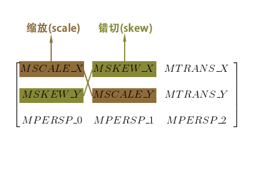

# 范围裁切和集合变换

## 范围裁切

范围裁切是为了将绘制限制在一定的范围内(/外，是的可以切割保留外部)。如果想要在绘制完某对象之后恢复范围，需要 canvas 进行 `save()` 和 `restore()`。

裁切范围的函数并不多，只有 `clipRect` 和 `clipPath` 两种用法

```
canvas.save();  
canvas.clipRect(left, top, right, bottom);  
canvas.drawBitmap(bitmap, x, y, paint);  
canvas.restore();  
```

***想要改变图像的形状不能使用范围裁切来完成，因为范围裁切是限制显示范围，而抗锯齿需要图像边缘进行模糊，范围裁切会使模糊失效，因此会有锯齿。使用 xformode 来完成。***


## 几何变换

- 二维变换 使用 canvas 
- 伪三维变换 使用 cammer 进行变换，经变换结果作用与 canvas 上。
- 使用 matrix 做不常见的变换（canvas 和 cammer 的变换底层都是 matrix）

### canvas 二维变换

#### 平移 translate
#### 旋转 rotate
#### 缩放 scale
#### 错切 skew

其中， canvas 的这些变换都是前置变换，变换跟写的顺序是相反的，要想达到设计的目标，需要倒着变换的顺序写变换。例如，想要先平移在旋转，则需要先写旋转，厚些平移。


### matrix 进行变换

1. 创建 Matrix 对象；
2. 调用 Matrix 的 pre/postTranslate/Rotate/Scale/Skew() 方法来设置几何变换；
3. 使用 Canvas.setMatrix(matrix) 或 Canvas.concat(matrix) 来把几何变换应用到 Canvas。

把 Matrix 应用到 Canvas 有两个方法： Canvas.setMatrix(matrix) 和 Canvas.concat(matrix)。

- Canvas.setMatrix(matrix)：用 Matrix 直接替换 Canvas 当前的变换矩阵，即抛弃 Canvas 当前的变换，改用 Matrix 的变换（有个说法，不同的系统中 setMatrix(matrix) 的行为可能不一致，所以还是尽量用 concat(matrix) 吧）；
- Canvas.concat(matrix)：用 Canvas 当前的变换矩阵和 Matrix 相乘，即基于 Canvas 当前的变换，叠加上 Matrix 中的变换。


#### 齐次坐标
[原文](https://www.sohu.com/a/191233794_667928)

实际的变换，其实是使用矩阵运算达到目的的。如何进行矩阵运算，不得不首先说明齐次坐标。

实际上齐次坐标的概念解释很简单很简单。也没有太多的数学公式。

> “齐次坐标表示是计算机图形学的重要手段之一，它既能够用来明确区分向量和点，同时也更易用于进行仿射（线性）几何变换。”—— F.S. Hill, JR。

关于齐次坐标，能做什么。实际上，这句话已经说的很清楚了。它既能够用来明确区分向量和点，看到这句话，我们思考一下为什么？我们需要区分点和向量?。比如欧式坐标系统中（1,2），可以表示一个点也可以表示一个向量我们无法区分。

1. 从普通坐标转换成齐次坐标时

如果 (x,y,z) 是个点，则变为 (x,y,z,1);

如果 (x,y,z) 是个向量，则变为 (x,y,z,0)

2. 从齐次坐标转换成普通坐标时

如果是 (x,y,z,1) ，则知道它是个点，变成 (x,y,z);

如果是 (x,y,z,0) ，则知道它是个向量，仍然变成 (x,y,z)

3. 同时也更易用于进行仿射（线性）几何变换

“许多图形应用涉及到几何变换，主要包括平移、旋转、缩放。以矩阵表达式来计算这些变换时，平移是矩阵相加，旋转和缩放则是矩阵相乘，综合起来可以表示为 `p' = p * m1 + m2` (m1旋转缩放矩阵， m2为平移矩阵， p为原向量 ，p'为变换后的向量)。引入齐次坐标的目的主要是 `合并` 矩阵运算中的 `乘法和加法`，表示为 `p' = p * M` 的形式。即它提供了用矩阵运算把二维、三维甚至高维空间中的一个点集从一个坐标系变换到另一个坐标系的有效方法。”

> 齐次”之名？齐次坐标的数学定义及特性

问题：两条平行线可以相交于一点

在欧氏几何空间，同一平面的两条平行线不能相交，这是我们都熟悉的一种场景。
然而，在透视空间里面，两条平行线可以相交，例如：火车轨道随着我们的视线越来越窄，最后两条平行线在无穷远处交于一点。

欧氏空间（或者笛卡尔空间）描述2D/3D几何非常适合，但是这种方法却不适合处理透视空间的问题（实际上，欧氏几何是透视几何的一个子集合），2维笛卡尔坐标可以表示为（x,y）。

如果一个点在无穷远处，这个点的坐标将会(∞,∞)，在欧氏空间，这变得没有意义。平行线在透视空间的无穷远处交于一点，但是在欧氏空间却不能，数学家发现了一种方式来解决这个问题。

方法：齐次坐标
简而言之，齐次坐标就是用N+1维来代表N维坐标

我们可以在一个2D笛卡尔坐标末尾加上一个额外的变量w来形成2D齐次坐标，因此，一个点(X,Y)在齐次坐标里面变成了（x,y,w），并且有

```
X = x/w

Y = y/w
```

例如，笛卡尔坐标系下（1，2）的齐次坐标可以表示为（1，2，1），如果点（1，2）移动到无限远处，在笛卡尔坐标下它变为(∞,∞)，然后它的齐次坐标表示为（1，2，0），因为(1/0, 2/0) = (∞,∞)，我们可以不用”∞"来表示一个无穷远处的点了，哈哈。


如果我们要将欧式坐标的一个二维点 (1,2)(1,2) 转换为齐次坐标，根据规则，我们可以选择刚才用到的 (1,2,1)(1,2,1)，也可以选择 (2,4,2)(2,4,2)，还可以选择 (4,8,4),(8,16,8)...(4,8,4),(8,16,8)...，即 (k,2k,k),k∈R(k,2k,k),k∈R 都是“合法”的齐次坐标表示，这些点都映射到欧式空间中的一点，即这些点具有尺度不变性（Scale Invariant），是“齐性的”(同族的)，所以称之为齐次坐标。

同样的，线性系统的齐次性是指在输入量倍乘的情况下，输出同时倍乘同一因子。以及齐次函数的定义等，都和倍乘某一个常数因子有关。

#### 仿射变换

[原文](https://www.gcssloop.com/customview/Matrix_Basic)


我们所用到的变换均属于仿射变换，仿射变换是 线性变换(缩放，旋转，错切) 和 平移变换(平移) 的复合。

基本变换有4种: 平移(translate)、缩放(scale)、旋转(rotate) 和 错切(skew)。

下面我们看一下四种变换都是由哪些参数控制的。





#### preXXX 和 postXXX 左乘和右乘

pre XXX：左乘：原矩阵在左： M` = M*A

postXXX：右乘：原矩阵在右：M` = A*M

> 关于变换代码顺序，有时候需要根据需要倒着写，并不是执行循序是倒着的。而是矩阵乘法不具有交换性的原因。其实，所有的变换，都会最终合成一个变换矩阵，由这个最终矩阵，作用与要绘制的内容上，而不是每一个变换步骤，作用于绘制对象。这样的好处是，优化了计算过程。

具体来说，如果每个变换步骤，分别计算，加入有四个变换步骤（平移，旋转，缩放，平移），假设一次矩阵相乘记为一个运算单位。而要绘制的点为 n 个

```
C = n * 4
```

而先合并变换矩阵，然后对目标进行运算就是

```
C = n * 1 + 3;
```


> 矩阵平移


