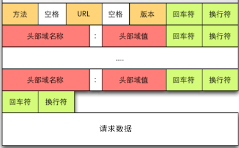

# HTTP 协议
HTTP协议的主要特点

- 支持C/S（客户/服务器）模式。
- 简单快速：客户向服务器请求服务时，只需传送请求方法和路径。请求方法常用的有GET、HEAD、POST，每种方法规定了客户与服务器联系的类型不同。由于HTTP协议简单，使得HTTP服务器的程序规模小，因而通信速度很快。
- 灵活：HTTP允许传输任意类型的数据对象。正在传输的类型由Content-Type加以标记。
- 无连接：无连接的含义是限制每次连接只处理一个请求。服务器处理完客户的请求，并收到客户的应答后，即断开连接。采用这种方式可以节省传输时间。
- 无状态：HTTP协议是无状态协议，无状态是指协议对于事务处理没有记忆能力。缺少状态意味着如果后续处理需要前面的信息，则它必须重传，这样可能导致每次连接传送的数据量增大。另一方面，在服务器不需要先前信息时它的应答就较快。

# HTTP协议的结构

首先来看方法，HTTP将请求分为不同的种类，例如请求数据 GET 和发送数据 POST，
HTTP请求方法有8种，分别是GET、POST、DELETE、PUT、HEAD、TRACE、CONNECT 、OPTIONS。其中PUT、DELETE、POST、GET分别对应着增删改查，对于移动开发最常用的就是POST和GET了。

    GET：请求获取Request-URI所标识的资源
    POST：在Request-URI所标识的资源后附加新的数据
    HEAD：请求获取由Request-URI所标识的资源的响应消息报头
    PUT： 请求服务器存储一个资源，并用Request-URI作为其标识
    DELETE ：请求服务器删除Request-URI所标识的资源
    TRACE ： 请求服务器回送收到的请求信息，主要用于测试或诊断
    CONNECT： HTTP/1.1协议中预留给能够将连接改为管道方式的代理服务器。
    OPTIONS ：请求查询服务器的性能，或者查询与资源相关的选项和需求

# URL
UIL叫做**统一资源定位符**，互联网是将分布在世界各地的资源联结起来，形成共享的网络。这些资源分布在世界各地，
想要找到该资源，就需要有能够定位该资源的唯一标识符。这就不得不说URI，URI就是统一资源标识符，在网络上不仅有
文档、图片、音频、视频。人们将账号、数据、邮箱等等凡是能够通过互联网访问的都称为资源。这些资源由于形式不一样
就需要使用不同协议标识的地址。例如http协议的地址是http://baidu.com。而使用ftp协议的一个地质可能是ftp://
baidu/a.img。
URL的结构

# 请求报头

在请求行之后会有0个或者多个请求报头，每个请求报头都包含一个名字和一个值，它们之间用“：”分割。请求头部会以一个空行，发送回车符和换行符，通知服务器以下不会有请求头。关于请求报头，会在后面的消息报头一节做统一的解释。

# 请求数据

请求数据不在 GET 方法中使用，而是在POST方法中使用。POST方法适用于需要客户填写表单的场合，与请求数据相关的最常用的请求头是Content-Type和Content-Length。

# HTTP的响应报文
响应报文的一般格式：

HTTP的响应报文由状态行、消息报头、空行、响应正文组成。响应报头后面会讲到，响应正文是服务器返回的资源的内容，先来看看状态行。
状态行

1、状态行格式如下：

HTTP-Version Status-Code Reason-Phrase CRLF

其中，HTTP-Version表示服务器HTTP协议的版本；Status-Code表示服务器发回的响应状态代码；Reason-Phrase表示状态代码的文本描述。
状态代码有三位数字组成，第一个数字定义了响应的类别，且有五种可能取值：

    100~199：指示信息，表示请求已接收，继续处理
    200~299：请求成功，表示请求已被成功接收、理解、接受
    300~399：重定向，要完成请求必须进行更进一步的操作
    400~499：客户端错误，请求有语法错误或请求无法实现
    500~599：服务器端错误，服务器未能实现合法的请求

常见的状态码如下：

    200 OK：客户端请求成功
    400 Bad Request：客户端请求有语法错误，不能被服务器所理解
    401 Unauthorized：请求未经授权，这个状态代码必须和WWW-Authenticate报头域一起使用
    403 Forbidden：服务器收到请求，但是拒绝提供服务
    500 Internal Server Error：服务器发生不可预期的错误
    503 Server Unavailable：服务器当前不能处理客户端的请求，一段时间后可能恢复正常

例如访问我的CSDN博客地址响应的状态行是：

HTTP/1.1 200

4.HTTP的消息报头

消息报头分为通用报头、请求报头、响应报头、实体报头等。消息头由键值对组成，每行一对，关键字和值用英文冒号“:”分隔。

## 通用报头

既可以出现在请求报头，也可以出现在响应报头中

    Date：表示消息产生的日期和时间
    Connection：允许发送指定连接的选项，例如指定连接是连续的，或者指定“close”选项，通知服务器，在响应完成后，关闭连接
    Cache-Control：用于指定缓存指令，缓存指令是单向的（响应中出现的缓存指令在请求中未必会出现），且是独立的（一个消息的缓存指令不会影响另一个消息处理的缓存机制）

## 请求报头

请求报头通知服务器关于客户端求求的信息，典型的请求头有：

    Host：请求的主机名，允许多个域名同处一个IP地址，即虚拟主机
    User-Agent：发送请求的浏览器类型、操作系统等信息
    Accept：客户端可识别的内容类型列表，用于指定客户端接收那些类型的信息
    Accept-Encoding：客户端可识别的数据编码
    Accept-Language：表示浏览器所支持的语言类型
    Connection：允许客户端和服务器指定与请求/响应连接有关的选项，例如这是为Keep-Alive则表示保持连接。
    Transfer-Encoding：告知接收端为了保证报文的可靠传输，对报文采用了什么编码方式。

## 响应报头

用于服务器传递自身信息的响应，常见的响应报头：

    Location：用于重定向接受者到一个新的位置，常用在更换域名的时候
    Server：包含可服务器用来处理请求的系统信息，与User-Agent请求报头是相对应的

## 实体报头

实体报头用来定于被传送资源的信息，既可以用于请求也可用于响应。请求和响应消息都可以传送一个实体，常见的实体报头为：

    Content-Type：发送给接收者的实体正文的媒体类型
    Content-Lenght：实体正文的长度
    Content-Language：描述资源所用的自然语言，没有设置则该选项则认为实体内容将提供给所有的语言阅读
    Content-Encoding：实体报头被用作媒体类型的修饰符，它的值指示了已经被应用到实体正文的附加内容的编码，因而要获得Content-Type报头域中所引用的媒体类型，必须采用相应的解码机制。
    Last-Modified：实体报头用于指示资源的最后修改日期和时间
    Expires：实体报头给出响应过期的日期和时间

# HTTP结构

所有的HTTP Request都分成4部分，URI、method、headers和body。
