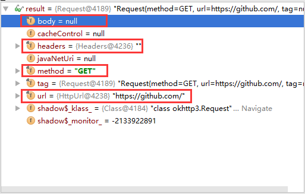
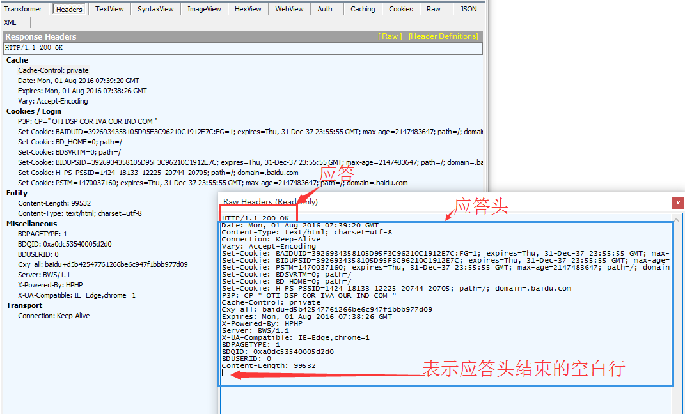
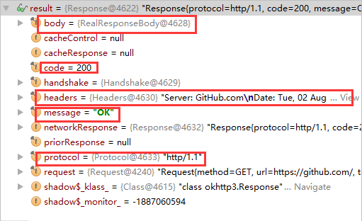

[TOC]
===============================

# okhttp
一个http请求包含请求方法, 请求地址, 请求协议, 请求头, 请求体这[5部分](http.md/http请求结构)，这些都在okhttp3.Request的类中有体现, 这个类正是代表http请求的类. 
如下:
```java
public final class Request {
  final HttpUrl url; // 请求地址
  final String method;  // 请求方法
  final Headers headers; // 请求头
  final @Nullable RequestBody body; // 请求体
  final Object tag; // 用来取消http请求的标志
  ...
}
```
请求协议呢? 为什么没有请求协议对应的类. 且听我慢慢道来, 下面就会讲到这个问题.
## http请求
### 请求协议的协商升级

目前, Http/1.1在全世界大范围的使用中, 直接废弃跳到http/2肯定不现实. 不是每个用户的浏览器都支持http/2的, 也不是每
个服务器都打算支持http/2的, 如果我们直接发送http/2格式的协议, 服务器又不支持, 那不是挂掉了! 总不能维护一个全世界的
网站列表, 表示哪些支持http/2, 哪些不支持?

为了解决这个问题, 从稍高层次上来说, 就是为了更方便地部署新协议, HTTP/1.1引入了 Upgrade 机制. 这个机制在 RFC7230
的[「6.7 Upgrade」](http://httpwg.org/specs/rfc7230.html#header.upgrade)这一节中有详细描述.

简单说来, 就是先问下你支持http/2么? 如果你支持, 那么接下来我就用http/2和你聊天. 如果你不支持, 那么我还是用原来的
http/1.1和你聊天.

1.客户端在请求头部中指定Connection和Upgrade两个字段发起 HTTP/1.1 协议升级. HTTP/2 的协议名称是 h2c, 代表 HTTP/2 ClearText.


    GET / HTTP/1.1
    Host: example.com
    Connection: Upgrade, HTTP2-Settings
    Upgrade: h2c
    HTTP2-Settings: <base64url encoding of HTTP/2 SETTINGS payload>

2.如果服务端不同意升级或者不支持 Upgrade 所列出的协议，直接忽略即可（当成 HTTP/1.1 请求，以 HTTP/1.1 响应）.

    HTTP/1.1 200 OK
    Content-Length: 243
    Content-Type: text/html
    ...

如果服务端同意升级，那么需要这样响应：

    HTTP/1.1 101 Switching Protocols
    Connection: Upgrade
    Upgrade: h2c
    [ HTTP/2 connection ... ]

HTTP Upgrade 响应的状态码是 101，并且响应正文可以使用新协议定义的数据格式。

这样就可以完成从http/1.1升级到http/2了. 同样也可以从http/1.1升级到WebSocket.

这样, 你就了解了为什么OkHttp没有指定具体请求协议了吧. 因为OkHttp使用了请求协议的协商升级, 无论是1.1还是2, 都先只
以1.1来发送, 并在发送的信息头里包含协议升级字段. 接下来就看服务器是否支持协议升级了. OkHttp使用的协议升级字段是ALPN,
如果有兴趣, 可以更深入的查阅相关资料.

### OkHttp请求
接下来我们构造一个http请求, 并查看请求具体内容.
```java
final Request request = new Request.Builder().url("https://github.com/").build();
```
我们看下在内存中, 这个请求是什么样子的, 是否如我们上文所说和请求方法, 请求地址, 请求头, 请求体一一对应.




## http响应
响应response由`响应首行`, `响应头`, `应答体`构成，



可以看到大体由应答首行, 应答头, 应答体构成. 但是应答首行表达的信息过多, HTTP/1.1表示访问协议, 200是响应码,
OK是描述状态的消息. 根据单一职责, 我们不应该把这么多内容用一个应答首行来表示. 这样的话, 我们的响应就应该由访问协议,
响应码, 描述信息, 响应头, 响应体来组成.

### okhttp response
我们看下OkHttp库怎么表示一个响应:
```java
public final class Response implements Closeable {
  final Request request; // 持有的请求
  final Protocol protocol; // 请求协议
  final int code; // 响应码
  final String message; // 描述信息
  final @Nullable Handshake handshake; // 代表SSL/TLS握手协议验证时的信息, 这些额外信息我们暂时不问.
  final Headers headers; // 响应头
  final @Nullable ResponseBody body; // 响应体
  final @Nullable Response networkResponse;
  final @Nullable Response cacheResponse;
  final @Nullable Response priorResponse;
  ...
}
```

有了刚才说的OkHttp响应的类组成, 我们看下OkHttp请求后响应在内存中的内容:
```java
final Request request = new Request.Builder().url("https://github.com/").build();
Response response = client.newCall(request).execute();
```



## 3 okhttp请求
### 3.0 创建http请求对象
```java
Request request = new Request.Builder()
        .url("http://publicobject.com/helloworld.txt")
        .build();
```

Request代表Http请求, 通过Request.Builder辅助类来构建.

### 3.1 okhttp客户端
有了http请求之后，在onhttp中还需要建立一个OkHttpClient对象来发送请求。熟悉客户端和服务器端的人应该很清楚它的
含义。
```java
OkHttpClient client = new OkHttpClient();
```

### 3.2 get请求
#### 3.2.1 同步get
同步GET的意思是一直等待http请求, 直到返回了响应. 在这之间会阻塞进程, 所以通过get不能在Android的主线程中执行,
否则会报错。
```java
Request request = new Request.Builder().url("https://github.com/").build();
OkHttpClient client = new OkHttpClient();
try {
    Response response = client.newCall(request).execute();
    if (!response.isSuccessful()) throw new IOException("Unexpected code " + response);
    Headers responseHeaders = response.headers();
    for (int i = 0; i < responseHeaders.size(); i++) {
        System.out.println(responseHeaders.name(i) + ": " + responseHeaders.value(i));
    }
    System.out.println(response.body().string());

} catch (IOException e) {
    e.printStackTrace();
}
```
OkHttpClient的newCall需要一个Request对象来作为一次请求的信息， 返回一个Call调用。call对象使用无参数的execure()将会返回一个Response对象，
而不会开辟新的线程来完成网络请求的任务。

OkHttpClient实现了Call.Factory接口, 是Call的工厂类, Call负责发送执行请求和读取响应.

Response代表Http请求的响应. response.body()是ResponseBody类, 代表响应体, 可以通过responseBody.string()
获得字符串的表达形式, 或responseBody.bytes()获得字节数组的表达形式, 这两种形式都会把文档加入到内存. 也可以通过
responseBody.charStream()和responseBody.byteStream()返回流来处理.

上述代码完成的功能是下载一个文件, 打印他的响应头, 以string形式打印响应体.

响应体的string()方法对于小文档来说十分方便高效. 但是如果响应体太大（超过1MB）, 应避免使用 string()方法, 因为它会
将把整个文档加载到内存中.

对于超过1MB的响应body, 应使用流的方式来处理响应body. 这和我们处理xml文档的逻辑是一致的, 小文件可以载入内存树状解析,
大文件就必须流式解析.

#### 3.2.2 异步get
如过想要在另外的线程中执行http请求，也不用自己动手写线程的代码，okhttp已经为我们封装了异步请求的功能。
```java
Request request = new Request.Builder().url("http://publicobject.com/helloworld.txt").build();
OkHttpClient client = new OkHttpClient();
client.newCall(request).enqueue(new Callback() {
      @Override
      public void onFailure(@NonNull Call call, IOException e) {
          e.printStackTrace();
      }

      @Override
      public void onResponse(@NonNull Call call, Response response) throws IOException {
          if (!response.isSuccessful()) throw new IOException("Unexpected code " + response);
          Headers responseHeaders = response.headers();
          for (int i = 0; i < responseHeaders.size(); i++) {
              System.out.println(responseHeaders.name(i) + ": " + responseHeaders.value(i));
          }
          System.out.println(response.body().string());
      }
   });
```
