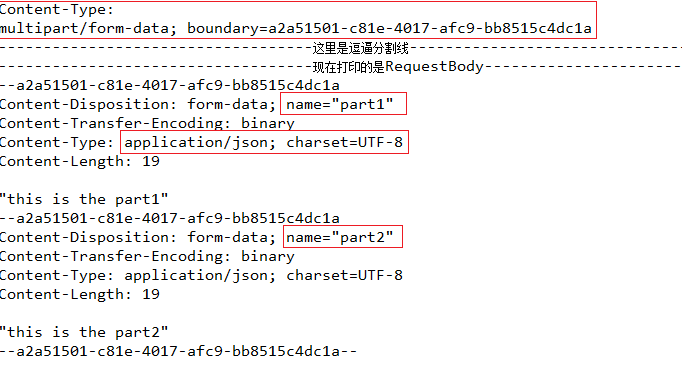
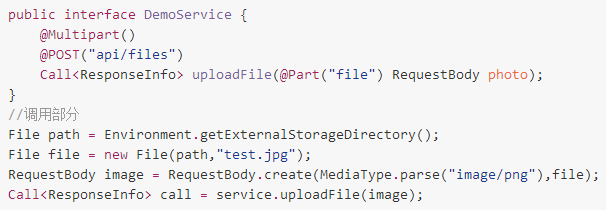
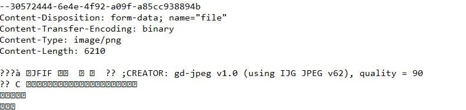

# Retrofit 的设计

1. 网络请求头是固定的。
2. 请求参数是可变的。
3. 网络请求是一个流 
```
发送 ----------+ 
             处理
接收 <---------+
```
4. 可重定向
5. 可缓存
6. SSL

## 有了 OKHttp 为什么还要 Retrofit？

```Java
Request request = new Request.Builder()
  .url("http://publicobject.com/helloworld.txt")
  .a
  .build();

OkHttpClient client = new OkHttpClient();

client.newCall(request).
  enqueue(new Callback() {
      @Override
      public void onFailure(@NonNull Call call, IOException e) {
          // ....
      }

      @Override
      public void onResponse(@NonNull Call call, Response response) throws IOException {
          // ...
      }
   });
```

1. 简化 Builder 的代码重复。
2. 可配置的。http 接口是分组，有结构的。接口的的所有接口定义都能归并的一个地方，能够更好地归纳，不同接口的区分更加明显。


- 本页 `README.md` Retrofit的从简单到入门
- [介绍什么是 RESTfulAPI](./RESTfulAPI.md)
- [Retrofit 注解说明表和快速跳转说明](./annotation_list.md)
- [Retrofit缓存等配置方法](./configuration.md)
- [使用中遇到的一些问题和解决办法](./bug_fix.md)
- [准备放一些自己封装组件的说明](./use.md)

- [所思所想](./Speculative.md)


# Retrofit是什么？


- [RESTfulAPI](./RESTfulAPI.md)

# 在项目中使用Retrofit

在安卓Module的gradle中添加如下的依赖：

```
compile 'com.squareup.retrofit2:retrofit:2.3.0'
```

Retrofit是为具有RESTful的的接口进行封装的．而Retrofit做的最好的地方就是它对于结构的划分让整个网络请求代码非常清晰简洁．Retrofit和其它Http库最大区别在于通过大范围使用注解简化Http请求。

要访问网络，首先就要制定网络接口，Retrofit 将网络接口的指定单独做到一起．加上使用注解的方式，让整个接口的参数指定变得清晰明了，看起来非常简洁．

```Java
public interface GitHubService {
  @GET("users/{user}/repos")
  Call<List<Repo>> listRepos(@Path("user") String user);
}
```
***Retrofit会将你的HTTP API转换为Java中的interface的形式。***

这里定义了一个接口listRepos来指定`HTTP请求头`的信息。
- @GET　指出这是一个GET请求，Retrofit要求请求接口必须有一个包含请求方法（GET,POST,DELETE...)和URL的注解，Retrofit内部已经封装的请求方法有五个：GET, POST, PUT, DELETE, and HEAD。后面跟着它的URL。
  * 在 URI 中也可以指定请求参数
    BaseUrl要以/结尾；@GET 等请求不要以/开头；@Url: 可以定义完整url，不要以 / 开头。
    ```
    @GET("users/{user}/repos?sort=desc")
    ```
  * 动态指定全路径URI
    ```java
    // option 2: using a dynamic URL
    @GET
    Call<ResponseBody> downloadFileWithDynamicUrlSync(@Url String fileUrl);
    ```

  * URL是可以在使用才动态改变的，例如这里的 users/{user}/repos 中请求users/用于ID/repos的内容，ID是可变的，Retrofit使用{}指明这是一个替换块，然后在参数中使用`@Path("user") String user`来指出参数将替换哪个字符串。

  * 请求参数如果可能改变，可以在参数中使用@Query指定
    ```java
    @GET("users/{user}/repos")
    Call<List<Repo>> listRepos(@Path("user") int userId, @Query("sort") String sort);
    ```

  * 聪明的你现在肯定还不满足，因为可能有这样的疑问：假设我要在参数中上传10个参数呢？这意味着我要在方法中声明10个@Query参数？当然不是！多个请求参数可以使用 Map 指定
    ```java
    @GET("users/{user}/repos")
    Call<List<Repo>> groupList(@Path("user") int userId, @QueryMap Map<String, String> options);
    ````

  * **请求体** 请求体是 POST 请求独有的选项，使用 @Body 可以声明一个用于作为请求体的对象。
    ```java
    @POST("users/new")
    Call<User> createUser(@Body User user);
    ```
    ***需要注意的是，对象与请求体的转换关系需要在Retrpofit实例化的时候有指定，不指定情况下只能接收 `RequestBody` 对象，否则会报错。关于如何制定的部分，会在实例化的部分给出，Retrofit做的好的地方正是这种将结构划分的非常明确部分：请求内容全部在接口中指定；请求接口只用来制定请求参数，不做任何其他工作***

  * **表单提交** 通过 @BODY 这样提交的请求体，Retrofit 会以JSON的形式来格式化数据。在服务器端得到的数据是这样的
    {"name":"tsr","gender":"male","age":24}
  如果服务器端使用的是接受表单的方式来解析数据，如 request.getParameter("username") 则会返回null。 那么如何发送表单呢？
    ```java
    @FormUrlEncoded
    @POST("user/edit")
    Call<User> updateUser(@Field("first_name") String first, @Field("last_name") String last);
    ```
    使用 @FormUrlEncoded 注解，然后 @Field("first_name") 注解 key 值，数据就会以表单的形式格式化。
    也有@FieldMap 供我们使用，使用方法参照`@QueryMap`。

  * Multipart提交。需要使用`@Multipart`注解接口，参数使用`@Part(组成名)`来注解。
    ```java
    @Multipart
    @PUT("user/photo")
    Call<User> updateUser(@Part("photo") RequestBody photo, @Part("description") RequestBody description);
    ```
    Multipart parts use one of Retrofit's converters or they can implement RequestBody to handle their own serialization.

  * 请求头
    使用了 @FormUrlEncoded 之后，不知道你有没有好奇一下，假设我们的参数中含有中文信息，会不会出现乱码？让我们来验证一下：

    Call<ResponseInfo> call = service.uploadNewUser("张德帅","male",24);

    这里上传的 username 信息是中文，而在服务器读取后进行打印，其输出的是“?????·???”。没错，确实出现乱码了。

    这个时候我们应该如何去解决呢？当然可以通过 URLEncode 对数据进行指定编码，然后服务器再进行对应的解码读取：

    String name =  URLEncoder.encode("张德帅","UTF-8");
    Call<ResponseInfo> call = service.uploadNewUser(name,"male",24);

    但如果了解一点 HTTP协议 的使用，我们知道还有另一种解决方式：在 Request-Header 中设置 charset 信息。于是，这个时候就涉及到添加请求头了：
    ```java
    @Headers("Cache-Control: max-age=640000")
    @GET("widget/list")
    Call<List<Widget>> widgetList();

    @Headers({
      "Accept: application/vnd.github.v3.full+json",
      "User-Agent: Retrofit-Sample-App"
    })
    @GET("users/{username}")
    Call<User> getUser(@Path("username") String username);
    ```

    除了@Headers 之外，还有另一个注解叫做 @Header。它的不同在于是动态的来添加请求头信息，也就是说更加灵活一点。我们也可以使用一下：
    ```java
    @GET("user")
    Call<User> getUser(@Header("Authorization") String authorization)
    ```

    `读取response header

    通过上面的总结我们知道通过 @Header 可以在请求中 添加header，那么我们如何去读取响应中的 header 呢？我们会发现官方文档并没有相关介绍。

    那么显然我们就只能自己看看了，一找发现对于 Retrofit2 来说 Response类 有一个方法叫做 headers()，通过它就获取了本次请求所有的响应头。

    那么，我们记得在 OkHttp 里面，除了 headers()，还有用于获取单个指定头的 header() 方法。我们能不能在 Retrofit 里使用这种方式呢？答案是可以。

    我们发现 Retrofit 的 Response 还有一个方法叫做 raw()，调用该方法就可以把 Retrofit 的Response 转换为原生的 OkHttp 当中的 Response。而现在我们就很容器实现 header 的读取了吧。

    okhttp3.Response okResponse = response.raw();
    okResponse.header("Cache-Control");
    `

  * @Multipart 与文件上传
    Multipart 是一个神奇的东西，它能够以二进制形式传输数据。先来看看这是个什么东西。
    ```java
    @Multipart
    @POST("api/multipartTesring")
    Call<ResponseBody> testMultipart(
            @Part("part1") String part1,
            @Part("part2") String part2
    );
    ```
    为了一探究竟，我们现在在服务器打印一下 Content-Type 与 请求体(request-body) 分别是怎样的：
    

    现在我们来分析一下从打印的请求体中，我们能够得到哪些信息：

    1. 首先，本次请求的 Content-Type 是 multipart/form-data; 也就是代表通过2进制形式上传多部分的数据。

    2. boundary 故名思议就是分割线，它是用来对上传的不同部分的数据来进行分隔的，就像上图中体现的一样。

    3. 通过 @Part 传入的参数信息都像上图中一样被组装，首先是相关的内容信息，然后间隔一个空行，之后是实际数据内容，最后接以 boundary。

    4. 当使用 @Part 上传String参数信息时，我们可以看到其默认的参数类型application/json。（这代表如果你的服务器接不支持解析此类型的Content-Type，就需要自己修改为对应的类型）

    现在我们注意到一个问题，那就是 multipart/form-data 将会以2进制形式来上传数据信息。那么，什么时候我们才需要2进制呢？显然就是文件的上传。 OK，那么我们继续修改代码，这次我们尝试通过@Part来上传一个文件会是什么情况？

    

    这里可以发现，当要上传的数据是文件时，就要使用到 RequestBody 了。再次运行程序，然后截取服务器打印的请求体的部分进行查看：
    

    我们其实可以很直观的看到，大体的格式与之前都是一样的，而不同之处在于：
    1. Content-Type 不再是 application/json，而是 image/png 了。

    2. 空行之后的数据内容不再是之前直观的文本，而是二进制的图片内容。

    这个时候就会出现一个问题，假设我们为了方便，打算通过一些公有的API去测试一下上传文件(图片)什么的，会发现上传不成功。这是为什么呢？

    实际上如果我们完全自己动手来写服务器，完全根据之前的请求体打印信息的格式来写解析的方法，肯定是也能完成文件上传的。但问题在于：

    我们说到 multipart/form-data 是支持多部分数据同时上传的，于是就出现了一个听上去很有逼格的梗，叫做“图文混传”。那么：

    为了区别于同一个 request-body 中的文本或文件信息，所以通常实际开发来说，上传文件的时候，Content-Disposition 是这样的：
    ```
    Content-Disposition: form-data; name="file"；filename="test.jpg"
    ```compile 'com.squareup.retrofit2:retrofit:(insert latest version)'
    而不是我们这里看到的：
    ```
    Content-Disposition: form-data; name="file"
    ```
    于是别人的api里读取不到这个关键的“filename”，自然也就无法完成上传了。所以如果想通过 Retrofit 实现文件上传，可以通过如下方式来改造一下：
    ```Java
    @Multipart
    @POST
    Call<ResponseBody> uploadFile(@Part("file\";filename=\"test.jpg") RequestBody photo);
    ```

- Call 则是能够发出HTTP请求（同步/异步）类。请求得到的数据的将会封装成List<Repo>的对象。内部具体怎么做到的，以后在做讨论。
