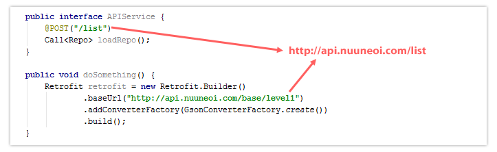

# Retrofit 配置
到目前为止，Retrofit已经指定好发送的请求，返回的数据了。这正是接口该有的功能，可以说这样的设计非常精妙。如何发送请求呢？要知道一个接口是没有任何功能的。来看官方的实例：

```Java
Retrofit retrofit = new Retrofit.Builder()
    .baseUrl("https://api.github.com/")
    .build();

GitHubService service = retrofit.create(GitHubService.class);
```
这里我们发现，在创建Retrofit对象之后，Retrofit能够将接口实例化。我们可以将Retrofit类看作是一个“工厂类”的角色，我们在接口中提供了此次的“产品”的生产规格信息，而Retrofit则通过信息负责为我们生产。
- Retrofit 2.0使用了新的URL定义方式。Base URL与@Url 不是简单的组合在一起而是和<a href="...">的处理方式一致。用下面的几个例子阐明。
  
  
  

  ps：貌似第二个才符合习惯。

  对于 Retrofit 2.0中新的URL定义方式，这里是我的建议：
  - Base URL: 总是以 /结尾
  - @Url: 不要以 / 开头

而且在Retrofit 2.0中我们还可以在@Url里面定义完整的URL：
```java
public interface APIService {

    @POST("http://api.nuuneoi.com/special/user/list")
    Call<Users> loadSpecialUsers();

}
```


然后我们就能调用接口中实现的方法了：
```Java
Call<List<Repo>> repos = service.listRepos("octocat");
```

这里生成了之前定义接口返回的Call对象，**通过之前封装的请求接口对象创建的任一的Call都可以发起一个同步（或异步）的HTTP请求到远程服务器。**

为了让OkHttp 的Call模式成为可能，在Retrofit 2.0中OkHttp 自动被用作HTTP 接口。

那么如何使用这个Call对象发起请求呢？首先要知道网络请求是非常耗时的，而且容易发生错误。当我们处理耗时工作时，经常在一个子线程中处理，然后在工作完成之后，使用回调来返回结果。Retrofit也是如此处理的。

要发起一个异步请求，只需要执行enqueue, 而同步请求则实行execure();
```Java
// 异步请求
call.enqueue(new Callback <List<Repo>>() {

            @Override
            public void onResponse(Call<List<Repo>> call, Response<List<Repo>> response) {

            }

            @Override
            public void onFailure(Call<List<Repo>> call, Throwable t) {

            }
        });

// 同步请求 代码会阻塞线程，因此你不能在安卓的主线程中调用，不然会面临NetworkOnMainThreadException。如果你想调用execute方法，请在后台线程执行。
List<Repo> repoList = call.execute();

```
***call只能调用一次。否则会抛 IllegalStateException*** 可以使用conle函数拷贝一个。
Call<List<Repo>> clone = call.clone();

## 即使response存在问题onResponse依然被调用

在Retrofit 1.9中，如果获取的 response 不能背解析成定义好的对象，则会调用failure。但是在Retrofit 2.0中，不管 response 是否能被解析。onResponse总是会被调用。但是在结果不能被解析的情况下，response.body()会返回null。别忘了处理这种情况。

如果response存在什么问题，比如404什么的，onResponse也会被调用。你可以从response.errorBody().string()中获取错误信息的主体。


Response/Failure 逻辑和Retrofit 1.9差别很大。如果你决定迁移到Retrofit 2.0，注意小心谨慎的处理这些情况。


## 取消正在进行的任务

service 的模式变成Call的形式的原因是为了让正在进行的事务可以被取消。要做到这点，你只需调用call.cancel()。
```java
call.cancel();
```


然而，当我们运行的时候，却出错了。查看管方的文档，你会发现，
###### Converters

  By default, Retrofit can only deserialize HTTP bodies into OkHttp's ResponseBody type and it can only accept its RequestBody type for @Body.
  从上述信息我们得知 Retrofit 默认只能将响应体转换为 OkHttp 中的 ResponseBody，而我们之前为 Call 设置的泛型类型是自定义的类型 ResponseInfo 。
> [OkHttp's ResponseBody]()

Retrofit 默认支持许多中数据类型的转换
- Gson: com.squareup.retrofit2:converter-gson
- Jackson: com.squareup.retrofit2:converter-jackson
- Moshi: com.squareup.retrofit2:converter-moshi
- Protobuf: com.squareup.retrofit2:converter-protobuf
- Wire: com.squareup.retrofit2:converter-wire
- Simple XML: com.squareup.retrofit2:converter-simplexml
- Scalars (primitives, boxed, and String): com.squareup.retrofit2:converter-scalars

如果想要指定转换的方法，需要额外指定。
将JSON格式的数据转换为 Java-BEAN，很自然就会想到GSON。而 Retrofit 如果要执行这种转换是要依赖于另一个库的，所以我们还得在项目中配置另一个依赖：

> compile 'com.google.code.gson:gson:2.8.2'

```java
mServerApi = new Retrofit.Builder()
        .baseUrl(Const.ServerConfig.BASE_URL)
        .addConverterFactory(GsonConverterFactory.create()) // 使用这一句来指定转换格式
        .build()
        .create(ServerApi.class);
```
而如果想要得到字符串数据，眼尖的马上就看到了 Scalars 后面有一个东西叫做 String。

于是接下来的工作就简单了，依然是配置依赖；然后将Call的泛型指定为String；最后记得将 Converter 改掉，像下面这样：

```java
//...
.addConverterFactory(ScalarsConverterFactory.create())
```
有了这个例子，对于同类型的需求我们就很容易举一反三了。但马上又想到：假设我们的数据类型官方没有提供现成的Converter呢？很简单，自己造！

ustom Converters

If you need to communicate with an API that uses a content-format that Retrofit does not support out of the box (e.g. YAML, txt, custom format) or you wish to use a different library to implement an existing format, you can easily create your own converter. Create a class that extends the [Converter.Factory class](https://github.com/square/retrofit/blob/master/retrofit/src/main/java/retrofit2/Converter.java) and pass in an instance when building your adapter.

从官方描述中，我们发现自定义Converter其实很简单。即创建一个继承自 Converter.Factory 的类，然后提供自己的 Converter实例 就行了。

那么假设，我们现在服务返回的数据格式是下面这样的。而我们的需求是希望在客户端对其解析后，将其放进一个Map里面。

  username=张三&male=男性

根据这样的需求，我们可以像下面这样很容易的实现我们自己的 Converter：


 现在，我们就可以进行调用测试了：


## 自定义Gson对象

为了以防你需要调整json里面的一些格式，比如，Date Format。你可以创建一个Gson 对象并把它传递给GsonConverterFactory.create()。

```java
Gson gson = new GsonBuilder()
        .setDateFormat("yyyy-MM-dd'T'HH:mm:ssZ")
        .create();

Retrofit retrofit = new Retrofit.Builder()
        .baseUrl("http://api.nuuneoi.com/base/")
        .addConverterFactory(GsonConverterFactory.create(gson))
        .build();

service = retrofit.create(APIService.class);
```
## 拦截

在Retrofit 1.9中，你可以使用RequestInterceptor来拦截一个请求，但是它已经从Retrofit 2.0 移除了，因为HTTP连接层已经转为OkHttp。

结果就是，现在我们必须转而使用OkHttp里面的Interceptor。首先你需要使用Interceptor创建一个OkHttpClient对象，如下：
```java
OkHttpClient client = new OkHttpClient();
client.interceptors().add(new Interceptor() {
    @Override
    public Response intercept(Chain chain) throws IOException {
        Response response = chain.proceed(chain.request());

        // Do anything with response here

        return response;
    }
});
```
然后传递创建的client到Retrofit的Builder链中。
```java
Retrofit retrofit = new Retrofit.Builder()
        .baseUrl("http://api.nuuneoi.com/base/")
        .addConverterFactory(GsonConverterFactory.create())
        //设置OKHttpClient,如果不设置会提供一个默认的
        .client(client)
        .build();
```

## RxJava Integration with CallAdapter
除了使用Call模式来定义接口，我们也可以定义自己的type，比如MyCall。。我们把Retrofit 2.0的这个机制称为CallAdapter。

Retrofit团队有已经准备好了的CallAdapter module。其中最著名的module可能是为RxJava准备的CallAdapter，它将作为Observable返回。要使用它，你的项目依赖中必须包含两个modules。
```gradle
compile 'com.squareup.retrofit:adapter-rxjava:2.0.0-beta1'
compile 'io.reactivex:rxandroid:1.0.1'
```

Sync Gradle并在Retrofit Builder链表中如下调用addCallAdapterFactory：
```java
    Retrofit retrofit = new Retrofit.Builder()
            .baseUrl("http://api.nuuneoi.com/base/")
            .addConverterFactory(GsonConverterFactory.create())
            .addCallAdapterFactory(RxJavaCallAdapterFactory.create())
            .build();
```
你的Service接口现在可以作为Observable返回了！
```java
    Retrofit retrofit = new Retrofit.Builder()
            .baseUrl("http://api.nuuneoi.com/base/")
            .addConverterFactory(GsonConverterFactory.create())
            .addCallAdapterFactory(RxJavaCallAdapterFactory.create())
            .build();
```
你可以完全像RxJava那样使用它，如果你想让subscribe部分的代码在主线程被调用，需要把observeOn(AndroidSchedulers.mainThread())添加到链表中。
```java
    Observable<DessertItemCollectionDao> observable = service.loadDessertListRx();

    observable.observeOn(AndroidSchedulers.mainThread())
        .subscribe(new Subscriber<DessertItemCollectionDao>() {
            @Override
            public void onCompleted() {
                Toast.makeText(getApplicationContext(),
                        "Completed",
                        Toast.LENGTH_SHORT)
                    .show();
            }

            @Override
            public void onError(Throwable e) {
                Toast.makeText(getApplicationContext(),
                        e.getMessage(),
                        Toast.LENGTH_SHORT)
                    .show();
            }

            @Override
            public void onNext(DessertItemCollectionDao dessertItemCollectionDao) {
                Toast.makeText(getApplicationContext(),
                        dessertItemCollectionDao.getData().get(0).getName(),
                        Toast.LENGTH_SHORT)
                    .show();
            }
        });
```
完成！我相信RxJava的粉丝对这个变化相当满意。
