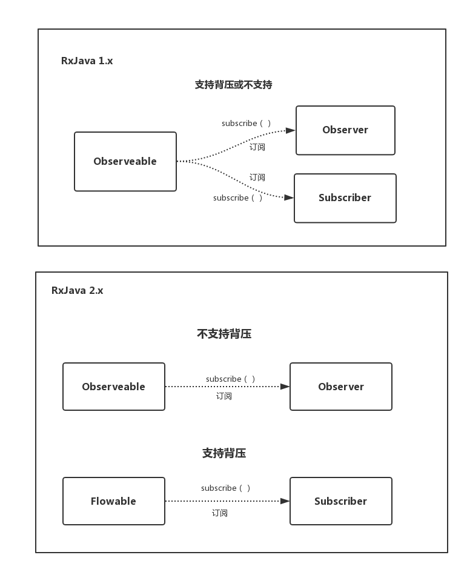

这里需要注意2.x的接口和1.x接口有很大差别。
显然2.0要比1.0的接口定义更加有可读性和人性化。当订阅时要发射×（触发）的事件，然而1.0的函数名和参数就让人很容易误解，为什么还没绑定观察者就开始调用了
（尽管熟悉的人知道这是多态，会调用绑定时传入的对象的方法），根本不符合人类在现实中形成的思维逻辑。

RxJava 2.x 最大的改动就是对于 backpressure 的处理，为此将原来的 Observable 拆分成了新的 Observable 和 Flowable，同时其他相关
部分也同时进行了拆分。

# Rxjava２中接口的变化
大家可能都知道， RxJava 以观察者模式为骨架，在 2.0 中依旧如此。

不过此次更新中，出现了两种观察者模式：

- Observable ( 被观察者 ) / Observer ( 观察者 )
- Flowable （被观察者）/ Subscriber （观察者）

Rxjava2拥有４个基础的类．Observable(ObservableSource)-->Observer,Flowable(Publisher)-->Subscriber（并不在Rxjava包中，而是reactive的另一个包)

Observable/Flowable作为被观察者（生产者）发送事件．
Observable/Subscriber作为观察者（消费者）处理事件．

其中用的比较多的自然是 Publisher 的 Flowable，它支持背压。关于背压给个简洁的定义就是：
> 背压是指在异步场景中，被观察者发送事件速度远快于观察者的处理速度的情况下，一种告诉上游的被观察者降低发送速度的策略。

（在类的命名与功能的关系上Rxjava做的挺有意思，Observable(ObservableSource)-->Observer观察者只负责观察，观察者只负责处理，不具有影响被观察者的背压功能；而Flowable(Publisher)-->Subscriber订阅者则能够影响发布者的产出，具有背压功能．

### 操作符
| 1.X    | 2.X  |    返回值　|
|--------|------|-----------|

### 类
| 1.X    | 2.X  |  其他　|
|--------|------|-------|
| Func1  | Function | 增加了 throws Exception |
| Func2  | BiFunction | 增加了 throws Exception |
| FuncN  | FunctionN  | 最多N到9, 增加了 throws Exception|
| Action1<? super T> | Consumer<? super T> onNext, Consumer<? super Throwable> onError, Consumer<? super Disposable> onSubscribe | onNext, Throwable, Disposable |
| Action0 | Action |
