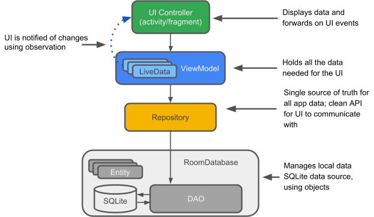

# MVVM

Android操作系统为构建在各种设备和外形尺寸上运行良好的应用程序提供了坚实的基础。但是，复杂的生命周期和缺乏推荐的应用程序架构等问题使编写强大的应用程序变得具有挑战性。Android体系结构组件为生命周期管理和数据持久性等常见任务提供库，以便更轻松地实现推荐的体系结构。

架构组件可帮助您以更少的样板代码以可靠，可测试和可维护的方式构建应用程序

M-V-VM 是受 WPF 架构的启发，架构 MVP 架构进行演化，将两者糅合得出一个架构。

MVP 向 MVVM 的变迁

| MVP            | MVVM           |  变化         |
| :------------- | :------------- | :----------- |
| M              | M              | Model 层并没有什么理论上的变化。主要是谷歌为了支持 MVVM 架构，添加了一些能够感知生命周期的组件。|
| V              | V              | View 层也是一一对应的，但是 VVVM 中将更过的逻辑操作和生命周期管理向下移动，放在了 VM 层。 |
| P              | VM             | 该层是变化最大的，在 MVP 架构中，Presenter 仅作为 View 和 Model 的中间代理，将逻辑上下传递，而到了 MVVM 架构中，VM 作为了 View 层测数据容器，管理着数据的更新和维护，感知View 层的声明周期，在合适的时机装载数据。|

该体系结构由 UI controller，由 ViewModel 提供 LiveData，Repository 和 Room 数据库组成。

其实划分为三层：

- V : UI controller 主要是安卓的 UI 组件。
- VM : ViewModel + LiveData，LiveData 大部分由 Model 层创建，由 VM 维护。
- Model : 包含一个 Repository 负责管理本地数据，远程数据，缓存的调度。其中本地数据的架构有： Room, DAO(Data Access Object)。

[Model](model.md)
[ViewModel](viewmodel.md)

## JetPack

在各种框架流行的今天，各种软件开发都有几个高度开发的框架供开发者快速创建应用。的确，减少重复代码开发，优秀的设计，齐备的功能大大降低了开发难度，加快了开发速度。然而在安卓上一直没有出现一个架构级的框架。一直处于混乱的自设计时代，各种库和结构设计思想的出现为架构级框架提供了充足的准备。(数据库访问库，MVP,MVVM)结合现有的库和架构设计思想，安卓为 MVVM 架构设计了一套架构组件，来帮助提交应用稳定性和提高开发效率。 安卓框架（JetPack）其实包括四部分：架构、UI、功能、行为。

## 安卓架构组件

- 分离关注点(separation of concerns)
- 松耦合(loose coupling)
- 观察者模式(observer pattern)
- 依赖注入/控制反转(inversion of control)

- Room : SQLite 对象映射库，通过注解来生成代码。注解 `@Entity` 来映射数据表。Room 能生成代码用户创建数据表，直接使用 `Entity` 进行存储和查询。Room 同时支持观察者模式，包括 `RxJava`,`lists, optional` 和 `Guava`
- WordManager : 用于需要保证执行的可延迟、一次性或循环执行后台任务的统一API。使用 `WordManager` 可以使用工作请求链创建复杂的进程和上传流。 由于是链式的，可以将一个任务输出，定义为另一个任务的输入。还可以定义任务的执行时间。`WordManager` 会按照规定的顺序执行任务，同时处理兼容性和系统性能问题。
    - 保证执行，处理设置重启后的继续运行。如果进程别强制终止，WorkManager 将会任务的运行状态。
- LifeCycles: 帮助管理安卓的声明周期，特别是帮助避免更新UI时的内存泄漏。
  - ViewModel: 不会在屏幕旋转等配置改变销毁 Activity 时销毁。该特性和适合用于存储 UI 的数据。
  - ViewModel 通常包含另一个声明周期组件 LiveData, LiveData 用户帮助 UI 之间或与架构深层之间的更新。LiveData 是一个观察者模式的数据容器，数据用于显示。当数据更新时，LiveData 会自动通知 UI 更新。LiveData 也是可感知声明周期的，仅会在处于显示时才会更新 UI，而当 Activity 销毁时，LiveData 会观察就会自动取消。不必在管子 UI 数据的刷新时机。同时 LiveData 支持转换，UI 也可以观察到数据库数据的改变。LiveData 和 ViewModel 也支持数据绑定。LifeCycles 还包含用于查询和观察 UI 的生命周期。

  - Paging 库直接与Room和LiveData集成，用户分页加载数据。同时避免棘手的SQLite光标性能问题。它具有以下特性，允许指定数据来源，是数据库还是网络，或者其他数据来源。它与 Room 和 RecycleView 一起开箱即用。它能支持无限长度的数据列表。同时支持 RxJava。

- Navigation : Navigation 和 Tooling 简化的实现复杂,但常见的导航需要，同时将导航可视化。支持：
  - Fragment 切换
  - 适当的返回的启动造作
  - 深连接
  - 底部导航
  - 页面切换动画
  导航的基本构造块称为 Destinations。 Destinations 是可访问的特殊页面。对 Activity 和 Fragment 提供了开箱即用的支持。同时也能自定义。同时它还支持全局导航，例如导航点。
