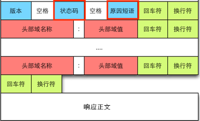

# 安卓网络请求最佳实践

在安卓开发中，经过多年的发展，网络请求的架构基本定型，通常是 `OkHttp + Retrofit + RxJava`，尽管在目前在 google 的推动下，有些开发者正在使用 `Kotlin` 的 `协程` 代替 `RxJava`。但是也仅是一线程调度的一部分，本文依旧可以在网络请求部分给出很好的建议。

## 返回错误码

网络请求可能发生各种各样的错误，当错误发生时，Http 会通过响应头返回 `状态码` 和 `原因短语` 来标识错误状态和原因。




自从 `RxJava 2.0` 普及之后，一些项目中的错误码返回开始出现了不太好的方式 —— 在 `Http body` 中自定义响应码。

```json
{
    "code": 200,
    "msg": "",
    "datas": ...
}
```


处于什么样的考虑很难一一找到原始开发人员进行解答，从项目中代码的使用可以推断，很可能有以下原因：


1. Retrofit 的 Converter 可以返回直接将 body 体转换成数据对象。这样很多返回结果可能不想要响应头。于是会出现这样的写法。

```Kotlin
@GET("test")
fun getPost(): Observer<BodyContent<Post>>
```

BodyContent 则是自定义的 Bean 类，用于转换 json 数据。

```Kotlin
class BodyContent<D> {
    var code = 0
    var msg: String? = null
    var data: D? = null
}
```

这样做并不是一个好的实践，因为 Http 响应头和响应体中自定义的状态码，不能仅判断响应体中的状态码，这样做相当于忽略了响应头中的错误。一些服务器服务器本身出现错误或者中间件中出现错误，可能没有执行到该请求的代码，就返回了错误，此时可能没有响应体或自定义错误码，而是 Http 请求头中返回错误。

如果我们除了检测自定义的错误码，还检测 HTTP 请求头中错误码，就需要两层判断，代码就显得繁杂且冗余。而且有时候两层状态码相同的数字表示不同的含义，很让人迷惑。

2. 跟响应体一样，通过 `converter` 获取状态码。

如果仅仅是为了获取状态码，这有点得不偿失。因为 Retrofit 的一个 Converter 插件写的非常好，我们可以使用 Retrofit 的响应头即可自动转换

```Kotlin
// Response 是 Retrofit 自带的数据类，可以通过 Retrofit 的 code() 和 message() 方法来获取状态码和状态短语。
@GET("post/{id}")
fun getPost(
    @Path("id") postId: Long
): Observer<Response<Post>>
```

3. 另一个原因是因为 `RxJava 2` 中不允许发送 `null` 值，当有些结果不需要返回结果的时候，例如上传数据，body 体可能是空的，转换会发送一个 null 值，会导致 RxJava 检测而抛出异常。这时候为了正常走返回结果逻辑，需要填充一点默认数据，为了和错误状态统一，添加状态码就成了一个可能的选择。

为了处理这种情况，一种选择是返回 Retrofit 的 `Response` 作为结果，即使请求体为空，也一定有响应。

```Kotlin
// retrofit 的 Response 作为返回结果来处理响应体为 null。
@POST("send/post")
fun sendPost(
    @Body post: Post
): Observer<Response<Void>>
```

然而，这并不是唯一的选择，如果我们并不想处理状态码，或者响应头，返回这些数据并优雅。

RxJava 真的不能处理返回结果为 `null` 吗？其实它只是不允许在发送序列流中掺杂 `null` 值。对于网络请求这种不返回任何数据的。其实就是请求完成了。我们可以使用 `Completable` 来处理请求。

```Kotlin
@POST("send/post")
fun sendPost(
    @Body post: Post
): Completable
```

其实，对于 HTTP 请求这种结果，我们根本没有必要使用 `Observer` 和 `Flowable`。因为它之后一个结果，而不会出现不断发送数据的事件流。

- 对于一定有响应体的请求，使用 `Single`。

- 一定没有响应体的请求，使用 `Completable`。

- 特殊请求，有时候有响应体，有时候没有的，返回 `Maybe`。

合理的使用 `Single`、`Completable` 和 `Maybe` 可以有效的提高代码的清晰度。如果确实需要响应头的中内容，可以在他们的泛型中使用 Retrofit 的 `Response` 来获取。

0. 如果仅仅是因为包含一些自己应用中特殊状态的状态码，这完全没有必要，因为 Http 的响应码仅使用了几个，还剩下许多状态码可用于表示特属含义。例如，2xx 开头的状态码表示正常结果。`RFC` 仅定义了 `200 ~ 206` 的状态码，其余都可以根据应用自己定义使用。我们甚至可以跳过 250 之前的，使用 251 ~ 299 之间的表示正常结果的某些情况，防止在未来它们被 `HTTP` 标准协议使用。

上面说来这么多错误码，马上就来讨论处理错误。

## 错误处理

有过单独使用 OkHttp 和 Retrofit 而不使用 RxJava，和 RxJava 一起使用两种使用方案的人可能会意识到，当状态码是 200 ~ 299 以外的错误码时，OkHttp 和 RxJava 走了 onResponse, 而 RxJava 走了 onError。 当使用 Body 中使用自定义的响应码时，它也走了 RxJava 的 onNext 或者 onSuccess。这种将错误码和正常结果放在一起会有以下问题：

- 在正常显示数据之前要先判断一次错误结果，如果错误则要调用错误处理方法，而在 `onFailure/OnError` 方法中也需要调用错误处理处理方法，多一条分支显得不是那么完美。 

- OkHttp/Retrofit 和 RxJava 的错误和正确流走的路径不太一致。甚至 RxJava 自己的错误分支都不一致。如果在 RxJava 中，返回结果仅仅是响应体则非 200 ~ 299 的错误走了 `onError`。

```Kotlin
@GET("post/{id}")
fun getPost(
    @Path("id") postId: Long
): Observer<Post>  // 仅返回 Response Body 数据
```

在 `adapter-rxjava` 的 `BodyObservable` 中的代码中可以看到:

```Java
@Override
public void onNext(Response<R> response) {
  // isSuccessfull 判断了状态码
  // public boolean isSuccessful() {
  //   return code >= 200 && code < 300;
  // }
  if (response.isSuccessful()) {
    observer.onNext(response.body());
  } else {
    terminated = true;
    Throwable t = new HttpException(response);
    try {
      observer.onError(t);
    } catch (Throwable inner) {
      ...
    }
  }
}
```

而如果结果返回的是Retrofit 的 `Response`。

```Kotlin
@GET("post/{id}")
fun getPost(
    @Path("id") postId: Long
): Observer<Response<Post>>  // 返回 Response。
```

在 `adapter-rxjava` 的 `ResultObservable` 中的代码则是:

```Java
@Override
public void onNext(Response<R> response) {
  observer.onNext(Result.response(response));
}

@Override
public void onError(Throwable throwable) {
  try {
    observer.onNext(Result.error(throwable));
  } catch (Throwable t) {
    ...
    return;
  }
  observer.onComplete();
}
```

让我们总结一些这些错误处理的流程

``` 
OkHttp         <----------  失败重连，重定向跟踪。Auth 认证重试
  |
  |   -------------------┐  
  |                      |   
  |                      |
  |                      |
 onResponse             onFailure 超时，链接失败，抛出 IOException 等异常。
 (Response包含非          |
 200~300错误)             |
  |                      |
  ∨                      ∨
Retrofit   --------------┤    <--- Retrofit 主要处理请求参数，和返回数据的转换。错误处理没有任何改变。
  |                      |
  |                      |
(Response)               |
包含200~300错误         跟OkHttp 一样 
  |                      |
  ∨                      ∨
RxJava(ResponseBody)  ---┤
  |                      |
(200 ~299 正常结果)       增加 非 200~ 299 的错误结果
  |                      |
  |                      |
onNext/onSuccess       onError
  |                      |
  ∨                      ∨ 
body 里判断结果         错误显示。
为 Response 的情况
或 body 里包含错误码           
```


希望做的的情况

1. 网络请求框架的 Http 响应码走一套逻辑。

2. 能在一处判断，不要有不同的分支。无论使用没使用 Retrofit 和 RxJava 都是一样的。

3. 对上层开发者透明，不用因为网络请求错误而单独继承或者调用函数判断错误码。

即达到这种效果

```
    OkHttp/Retrofit/RxJava
             |
  ┌------判断响应码--------┐
  |                      |
 onRespons               |
 onSuccess            onFailure/OnError 
(只有200~299的正确结果)    |
  |                      |   
  |                      |
  ∨                      ∨
渲染逻辑               错误提示。
```

要让所有的上层结果返回结果都一致，OkHttp 的拦截器是绝佳的选择。我们即在此来处理请求结果。

```Java
public class ResponseStatusInterceptor implements Interceptor {

    @Override
    public Response intercept(Chain chain) throws IOException {
        Request request = chain.request();
        Response response =  chain.proceed(request);
        if (!response.isSuccessful()) {
            throw new ApiException(response.code(), response.message());
        }
        return response;
    }
```

需要说明的是，如果使用 Java，抛出的异常不是继承自 `IOException` 将会有错误提示，但是如果使用 Kotlin，则不会提示，你必须使用继承自 `IOException` 的类，否则将不会走到 onFaile 的回调，这是因为在 OkHttp 的 `RealCall` 中判断请求结果的代码中：

```Java
    @Override protected void execute() {
      ...
      try {
        Response response = getResponseWithInterceptorChain();
        signalledCallback = true;
        responseCallback.onResponse(RealCall.this, response);
      } catch (IOException e) {
        ...
        responseCallback.onFailure(RealCall.this, e); // IOException 会回调 onFailure.
      } catch (Throwable t) {
        ...
        throw t; // 非 IOException 则会以及抛出异常。
      } finally {
        ...
      }
    }
```

可以看到，判断如此简单。但是如果你之前自定义了响应码，或者你项目中之前在代码中处理错误码的。很可能这些错误处理的地方非常多，一时修改不完，你并不想一次性将整个项目修改，这样工作量很大，也很难保证修改的正确性。我们希望渐进式的演化，在新的接口中使用这种方式，而老的接口不会有影响。我们将在 Retrofit 的接口定义中添加一个请求头，然后在拦截器中获取并移除掉。

```Kotlin
open class ResponseStatusInterceptor : Interceptor {
    companion object {
        const val CHECK_HTTP_RESPONSE_CODE = "Check-Http-Response-Code: true"
        private const val CHECK_HEADER = "Check-Http-Response-Code"
        private val gson = Gson()
        private val UTF8 = StandardCharsets.UTF_8
    }

    @Throws(IOException::class)
    override fun intercept(chain: Interceptor.Chain): Response {
        var request = chain.request()
        val value = request.headers()[CHECK_HEADER]
        request = request.newBuilder().removeHeader(CHECK_HEADER)
                .build() // 移除请求头中的无用标识，不会发送到服务器。
        val response = chain.proceed(request)
        if ("true" == value) {
            if (!response.isSuccessful) {
                throw ApiException(response.code(), response.message())
            }
            // Make sure the content is json.
            val contentType = response.headers()["Content-Type"]
            if (contentType != null && response.body() != null && contentType.contains("application/json")) {
                val status =
                    gson.fromJson<BodyContent<Void>>(
                        bodyContent(response.body()),
                        object : TypeToken<BodyContent<Void?>?>() {}.type
                    )
                if (status != null && status.code != 1) {
                    throw ApiException(status.code, (if (status.msg == null) "" else status.msg!!))
                }
            }
        }
        return response
    }

    @Throws(IOException::class)
    protected fun bodyContent(responseBody: ResponseBody?): String? {
        if (responseBody == null) return null
        val contentLength = responseBody.contentLength()
        val source = responseBody.source()
        source.request(contentLength) // Buffer the entire body.
        val buffer = source.buffer

        return if (contentLength != 0L) {
            buffer.clone().readString(UTF8)
        } else null
    }
}
```

我们将在新接口中添加请求头，以表示拦截响应码。

```Kotlin
@Headers(ResponseStatusInterceptor.CHECK_HTTP_RESPONSE_CODE) // 请求头中添加标识。
@GET("not_exit_file")
fun testRetrofitErrorCode(): Call<String>
```

同时我们需要修改自定义响应码的映射类 `BodyContent`，将默认值改为正常请求的，具体是什么依赖于你项目，这里假设是 200。

```Kotlin
class BodyContent<D> {
    companion object {
        const val SUCCESS = 200
    }
    var code = SUCCESS
    ...
}
```

这样如果我们在 body 体中定义了响应码的话，就可在因接口中不再使用自定义的，而使用请求头。而此时，默认值是 200，而仍然会走正常的流程。**唯一需要注意的是，该字段不会被用于其他含义的数据。**

同时，我们将使用 `@Deprecated` 将 `BodyContent` 标记为废弃，提醒其他人员转移到新的错误处理体系上来。

最后我们形成如下的流程

```
OkHttp

  |
  |
拦截器拦截错误 ------------┒  
  |                      |   
  |                      |
  |                      |
（onResponse）          onFailure 超时，链接失败，抛出 IOException 等异常。200~300错误.
  |                      |
  ↓                      |
Retrofit                 |
  |                      |
  |                      |
(Response)   -------- onResponse   可能会增加一些 json 解析错误。
  |                      |
  ↓                      |
RxJava       -------- onError  可能会增加一些 UI 渲染，空指针错误
  |                      |    
  |                      |
  |                      |
(onNext/onSuccess)       |
  |                      |
  |                      |  
渲染 UI               错误处理逻辑。
```

你可以使用任何上层的技术组合，他们的流程都是一样的。只需要在 onFailure 或 onError 中处理错误即可。至于是哪一个，取决于你使用的是 Retroit 还是 RxJava.

尽管异常处理的流程分支统一了，但是有一种特殊异常基本是统一的，那就是 401 授权失败异常。这种异常会在各个页面都可能发生，然而处理流程和结果却是一样的: 显示提醒 ——> 跳转到登录页面 ——> 返回刷新数据。针对这样的异常，应该是统一处理，而不是每个页面单独写自己的逻辑。我见过不同的方案来实现这种跳转，有的直接在拦截器中就跳转了；有的使用 RxJava 的 Observer 作为基类在 onError 中处理；有的在 RxJava 的 retry 操作符中进行重连。这里将比较它们实现中的问题，同时给出一个最佳的组合。

## 登录授权

如上的错误处理有一个问题，那就是登录授权。需要登录验证通过才能访问的接口会在验证失败时在响应头中返回 401 错误码。此时我们分两种情况：

1. token 过期可以在后台通过接口自动更新 token。

2. 没有登录或者登录失败等需要用户操作才能登陆的情况。

### 自动更新 token 的情况

对于第一中，OkHttp 已经提供了 authenticator 拦截器，唯一需要注意的是，由于网络请求可以并发发出，因此你需要避免发出多个更新 token 请求。这里使用加锁和本地缓存来避免重复请求。

```Kotlin
OkHttpClient.Builder()
.authenticator(object :Authenticator {
    override fun authenticate(route: Route?, response: Response): Request? {
        synchronized(Client::class.java) {
            val token = if (getCachedAuth() == response.request().header("Authorization" )) {
                val request = Request.Builder().url("authenticator url").build()
                val response = okHttpClient.newCall(request).execute()
                val token = "从请求结果 response 中拿到" // response.body(). 获取token.
                updateCachedToken(token) // 更新本地缓存的 token
                token
            } else {
                getCachedAuth()
            }
            return response.request().newBuilder()
                .addHeader("Authorization","Bearer {$token}")
                .build()
        }
    }
})
```

这里没有使用双重检测锁，主要考虑刷新 token 并不是一个频繁的操作，代码简洁也很重要。根据你自己的考虑，你可以添加双重判断。

获取和更新本地缓存的方法需要你根据你的方案来自己实现操作:

```Kotlin
fun getCachedAuth(): String  {
    return "Bearer " + "本地存贮的值"
}

fun updateCachedToken(token: String) {
    // 更新本地缓存的 token
}
```

### 需要通知用户手动登录的情况

第二种情况显得不那么好处理，错误的处理情况千差万别，处理的方式也不一样。因为这里涉及到 UI 操作，一个好的做法是，在 BaseActivity 中添加一个函数，用于处理全部都有的登录部分。

```Kotlin
// BaseActivity 中添加

protected fun handleException(exception: Throwable): Boolean {
    reportException(exception)
    return if (exception is ApiException && exception.unauthorized()) {
        // 显示登陆提醒的弹窗。询问是否登陆，跳转到登陆页面。
        true
    } else {
        false
    }
}

fun reportException(exception: Throwable) {
    // 上报错误数据
}
```

在各个 Activity 中对接网络请求和错误处理。

```Kotlin
val disposable = Client.getServerApi()
    .getPost(12)
    .subscribe({
        // update ui
    }, { exception ->
        // 对 UI 显示是否提醒和更改状态，例如隐藏加在动画。
        if (拦截) {
            // 如果需要拦截，就不用调用 handleException。否则就交给默认的错误处理。
        } else if (!handleException(exception)) {
            // 默认处理没有相应，就自己处理。
        }
    })
```

中间的交付过程可以使用 LiveData、RxJava、协称的任意组合。这样对中间交付过程没有任何要求，处理起来非常灵活。


1. token 过期，

## 线程切换

由于安卓的特性，网络请求必须在后台线程中执行。因此切换线程就成了一个必选项。至于在何处切换线程有了五花八门的写法。我建议始终把 `subscribeOn` 和 `observerOn` 写在紧挨着 `subsctibe` 的前面。例如:

```Kotlin
 Single.just(1)
    .doOnSubscribe {
        printThread("doOnSubscribe")
    }
    .map {
        printThread("Map")
        it
    }
    ...
    .subscribeOn(Schedulers.io())
    .observeOn(Schedulers.newThread())
    .subscribe(...)

fun printThread(tag: String) {
    println(tag + "........"+ Thread.currentThread().name)
}
```

由于网络请求是必须的操作，`.subscribeOn(Schedulers.io())` 就成了必须要做的工作。而 RxJava-adapter 已经为我们提供了这个操作。在添加 Retrofit 的 CallAdapterFActory 时，我们可以选择添加线程调度器。

```Kotlin
 Retrofit.Builder()
    .addCallAdapterFactory(RxJava3CallAdapterFactory.createWithScheduler(Schedulers.io())) // 指定 io 线程访问网络。
```

既然切换到后台线程有默认的方法可供使用，那切换到前台呢？然而并没有。 我们来讨论为什么不应该这样做！

这是因为 observeOn 影响它后面流的操作符的线程。一旦我们把 `observeOn` 写在靠前的位置，后面的变换操作符将在前台线程中。如果变换操作中有一些耗时的操作，我们将不得不调用 `observeOn(..)` 切换到其他线程，然后再次调用一次，这样一次流中的线程切换频繁显得非常繁琐。另一方面，切换到前台线程的操作不是必须的，例如一个请求是作为另一个请求的输入，或者我们使用 LiveData 的 postValue 将数据更新到 UI 线程时，切换到前台线程显得多余。

那如果是这样，`subscribeOn` 为什么提供了默认的接口呢？它也智能影响它前面的 `doOnSubscribe`, 我们再最上游的流设置了 `subscribeOn` 并不能使后面的操作也在后台线程中。 我想着主要是因为两方面

1. 网络在后台线程请求是必须的，而切换到前台更新 UI 则不一定会发生。

2. `doOnSubscribe` 则没有变换操作频繁。几乎每个接口请求后都会有一些额外操作，而请求之前的操作却不是那么常见，即使有也很少有耗时的操作。一个项目中也不会有多少个调用。