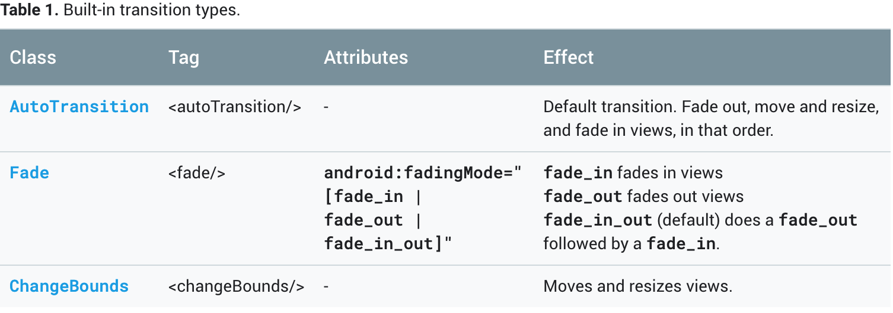

在两个布局之间设置动画的基本过程如下：

- 为起始布局和结束布局创建一个Scene对象。但是，起始布局的场景通常是从当前布局自动确定的。
- 创建Transition对象以定义所需的动画类型。
- 调用TransitionManager.go（），系统运行动画来交换布局


### 创建 Scene

Scene 用于包含源视图和目标视图的 View 信息(View 的嵌套和属性)，在过渡时，framework 用于计算过渡的动画过程。

可以从布局文件或者已经实例化的 View 嵌套创建 Scene 实例。但是，转换的起始场景通常是从当前UI自动确定的。


1. 如果视图过渡发生在视图本身上（尺寸变化等）。

```
val aScene = Scene(ViewGroup)

```

2. 也可以用于两个 ViewGroup 之间的变化

其中 src 是正在显示的一个视图节点， target 可以是刚从 layout 文件实例化的视图，这对于使用 databinding 的 layout 很有用。只需要传入 `binding.root` 即可。

```
Scene(ViewGroup src, View target)
```
3. 使用 layout 文件创建

```
Scene.getSceneForLayout(ViewGroup parentNodeView, R.layout.someId, context)
```

### 执行额外操作

同时，还可以指定当过渡发生前和发生后要执行的动作，此功能对于在转换到场景后清除视图设置很有用。

```
Scene.setEnterAction(Runnable)
Scene.setExitAction(Runnable)
```


场景动作对于处理这些情况很有用：
- 动画不在同一层次结构中的视图。您可以使用退出和输入场景动作为开始和结束场景设置动画。
- 动画视图转换框架无法自动设置动画，例如ListView对象。有关更多信息，请参阅限制。

框架在运行过渡动画之前调用起始场景上的setExitAction（）函数，并在运行过渡动画之后调用结束场景上的setEnterAction（）函数。

### 添加动画

当获得了 Scene 的实例后，可能想要在过渡时，应用一个过渡的动画。过渡动画框架已经提供了几个特定的动画，还可以继承 Transition 实现自己的动画。



ChangeBounds() : move and resize object that change between sences.

Fade(): Fade things in and out 在不同场景之间。

动态创建过渡，例如
```
var fadeTransition: Transition = Fade()
```

TransitionSet

Resources file 定义复杂的组合过渡

- 在 `res/transition/` 目录下创建转换
- 使用如下代码实例化

```Kotlin
var fadeTransition: Transition =
    TransitionInflater.from(this)
                      .inflateTransition(R.transition.fade_transition)
```


### 运行

1. 不带过渡

```
Scene.enter()
```

2. 默认过渡。不提供过渡动画，会默认是系统提供的 AutoTransition 做动画。

```
TransitionManager.go(Scene)
```

3. 自定义过渡

```
TransitionManager.go(Scene, Transition)
// 或者， 对 TransitionManager 示例
TransitionManager.TransitionTo(Scene, Transition)
```

需要注意的是，如果一个 ViewGroup 的局部进行了更改，就没有必要进行创建 Scene。而是使用 `delayed transition` 在视图层次结构的两个状态之间创建和应用转换。转换框架的此功能以当前视图层次结构状态开始，记录下对其视图所做的更改，并应用在系统重绘用户界面时动画更改界面。

```Kotlin
TransitionManager.beginDelayedTransition(ViewGroup, Transition)
```

1.  当发生触发转换的事件时，调用TransitionManager.beginDelayedTransition（）函数，提供要更改的所有视图的父视图以及要使用的转换。框架存储子视图的当前状态及其属性值。
2. 根据用例的要求更改子视图。框架记录您对子视图及其属性所做的更改。
3. 当系统根据您的更改重绘用户界面时，框架会动态显示原始状态和新状态之间的更改。


```Kotlin
setContentView(R.layout.activity_main)
val labelText = TextView(this).apply {
    text = "Label"
    id = R.id.text
}
val rootView: ViewGroup = findViewById(R.id.mainLayout)
val fade: Fade = Fade(Fade.IN)
TransitionManager.beginDelayedTransition(rootView, mFade)
rootView.addView(labelText)
```

[更多细节](https://www.jianshu.com/p/89a9cdde42ae)


### 指定动画的 View

Android 过渡默认给所有的 View 使用动画。如果有特殊需要，可以指定仅某些 View 有动画。例如，框架不支持动画更改ListView对象，因此您不应尝试在转换期间为它设置动画。

```
removeTarget() // 从动画列表中移除 View
addTarget() // 添加应用动画的 View
```


