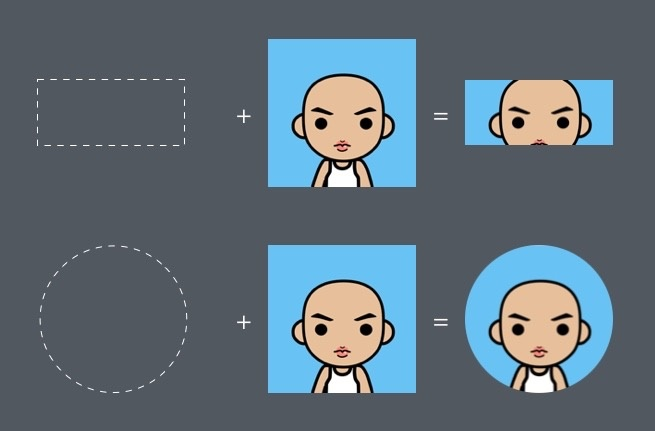
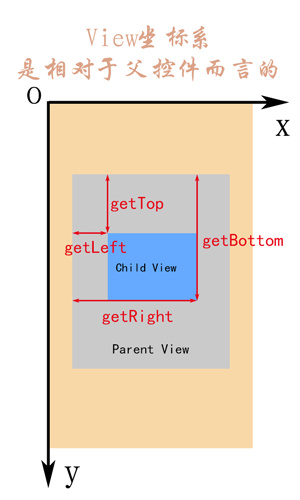
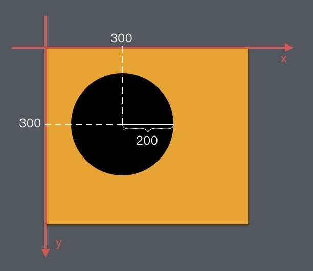

## 重写
- 自定义View的显示方法就是重写绘制方法，其中最常用的就是重写onDraw（Canvas canvas）方法。
- 绘制的关键是Canvas的使用。
- 使用不同的绘制方法来控制遮盖关系。

### 自定义绘制知识的四个级别
##### [1. Canvas 的 drawXXX() 系列方法及 Paint 最常见的使用](./4.canvas.md)

Canvas.drawXXX() 是自定义绘制最基本的操作。掌握了这些方法，你才知道怎么绘制内容，例如怎么画圆、怎么画方、怎么画图像和文字。组合绘制这些内容，再配合上 Paint 的一些常见方法来对绘制内容的颜色和风格进行简单的配置，就能够应付大部分的绘制需求了。

##### [2. paint相关配置](./paint.md)
Paint 可以做的事，不只是设置颜色，也不只是我在视频里讲的实心空心、线条粗细、有没有阴影，它可以做的风格设置真的是非常多、非常细。例如：

> 拐角形状


> 线性过滤效果


##### [3.Canvas对绘制的辅助————范围剪切和几何变换]()
> 范围裁剪



> 几何变换


##### [使用不同的绘制方法来控制绘制顺序]()
控制绘制顺序解决的并不是「做不到」的问题，而是性能问题。同样的一种效果，你不用绘制顺序的控制往往也能做到，但需要用多个 View 甚至是多层 View 才能拼凑出来，因此代价是 UI 的性能；而使用绘制顺序的控制的话，一个 View 就全部搞定了。

## 开始绘制
一般的绘制自定义View的方法是继承跟要完成功能有相似功能的组件，例如要实现图片缩放功能，可以直接继承ImageView。这样可以减少大量的代码量，使工作变得轻松。如果没有相似功能的视图组件，就只有继承最基本的视图组件View了。

```java
Paint paint = new Paint();

@Override
protected void onDraw(Canvas canvas) {  
    super.onDraw(canvas);

    // 绘制一个圆
    canvas.drawCircle(300, 300, 200, paint);
}
```

## 获取View所在的位置
View中用于获得View本身所在位置的坐标。
```java
getTop();       //获取子View左上角距父View顶部的距离
getLeft();      //获取子View左上角距父View左侧的距离
getBottom();    //获取子View右下角距父View顶部的距离
getRight();     //获取子View右下角距父View左侧的距离
```
> 注意：View的坐标系统是相对于父控件而言的.



需要特别指出的是，View相对于父View（外部View的位置)。而View内部则使用一个新的坐标。例如此时想要在内部画一个圆。
// 绘制一个圆
```java
canvas.drawCircle(300, 300, 200, paint);
```
此时的绘制效果是。



## 自定义属性
http://blog.csdn.net/xmxkf/article/details/51468648
