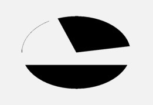

# Canvas方法简略

### 绘制颜色

使用canvas绘制颜色会将整个View绘制成同一个颜色。因为它没有坐标参数。但是你可以将颜色设置成纯色或者透明色。这类颜色填充方法一般用于在绘制之前设置底色，或者在绘制之后为界面设置半透明蒙版。
例如

```java
drawColor(Color.BLACK)
//它等价于
drawRGB(int r, int g, int b)

// 或者使用半透明呢色
drawColor(Color.parse("#88880000"); // 半透明红色  
// 它等价于
drawARGB(int a, int r, int g, int b)
```

### 绘制规则的图形
##### 画点

drawPoint(float x, float y, Paint paint) 画点


x 和 y 是点的坐标。点的大小可以通过 paint.setStrokeWidth(width) 来设置；点的形状可以通过  paint.setStrokeCap(cap) 来设置：ROUND 画出来是圆形的点，SQUARE 或 BUTT 画出来是方形的点。（点还有形状？是的，反正 Google 是这么说的，你要问问 Google 去，我也很懵逼。）

drawPoints(float[] pts, int offset, int count, Paint paint) / drawPoints(float[] pts, Paint paint) 画点（批量）

同样是画点，它和 drawPoint() 的区别是可以画多个点。pts 这个数组是点的坐标，每两个成一对；offset 表示跳过数组的前几个数再开始记坐标；count 表示一共要绘制几个点。说这么多你可能越读越晕，你还是自己试试吧，这是个看着复杂用着简单的方法。
```java
float[] points = {0, 0, 50, 50, 50, 100, 100, 50, 100, 100, 150, 50, 150, 100};  
// 绘制四个点：(50, 50) (50, 100) (100, 50) (100, 100)
canvas.drawPoints(points, 2 /* 跳过两个数，即前两个 0 */,  
          8 /* 一共绘制 8 个数（4 个点）*/, paint);
```


##### 划线
drawLine(float startX, float startY, float stopX, float stopY, Paint paint) 画线
startX, startY, stopX, stopY 分别是线的起点和终点坐标。

> 由于直线不是封闭图形，所以 setStyle(style) 对直线没有影响。

drawLines(float[] pts, int offset, int count, Paint paint) / drawLines(float[] pts, Paint paint) 画线（批量）

drawLines() 是 drawLine() 的复数版。pts从offset开始的点，每两个点作为一个坐标。一共绘制count个点之间的线。

##### 绘制矩形

drawRect(float left, float top, float right, float bottom, Paint paint) 画矩形
left, top, right, bottom 是矩形四条边的坐标

另外，它还有两个重载方法 drawRect(RectF rect, Paint paint) 和  drawRect(Rect rect, Paint paint) ，让你可以直接填写 RectF 或 Rect 对象来绘制矩形。

##### 圆角矩形
drawRoundRect(float left, float top, float right, float bottom, float rx, float ry, Paint paint) 画圆角矩形
left, top, right, bottom 是四条边的坐标，rx 和 ry 是圆角的横向半径和纵向半径。
另外，它还有一个重载方法 drawRoundRect(RectF rect, float rx, float ry, Paint paint)，让你可以直接填写 RectF 来绘制圆角矩形。


##### 绘制圆形
drawCircle(float centerX, float centerY, float radius, Paint paint)
- 前两个参数 centerX centerY 是圆心的坐标，
- 第三个参数 radius 是圆的半径，单位都是像素，它们共同构成了这个圆的基本信息（即用这几个信息可以构建出一个确定的圆）；
- 第四个参数 [paint](./5.paint.md) 提供基本信息之外的所有风格信息，例如颜色、线条粗细、阴影等。

##### 画椭圆
drawOval(float left, float top, float right, float bottom, Paint paint)
只能绘制横着的或者竖着的椭圆，不能绘制斜的（斜的倒是也可以，但不是直接使用 drawOval()，而是配合几何变换，后面会讲到）。left, top, right, bottom 是这个椭圆的左、上、右、下四个边界点的坐标。
```java
paint.setStyle(Style.FILL);  
canvas.drawOval(50, 50, 350, 200, paint);

paint.setStyle(Style.STROKE);  
canvas.drawOval(400, 50, 700, 200, paint);  
```
另外，它还有一个重载方法 drawOval(RectF rect, Paint paint)，让你可以直接填写 RectF 来绘制椭圆。

##### 画弧形或扇形

drawArc(float left, float top, float right, float bottom, float startAngle, float sweepAngle, boolean useCenter, Paint paint) 绘制弧形或扇形

- left, top, right, bottom 描述的是这个弧形所在的椭圆；
- startAngle 是弧形的起始角度（x 轴的正向，即正右的方向，是 0 度的位置；顺时针为正角度，逆时针为负角度），
- sweepAngle 是弧形划过的角度；
- useCenter 表示是否连接到圆心，如果不连接到圆心，就是弧形，如果连接到圆心，就是扇形。

```java
paint.setStyle(Paint.Style.FILL); // 填充模式  
canvas.drawArc(200, 100, 800, 500, -110, 100, true, paint); // 绘制扇形  
canvas.drawArc(200, 100, 800, 500, 20, 140, false, paint); // 绘制弧形  
paint.setStyle(Paint.Style.STROKE); // 画线模式  
canvas.drawArc(200, 100, 800, 500, 180, 60, false, paint); // 绘制不封口的弧形  
```


到此为止，以上就是 Canvas 所有的简单图形的绘制。除了简单图形的绘制， Canvas 还可以使用  drawPath(Path path) 来绘制自定义图形。

##### drawPath(Path path, Paint paint) 画自定义图形
个方法有点复杂，需要展开说一下。

前面的这些方法，都是绘制某个给定的图形，而 drawPath() 可以绘制自定义图形。当你要绘制的图形比较特殊，使用前面的那些方法做不到的时候，就可以使用 drawPath() 来绘制。


***[path详细操作](./path.md)***

除此之外， Canvas 还可以绘制 Bitmap 和文字。
##### 除此之外， Canvas 还可以绘制 Bitmap 和文字。
```java
drawBitmap(Bitmap bitmap, float left, float top, Paint paint)
```
绘制 Bitmap 对象，也就是把这个 Bitmap 中的像素内容贴过来。其中 left 和 top 是要把 bitmap 绘制到的位置坐标。它的使用非常简单。

```java
drawBitmap(Bitmap bitmap, Rect src, RectF dst, Paint paint)
drawBitmap(Bitmap bitmap, Rect src, Rect dst, Paint paint)
drawBitmap(Bitmap bitmap, Matrix matrix, Paint paint)
```

drawBitmap 还有一个兄弟方法 drawBitmapMesh()，可以绘制具有网格拉伸效果的 Bitmap。  drawBitmapMesh() 的使用场景较少，所以不讲了，如果有兴趣你可以自己研究一下。


#####　绘制文字
```java
drawText(String text, float x, float y, Paint paint)
```
界面里所有的显示内容，都是绘制出来的，包括文字。 drawText() 这个方法就是用来绘制文字的。参数  text 是用来绘制的字符串，x 和 y 是绘制的起点坐标。

文字的绘制具有很高的定制性，可以使用Path进行定制。可以查看[Paint文字配置部分](./5.paint.md)
