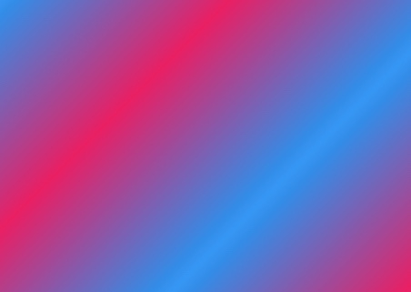
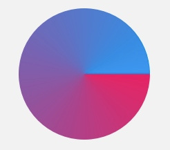
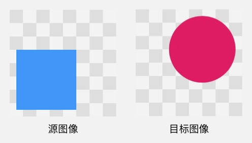
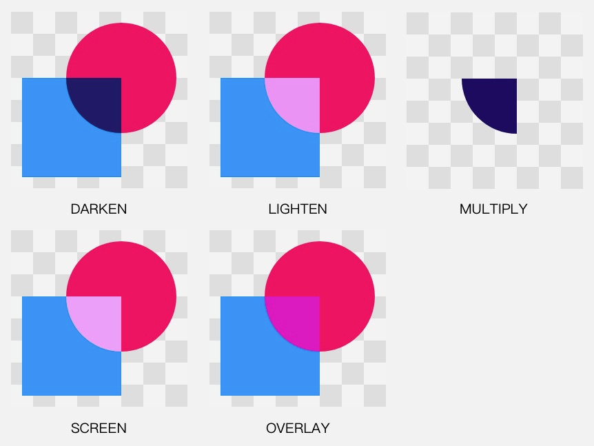
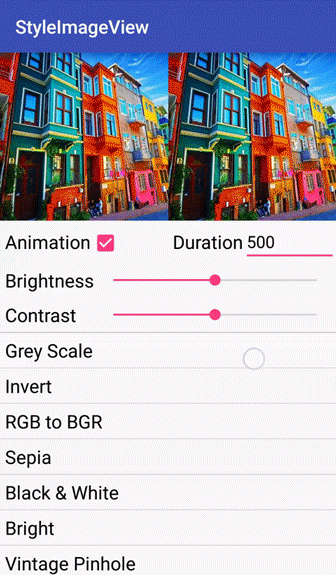
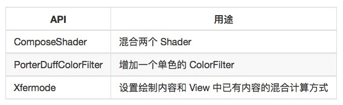
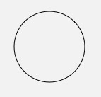

# Paint
paint本身并不能绘制，而是用于配置用于绘制的风格信息。例如颜色、线条粗细、阴影等。

Paint 的 API 大致可以分为 4 类：
- 颜色
- 效果
- drawText() 相关
- 初始化

[TOC]

### 配置颜色
像素的基本颜色，根据绘制内容的不同而有不同的控制方式： Canvas 的颜色填充类方法  drawColor/RGB/ARGB() 的颜色，是直接写在方法的参数里，通过参数来设置的（上期讲过了）；  drawBitmap() 的颜色，是直接由 Bitmap 对象来提供的（上期也讲过了）；除此之外，是图形和文字的绘制，它们的颜色就需要使用 paint 参数来额外设置了（下面要讲的）。


> Paint 设置颜色的方法有两种：一种是直接用 Paint.setColor/ARGB() 来设置颜色，另一种是使用  Shader 来指定着色方案。
#####　直接配置颜色
```java
setColor(Color.RED); // 设置为红色
setARGB(int a, int r, int g, int b)
gerColor() // 获取Paint颜色
```
canvas绘制的时候,有三层对颜色的处理:


##### 使用Shader(着色器)
setShader(Shader shader)

Shader 这个英文单词很多人没有见过，它的中文叫做「着色器」，也是用于设置绘制颜色的。「着色器」不是 Android 独有的，它是图形领域里一个通用的概念，它和直接设置颜色的区别是，着色器设置的是一个颜色方案，或者说是一套着色规则。***当设置了 Shader 之后，Paint 在绘制图形和文字时就不使用  setColor/ARGB() 设置的颜色了，而是使用 Shader 的方案中的颜色。***

在 Android 的绘制里使用 Shader ，并不直接用 Shader 这个类，而是用它的几个子类。具体来讲有  LinearGradient RadialGradient SweepGradient BitmapShader ComposeShader 这么几个：

###### LinearGradient 线性渐变
设置两个点和两种颜色，以这两个点作为端点，使用两种颜色的渐变来绘制颜色。就像这样：
```java
Shader shader = new LinearGradient(100, 100, 500, 500, Color.parseColor("#E91E63"),  
        Color.parseColor("#2196F3"), Shader.TileMode.CLAMP);
paint.setShader(shader);
...
canvas.drawCircle(300, 300, 200, paint);
```


构造方法：
LinearGradient(float x0, float y0, float x1, float y1, int color0, int color1, Shader.TileMode tile) 。

参数：
x0 y0 x1 y1：渐变的两个端点的位置
color0 color1 是端点的颜色
tile：端点范围之外的着色规则，类型是 TileMode。TileMode 一共有 3 个值可选： CLAMP, MIRROR 和 REPEAT。CLAMP （夹子模式？？？算了这个词我不会翻）会在端点之外延续端点处的颜色；MIRROR 是镜像模式；REPEAT 是重复模式。具体的看一下例子就明白。

CLAMP:


MIRROR



REPEAT


###### RadialGradient 辐射渐变
辐射渐变很好理解，就是从中心向周围辐射状的渐变。大概像这样：
```java
Shader shader = new RadialGradient(300, 300, 200, Color.parseColor("#E91E63"),  
        Color.parseColor("#2196F3"), Shader.TileMode.CLAMP);
paint.setShader(shader);
...
canvas.drawCircle(300, 300, 200, paint);  
```


参数：
- centerX centerY：辐射中心的坐标
- radius：辐射半径
- centerColor：辐射中心的颜色
- edgeColor：辐射边缘的颜色
- tileMode：辐射范围之外的着色模式。

######  SweepGradient 扫描渐变
```java
Shader shader = new SweepGradient(300, 300, Color.parseColor("#E91E63"),  
        Color.parseColor("#2196F3"));
paint.setShader(shader);
...
canvas.drawCircle(300, 300, 200, paint);  
```



构造方法：
SweepGradient(float cx, float cy, int color0, int color1)

参数：
- cx cy ：扫描的中心
- color0：扫描的起始颜色
- color1：扫描的终止颜色

###### BitmapShader
用 Bitmap 来着色（终于不是渐变了）。其实也就是用 Bitmap 的像素来作为图形或文字的填充。大概像这样：
```java
Bitmap bitmap = BitmapFactory.decodeResource(getResources(), R.drawable.batman);  
Shader shader = new BitmapShader(bitmap, Shader.TileMode.CLAMP, Shader.TileMode.CLAMP);  
paint.setShader(shader);
...
canvas.drawCircle(300, 300, 200, paint);  
```


嗯，看着跟 Canvas.drawBitmap() 好像啊？事实上也是一样的效果。如果你想绘制圆形的  Bitmap，就别用 drawBitmap() 了，改用 drawCircle() + BitmapShader 就可以了（其他形状同理）。

构造方法：
BitmapShader(Bitmap bitmap, Shader.TileMode tileX, Shader.TileMode tileY)

参数：
- bitmap：用来做模板的 Bitmap 对象
- tileX：横向的 TileMode
- tileY：纵向的 TileMode。

###### ComposeShader 混合着色器
所谓混合，就是把两个 Shader 一起使用。
```java
// 第一个 Shader：头像的 Bitmap
Bitmap bitmap1 = BitmapFactory.decodeResource(getResources(), R.drawable.batman);  
Shader shader1 = new BitmapShader(bitmap1, Shader.TileMode.CLAMP, Shader.TileMode.CLAMP);

// 第二个 Shader：从上到下的线性渐变（由透明到黑色）
Bitmap bitmap2 = BitmapFactory.decodeResource(getResources(), R.drawable.batman_logo);  
Shader shader2 = new BitmapShader(bitmap2, Shader.TileMode.CLAMP, Shader.TileMode.CLAMP);

// ComposeShader：结合两个 Shader
Shader shader = new ComposeShader(shader1, shader2, PorterDuff.Mode.SRC_OVER);  
paint.setShader(shader);
...
canvas.drawCircle(300, 300, 300, paint);
```

> 注意：上面这段代码中我使用了两个 BitmapShader 来作为 ComposeShader() 的参数，而  ComposeShader() 在硬件加速下是不支持两个相同类型的 Shader 的，所以这里也需要关闭硬件加速才能看到效果。


构造方法：ComposeShader(Shader srcShader, Shader dscShader, PorterDuff.Mode mode)

参数：
srcShader, dscShader：两个相继使用的 Shader
mode: 两个 Shader 的叠加模式，即 srcShader 和 dscShader 应该怎样共同绘制。它的类型是  PorterDuff.Mode 。

> PorterDuff.Mode

PorterDuff.Mode 是用来指定两个图像共同绘制时的颜色策略的。它是一个 enum，不同的 Mode 可以指定不同的策略。「颜色策略」的意思，就是说把源图像绘制到目标图像处时应该怎样确定二者结合后的颜色，而对于 ComposeShader(srcShader, dscShader, mode) 这个具体的方法，就是指应该怎样把 shaderB 绘制在 shaderA 上来得到一个结合后的 Shader。

没有听说过 PorterDuff.Mode 的人，看到这里很可能依然会一头雾水：「什么怎么结合？就……两个图像一叠加，结合呗？还能怎么结合？」你还别说，还真的是有很多种策略来结合。

最符合直觉的结合策略，就是我在上面这个例子中使用的 Mode: SRC_OVER。它的算法非常直观：就像上面图中的那样，把源图像直接铺在目标图像上。不过，除了这种，其实还有一些其他的结合方式。例如如果我把上面例子中的参数 mode 改为 PorterDuff.Mode.DST_OUT，就会变成挖空效果：


而如果再把 mode 改为 PorterDuff.Mode.DST_IN，就会变成蒙版抠图效果：


这下明白了吧？

具体来说， PorterDuff.Mode 一共有 17 个，可以分为两类：

Alpha 合成 (Alpha Compositing)
混合 (Blending)
第一类，Alpha 合成，其实就是 「PorterDuff」 这个词所指代的算法。 「PorterDuff」 并不是一个具有实际意义的词组，而是两个人的名字（准确讲是姓）。这两个人当年共同发表了一篇论文，描述了 12 种将两个图像共同绘制的操作（即算法）。而这篇论文所论述的操作，都是关于 Alpha 通道（也就是我们通俗理解的「透明度」）的计算的，后来人们就把这类计算称为Alpha 合成 ( Alpha Compositing ) 。

看下效果吧。效果直接盗 Google 的[官方文档](https://developer.android.com/reference/android/graphics/PorterDuff.Mode.html)了。

源图像和目标图像



Alpha合成


第二类，混合，也就是 Photoshop 等制图软件里都有的那些混合模式（multiply  darken lighten 之类的）。这一类操作的是颜色本身而不是 Alpha 通道，并不属于 Alpha 合成，所以和 Porter 与 Duff 这两个人也没什么关系，不过为了使用的方便，它们同样也被 Google 加进了 PorterDuff.Mode 里。

效果依然盗 [官方文档](https://developer.android.com/reference/android/graphics/PorterDuff.Mode.html)。



**结论**

从效果图可以看出，Alpha 合成类的效果都比较直观，基本上可以使用简单的口头表达来描述它们的算法（起码对于不透明的源图像和目标图像来说是可以的），例如 SRC_OVER 表示「二者都绘制，但要源图像放在目标图像的上面」，DST_IN 表示「只绘制目标图像，并且只绘制它和源图像重合的区域」。

而混合类的效果就相对抽象一些，只从效果图不太能看得出它们的着色算法，更看不出来它们有什么用。不过没关系，你如果拿着这些名词去问你司的设计师，他们八成都能给你说出来个 123。

所以对于这些 Mode，正确的做法是：对于 Alpha 合成类的操作，掌握他们，并在实际开发中灵活运用；而对于混合类的，你只要把它们的名字记住就好了，这样当某一天设计师告诉你「我要做这种混合效果」的时候，你可以马上知道自己能不能做，怎么做。

另外：PorterDuff.Mode 建议你动手用一下试试，对加深理解有帮助。

好了，这些就是几个 Shader 的具体介绍。

除了使用 setColor/ARGB() 和 setShader() 来设置基本颜色， Paint 还可以来设置 ColorFilter，来对颜色进行第二层处理。


### 设置过滤色
在根据颜色设置（基本色或着色器）或从Bitmap中获取到要绘制的颜色后，并不会作为最终结果绘制出来．还要经过颜色过滤和变换才会得到最终结果．

。颜色过滤的意思，就是为绘制的内容设置一个统一的过滤策略，然后 Canvas.drawXXX() 方法会对每个像素都进行过滤后再绘制出来。举几个现实中比较常见的颜色过滤的例子：

在 Paint 里设置 ColorFilter ，使用的是 Paint.setColorFilter(ColorFilter filter) 方法。  ColorFilter 并不直接使用，而是使用它的子类。它共有三个子类：LightingColorFilter PorterDuffColorFilter 和 ColorMatrixColorFilter。

##### LightingColorFilter()

这个 LightingColorFilter(int mul, int add) 是用来模拟简单的光照效果的。参数里的 mul 和  add 都是和颜色值格式相同的 int 值，其中 mul 用来和目标像素相乘，add 用来和目标像素相加：

```
R' = R * mul.R / 0xff + add.R  
G' = G * mul.G / 0xff + add.G  
B' = B * mul.B / 0xff + add.B
```
一个「保持原样」的「基本 LightingColorFilter 」，mul 为 0xffffff，add 为 0x000000（也就是0），那么对于一个像素，它的计算过程就是：

```
R' = R * 0xff / 0xff + 0x0 = R // R' = R  
G' = G * 0xff / 0xff + 0x0 = G // G' = G  
B' = B * 0xff / 0xff + 0x0 = B // B' = B
```
具体效果是这样的：

```
ColorFilter lightingColorFilter = new LightingColorFilter(0x00ffff, 0x000000);  
paint.setColorFilter(lightingColorFilter);  
```

##### PorterDuffColorFilter
这个 PorterDuffColorFilter 的作用是使用一个指定的颜色和一种指定的 PorterDuff.Mode 来与绘制对象进行合成。它的构造方法是 PorterDuffColorFilter(int color, PorterDuff.Mode mode) 其中的 color 参数是指定的颜色， mode 参数是指定的 Mode。同样也是 PorterDuff.Mode ，不过和  ComposeShader 不同的是，PorterDuffColorFilter 作为一个 ColorFilter，只能指定一种颜色作为源，而不是一个 Bitmap。

PorterDuff.Mode 前面已经讲过了，而 PorterDuffColorFilter 本身的使用是非常简单的，所以不再展开讲。

##### ColorMatrixColorFilter

这个就厉害了。ColorMatrixColorFilter 使用一个 ColorMatrix 来对颜色进行处理。 ColorMatrix 这个类，内部是一个 4x5 的矩阵：

这个就厉害了。ColorMatrixColorFilter 使用一个 ColorMatrix 来对颜色进行处理。 ColorMatrix 这个类，内部是一个 4x5 的矩阵：
```
[ m11, m12, m13, m14, m15,
  m21, m22, m23, m24, m25,
  m31, m32, m33, m34, m35,
  m41, m42, m43, m44, m45 ]
```

通过计算， ColorMatrix 可以把要绘制的像素进行转换。对于颜色 [R, G, B, A] ，转换算法是这样的：

```
R’ = m11*R + m12*G + m13*B + m14*A + m15;  
G’ = m21*R + m22*G + m23*B + m24*A + m25;  
B’ = m31*R + m32*G + m33*B + m34*A + m35;  
A’ = m41*R + m42*G + m43*B + m44*A + m45;  
```
ColorMatrix 有一些自带的方法可以做简单的转换，例如可以使用 setSaturation(float sat) 来设置饱和度；另外你也可以自己去设置它的每一个元素来对转换效果做精细调整。具体怎样设置会有怎样的效果，我就不讲了（其实是我也不太会😅）。如果你有需求，可以试一下程大治同学做的这个库：[StyleImageView](https://github.com/chengdazhi/StyleImageView)



以上，就是 Paint 对颜色的第二层处理：通过 setColorFilter(colorFilter) 来加工颜色。

除了基本颜色的设置（ setColor/ARGB(), setShader() ）以及基于原始颜色的过滤（  setColorFilter() ）之外，Paint 最后一层处理颜色的方法是 setXfermode(Xfermode xfermode) ，它处理的是「当颜色遇上 View」的问题。

###  setXfermode(Xfermode xfermode)
"Xfermode" 其实就是 "Transfer mode"，用 "X" 来代替 "Trans" 是一些美国人喜欢用的简写方式。严谨地讲， Xfermode 指的是你要绘制的内容和 Canvas 的目标位置的内容应该怎样结合计算出最终的颜色。但通俗地说，其实就是要你以绘制的内容作为源图像，以 View 中已有的内容作为目标图像，选取一个  PorterDuff.Mode 作为绘制内容的颜色处理方案。就像这样：

```java
Xfermode xfermode = new PorterDuffXfermode(PorterDuff.Mode.DST_IN);

...

canvas.drawBitmap(rectBitmap, 0, 0, paint); // 画方  
paint.setXfermode(xfermode); // 设置 Xfermode  
canvas.drawBitmap(circleBitmap, 0, 0, paint); // 画圆  
paint.setXfermode(null); // 用完及时清除 Xfermode  
```


又是 PorterDuff.Mode 。 PorterDuff.Mode 在 Paint 一共有三处 API ，它们的工作原理都一样，只是用途不同：



另外，从上面的示例代码可以看出，创建 Xfermode 的时候其实是创建的它的子类  PorterDuffXfermode。而事实上，Xfermode 也只有这一个子类。所以在设置 Xfermode 的时候不用多想，直接用 PorterDuffXfermode 吧。

其实在更早的 Android 版本中，Xfermode 还有别的子类，但别的子类现在已经 deprecated 了，如今只剩下了 PorterDuffXfermode。所以目前它的使用看起来好像有点啰嗦，但其实是由于历史遗留问题。

***Xfermode 注意事项***

Xfermode 使用很简单，不过有两点需要注意：

1. **使用离屏缓冲（Off-screen Buffer）**

实质上，上面这段例子代码，如果直接执行的话是不会绘制出图中效果的，程序的绘制也不会像上面的动画那样执行，而是会像这样：


> 为什么会这样？

按照逻辑我们会认为，在第二步画圆的时候，跟它共同计算的是第一步绘制的方形。但实际上，却是整个  View 的显示区域都在画圆的时候参与计算，并且 View 自身的底色并不是默认的透明色，而且是遵循一种迷之逻辑，导致不仅绘制的是整个圆的范围，而且在范围之外都变成了黑色。就像这样：


> 这……那可如何是好？

要想使用 setXfermode() 正常绘制，必须使用离屏缓存 (Off-screen Buffer) 把内容绘制在额外的层上，再把绘制好的内容贴回 View 中。也就是这样：


通过使用离屏缓冲，把要绘制的内容单独绘制在缓冲层， Xfermode 的使用就不会出现奇怪的结果了。使用离屏缓冲有两种方式：

* Canvas.saveLayer()
```java
saveLayer() 可以做短时的离屏缓冲。使用方法很简单，在绘制代码的前后各加一行代码，在绘制之前保存，绘制之后恢复：

int saved = canvas.saveLayer(null, null, Canvas.ALL_SAVE_FLAG);


canvas.drawBitmap(rectBitmap, 0, 0, paint); // 画方
paint.setXfermode(xfermode); // 设置 Xfermode
canvas.drawBitmap(circleBitmap, 0, 0, paint); // 画圆
paint.setXfermode(null); // 用完及时清除 Xfermode


canvas.restoreToCount(saved);
```
* View.setLayerType()

View.setLayerType() 是直接把整个 View 都绘制在离屏缓冲中。  setLayerType(LAYER_TYPE_HARDWARE) 是使用 GPU 来缓冲，  setLayerType(LAYER_TYPE_SOFTWARE) 是直接直接用一个 Bitmap 来缓冲。

> 关于 Canvas.saveLayer() 和 View.setLayerType() ，这里就不细讲它们的意义和原理了，后面也许我会专门用一期来讲它们。

如果没有特殊需求，可以选用第一种方法 Canvas.saveLayer() 来设置离屏缓冲，以此来获得更高的性能。更多关于离屏缓冲的信息，可以看官方文档中对于硬件加速的介绍。


2. **控制好透明区域**

使用 Xfermode 来绘制的内容，除了注意使用离屏缓冲，还应该注意控制它的透明区域不要太小，要让它足够覆盖到要和它结合绘制的内容，否则得到的结果很可能不是你想要的。我用图片来具体说明一下：


> 如图所示，由于透明区域过小而覆盖不到的地方，将不会受到 Xfermode 的影响。

好，到此为止，前面讲的就是 Paint 的第一类 API——关于颜色的三层设置：直接设置颜色的 API 用来给图形和文字设置颜色； setColorFilter() 用来基于颜色进行过滤处理； setXfermode() 用来处理源图像和 View 已有内容的关系。

再贴一次本章开始处的图作为回顾


# 效果

### 设置风格Paint.setStyle(Paint.Style style)
而如果你想画的不是实心圆，而是空心圆（或者叫环形），也可以使用  paint.setStyle(Paint.Style.STROKE) 来把绘制模式改为画线模式。
> STROKE效果



- Paint.Style.STROKE  勾边/路径
- Paint.Style.FILL 填充
- Paint.Style.STROKE_FILL 两种模式同时使用。

它的默认值是 FILL，填充模式。

### 设置描边的宽度
在STROKE或者FILE模式下，边的宽度会影响图形的显示效果。
setStrokeWidth(20); // 线条宽度为 20 像素.当线条宽度不是１时，它会向线条的两侧都有扩展．来达到设置的线条宽度．


> 线条宽度 0 和 1 的区别

默认情况下，线条宽度为 0，但你会发现，这个时候它依然能够画出线，线条的宽度为 1 像素。那么它和线条宽度为 1 有什么区别呢？

其实这个和后面要讲的一个「几何变换」有关：你可以为 Canvas 设置 Matrix 来实现几何变换（如放大、缩小、平移、旋转），在几何变换之后 Canvas 绘制的内容就会发生相应变化，包括线条也会加粗，例如 2 像素宽度的线条在 Canvas 放大 2 倍后会被以 4 像素宽度来绘制。而当线条宽度被设置为 0 时，它的宽度就被固定为 1 像素，就算 Canvas 通过几何变换被放大，它也依然会被以 1 像素宽度来绘制。Google 在文档中把线条宽度为 0 时称作「hairline mode（发际线模式）」。

### 抗锯齿
在绘制的时候，往往需要开启抗锯齿来让图形和文字的边缘更加平滑。开启抗锯齿很简单，只要在  new Paint() 的时候加上一个 ANTI_ALIAS_FLAG 参数就行：

Paint paint = new Paint(Paint.ANTI_ALIAS_FLAG);  

另外，你也可以使用 Paint.setAntiAlias(boolean aa) 来动态开关抗锯齿。

抗锯齿的效果如下：


> 可以跳过的冷知识

  好奇的人可能会问：抗锯齿既然这么有用，为什么不默认开启，或者干脆把这个开关取消，自动让所有绘制都开启抗锯齿？

  短答案：因为抗锯齿并不一定适合所有场景。

  长答案：所谓的毛边或者锯齿，发生的原因并不是很多人所想象的「绘制太粗糙」「像素计算能力不足」；同样，抗锯齿的原理也并不是选择了更精细的算法来算出了更平滑的图形边缘。
  实质上，锯齿现象的发生，只是由于图形分辨率过低，导致人眼察觉出了画面中的像素颗粒而已。换句话说，就算不开启抗锯齿，图形的边缘也已经是最完美的了，而并不是一个粗略计算的粗糙版本。
  那么，为什么抗锯齿开启之后的图形边缘会更加平滑呢？因为抗锯齿的原理是：修改图形边缘处的像素颜色，从而让图形在肉眼看来具有更加平滑的感觉。一图胜千言，上图：
  

  上面这个是把前面那两个圆放大后的局部效果。看到没有？未开启抗锯齿的圆，所有像素都是同样的黑色，而开启了抗锯齿的圆，边缘的颜色被略微改变了。这种改变可以让人眼有边缘平滑的感觉，但从某种角度讲，它也造成了图形的颜色失真。
  所以，抗锯齿好不好？好，大多数情况下它都应该是开启的；但在极少数的某些时候，你还真的需要把它关闭。「某些时候」是什么时候？到你用到的时候自然就知道了。

### 线条头部形状
