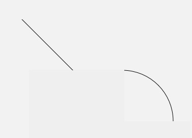
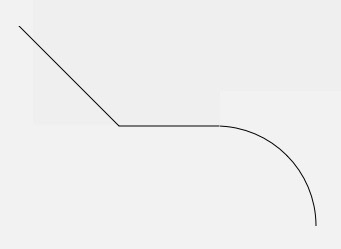
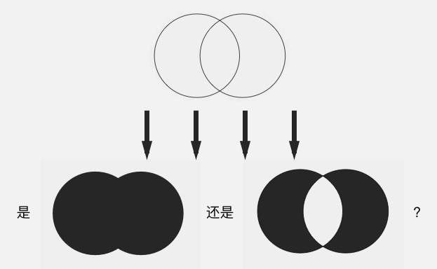
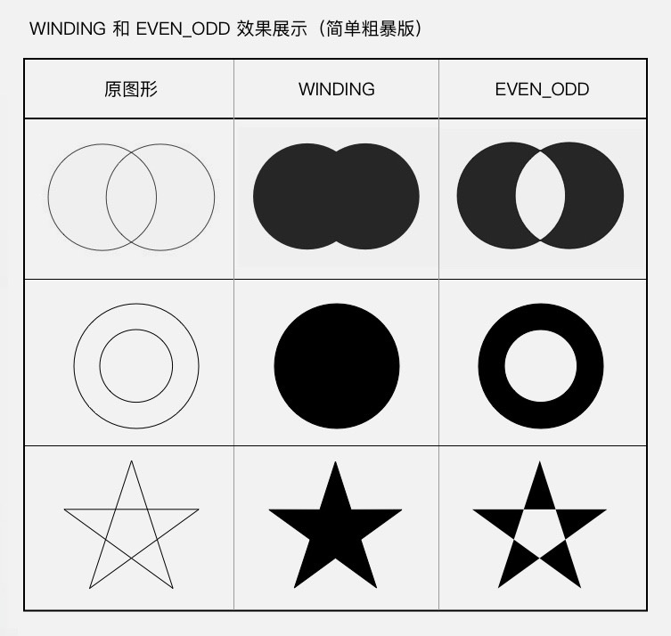
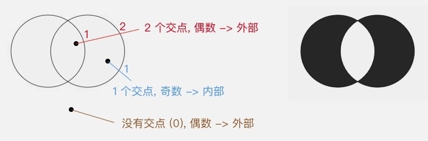
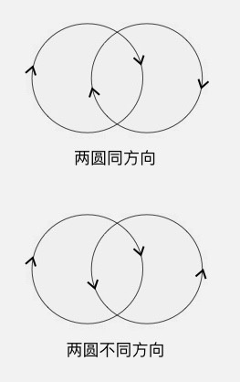

# Path操作
Path 可以描述直线、二次曲线、三次曲线、圆、椭圆、弧形、矩形、圆角矩形。把这些图形结合起来，就可以描述出很多复杂的图形。下面我就说一下具体的怎么把这些图形描述出来。

Path 有两类方法，一类是直接描述路径的，另一类是辅助的设置或计算。

### Path 方法第一类：直接描述路径。
这一类方法还可以细分为两组：添加子图形和画线（直线或曲线）

##### 第一组： addXxx() ——添加子图形

###### addCircle(float x, float y, float radius, Direction dir) 添加圆
x, y, radius 这三个参数是圆的基本信息，最后一个参数 dir 是画圆的路径的方向。

path.AddCircle(x, y, radius, dir) + canvas.drawPath(path, paint) 这种写法，和直接使用 canvas.drawCircle(x, y, radius, paint) 的效果是一样的，区别只是它的写法更复杂。所以如果只画一个圆，没必要用 Path，直接用 drawCircle() 就行了。drawPath() 一般是在绘制组合图形时才会用到的。

其他的 Path.add-() 方法和这类似，例如：

addOval(float left, float top, float right, float bottom, Direction dir) / addOval(RectF oval, Direction dir) 添加椭圆

addRect(float left, float top, float right, float bottom, Direction dir) / addRect(RectF rect, Direction dir) 添加矩形

addRoundRect(RectF rect, float rx, float ry, Direction dir) / addRoundRect(float left, float top, float right, float bottom, float rx, float ry, Direction dir) / addRoundRect(RectF rect, float[] radii, Direction dir) / addRoundRect(float left, float top, float right, float bottom, float[] radii, Direction dir) 添加圆角矩形

addPath(Path path) 添加另一个 Path

##### xxxTo() ——画线（直线或曲线）
这一组和第一组 addXxx() 方法的区别在于，第一组是添加的完整封闭图形（除了 addPath() ），而这一组添加的只是一条线。

###### moveTo(float x, float y) / rMoveTo(float x, float y) 移动到目标位置

不论是直线还是贝塞尔曲线，都是以当前位置作为起点，而不能指定起点。但你可以通过 moveTo(x, y) 或 rMoveTo() 来改变当前位置，从而间接地设置这些方法的起点。

moveTo(x, y) 虽然不添加图形，但它会设置图形的起点，所以它是非常重要的一个辅助方法。

###### lineTo(float x, float y) / rLineTo(float x, float y) 画直线

从当前位置向目标位置画一条直线， x 和 y 是目标位置的坐标。这两个方法的区别是，lineTo(x, y) 的参数是绝对坐标，而 rLineTo(x, y) 的参数是相对当前位置的相对坐标 （前缀 r 指的就是  relatively 「相对地」)。

> **当前位置**：所谓当前位置，即最后一次调用画 Path 的方法的终点位置。初始值为原点 (0, 0)。

###### quadTo(float x1, float y1, float x2, float y2) / rQuadTo(float dx1, float dy1, float dx2, float dy2) 画二次贝塞尔曲线

这条二次贝塞尔曲线的起点就是当前位置，而参数中的 x1, y1 和 x2, y2 则分别是控制点和终点的坐标。和 rLineTo(x, y) 同理，rQuadTo(dx1, dy1, dx2, dy2) 的参数也是相对坐标

###### cubicTo(float x1, float y1, float x2, float y2, float x3, float y3) / rCubicTo(float x1, float y1, float x2, float y2, float x3, float y3) 画三次贝塞尔曲线

和上面这个 quadTo() rQuadTo() 的二次贝塞尔曲线同理，cubicTo() 和 rCubicTo() 是三次贝塞尔曲线，不再解释。

###### 画弧形
arcTo(RectF oval, float startAngle, float sweepAngle, boolean forceMoveTo) / arcTo(float left, float top, float right, float bottom, float startAngle, float sweepAngle, boolean forceMoveTo) / arcTo(RectF oval, float startAngle, float sweepAngle)

这个方法和 Canvas.drawArc() 比起来，少了一个参数 useCenter，而多了一个参数 forceMoveTo 。

少了 useCenter ，是因为 arcTo() 只用来画弧形而不画扇形，所以不再需要 useCenter 参数；而多出来的这个 forceMoveTo 参数的意思是，绘制是要「抬一下笔移动过去」，还是「直接拖着笔过去」，区别在于是否留下移动的痕迹。

```java
paint.setStyle(Style.STROKE);  
path.lineTo(100, 100);  
path.arcTo(100, 100, 300, 300, -90, 90, true); // 强制移动到弧形起点（无痕迹）
```


```java
paint.setStyle(Style.STROKE);  
path.lineTo(100, 100);  
path.arcTo(100, 100, 300, 300, -90, 90, false); // 直接连线连到弧形起点（有痕迹）  
```


addArc(float left, float top, float right, float bottom, float startAngle, float sweepAngle) / addArc(RectF oval, float startAngle, float sweepAngle)

又是一个弧形的方法。一个叫 arcTo ，一个叫 addArc()，都是弧形，区别在哪里？其实很简单：  addArc() 只是一个直接使用了 forceMoveTo = true 的简化版 arcTo() 。

###### close() 封闭当前子图形

它的作用是把当前的子图形封闭，即由当前位置向当前子图形的起点绘制一条直线。

# 获取Path上所有点的坐标 PathMeasure
PathMeasure是一个用来测量Path的类，主要有以下方法:

close() 和 lineTo(起点坐标) 是完全等价的。

「子图形」：官方文档里叫做 contour 。但由于在这个场景下我找不到这个词合适的中文翻译（直译的话叫做「轮廓」），所以我换了个便于中国人理解的词：「子图形」。前面说到，第一组方法是「添加子图形」，所谓「子图形」，指的就是一次不间断的连线。一个 Path 可以包含多个子图形。当使用第一组方法，即 addCircle() addRect() 等方法的时候，每一次方法调用都是新增了一个独立的子图形；而如果使用第二组方法，即 lineTo() arcTo() 等方法的时候，则是每一次断线（即每一次「抬笔」），都标志着一个子图形的结束，以及一个新的子图形的开始。

另外，不是所有的子图形都需要使用 close() 来封闭。当需要填充图形时（即 Paint.Style 为  FILL 或 FILL_AND_STROKE），Path 会自动封闭子图形。

```java
  paint.setStyle(Style.FILL);
  path.moveTo(100, 100);
  path.lineTo(200, 100);
  path.lineTo(150, 150);
  // 这里只绘制了两条边，但由于 Style 是 FILL ，所以绘制时会自动封口
```

### Path 方法第二类：辅助的设置或计算
这类方法的使用场景比较少，我在这里就不多讲了，只讲其中一个方法：  setFillType(FillType fillType)。

##### Path.setFillType(Path.FillType ft) 设置填充方式

这类方法的使用场景比较少，我在这里就不多讲了，只讲其中一个方法：  setFillType(FillType fillType)。

###### Path.setFillType(Path.FillType ft) 设置填充方式
前面在说 dir 参数的时候提到， Path.setFillType(fillType) 是用来设置图形自相交时的填充算法的：



方法中填入不同的 FillType 值，就会有不同的填充效果。FillType 的取值有四个：
- EVEN_ODD
- WINDING （默认值）
- INVERSE_EVEN_ODD
- INVERSE_WINDING

其中后面的两个带有 INVERSE_ 前缀的，只是前两个的反色版本，所以只要把前两个，即 EVEN_ODD 和  WINDING，搞明白就可以了。

EVEN_ODD 和 WINDING 的原理有点复杂，直接讲出来的话信息量太大，所以我先给一个简单粗暴版的总结，你感受一下： WINDING 是「全填充」，而 EVEN_ODD 是「交叉填充」：



之所以叫「简单粗暴版」，是因为这些只是通常情形下的效果；而如果要准确了解它们在所有情况下的效果，就得先知道它们的原理，即它们的具体算法。

##### EVEN_ODD 和 WINDING 的原理
###### EVEN_ODD
即 even-odd rule （奇偶原则）：对于平面中的任意一点，向任意方向射出一条射线，这条射线和图形相交的次数（相交才算，相切不算哦）如果是奇数，则这个点被认为在图形内部，是要被涂色的区域；如果是偶数，则这个点被认为在图形外部，是不被涂色的区域。还以左右相交的双圆为例：


射线的方向无所谓，同一个点射向任何方向的射线，结果都是一样的，不信你可以试试。

从上图可以看出，射线每穿过图形中的一条线，内外状态就发生一次切换，这就是为什么 EVEN_ODD 是一个「交叉填充」的模式。

###### WINDING
即 non-zero winding rule （非零环绕数原则）：首先，它需要你图形中的所有线条都是有绘制方向的：



然后，同样是从平面中的点向任意方向射出一条射线，但计算规则不一样：以 0 为初始值，对于射线和图形的所有交点，遇到每个顺时针的交点（图形从射线的左边向右穿过）把结果加 1，遇到每个逆时针的交点（图形从射线的右边向左穿过）把结果减 1，最终把所有的交点都算上，得到的结果如果不是 0，则认为这个点在图形内部，是要被涂色的区域；如果是 0，则认为这个点在图形外部，是不被涂色的区域。


> 和 EVEN_ODD 相同，射线的方向并不影响结果。

所以，我前面的那个「简单粗暴」的总结，对于 WINDING 来说并不完全正确：如果你所有的图形都用相同的方向来绘制，那么 WINDING 确实是一个「全填充」的规则；但如果使用不同的方向来绘制图形，结果就不一样了。

> 图形的方向：对于添加子图形类方法（如 Path.addCircle() Path.addRect()）的方向，由方法的  dir 参数来控制，这个在前面已经讲过了；而对于画线类的方法（如 Path.lineTo() Path.arcTo()）就更简单了，线的方向就是图形的方向。

所以，完整版的 EVEN_ODD 和 WINDING 的效果应该是这样的：


而 INVERSE_EVEN_ODD 和 INVERSE_WINDING ，只是把这两种效果进行反转而已，你懂了 EVEN_ODD 和  WINDING ，自然也就懂 INVERSE_EVEN_ODD 和 INVERSE_WINDING 了，我就不讲了。

好，花了好长的篇幅来讲 drawPath(path) 和 Path，终于讲完了。同时， Canvas 对图形的绘制就也讲完了。图形简单时，使用 drawCircle() drawRect() 等方法来直接绘制；图形复杂时，使用  drawPath() 来绘制自定义图形。


构造方法

| 方法名 |	释义 |
|-------|-----|
| PathMeasure() |	创建一个空的PathMeasure |
| PathMeasure(Path path, boolean forceClosed)	| 创建 PathMeasure 并关联一个指定的Path(Path需要已经创建完成)。|
公共方法

| 返回值	| 方法名	| 释义 |
|---------------------|
|void	| setPath(Path path, boolean forceClosed)	| 关联一个Path
| boolean	| isClosed() | 是否闭合
| float |	getLength() |	获取Path的长度
| boolean |	nextContour() |	跳转到下一个轮廓
| boolean |	getSegment(float startD, float stopD, Path dst, boolean startWithMoveTo) |	截取片段
| boolean	| getPosTan(float distance, float[] pos, float[] tan)	|　获取指定长度的位置坐标及该点切线值
| boolean	| getMatrix(float distance, Matrix matrix, int flags)	| 获取指定长度的位置坐标及该点Matrix

可以看到，这个就等于是一个Path的一个工具类，方法很简单，那么就开始我们所要做的按钮跟时钟的开发吧
