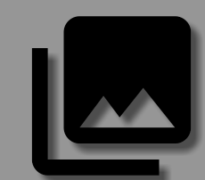

# SVG图
http://blog.csdn.net/lisdye2/article/details/51967946
https://bigbadaboom.github.io/androidsvg/download.html
http://www.linuxidc.com/Linux/2015-08/121992.htm

SVG是一种矢量图格式，是Scalable Vector Graphics三个单词的首字母缩写。是基于可扩展标记语言（标准通用标记语言的子集），用于描述二维矢量图形的一种图形格式。在xml文件中的标签是<vector>，画出的图形可以像一般的图片资源使用，例子如下：

```xml
<vector xmlns:android="http://schemas.android.com/apk/res/android"
    android:width="24dp"
    android:height="24dp"
    android:viewportHeight="24.0"
    android:viewportWidth="24.0">
    <path
        android:fillColor="#FF000000"
        android:pathData="M22,16V4c0,-1.1 -0.9,-2 -2,-2H8c-1.1,0 -2,0.9 -2,2v12c0,1.1 0.9,2 2,2h12c1.1,0 2,-0.9 2,-2zm-11,-4l2.03,2.71L16,11l4,5H8l3,-4zM2,6v14c0,1.1 0.9,2 2,2h14v-2H4V6H2z" />
</vector>
```
所画出的图形如下：



于此同时，android studio提供了丰富的图片资源，可以右键module,new->vector asset选择。

- vector 标签下有android:width和android:height属性，这两个属性是必填的，定义矢量图形的绝对大小，虽然说是矢量图形随意缩放，但是不能说这里不定义宽高直接到要设置到的目标控件上定义控件的宽高，这样是不允许的，一定要设置这个绝对宽高，要不然会报错。

- 然后还有个android:viewportHeight和android:viewportWidth属性，这个是画布宽高，也是必填的，定义Path路径的时候就必须在这个画布大小里去绘制，超出画布就显示不出来了。

- path标签android:fillColor属性定义绘制颜色。

- android:pathData定义绘制路径。

# 路径
其他属性都很容易理解，唯独路径里的一大串数字让人摸不着头脑。其实这就是图像的路径。

## path中的标签
- M(x y): Move to 把绘制点移动到制定点，后面跟着的两个数字既是移动到的坐标点(x，y）。
- L(x y): Line to 直线，后面跟着的两个数字就是目标点。从上一个点到目标点连一条直线。直线是没有宽度的，所以你什么也看不到。

  `android:strokeColor="#333330" android:strokeWidth="10" 设置颜色和线宽`
- Z: Close 闭合，向起始点连一条线。形成封闭的图形。
- Q: quatratic bezier 二次贝塞尔曲线。控制点（x1,y1），终点x,y。
- C(x1 y1 x2 y2 x y)：cubic bezier 三次贝塞尔曲线。控制点（x1,y1）（ x2,y2），终点x,y。
- A(rx ry x-axis-rotation large-arc-flag sweep-flag x y) : ellipse 圆弧
  * rx ry 椭圆半径
  * x-axis-rotation x轴旋转角度
  * large-arc-flag 为0时表示取小弧度，1时取大弧度 （舍取的时候，是要长的还是短的）
  * sweep-flag 0取逆时针方向，1取顺时针方向


***每个命令都有大小写形式，大写代表后面的参数是绝对坐标，小写表示相对坐标，相对于上一个点的位置。参数之间用空格或逗号隔开。***
