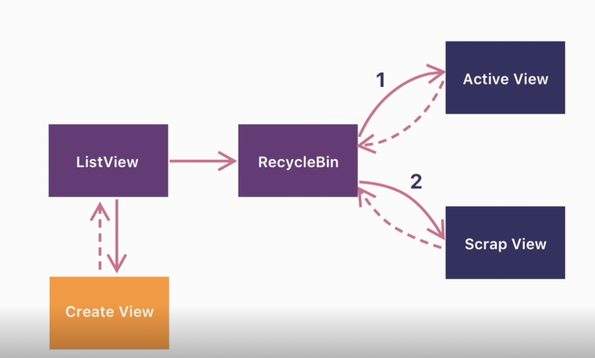
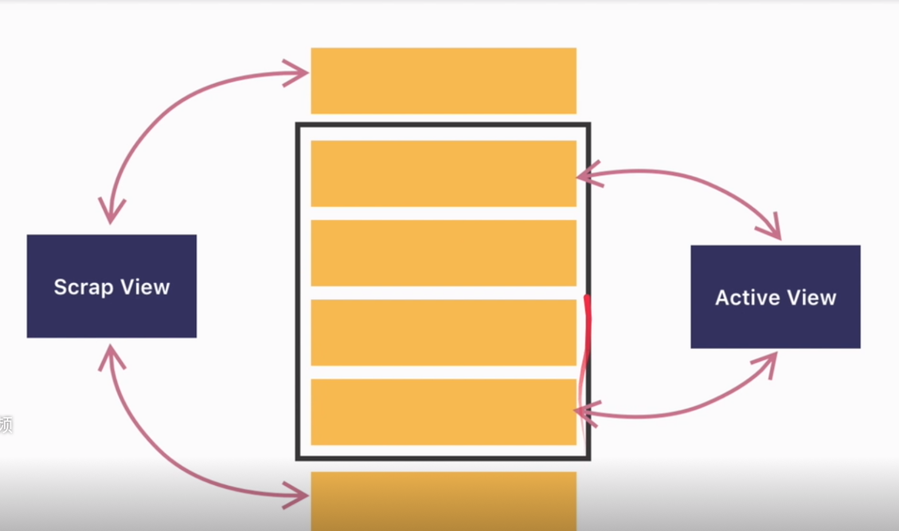
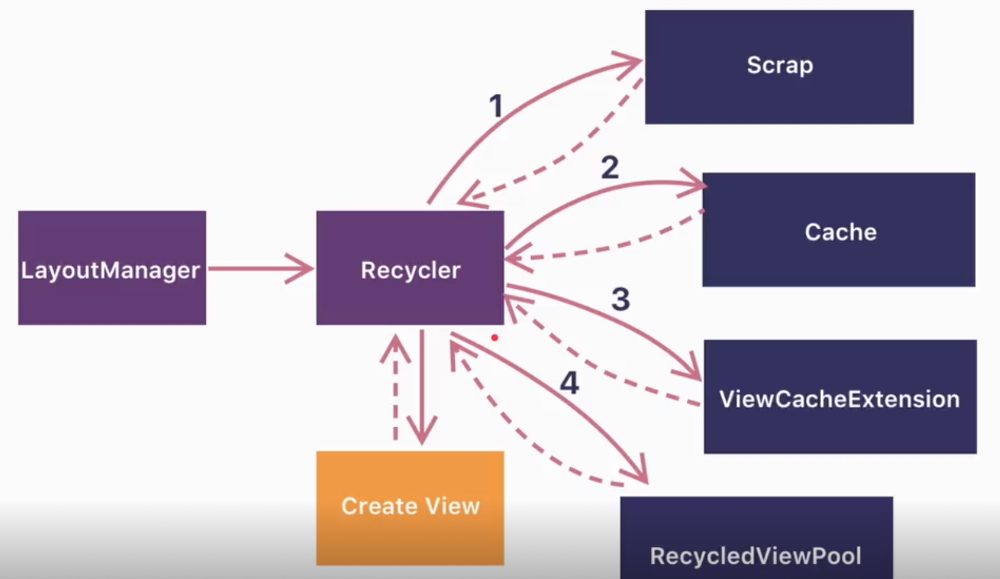
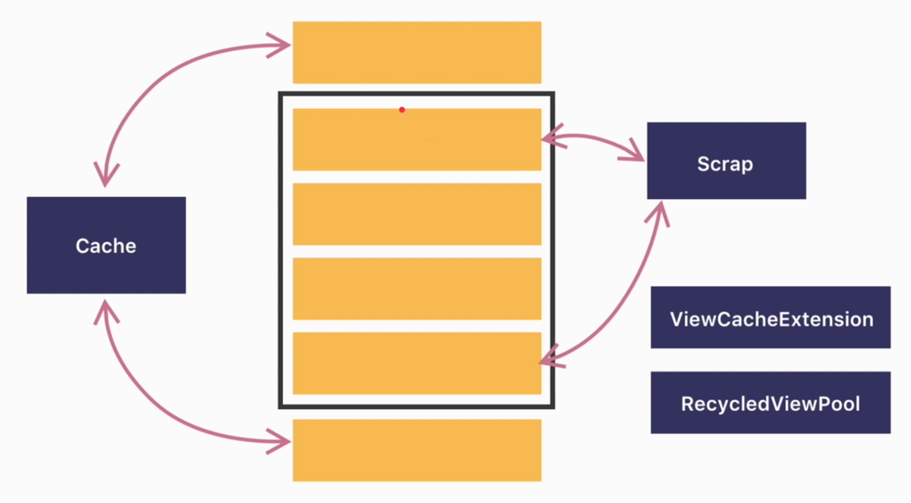
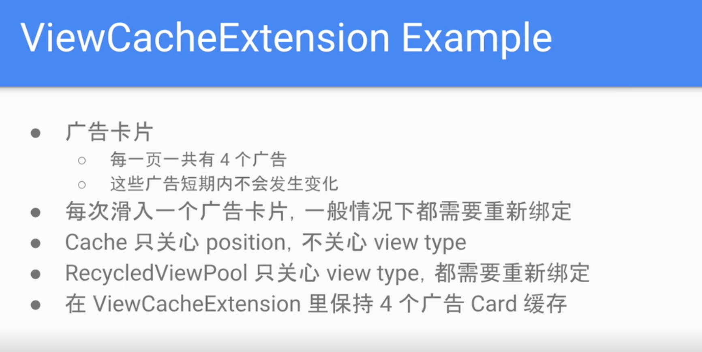
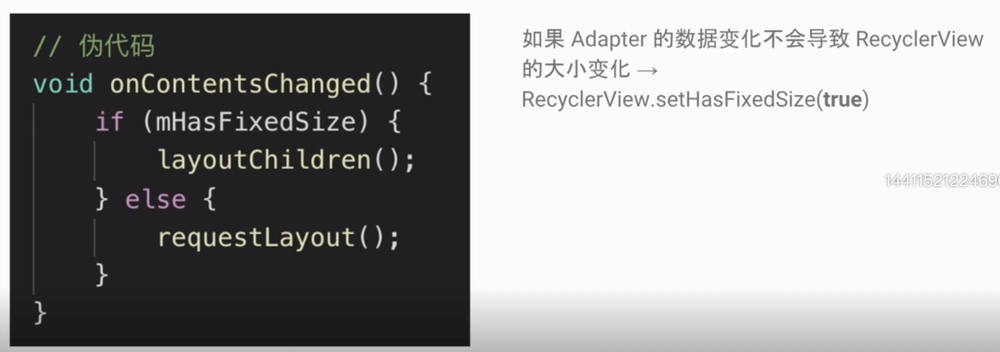
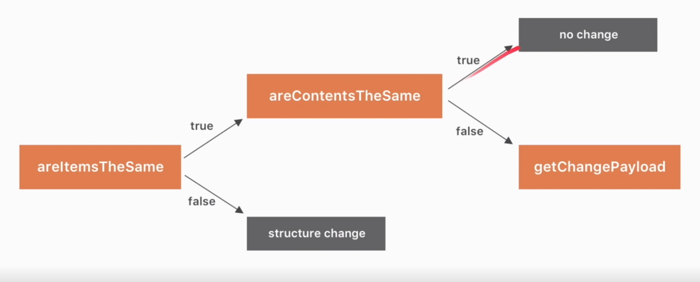

[TOC]

# RecyclerView

一个在有限屏幕空间，展示 `大量数据列表` 的 `灵活` 的组件。

> 大量数据列表

- 复用 Item

> 灵活

- 展示不同形式的列表
- 不同 Item 可以不同


> ListView 的局限

- 只能显示纵向列表，不能实现表格布局，流式布局
- 没有支持动画的 API
- 接口设计和系统不一致
    - setOnItemClickListener()
    - setOnItemLongClickListener()
    - setSelection()
    - 这些接口和系统的组件的 onClickListener 是重复的，这样就很混乱，也容易引起人们的困惑。
- 没有强制实现 ViewHolder
- 性能不如 RecyclerView, 需要自己手写复用回收的代码


> RecyclerView 的优势

- 默认支持 Linear, Grid, Staggered Grid 三种布局，并且都有水平和竖直两个方向。
- 友好的 ItemAnimator 动画 API
- 强制实现 ViewHolder
- 解耦的架构设计
- 相对 ListView 更好的性能


## RecyclerView 使用

架构组件

- RecyclerView: 总的容器
- LayoutManager: 布局和摆放 Item, 计算 Item View 的位置
- Item Animator: 控制 Item 的动画
- Adapter: 提供显示的 item View

### 分割线


###


## RecyclerView.ViewHolder 究竟是什么
用户保存 View 引用的容器类， 把需用用到的 View (findViewById 拿到的。深度优先查找，O(n)) 都缓存起来。
- 和 ItemView 什么关系？
    意义对应关系，一个 ItemView 对应一个 ViewHolder
- 解决什么问题
    解决重复 findViewById 来提高效率。
- ViewHolder 和 ListView 的 ItemView 复用有什么关系？
    需要自己选择是否实现 ViewHolder。一个 ItemView 就绑定一个 ViewHolder, 一对一的绑定，优化重复 findViewById 的问题。


另外还保存了位置信息


## RecyclerView 的缓存机制

> ListView 的缓存



通过 RecycleBean 实现回收的管理。RecycleBean 有两层缓存。第一层是 Active View，活跃的，滑动时用户能够看到的 View 的列表， 第二层是 Scrap View。划出屏幕，别回收的 View。 当需要一个 View 时，会首先在第一层里面找，找不到才会在第二层里面找。如果都没找到，则会返回 null, 也就是在 getView 中需要自己创建新的 item view 的时机。




Active View 复用是在屏幕刷新的时候，会先清空，然后从从新获取要绘制的内容，这时候就从 Active View 获取，绘制。这时候由于数据、Item、尺寸都完全一样，所以会直接绘制，不会调用 getView方法。



使用 Recycler 来管理缓存，具有四层的缓存。缓存的是 ViewHolder。

- 与 ListView 不同，Scrap 是屏幕内显示的第一层缓存。
- cache 是刚划出的，数据还没有变化的 item 的缓存，它是通过 position 来查找。这样的好处是，如果反向滑动，这时候 cache 的缓存可以直接拿过来用，而不用从新绑定数据。 所以 cache 跟 scrap 更像。 （RecyclerView 的 cache + scrap <----> ListView 的 ActiveView）
- 第三层 ViewCacheExtension 是用户自定义的缓存策略。用户没有定义的时候，将跳过。
- RecycledViewPool. 标记数据为脏数据的 Item, 通过 ViewType 来查找，需要从新绑定数据。

都查找不到，就调用 adapter 的 onCreateViewHolder 创建一个。



ViewCacheExtension 极少使用得到，下面是一个假象的场景。



> 注意: 列表中 item/ 广告的 impression 统计

ListView 是使用 getView 来统计展示的次数。但是 RecyclerView 的 onBindViewHolder 的调用次数，可能会比实际展示多。 通过 onViewAttatchedToWindow（） 来统计次数。


## RecyclerView 的性能优化策略

> 1 点击监听器的创建

滑动时创建，和回收，会造成内存抖动。所以不要再 onBindViewHolder 中创建、设置监听器，而是在创建的时候， ViewHolder 中，或者全部的 Item 使用同一个 listener。

> 2 LinearLayoutManager.setInitialPrefetchItemCount()

- 在既能横向滑动，又能纵向滑动的时候。比如在纵向列表中插入了横向列表。当滑动到具有横向列表的 Item 的时候，由于要创建复杂的横向列表，可能会导致页面卡顿。
- 5.0 以上，由于 RenderThread 的存在（单独的 UI 线程），RecyclerView 会进行 prefetch。
- LinearLayoutManager.setInitialPrefetchItemCount(横向列表初次显示时，可见的 item 个数)
    - 只有 LinearLayoutManager 有
    - 只有嵌套到内部的 RecyclerView 才有用。


> 3. RecyclerView.setHasFixedSize()



当 RecyclerView 的 item 数量发生变化时，会导致调用 requestLayout 来从新布局，和绘制。这是一个很重的造作。如果一下操作，如替换，和能改数据，不会引起 item 的数量发生变化时，可以将 hasFixedSize 设置为 true, 就会只走 layoutChilder() 的逻辑。从而优化性能。


> 4 多个 RecyclerView 共用 RecyclerdViewPool

当多个 RecyclerView 的 ItemView 一样或者有部分 item 一样的时候，可以设置共用一个缓存池。

```kotlin
val viewPool = RecyclerView.RecycledViewPool()
recyclerView1.setRecycledViewPool(viewPool)
recyclerView2.setRecycledViewPool(viewPool)
recyclerView3.setRecycledViewPool(viewPool)
```


> 5 DiffUtil

- 局部更新方法 notifiItemXXX() 不适用与所有情况，插入，删除和批量处理
- notifyDataSetChange() 会导致整个布局重绘，重新绑定所有的 ViewHolder, 而且会失去可能的动画效果。
- DissUtil 使用与整个页面需要刷新，但是有部分数据可能相同的情况。

使用的是 Myers Diff Algorithm。 动态规划，比较两个列表的




在列表数据很大是，使用异步处理来回调显示。 谷歌提供了 AynycListDiffer(Executor) / ListAdapter。

代码示例

https://developer.android.com/reference/androidx/recyclerview/widget/AsyncListDiffer

https://developer.android.com/reference/androidx/recyclerview/widget/ListAdapter


## 为什么 ItemDecoration 可以绘制分割线。

分割线尽量不要使用 View 或背景来代替，一是影响性能，最主要的是影响扩展，做动画的时候，分割线会跟着 Item 动，这个很难受。

使用场景
- 分割线
- HightLight(高亮)，例如选中的图片加蒙板
- Visual grouping boundaries 分组

***可以添加多个，效果进行叠加。***


### 更多知识

添加 header, footer，动画等

https://github.com/h6ah4i/android-advancedrecyclerview

https://advancedrecyclerview.h6ah4i.com/


### 默认实现

DividerItemDecoration


### 替换 ViewPager

https://blog.csdn.net/u012854870/article/details/84984066


> Android RecyclerView.ViewHolder # getAdapterPosition() 返回 -1 的原因与处理方案。

使用 getLayoutPosition 代替

https://www.jianshu.com/p/17080a269dfe


### RecyclerView 消耗点击事件

点击

suppressLayout(true)

### GridLayoutManager 的间距

获取行和列

```
    @Override
    public void getItemOffsets(@NonNull Rect outRect, @NonNull View view, @NonNull RecyclerView parent, @NonNull RecyclerView.State state) {
        super.getItemOffsets(outRect, view, parent, state);

        RecyclerView.LayoutManager layoutManager = parent.getLayoutManager();
        if (layoutManager instanceof GridLayoutManager) {
            GridLayoutManager gridManager = (GridLayoutManager) layoutManager;
            int itemPosition = ((RecyclerView.LayoutParams) view.getLayoutParams()).getViewLayoutPosition();

            int spanCount = gridManager.getSpanCount();
            int childCount = parent.getChildCount();
            GridLayoutManager.SpanSizeLookup lookup = gridManager.getSpanSizeLookup();
//            int position = parent.getChildAdapterPosition(view);
            RecyclerView.LayoutParams lp = (RecyclerView.LayoutParams) view.getLayoutParams();
            int position = lp.getViewAdapterPosition();

            int row = lookup.getSpanGroupIndex(position, spanCount);
            int column = lookup.getSpanIndex(position, spanCount);
            switch (gridManager.getItemViewType(view)) {
                case SELECT_ITEM:
                    if (column % 6 == 0) {
                        outRect.right = space;
                    } else if (column % 6 == 4) {
                        outRect.left = space;
                    } else {
                        outRect.left = space;
                        outRect.right = space;
                    }
                    break;
                case COURSE_ITEM:
                    if (column % 6 == 0) {
                        outRect.right = space;
                    } else if (column % 6 == 3) {
                        outRect.left = space;
                    }
                    break;
            }
        }
    }
```


## 回收

Android RecyclerView adapter has function's called,

```


onViewAttchedToWindow();

onViewDetachedFromWindow();

onViewRecycled();

Use this function's to achieve.
```

页面销毁时，需要单独处理

```
@Override
public void onDestroyView() {
    super.onDestroyView();
    mRecyclerView.setAdapter(null);
}
```


## ConcatAdapter


## RecyclerView

### 和 ListView 的对比

1. 只支持垂直的滑动，对于横向滑动没有直接支持。使用列表布局，流布局则需要使用其他类。
2. 没有支持动画的 API
3. 接口设计和其他 View 设计不一致，其他View 都是在本身设置点击事件，而它需要设置　`onItemClickListener`等，容易产生混乱。
4. 没有强制实现 ViewHolder, 对于缓存的使用完全凭借开发者的经验，性能比较差。
5. 性能不如 RecyclerView。提供了 DiffUtils 等页面数据更新工具，是数据的部分修改更加高效和平滑。
6. (对于列表中填充不同数据类型没有直接的支持，实现比较麻烦。)

### ViewHolder 是什么？

解决的是什么问题？

ViewHolder 用于保存 item view 中子 view 的引用，减少复用组件的时候　`findViewById` 的性能损耗。

和 item view 的对应关系？

ViewHolder 和　view item 是一对一关系

ListView 中的 ViewHolder 和 item 的复用有什么关系？

item 的复用由用户判断，返回是否为空，为空需要从新创建，不空则复用。而 ViewHolder 仅仅是在不为空复用时，减少 findViewById 的性能损耗。

### 缓存比较

ListView:

RecyclerBin 的类管理缓存复用。ListView 每次渲染的时候，要把所有的绘制内容清空掉，然后根据最近的状态从新计算、绑定所有 View 的数据，然后进行渲染。这样很耗时，因为绝大多数，除了位置不同，其他内容都是不变的。这样计算性能很低。

1. Active View: 屏幕里面能看到的 View.
2. Scrap View: 移除屏幕的 View。


Recycler View 缓存机制

1. Scrap: 屏幕内的 ViewHolder。数据是干净的，不会从新绑定数据，只需要计算位置，就可以拿来绘制。
2. Cache：滑出屏幕的 ViewHolder。当用户反过来滑动的时候，数据也是干净的，可以根据　position 获取到，拿过来直接用。也不用绑定数据。
3. ViewCacheExtension：用户自定义的缓存策略。一个可能的应用场景是，这个可以用户多个 List　中使用一个　View。而不用再次创建了。cache 只关心　position，不关系 ViewType。RecycledViewPool 只关心　ViewType，都需要从新绑定数据。要想实现长时间滑动出去，还是能不用绑定数据，可以在此自定义缓存策略。
4. RecycledViewPool：废弃的 View,数据是脏的，有可能是其他 item 的数据，需要从新绑定数据。多个列表可以设置复用一个，从而减少 View　的创建。

> 1. 展示次数统计

`onBindViewHolder` 可能复用而不再次绑定，需要使用 `onViewAttachedWindow` 来统计。

### RecyclerView 性能优化

1. 在 onCreateView 中绑定监听器。通过　`getAdapterPosition` 获取位置来处理事件。

2. 设置 `LinearLayoutManager.setInitialPrefetchCount`　来设置提前加载数据的个数来避免比较复杂的 item 创建的耗时，提高滑动的流畅性。只有设置嵌套内部的　LayoutManager 才有用，外部的列表的 Manager 的设置是没有用的。

3. setFixedSize(), 当设置为 true 时，当内容变化的时候（添加、删除、更改）,会直接重新子 View，而不会从新布局自身。当 数据改变的时候，不会影响RecyclerView 的大小改变，就可以设置为 true。

4. 多个 List 的 item 是一样的，例如多个 Tab 下的列表，item 是一样的。设置  `setRecycleViewPool` 

5. 使用 DiffUtil 来更新数据，提高效率。不用更新整个列表，同时还有动画，比较友好。当数据量很大的时候，还是需要将计算过程放到后台线程，然后将结果返回到前台线程更新 UI。或者使用 Google 封装好的 `AsyncListDiffer(Executor)/ListAdapter` 来处理。

### ItemDecoration 作用。

1.分割线，2. 蒙版，3.分组间隔。可以设置多个 ItemDecoration，来分别负责不同的效果。实现了解耦。


onDraw 在 imem 之前绘制，会在 Item 的下面。
onDrawOver 在 item 之后绘制，会绘制在 Item 上面。
getItemOffSets Item 的偏移量，用来留出 Item 之间的距离。


更多使用

https://github.com/h6ah4i/android-advancedrecyclerview
https://advancedrecyclerview.h6ah4i.com/
