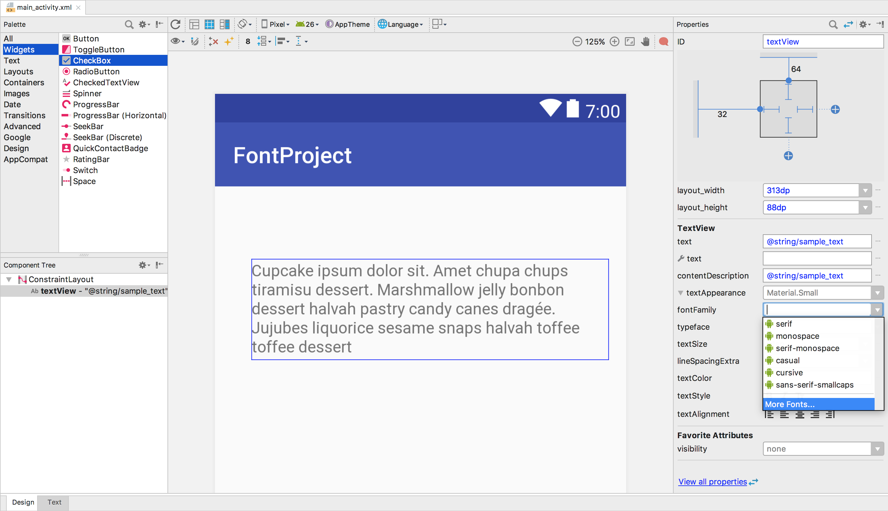
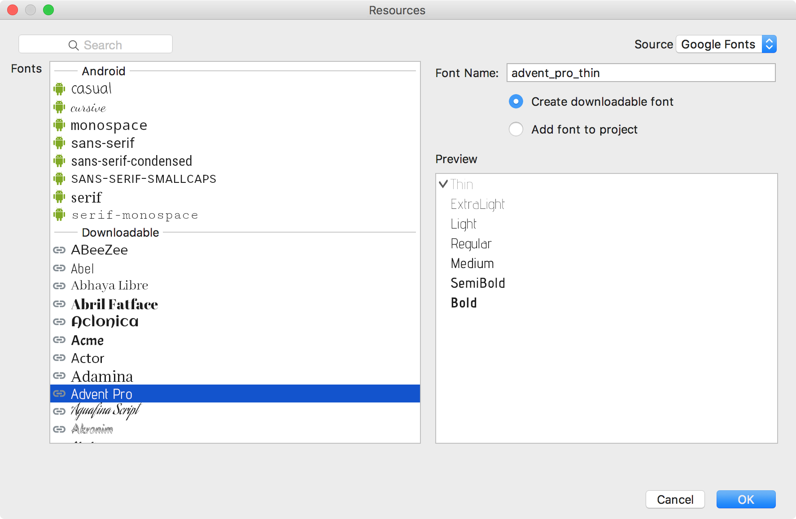
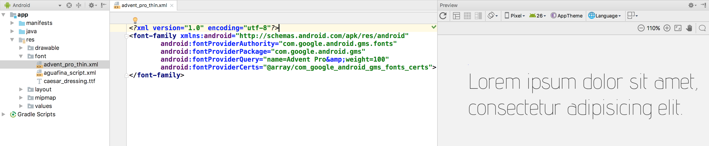
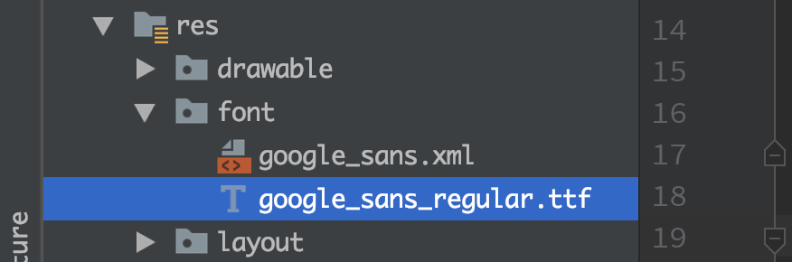

# 终于，终于，终于，Android 原生支持切换各种改字体了

曾经，相要在安卓中使用字体是件很麻烦的事：内嵌字体文件，自己加载字体，定义组件设置字体。然而只用上有很多不便之处：
- 很难在 xml 中改变字体的各种属性
- 无法在在 theme 中同一定义样式
- 自定义组件，存在着不安全性。
- 加载字体的效率难以保证（曾经自定义汉字书写的View 加载字体的速度都能认为感知的慢。）

**现在， 安卓终于能像 web 一样，随意改变字体，并且不增加 apk 的体积 —— 运行时下载**

好处很多：

- 整个系统有效，别的APP 下载过的，自己的 app 用到了，不用再次下载
- 减少了 apk 的体积
- 不用编写代码，能够以 XML 的方式改变字体的各种属性，统一定义 Theme，更优雅，更高效，更安全。
- 最重要的，支持从 API14 及以上的所有手机，即安卓 4.0 以上都可以使用该特性。

## 使用方法
将 Android stuido 升级到 3.2 及以上，SDK 版本升级的 26 （8.0）或更高
1. 在布局编辑窗口, 选择一个 TextView, 在右侧的属性编辑窗口, 选择 fontFamily （绿色图标的系统自带可以使用的）> More Fonts.

会出现一个字体此案

2. In the Source drop-down list, select Google Fonts.
3. In the Fonts box, select a font.
4. Select Create downloadable font and click OK.



此时 Android studio 会在 res > font 下生成相应的字体标识文件，用于安装后系统识别并下载字体。


以及 res/values 中 font_certs.xml 中用于下载认证的签名。

同时 AndroidMinifest.xml 中加入了了
```
<meta-data
     android:name="preloaded_fonts"
     android:resource="@array/preloaded_fonts" />
```

以上这些工作 Android Studio 自动已经完成了。

接下来就可以在布局文件中使用了。
```
android:fontFamily="@font/<font 目录下生成的文件名，不需要带 xml 后缀>"
例如
android:fontFamily="@font/google_sans"
```

### 想要在 8.0 以下使用，需要加点东西
support 库

gradel 中添加
```
dependencies {
    ...
    compile "com.android.support:support-compat:28.0.0"
}
```

然后使用
```
app:fontFamily="@font/google_sans"
```

**个人建议，在主题中设置字体，方便更改和复用**

## 当然 ，你也可以编程获取，动态设置

[看文档，不啰嗦了](https://developer.android.com/guide/topics/ui/look-and-feel/downloadable-fonts)


## 真的不能下载，font 文件也可以当 资源用了

只需要将下载好的字体放到 res > font 目录下，例如



文件名和普通资源文件的命名规则一样，只支持[a-z0-9]，不能有大写字母，中划线，空格等其他特殊字符。

然后就可以和上面的 `Downloadable Fonts` 一样使用了

```
android:fontFamily="@font/google_sans"
8.0 以下使用
app:fontFamily="@font/google_sans_regular"
```


[更多详细说明，请看官方文档](https://developer.android.com/guide/topics/ui/look-and-feel/fonts-in-xml)
