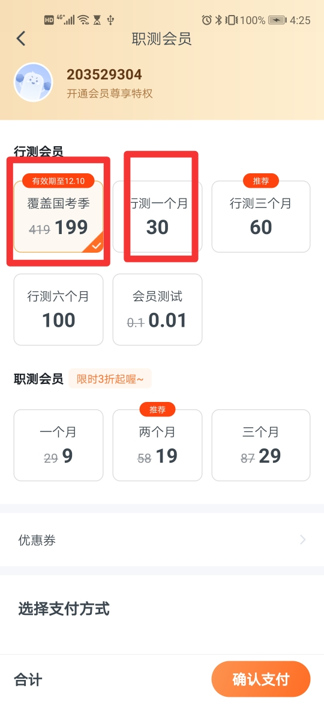

## NDK 版本编译错误

***项目中的 NDK 必须使用 16 及之前版本，否则会报错***

这个可能是当时写 JNI 程序 的时候为了兼容，4.0 之下手机比较多，为了兼容老手机，所以编译的 `so` 库最低兼容的是 `armabi` 的。


> 问题出在 `module/video`

/src/main/jni/Application.mk` 文件的最低支持 `armeabi` 引起的。

```
`APP_ABI := armeabi`
```

 
 从 NDK 17 开始就不再支持 `armabi` 了，改成 `armabi-v7a` 就可以编译了。[NDK 17 开始不再支持 armabi，mips, mips64 了](https://github.com/android/ndk/wiki/Changelog-r17)。 
 
 
 - armeabi: 第5代、第6代的ARM处理器，早期的手机用的比较多。使用软件浮点运算，通用性强，速度慢。 
 - armabi-v7a 第7代及以上的 ARM 处理器，从2010 年发布的手机基本上都是 这个处理器起步的了。

> 可以升级一下

armeabi 手机的市场占有率。

- 从 Adroid 4.0 (API 14)默认不再支持 armeabi。Android 4.4 (API 19)之后强制要求armv7处理器。4.0 及以上的市场占有率达到了 100%, v5,v6 的手机设备应该没有了。咱们的项目 min SDK 是 19 (4.4), 对于其他项目，支持到 4.0 也是完全可以覆盖所有手机的。

    https://www.jianshu.com/p/4b1c2dd3c87f
    https://stackoverflow.com/questions/10920747/android-cpu-arm-architectures

- v7 开始的 ARM 处理器开始支持硬件浮点数运算以及其他一些特性。 对于为了减小包体积，只留一个 `so` 的情况，留 `armabi-v7a` 能获得更好的性能。

- 对于新入职人员不用不明所以的出现编译错误，要拷贝老版本的 NDK了。

***升级 NDK 后，多了一些警告，设个是以为从 NDK 17 开始，默认使用 clang 编译器，clang 的检查更加智能和严格，对于一些可能存在风险的编程习惯，也给出了警告。NDK18 之后就彻底把 gcc 编译器移除了。***


如何定位的?

编译错误后，会提示哪个模块编译出错的，然后单独编译这个模块，
```
 ./gradlew :module:video:ndkBuild --stacktrace # 错误堆栈，主要是这个。

./gradlew :module:video:ndkBuild --debug # 调试信息。
```


## Rxjava 的 subscriveOn 和 obserbeOn 线程切换

看起来是用的有点多和混乱。

> 1. subscriveOn 被观察者的线程，多次调用只有第一次调用起作用（细节上不正确，只影响它之前的创建操作符和 doOnSubscrive ）。 **因此整个流中有一个就行了。**


```Java
public static void printThread(int id) {
    System.out.println("Thread " + id + ": " + Thread.currentThread().getName());
}


Single.just("Done")
        .map(str -> {
            printThread(1);
            return str;
        })
        .subscribeOn(Schedulers.io())
        .map(str -> {
            printThread(2);
            return str;
        })
        .subscribeOn(Schedulers.newThread())
        .map(str -> {
            printThread(3);
            return str;
        })
        .subscribeOn(Schedulers.single())
        .subscribe(str -> {
            printThread(4);
        }, Throwable::printStackTrace);

```

多次切换只有第一次起所用，所以结果是

```
Thread 1: RxCachedThreadScheduler-1
Thread 2: RxCachedThreadScheduler-1
Thread 3: RxCachedThreadScheduler-1
Thread 4: RxCachedThreadScheduler-1
```

并且调用不用 `observerOn` 不切线程的话，后面的线程和前面的线程一致。 **因此，对于观察者也想在后台执行的，可以不用调用 `observerOn`。**

**细节的，多次调用会影响 `doOnSubscribe` 的执行线程。**

> observerOn 可以多次调用切换线程，并且只影响调用后面的流，直到下一次 `observerOn` 切换线程。 

```Java
Single.just("Done")
        .map(str -> {
            printThread(1);
            return str;
        })
        .observeOn(Schedulers.single())
        .map(str -> {
            printThread(2);
            return str;
        })
        .observeOn(Schedulers.newThread())
        .map(str -> {
            printThread(3);
            return str;
        })
        .subscribe(str -> {
            printThread(4);
        }, Throwable::printStackTrace);
```

结果

```
Thread 1: main
Thread 2: RxSingleScheduler-1
Thread 3: RxNewThreadScheduler-1
Thread 4: RxNewThreadScheduler-1
```

**通过第一个输出，可以看出 `observeOn` 不改变它前面的流的线程。**

### 项目中的代码

```Java
// com/fenbi/android/module/pay/huabei/BasePayViewModel.java

public void refreshPrice() {
    .....
    PayKeApis.getInstance().priceInfo(requestOrder)
            .observeOn(Schedulers.io())
            .subscribeOn(AndroidSchedulers.mainThread()) // 感觉像是网络请求在 UI 线程中。
            .subscribe(new ApiObserver<BaseRsp<DiscountInfo>>() {
                @Override
                public void onSuccess(BaseRsp<DiscountInfo> rsp) {
                    ....
                    getPriceInfoLiveData().postValue(currPriceInfo);
                }
            });
}
```

5.0 之后就不允许 UI 线程请求网络了，即使没有到达 ANR 的时间，也会抛异常。为什么没有崩溃？

```Java
// com/fenbi/android/retrofit/RetrofitUtils.java
// 这里设置了一个拦截器，来切换线程。
public static RetrofitUtils getInstance() {
    return getInstance(RetrofitInterceptor.IO2Main);
}

// 所以网络请求用的是比较靠前的这里的拦截器。

RetrofitInterceptor IO2Main = new RetrofitInterceptor() {
    @Override
    public Object intercept(Object object) {
        if (object instanceof Observable) {
            return ((Observable) object)
                    .subscribeOn(Schedulers.io())
                    .observeOn(AndroidSchedulers.mainThread());
        }
        return object;
    }
};
```


> 我觉得更简洁的写法。

1. 网络拦截器里只写 `subscribeOn` 这样，流前后的操作都在后台线程，如果想要继续在后台线程，不用写任何线程切换的代码（不用调用 observerOn， 因为 subscribeOn 前后的流只要不切换，都是在第次指定的线程中执行的。）。 

其实 RxJava 的适配器已经做了这件事

```Java
Retrofit retrofit = new Retrofit.Builder()
        .baseUrl(baseUrl)
        // .addCallAdapterFactory(RxJava2CallAdapterFactory.create())
        .addCallAdapterFactory(RxJava2CallAdapterFactory.createWithScheduler(Schedulers.io()))  // 可以在创建 RxJava 适配器的同时，指定适配器。
```

2. 因为 subscriveOn 影响后继的流，后继线程操作在流处理的时候根据需要再次调用。 例如

```Java

public void refreshPrice() {
    .....
    PayKeApis.getInstance().priceInfo(requestOrder)
            // 当使用 liveData 更新 UI 时，下面两行完全可以不用调用
            //.observeOn(Schedulers.io())
            //.subscribeOn(AndroidSchedulers.mainThread()) 
            .subscribe(new ApiObserver<BaseRsp<DiscountInfo>>() {
                @Override
                public void onSuccess(BaseRsp<DiscountInfo> rsp) {
                    ....
                    getPriceInfoLiveData().postValue(currPriceInfo);
                }
            });
}
```

```Java
// com/fenbi/android/epub/EpubView.java
public void calculatePageCount(Consumer<List<Chapter>> endCallback) {
    calculateBookPageCount(this, book, config)
        .subscribeOn(AndroidSchedulers.mainThread())
        .observeOn(AndroidSchedulers.mainThread()) // 可以不用写。
        .subscribe(rsp -> {
            this.chapterManager = rsp;
            endCallback.accept(chapterManager.chapterTree);
        }, e -> {
            e.printStackTrace();
        });
}
```

需要切换线程的时候，再调用 `observerOn` 来切换线程即可。

3. 先写 `subscriveOn`, 后写 `observerOn`。 因为 `subscriveOn` 影响它之前的流，而 `observerOn` 只影响它之后的流。

## 网络请求的观察者

项目中全都是使用的 `Observerble`

```Java
// PayKeApis.java

Observable<BaseRsp<DiscountInfo>> priceInfo(...);

Observable<BaseRsp<List<DiscountInfo.ChannelInfo>>> orderPayChannel(...);

Observable<BaseRsp<UnPaidOrder>> checkUnPaidOrder(...)
```

然后在 `subscrive()` 传入定制的 `ApiObserver`。这里面对 `onNext`, `onComplete` 进行了调用。

```Java
public abstract class ApiObserver<T> extends LifecycleApiObserver<T> {

    @Override
    public void onNext(T t) {
        if (t instanceof Response) {
            int httpCode = ((Response)t).code();
            boolean isSucc = httpCode >= 200 && httpCode < 300;
            if (!isSucc) {
                onError(new HttpException((Response) t));
                return;
            }
        }
        onSuccess(t); // 这里调用。
        onFinish();
        processData(t);
    }
}
```

Observable 更适合有一系列事件不断发生的情况，比如每隔 1 分钟发送一个数据(Observable.timer)。 对于网路请求这种，只有一次返回数据的情况，`Single 更合理`。 它的观察者 `SingleObserver` 只有 `onSuccess` 和 `onError`。

```Java
Single.just("Done")
        .subscribe(new SingleObserver() {
            @Override
            public void onSubscribe(@NonNulDisposable d) {
                        
            }

             @Override
             public void onSuccess(Object o) {

            }

             @Override
             public void onError(@NonNull Throwable e) {

            }
        });
```

看源码的时候可以发现 `Single` 的代码逻辑非常简单，收到数据就调用发送，然后结束，不像 `Observerble` 为了处理流的发送，代码更复杂一些。


## 请求商品信息和订单用的一个生成器。


```Java
// com/fenbi/android/module/pay/huabei/BasePayViewModel.java
@Override
public void refreshPrice() {
    RequestOrder requestOrder = genRequestOrder(); // 这里
    if (requestOrder == null) {
        return;
    }
    // 返回后将数据放在了 getPriceInfoLiveData().postValue(currPriceInfo);
// 


default RequestOrder genRequestOrder() {
    if (getProductInfoLiveData().getValue() == null) {
        return null;
    }
    return RequestOrder.create(getProductInfoLiveData().getValue(), getPriceInfoLiveData().getValue()); 后一个参数后获取上一个商品的 price 和折扣信息。
}

// com/fenbi/android/module/pay/data/RequestOrder.java

public static RequestOrder create(ProductInfo productInfo, DiscountInfo discountInfo, int quantity, List<Item> affiliatedItems) {
    ....
    if (discountInfo != null) {
        if (discountInfo.getUserCoupon() != null) requestOrder.couponId = discountInfo.getUserCoupon().getCouponId();
        requestOrder.dealerCode = discountInfo.getInvitationCode();
        requestOrder.totalFee = discountInfo.totalFee;
        requestOrder.payFee = discountInfo.payFee;
        if (discountInfo.userCoupon != null) requestOrder.couponId = discountInfo.getUserCoupon().getCouponId();
        requestOrder.dealerCode = discountInfo.getInvitationCode();
    } else {
        ...
    }
    return requestOrder;
}
```

