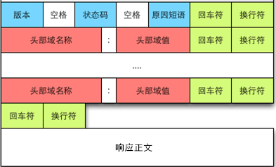

# 网络请求最佳实践


## 问题 1： 错误处理

切入点，使用 Single 的时候，发现原有的错误处理复用不了。

### 现有代码

1. 处理错误的形式多样，理解和使用都很容易迷惑。

> 第一种类型: ApiObserver 基类

覆写的 Observer 就又好几种，主要在 `com.fenbi.android.retrofit.observer` 目录下。

```Java
// ApiObserver
// ApiObserverNew

@Override
public void onNext(T t) {
    if (t instanceof Response) {
        int httpCode = ((Response)t).code();
        boolean isSucc = httpCode >= 200 && httpCode < 300;
        if (!isSucc) {
            onError(new HttpException((Response) t));
            return;
        }
    }

    if (t instanceof  BaseRsp) {
        BaseRsp baseRsp = (BaseRsp)t;
        if (!baseRsp.isSuccess()) {
            onError(new ApiRspContentException(baseRsp.getCode(), baseRsp.getMsg()));
            return;
        }
    }
    onSuccess(t);
    onFinish();
}
```
- RxJava 的五种观察者没有公共的观察者基类。当使用其他观察者如 `Single`, `Maybe` 等的时候，就不继承该基类。
    造成的结果就是：
    - 一是再写几个继承不同类型观察者的基类，这样就会造成类膨胀，继承体系庞大，感觉很繁杂。而且多处判断，代码重复，即便是将判断的逻辑抽出来，也要在多处多次调用。
    - 另外，继承没有强制性，如果不是靠经验，很容易忘记继承重写的基类。
    - 或者就只能使用 `Observer` 这样严重降低了 `RxJava` 的灵活性，后面会讲为什么灵活使用 `RxJava` 的不同观察者如此重要。

- 这种写法的问题是，每次都要继承与该基类。Java 是单继承的，如果有特殊的类已经继承了其类，那么就不能继承该类。

- 在 `Rxjava` 总写拦截错误处理，如果有不使用 RxJava 的情况，就需要再写一次错误拦截。

> 第二种类型：继承单独

各个地方单独判断。

```Java
One2OneKeApis.getInstance().getMyQuota(tiCourse)
        .subscribeOn(Schedulers.io())
        .observeOn(AndroidSchedulers.mainThread())
        .subscribe(new BaseObserver<BaseRsp<MyQuota>>() {
            @Override
            public void onNext(BaseRsp<MyQuota> rsp) {
                super.onNext(rsp);
                if (rsp != null && rsp.isSuccess()) {
                    render(rsp.getData());
                } else {
                    ToastUtils.showShort("加载失败");
                    finish();
                }
            }

            @Override
            public void onError(Throwable e) {
                super.onError(e);
                ToastUtils.showShort("加载失败");
                finish();
            }
        });
```

问题：

- 每个地方都写一次，模板代码太多。

- 错误结果判断和正常结果的执行混在一起，RxJava 的 `onError` 也有一处错误处理代码，分支不够清晰。

- 全靠编程人员的自我约束和测试，很容易忘记写判断代码。并且对于新上手项目的人，很容易再写几种不同的判断逻辑。


> 第三种: 在 RxJava 变换中

```Java
// SnapshotUploadUtils.java

.flatMap((Function<BaseRsp<SignInfo>, ObservableSource<String>>) signInfoBaseRsp -> {
    signInfoRef.set(signInfoBaseRsp);
    if (!signInfoBaseRsp.isSuccess()) {  // <---------
        IDebug.Instance.rd(TAG, "get sign error:" + signInfoBaseRsp.getCode());
        throw new RuntimeException("上传时获取签名失败 " + signInfoBaseRsp.getCode());
    }

    File file = destFileRef.get();
    if (!FileUtils.isFileExists(file)) {
        IDebug.Instance.rd(TAG, "视频不存在:");
        throw new RuntimeException("生成剪辑失败，请检查应用存储权限");
    }
    return RemoteUtils.uploadFile(file.getAbsolutePath(), signInfoRef.get().getData());
})
.flatMap((Function<String, ObservableSource<BaseRsp<Boolean>>>) cloudFileId ->
        ZixiKeApi.getInstance().setSnapshotInfo(zixiId, lessonId, signInfoRef.get().getData().getId(), cloudFileId)
)
// 超过 2 次或者因为签名获取失败不再重试上传
.retry(2, throwable -> enableRetry && (signInfoRef.get() == null || signInfoRef.get().isSuccess()))  // <------
```

### 网络错误的异常定义庞杂

Exception 类型太多，处理不清楚用哪一个，每个人，每个包里都要自己独特的写法。

仅 Http 请求结果的 Exception 就有（还没看 network 包中的情况）：

```
// package com.fenbi.android.retrofit.exception;
ApiException
ApiRspContentException
ApiStatusException

// Retrofit 的异常
// package retrofit2
HttpException
```


### 网络请求的错误处理

#### 1. 首先理清现有网络框架的错误处理分支

``` 
OkHttp         <----------  失败重连，重定向跟踪。Auth 认证重试
  |
  |   -------------------┐  
  |                      |   
  |                      |
  |                      |
 onResponse             onFailure 超时，链接失败，抛出 IOException 等异常。      |
 (Response包含非          |
 200~300错误)             |
  |                      |
  ∨                      ∨
Retrofit   --------------┤    <--- Retrofit 主要处理请求参数，和返回数据的转换。错误处理没有任何改变。
  |                      |
  |                      |
(Response)               |
包含200~300错误         跟OkHttp 一样 
  |                      |
  ∨                      ∨
RxJava(AdapterFactory)---┤
  |                      |
(200 ~299 正常结果)       增加 非 200~ 299 的错误结果
  |                      |
  |                      |
(ResponseBody)           |
  |                      |
  ∨                      ∨ 
body 里加code 自己处理    错误处理逻辑。
```

希望做的的情况


1. 希望自己定义的的错误转台码判断和网络请求框架的 Http 响应码走一套逻辑。

2. 能在一处判断，不要有不同的分支

3. 对上层开发者透明，不用因为网络请求错误而单独继承或者调用函数判断。

0. 原有网络请求错误处理代码很多，一时修改不完。希望不影响旧接口，渐进式的过度。


```
    OkHttp/Retrofit/RxJava
             |
  ┌------判断响应码--------┐
  |                      |
 onRespons               |
 onSuccess            onFailure/OnError 
(只有200~299的正确结果)    |
  |                      |   
  |                      |
  ∨                      ∨
渲染逻辑               错误提示。
```


> Retrofit 虽然定义了 HttpException 用于承接错误响应码，但是并不会向外抛出，仅作从错误中恢复和 AdapterFactory 中的适配器中的错误处理。


- 自己处理，现有逻辑。问题上面已经说过。

- RxJava-Adapter，Convert 中处理，都有可能因为上层没有使用而导致代码失效。

- Retrofit 留给开发者的接口就之后 `Adapeter` 和 `Convertor`，这两个都不合适。

- 仅有 OkHttp 的拦截器成了唯一选项。


> 1. 添加拦截器


```Java
public final class ResponseStatusInterceptor implements Interceptor {
    public static final String CHECK_HTTP_RESPONSE_CODE = "Check-Http-Response-Code: true";
    private static final String CHECK_HEADER = "Check-Http-Response-Code";
    private static final Gson gson = new Gson();
    private final Charset UTF8 = StandardCharsets.UTF_8;
    @Override
    public Response intercept(Chain chain) throws IOException {
        Request request = chain.request();
        String value = request.headers().get(CHECK_HEADER);
        request = request.newBuilder().removeHeader(CHECK_HEADER).build();
        Response response =  chain.proceed(request);
        if ("true".equals(value)) {
            if (!response.isSuccessful()) {
                throw new ApiException(response.code(), response.message());
            }
            // Make sure the content is json.
            String contentType = response.headers().get("Content-Type");
            if (contentType != null && response.body() != null && contentType.contains("application/json")) {
//                JsonReader jsonReader = gson.newJsonReader(response.body().charStream());
                BaseRsp<Void> status = gson.fromJson(bodyContent(response.body()),new TypeToken<BaseRsp<Void>>() {}.getType());
                if (status != null && (status.getCode() != 1)) {
                    throw new ApiException(status.getCode(), status.getMsg() == null ? "" : status.getMsg());
                }
            }
        }
        return response;
    }


    protected String bodyContent(ResponseBody responseBody) throws IOException {
        if (responseBody == null) return null;

        long contentLength = responseBody.contentLength();
        BufferedSource source = responseBody.source();
        source.request(contentLength); // Buffer the entire body.
        Buffer buffer = source.getBuffer();

//        MediaType contentType = responseBody.contentType();
        if (contentLength != 0) {
            return buffer.clone().readString(UTF8);
        }
        return null;
    }
}
```
2. 将多余的 Exception 使用 `@Deprecated` 标记为废弃，同时添加文档提醒使用新的添加 header 的方式。


优化后的流程

```
OkHttp

  |
  |
拦截器拦截错误 ------------┒  
  |                      |   
  |                      |
  |                      |
（onResponse）          onFailure 超时，链接失败，抛出 IOException 等异常。200~300错误.
  |                      |
  ↓                      |
Retrofit                 |
  |                      |
  |                      |
(Response)   -------- onResponse   可能会增加一些 json 解析错误。
  |                      |
  ↓                      |
RxJava       -------- onError  可能会增加一些 UI 渲染，空指针错误
  |                      |    
  |                      |
  |                      |
(onNext/onSuccess)       |
  |                      |
  |                      |  
渲染 UI               错误处理逻辑。
```


***留下的问题：必须手动添加请求头，没有找到新定义接口就默认启动新的判断逻辑的方法。***


## 问题 2：线程调度

Retrofit 中已经添加了拦截器调度线程。但是当我使用 `Single` 作为接口的返回值得时候，发现网络请求并没有在后台线程中，而是在主线程。

发现拦截器里仅拦截了 `Observer`。 

```
RetrofitInterceptor IO2Main = new RetrofitInterceptor() {
    @Override
    public Object intercept(Object object) {
        if (object instanceof Observable) {
            return ((Observable) object)
                    .subscribeOn(Schedulers.io())
                    .observeOn(AndroidSchedulers.mainThread());
        }
        return object;
    }
};
```

而 RxJava 的 Single, Maybe... 虽然可以互转，但是他们没有定义公共的基类。是不同的流。


拦截器的添加很代码很疑惑

```Java
@SuppressWarnings("unchecked")
private <T> T createApi(final Retrofit retrofit, final Class<T> service) {
    if (retrofitInterceptor == RetrofitInterceptor.NOP) {
        return retrofit.create(service);
    }
    return (T) Proxy.newProxyInstance(service.getClassLoader(), new Class<?>[]{service},
            new InvocationHandler() {

                @Override
                public Object invoke(Object proxy, Method method, @Nullable Object[] args)
                        throws Throwable {
                    // If the method is a method from Object then defer to normal invocation.
                    if (method.getDeclaringClass() == Object.class) {
                        return method.invoke(this, args);
                    }
                    T serviceImpl = retrofit.create(service);
                    Object obj = method.invoke(serviceImpl, args);
                    return retrofitInterceptor.intercept(obj);
                }
            });
}
```

代码嵌套了两层动态代理，看代码很疑惑。就想能不能使用其它方式来加这个线程调度的代码。

- 首先想到了继承 `AdapterFactory`， 因为 Retrofit 提供的适配器就又默认可以调度到后台线程的代码 `RxJava2CallAdapterFactory.createWithScheduler(Schedulers.io())`。既然能设置后台线程，就能设置返回结果的观察者的线程。看代码.... 发现是 final 的，继承显然不可能了，Copy 修改一份，代码冗余。不能及时升级库使用新特性或者 bug 修复。

- 想到了 `addCallAdapterFactory`, `addXXX` 不就意味着可以添加多个吗？例如 `RecycleView.addItemDecoration`、`OkHpptBuiler.addInterceptor`。

- 如何添加？只有读源码。

```
Retrofit.CallAdapter<?, ?> nextCallAdapter(@Nullable CallAdapter.Factory skipPast, Type returnType, Annotation[] annotations)
```

```
// ObserveOnMainCallAdapterFactory(val scheduler: Scheduler)
```

添加顺序有一定要求。

```
.addCallAdapterFactory(ObserveOnMainCallAdapterFactory(Schedulers.newThread()))
.addCallAdapterFactory(RxJava3CallAdapterFactory.createWithScheduler(Schedulers.io()))
```

### 最佳实践。

1. 仅保留对 Observer 的判断，其他 Single 等不处理。这样仅 Observer 会切换到主线程。其他都不会切换。这么做的原因：

    1. 网络请求必须在后台线程执行的，所以 RxJavaAdapter 中才默认有关于后台线程的程序。

    2. `onOnSubscribe` 操作符用的不多。但是请求后的变换却很常见，基本每个请求都会变换等操作符。希望这些操作也在后台执行，而不切换到 UI 线程。

    3. 网络请求中避免使用 Observer，取而代之使用 `Single`, `Maybe`, `Complateble`。 逐渐淘汰掉在拦截器中切换到前台的操作。


## 问题 3：自定义响应码

Http 协议中已经返回了响应码和响应信息。



请求提中又定义了一次

```
{
    "code":3,
    "msg":"Error",
    "data": null
}
```

增加了许多判断。

返回为 null 的情况处理。两种方法

1. 返回 Response.
```
@GET("test")
fun testResponseCode(): Single<Response<Void>>
```

2. 使用 `Complateable` 和 `Maybe` 处理。


