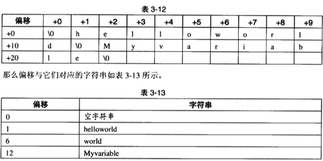

# ELF

一、为什么需要ELF(Executable and Linkable Format)文件格式

   现代操作系统提供了内存管理功能，为每个进程提供了独立的地址空间。每个程序独立占用完整的地址空间（每个程序都有地址 0 ~ 0xFFFF~，32位和 64 位地址空间不同），但是并不意味着其可以任意使用空间中的地址。

* 现代的系统为程序规定了代码区、数据区、堆、栈等区域，并且这些区域不一定是连续的。因此程序本身是多个片段。因此文件需要记录各个片段的类型、虚拟内存起始地址、长度。以及为了方便根据需要加载不同的段，需要记录各个端在文件中的位置。

* 对于如此多的运行任务，内存仍然是稀缺资源，为了高效使用内存，加载程序只会为程序占用的地址空间分配内存。因次需要知道哪些地址有数据，成块的数据被作为一个段。

* 现代系统并不会一次性将程序加载到内存，而是访问到加载一页数据进内存（页大小由芯片设计和系统共同决定，例如 X86 一般为 4KB），因次需要根据虚拟地址快速在文件中定位数据。

* 现代系统的可执行文件还有共享库，这些程序能够被多个程序使用，但是在内存中仅存在一份数据，由于动态加载，程序无法将块区域留给固定的库，因此共享库在不同程序中的虚拟地址也是不同的。


基于以上的原因，elf 被设计出来，最核心的思想就是分段、即记录程序中数据的块。包括各段的类型、起始地址、长度、在文件中的位置等信息。

编译后的现代程序是会根据不同类型的数据将程序放入不同的段内，这样做有很多优点，可以更好的利用计算机体系结构让程序执行获得更好的性能、也能方便对编译的中间过程进行加工、对结果输出进行组合，对位置重新布局。现代操作系统使用了不同格式的文件存放可执行文件，但都是分段的。GNU Linux 使用 ELF 文件来存储可执行文件。ELF 中每个块被称为 Section，每个 Section 至少包含两个信息：名字、大小。一般名字和大小是编译器和连接器根据操作系统的约定和程序大小确定的。

## ELF 的历史

Unix 最早的可执行文件格式为 a.out 格式，它的设计非常地简单，以至于后来共享库这个概念出现的时候，a.out 格式就变得捉襟见肘了。于是人们设计了 COFF 格式来解决这些问题，COFF 是由 Unix System V Release3 首先提出并且使用的格式规范。现在 PC 平台流行的可执行文件格式(Executable)主要是 Windows 下的 PE(Portable Executable)和 Linux的 ELF(ExecutableLinkableFormat)，以及 Mac OS 的 Mach-O，它们都是 COFF(Commonfileformat)格式的变种。这也就是为什么目前 PE 和 ELF 如此相似的原因，因为它们都是源于同一种可执行文件格式COFF。

20 世纪 90年代，一些厂商联合成立了一个委员会，起草并发布了一个 ELF 文件格式标准供公开使用，并且希望所有人能够遵循这项标准并且从中获益。1993年，委员会发布了ELF文件标准。当时参与该委员会的有来自于编译器的厂商，如Watcom和Borland:来自CPU的厂商如IBM和Intel:来自操作系统的厂商如 IBM 和 Microsoft。1995年，委员会发布了 ELF1.2 标准，自此委员会完成了自己的使命，不久就解散了。所以ELF文件格式标准的最新版本为 1.2。 System V Release 4 首次引入了 ELF 格式，目前流行的 Linux 系统也以 ELF 作为基本可执行文件格式。


## ELF 的种类

ELF 文件标准把系统中采用 ELF 格式的文档分为 4 类：

1. 可重定位文件（Relocatable File），可以被连接器用于链接成可执行程序或共享库。静态链接库也属于这种。

2. 可执行文件(Executable File)。 

3. 共享目标文件(Shared Object File): 共享文件有两种应用。一种时链接器可以将这种文件和其它可重定位文件和共享目标文件链接成新的目标文件；另一种是动态链接库可以将其与可执行文件结合，作为进程映像的一部分来运行。

4. 核心转储文件（Core Dump File）: 当进程意外终止时，系统可以将进程地址空间的内容及进程终止的一些其它信息转储到核心转出文件。例如 Linux 下的 core dump.

静态库稍有不同，它是把很多目标文件捆绑在一起形成一个文件，再加上一些索引。它本质上是一个归档文件(archive），包含了多个目标文件（.o文件）的集合。但是查看和操作 ELF 文件的工具基本在静态库上也可以使用。

`file` 命令可以查看 ELF 的应用类型。

## ELF 的结构

ELF 文件由 3 大部分组成: ELF 文件头、Section、Tables。

```
+---------------+
|  ELF Header   | ---------> Header
+---------------+
|    Section    | ---------> Section
|     ...       |
+---------------+
| Section Header|
| Table         | ---------> Table
|      ...      |
+---------------+
```


## ELF 文件头

readelf 和 objdump 是查看 ELF 文件最常使用的指令，readelf 主要用于查看目标文件的文件信息、header 和 section 信息。objdump 常用于查看目标文件的数据内容、反汇编等。objcopy 则用于将数据拷贝到或拷贝出目标文件。

### 查看

可以使用如下命令查看 elf 文件的 Header

```
$ llvm-readelf -h testelf.o
ELF Header:
  Magic:   7f 45 4c 46 02 01 01 00 00 00 00 00 00 00 00 00
  Class:                             ELF64
  Data:                              2's complement, little endian
  Version:                           1 (current)
  OS/ABI:                            UNIX - System V
  ABI Version:                       0
  Type:                              REL (Relocatable file)
  Machine:                           AArch64
  Version:                           0x1
  Entry point address:               0x0
  Start of program headers:          0 (bytes into file)
  Start of section headers:          1280 (bytes into file)
  Flags:                             0x0
  Size of this header:               64 (bytes)
  Size of program headers:           0 (bytes)
  Number of program headers:         0
  Size of section headers:           64 (bytes)
  Number of section headers:         13
  Section header string table index: 1
```

Linux 上 ELF 文件的数据结构定义在 `/usr/include/elf.h` 中，Elf64_Ehdr 和 Elf32_Ehdr 分别是 64 和 32 位目标文件的 Header 数据结构定义。它们的顺序完全相同，只有 e_entry、e_phoff 和 e_shoff 三项表示地址和偏移的，在32位下是4字节，64位下是8字节。这个对elf文件整体信息的描述，在32位系统下是52字节，在64位系统下是64个字节。以 64 为为例，其结构为：
```
typedef struct {
    unsigned char e_ident[EI_NIDENT]; /* Magic number and other info */
    Elf64_Half  e_type;         /* Object file type */
    Elf64_Half  e_machine;      /* Architecture */
    Elf64_Word  e_version;      /* Object file version */
    Elf64_Addr  e_entry;        /* Entry point virtual address */
    Elf64_Off   e_phoff;        /* Program header table file offset */
    Elf64_Off   e_shoff;        /* Section header table file offset */
    Elf64_Word  e_flags;        /* Processor-specific flags */
    Elf64_Half  e_ehsize;       /* ELF header size in bytes */
    Elf64_Half  e_phentsize;    /* Program header table entry size */
    Elf64_Half  e_phnum;        /* Program header table entry count */
    Elf64_Half  e_shentsize;    /* Section header table entry size */
    Elf64_Half  e_shnum;        /* Section header table entry count */
    Elf64_Half  e_shstrndx;     /* Section header string table index */
} Elf64_Ehdr;
```


指令输出内容和结构体的对应关系为

| 成员         | 长度（字节）| readelf 输出结果与含义            |
| ----------- | --- | ------------------------------------- |
| e_ident     | 16  | 用于标识(identification) ELF 文件，包括：Magic、Class、字节序、ELF 的版本。其余保留 |
| e_type      | 2   | 1 可重定位文件；2 可执行文件；3 共享目标文件。 elf.h 中 ET_ 开头的宏|
| e_machine   | 2   | 硬件类型，如 AARCH64 定义为 EM_AARCH64 183。elf.h 中 EM_ 开头的宏|
| e_version   | 4   | ELF版本号。一般为常数 1（为什么 e_ident 也有版本？） |
| e_entry     | 4/8 | 程序的入口虚拟地址                        |
| e_phoff     | 4/8 | Start of program headers，这个暂时不关心，请参考后面的“ELF链接视图和执行视图” 一节 |
| e_shoff     | 4/8 | 段表在文件中的偏移字节。 |
| e_flags     | 4   | ELF 标志位，用来标识一些 ELF 文件平台相关的属性。相关常量的格式一般为 EF_machine_flag, machinc为平台，flag为标志。|
| e_ehsize    | 2   | ELF 文件头本身的大小。 |
| e_phentsize | 2   | Size of program headers。ELF链接视图和执行视图 |
| e_phnum     | 2   | Number of program headers: ELF链接视图和执行视图|
| e_shentsize | 2   | 段表描述符的大小，这个一般等于 sizeof(Elf32_Shdr)。具体参照“段表”一节|
| e_shnum     | 2   | 段表描述符数量。这个值等于ELF 文件中拥有的段的数量。 |
| e_shstrndx  | 2   | Section header string table index。段表字符串表所在的段在段表中的下标。|

说明：

- e_ident：16个字节
    - 魔数：4字节。第一个字节对应ASCII字符里面的DEL控制符，后面3 个字节刚好是ELF这3 个字 母的ASCII码。
    - 32/64位类型：1 字节，也是**靠这一字节来确定要读取 32 位的文件头还是 64 位文件头。**
        - 0 无效文件
        - 1 32位ELF文件
        - 2 64位ELF文件
    - 字节序：1字节。0 无效格式；1 小端格式；2 大端格式；
    - ELF 主版本号：1 字节。一般是 1，因为ELF标准自1.2版以后就再也没有 更新了
    - 其它：ELF标准没有定义，一般填 0，有些平台会使用这 9 个字节作为扩展标志。上面 `readelf -h` 中的 `OS/ABI` 和 `ABI Version` 就是 Linux 平台的扩展。OS/ABI 的具体值由 `ELFOSABI_` 开头的宏定义。
  
## Sections

**`COFF`文件最突出的贡献就是引入了段，不同类型的应用可以根据需要使用不同的段、并且可以根据需要进行扩展。**这个设计非常通用，以至于 COFF 的继承者到目前还在被广泛地使用。

目标文件中的内容至少有编译后的机器指令代码、数据。除了这些内容以外，目标文件中还包括了链接时所须要的一些信息，比如符号表、调试信息、字 符串等。一般目标文件将这些信息按不问的属性，以 “节”(Section)的形式存储，有时候也叫“段”(Segment)，一般情况下，它们都表示一个一定长度的区域，基本上不加以区别，唯一的区别是在 ELF 的链接视图和装载视图的时候，后面会专门提到。在本书中，默认情况下统一将它们称为“段”。


### 段表（Section Header Table）

段内保存的是实际的数据，这些段还有其它一些属性，例如每个段的段名、段的长度、在文件中的偏移、读写权限及段的其 他属性。因需要段表来对实际的段进行表述，在上面的 `ELF Header` 中也没有段的信息，而是段表。`e_sh` (Elf Section Header)开头的几个属性是段表相关的属性：

- e_shoff:      段表在文件中的偏移字节。
- e_shentsize:  段表描述符的大小，这个一般等于 sizeof(Elf32_Shdr)。
- e_shnum:      段表描述符数量。这个值就是 ELF 文件中拥有的段的数量。
- e_shstrndx:   Section header string table index。段表字符串表所在的段在段表中的下标。

通过 `e_shoff` 我们知道段表其实并不是紧挨在 ELF 的文件头后面，反而在文件的最后面。每个 Section Header 都是固定的大小：e_shentsize，数量为 e_shnum。

我们可以使用 `readelf -S` 查看 ELF 的段表：
```C
int printf(const char *format, ...);

int global_init_var = 84;
int global_uninit_var;

void func1(int i) { printf("%d\n", i); }

int main(void) {
  static int static_var = 85;
  static int static_var2;

  int a = 1;
  int b;
  func1(static_var + static_var2 + a + b);
  return a;
}
```
```shell
$ clang -c testelf.c -o testelf.o
$ llvm-readelf -S testelf.o
There are 13 section headers, starting at offset 0x500:

Section Headers:
  [Nr] Name              Type            Address          Off    Size   ES Flg Lk Inf Al
  [ 0]                   NULL            0000000000000000 000000 000000 00      0   0  0
  [ 1] .strtab           STRTAB          0000000000000000 000414 0000e9 00      0   0  1
  [ 2] .text             PROGBITS        0000000000000000 000040 00007c 00  AX  0   0  4
  [ 3] .rela.text        RELA            0000000000000000 000320 0000c0 18   I 12   2  8
  [ 4] .data             PROGBITS        0000000000000000 0000bc 000008 00  WA  0   0  4
  [ 5] .rodata.str1.1    PROGBITS        0000000000000000 0000c4 000004 01 AMS  0   0  1
  [ 6] .bss              NOBITS          0000000000000000 0000c8 000008 00  WA  0   0  4
  [ 7] .comment          PROGBITS        0000000000000000 0000c8 000022 01  MS  0   0  1
  [ 8] .note.GNU-stack   PROGBITS        0000000000000000 0000ea 000000 00      0   0  1
  [ 9] .eh_frame         PROGBITS        0000000000000000 0000f0 000068 00   A  0   0  8
  [10] .rela.eh_frame    RELA            0000000000000000 0003e0 000030 18   I 12   9  8
  [11] .llvm_addrsig     LLVM_ADDRSIG    0000000000000000 000410 000004 00   E 12   0  1
  [12] .symtab           SYMTAB          0000000000000000 000158 0001c8 18      1  14  8
Key to Flags:
  W (write), A (alloc), X (execute), M (merge), S (strings), I (info),
  L (link order), O (extra OS processing required), G (group), T (TLS),
  C (compressed), x (unknown), o (OS specific), E (exclude),
  R (retain), p (processor specific)

Section Headers:
  [Nr] Name              Type            Address          Off    Size   ES Flg Lk Inf Al
  [ 0]                   NULL            0000000000000000 000000 000000 00      0   0  0
  [ 1] .text             PROGBITS        0000000000000000 000040 000074 00  AX  0   0  4
  [ 2] .rela.text        RELA            0000000000000000 0003a0 0000c0 18   I 10   1  8
  [ 3] .data             PROGBITS        0000000000000000 0000b4 000008 00  WA  0   0  4
  [ 4] .bss              NOBITS          0000000000000000 0000bc 000008 00  WA  0   0  4
  [ 5] .rodata           PROGBITS        0000000000000000 0000c0 000004 00   A  0   0  8
  [ 6] .comment          PROGBITS        0000000000000000 0000c4 000026 01  MS  0   0  1
  [ 7] .note.GNU-stack   PROGBITS        0000000000000000 0000ea 000000 00      0   0  1
  [ 8] .eh_frame         PROGBITS        0000000000000000 0000f0 000058 00   A  0   0  8
  [ 9] .rela.eh_frame    RELA            0000000000000000 000460 000030 18   I 10   8  8
  [10] .symtab           SYMTAB          0000000000000000 000148 0001f8 18     11  16  8
  [11] .strtab           STRTAB          0000000000000000 000340 000060 00      0   0  1
  [12] .shstrtab         STRTAB          0000000000000000 000490 000061 00      0   0  1
```

- ES：Entry's size（条目大小）。表示动态节条目的大小。
- Flg：Flags（标志）。表示条目的特定属性或状态，Key to Flags 说明了各个字符代表的含义。
- Lk：Linkage（链接）。对于需要重定位或需要符号解析的条目，这表示链接到哪个其他条目或段。
- Inf：Info/Version（信息/版本）。对于某些条目，这可以包含额外的信息或版本号。
- Al：Alignment（对齐）。表示条目的对齐要求。

Section Header 是 "Elf64_Shdr" 或 “Elf32_Shdr” 结构体为元素的数组。 对于 testelf.o 来说，段表就是有12 个元素的数组。ELF 段表的这个数组的第一个元素是无效的段描述符，它的类型为 “NULL”，除此之外每个段描述符都对应一个段。也就是说 testelf.o 共有11个有效的段。

| 属性           | 字节 |  作用  |
| ------------- | ---- | ----- |
| sh_name;      |  4   | 段名，这里存放的是一个偏移，它位于一个叫做“.shstrtab” 的字符串表。|
| sh_type;      |  4   | Section type                       |
| sh_flags;     | 4/8  | Section flags                      |
| sh_addr;      | 4/8  | 如果该段可以被加载，则为该段被加载后在进程地址空间中的虚拟地址; 否则为0  |
| sh_offset;    | 4/8  | 如果该段存在于文件中，则表示该段在文件中的偏移;否则无意义。比如 sh_offset 对于BSS 段来说就没有意义 |
| sh_size;      | 4/8  | Section size in bytes              |
| sh_link;      | 4/4  | Link to another section            |
| sh_info;      | 4/4  | Additional section information     |
| sh_addralign; | 4/8  | 段的对齐字节，存放的是 2 的指数， 例如 3 表示对齐为 8 字节 |
| sh_entsize;   | 4/8  | 有些段包含了一些固定大小的项，比如符号表，它包含的每个符号所占的大小都是一样的。对于这种段，sh_entsize 表示每个项的大小。如果为 O，则表示该段不包含固定大小的项 |

说明：
- “objdump -h” 命令只是把 ELF 文件中关键的段显示了出来，而省略了其他的辅助性的段，比如: 符号表、字符串表、段名字符串表、 重定位表等。我们可以使用 readelf 工具来查看 ELF 文件的段，它显示出来的结果才是全部的段表结构

- 段的名字对于编译器、链接器来说是有意义，但是对于操作系统来说并没有实质的意义，对于操作系统来说，一个段该如何处理取决于它的属性和权限，即由段的类型和段的标志位这两个成员决定.

- sh_type：段的名字主要在编译和链接过程中使用。而程序加载到内存执行时，决定段的属性的是段的类型(sh_type)和段的标志位(sh_flags)。段的类型相 关常量以SHT_开头。

    | 常量         | 值  |  含义    |
    | ----------- | --- | ------- |
    | SHT_NULL    | 0   | 无效段    |
    | SHT_PROGBITS| 1   | 程序段。代码段、数据段都是这种类型的  |
    | SHT_SYMTAB  | 2   | 表示该段的内容为符号表    |
    | SHT_STRTAB  | 3   | 表示该段的内容为字符串表  |
    | SHT_RELA    | 4   | 重定位表。该段包含了重定位信息，具体参考 “ 静态地址决议 和重定位” 这一节  |
    | SHT_HASH    | 5   | 符号表的哈希表。见“符号表” 这一节     |
    | SHT_DYNAMIC | 6   | 动 态 链 接 信 息 具 体 见 “ 动 态 链 接 ” 一章   |
    | SHT_NOTE    | 7   | 提示性信息    |
    | SHT_NOBITS  | 8   | 表示该段在文件中没内容，比如.bss 段   |
    | SHT_REL     | 9   | 该段包含了重定位信息，具体参考 “静态地址决议和重定位” 这 一节     |
    | SHT_SHLI    | 10  | 保留  |
    | SHT_DNYSYM  | 11  | 动态链接的符号表。具体见“动态链接”一章    |

- 段的标志位(sh_flag)：段的标志位表示该段在进程虚拟地址空间中的属性，比如是否可写，是否可执行等。相关常量以 SHF_ 开头

    | 常量          | 值    | 含义  |
    | ------------ | ----- | ----- |
    | SHF_WRITE    | 1     | 表示该段在进程空间中可写 |
    | SHF_ALLOC    | 2     | 表示该段在进程空间中须要分配空间。有些包含指示或控制信息的段不须要在进程空间中被分配空间，它们一般不会有 这个标志。像代码段、数据段和.bss 段都会有这个标志位 |
    | SHF_EXECINSTR| 4     | 表示该段在进程空间中可以被执行，一般指代码段 |
    一个 section 可被标记为 “loadable(可加载的)” 或 “allocatable(可分配的)”.
    loadable section: 在输出文件运行时, 相应的 section 内容将被载入进程地址空间中.
    allocatable section: 内容为空，运行时才在内存中分配，并初始化为 0。用于全局变量存放。

- 段名：以 `.` 作为前缀的名字是系统保留的，应用程序可以使用一些非系统保留的名字自定义段的段名。还有 些保留的段名是因为ELF文件历史遗留问题造成的，以前用过的一些名字如.sdata、idese、.sbss、.lit4、.lit8、.reginfo、.gptab、.liblist、.conflict。可以不用理会这些段，它们已经被遗弃了。

    | 常用的段名  |  说明 |
    | --------- | ----- |
    | .text     | 代码段 |
    | .data     | 数据段 |
    | .bss      | 未初始化字段 |
    | .rodata </br> .rodata1 | ReadonlyData ，这种段里存放的是只读数据，比如字符串常量、全局 const 变量。|
    | .comment  | 存放的是编译器版本信息，比如字符串:”GCC:(GNU)4.2.0" |
    | .debug    | 调试信息 |
    | .dynamic  | 动态链接信息 |
    | .hash     | 符号哈希表 |
    | .line     | 调试时的行号表，即源代码行号与编译后指令的对应表 |
    | .note     | 额外的编译器信息。比如程序的公司名、发布版本号等 |
    | .strtab   | StringTable.字符串表，用于存储ELF 文件中用到的各种字符串 |
    | .symtab   | SymbolTable. 符号表 |
    | .shstrtab | Section String Table. 段名表 |
    | .plt </br> .got | 动态链接的跳转表和全局入口表 |
    | .init </br> .fini : 程序初始化与终结代码段。见“ C++全局构造与析构” 一节 |

### Section

这里我们会对最普通的 `.data`、`.text`，`.bss`，以及字符串表做一个简单的查看，`.rel.XXX` 


1. 查看某个段的内容 readelf 或者 objdump 都可以


```shell
$ llvm-readelf -x .data testelf.o
Hex dump of section '.data':
0x00000000 54000000 55000000                   T...U...


$ llvm-objdump  -s -j .data testelf.o

testelf.o:	file format elf64-littleaarch64
Contents of section .data:
 0000 54000000 55000000                    T...U...
```

#### 1. 代码段

可以使 objdump 添加 `-d` 参数来查看代码段，并对代码段进行反汇编。

```shell
$ llvm-objdump-16 -d -j .text testelf.o

testelf.o:	file format elf64-littleaarch64

Disassembly of section .text:

0000000000000000 <func1>:
       0: d10083ff     	sub	sp, sp, #0x20
       4: a9017bfd     	stp	x29, x30, [sp, #0x10]
       8: 910043fd     	add	x29, sp, #0x10
       c: b81fc3a0     	stur	w0, [x29, #-0x4]
      10: b85fc3a1     	ldur	w1, [x29, #-0x4]
      14: 90000000     	adrp	x0, 0x0 <func1>
      18: 91000000     	add	x0, x0, #0x0
      1c: 94000000     	bl	0x1c <func1+0x1c>
      20: a9417bfd     	ldp	x29, x30, [sp, #0x10]
      24: 910083ff     	add	sp, sp, #0x20
      28: d65f03c0     	ret

000000000000002c <main>:
      2c: d10083ff     	sub	sp, sp, #0x20
      30: a9017bfd     	stp	x29, x30, [sp, #0x10]
      34: 910043fd     	add	x29, sp, #0x10
      38: b81fc3bf     	stur	wzr, [x29, #-0x4]
      3c: 52800028     	mov	w8, #0x1
      40: b9000be8     	str	w8, [sp, #0x8]
      44: 90000008     	adrp	x8, 0x0 <func1>
      48: b9400108     	ldr	w8, [x8]
      4c: 90000009     	adrp	x9, 0x0 <func1>
      50: b9400129     	ldr	w9, [x9]
      54: 0b090108     	add	w8, w8, w9
      58: b9400be9     	ldr	w9, [sp, #0x8]
      5c: 0b090108     	add	w8, w8, w9
      60: b94007e9     	ldr	w9, [sp, #0x4]
      64: 0b090100     	add	w0, w8, w9
      68: 94000000     	bl	0x68 <main+0x3c>
      6c: b9400be0     	ldr	w0, [sp, #0x8]
      70: a9417bfd     	ldp	x29, x30, [sp, #0x10]
      74: 910083ff     	add	sp, sp, #0x20
      78: d65f03c0     	ret
```

#### BSS 段

`.bss` （Block Started by Symbol）段存放的是未初始化的全局变量和局部静态(static)变量。这些变量因为没有初始化，默认初始化时全部为0，不需要存放其值，只需要保存需要的空间大小即可。因此 `.bss` 段 Section Header 的 `Type` 为 `NOBITS`，而 size 为 8 表示加载到内存的时候需要 8 字节。 


#### 字符串表

ELF 文件中用到了很多字符串，比如段名、变量名等。因为字符串的长度往往是不定的， 所以用周定的结构来表示它比较困难。一种很常见的做法是把字符串集中起来存放到一个表，然后使用字符串在表中的偏移来引用字符串，字符串以`\0`作为结束符 。比如表3-12 这个字符串表。



通过这种方法，在ELF文件中引用字符串只须给出 一个数字下标即可，不用考虑字符 串长度的问题。 一般字符串表在ELF文件中也以段的形式保存，常见的段名为 “.strtab” 或 “.shstrtab”。这两个字符串表分别为字符串表(String Table)和段表字符串表(Section Header String Table)。顾名思义，字符串表用来保存普通的字符串，比如符号的名字。段表字符串表用来保存段表中用到的字符串，最常见的就是段名(sh_name)。

**GNU 的编译器使用 “.shstrtab” 存放段表的字符串。LLVM 则全部放在了 ".strtab" 中。** 那他们是如何确定是哪个段的呢？回到 ELF 文件头中的 `e_shstrndx` 字段，指示了 Section Header Table 的索引。其值为 1，Section Header table 索引为 1 的 Section Header 就是 `.strtab` 段的 Section Header。然后 Section Header 中的 `sh_name` 字段就是存储的这个段中的字节偏移量。

例如 text 段 Section Header 的 sh_name 为 6. 查看下 `.strtab` 的内容：

```shell
$ llvm-readelf -x .strtab testelf.o
Hex dump of section '.strtab':
0x00000000 002e7265 6c612e74 65787400 2e636f6d ..rela.text..com
0x00000010 6d656e74 002e6273 7300676c 6f62616c ment..bss.global
0x00000020 5f756e69 6e69745f 76617200 676c6f62 _uninit_var.glob
0x00000030 616c5f69 6e69745f 76617200 6d61696e al_init_var.main
```
可以看到偏移量为 6 开始的字符串就是 `.text`。另一个有意思的点是 `.rela.text` 的 `sh_name` 为 1, `.rela.text` 段和 `.text` 段的段名的复用了 `.text` 字符串。

## 链接


### 符号

符号(symbol): 每个目标文件都有符号表(SYMBOL TABLE), 包含已定义的符号(对应全局变量和static变量和定义的函数的名字)和未定义符号(未定义的函数的名字和引用但没定义的符号)信息.

符号值: 每个符号对应一个地址, 即符号值(这与c程序内变量的值不一样, 某种情况下可以把它看成变量的地址). 可用nm命令查看它们. 


## 2. Program header table

这个表是加载指示器，操作系统（确切的说是加载器，有些elf文件，比如操作系统内核，是由其他程序加载的）,该表的结构非常重要。

```
typedef struct
{
  Elf64_Word     p_type;         /* Segment type */
  Elf64_Word     p_flags;        /* Segment flags */  /*segment权限，6表示可读写，5表示可读可执行
  Elf64_Off      p_offset;       /* Segment file offset */     /*段在文件中的偏移*/
  Elf64_Addr     p_vaddr;        /* Segment virtual address */   /*虚拟内存地址，这个表示内存中的
  Elf64_Addr     p_paddr;        /* Segment physical address  /*物理内存地址，对应用程序来说，这个字段无用*/
  Elf64_Xword    p_filesz;       /* Segment size in file */        /*段在文件中的长度*/
  Elf64_Xword    p_memsz;        /* Segment size in memory */       /在内存中的长度，一般和p_filesz的值一样*/
  Elf64_Xword    p_align;        /* Segment alignment */                  /* 段对齐*/
} Elf64_Phdr;   
```


## 静态链接

我们注意到，SimpleSection.o中有 一个叫做“rel.lext”的段，它的类型(sh_type)为 “SHT_REL”，也就是说它是一个重定位表(Relocation Table)。正如我们最开始所说的， 链接器在处理目标文件时，须要对目标文件中某些部位进行重定位，即代码段和数据段中那 些对绝对地址的引用的位置。这些重定位的信息都记录在ELF 文件的重定位表里面，对于 每个须要重定位的代码段或数据段，都会有一个相应的重定位表。比如SimpleSection.o 中 的 “.rel.text”就是针对“text”段的重定位表，因为“，text”段中至少有一个绝对地址的引用，那就是对“printf”函数的调用:而“.data”段则没有对绝对地址的引用，它只包含了几个常量，所以SimpleSection.o中没有针对“data”段的重定位表“.rel.data”。

一个重定位表同时也是ELF的一个段，那么这个段的类型(sh_type)就是“SHT_REL”类型的。它的“sh_link”表示符号表的下标，它的“sh_info”表示它作用于哪个段。比如“.rel.tex"作用了“text”段，而“，tex:”段的下标为“1”，那么“rel.lex.”的“sh_info”为“1”。


对于可执行文件来说，最主要的就是数据段和代码段


每个“可加载的”或“可分配的”输出section通常包含两个地址: VMA(virtual memory address 虚拟内存地址或程序地址空间地址)和LMA(load memory address 加载内存地址或物理内存地址). 通常VMA和LMA是相同的.

但在嵌入式系统中, 经常存在加载地址和执行地址不同的情况: 比如将输出文件加载到开发板的flash中(由LMA指定), 而在运行时将位于flash中的输出文件复制到SDRAM中(由VMA指定).
