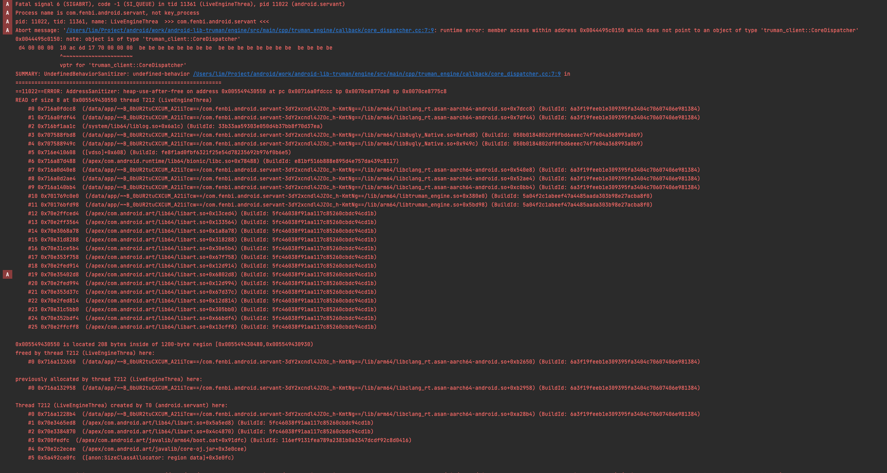

# 应用层调试

调试、追踪、分析

1. 开发后检测
2. 线上监控
3. 定位问题、解决

## 2. 检测工具

通过检测工具提前发现错误。

### 内存

- HWASan/ASan: 内存泄露。On arm64 we recommend using HWASan, while for 32-bit arm and for non-Arm platforms we recommend using ASan. They provide equivalent functionality and should be used for detecting memory safety bugs in userspace code.
    - 堆栈和堆缓冲区上溢/下溢
    - 释放之后的堆使用情况
    - 超出范围的堆栈使用情况
    - 重复释放/错误释放
- GWP-ASan: `释放后使用` 和 `堆缓冲区溢出` 错误。只能检测到 ASan 的子集，但是因为 GWP-ASan 不会显著降低性能，因此适合在生产环境用使用，而 HWAsan 则仅在测试环境中使用。
    - https://llvm.org/docs/GwpAsan.html
    - https://developer.android.com/ndk/guides/gwp-asan
    - https://source.android.com/docs/security/test/memory-safety/gwp-asan-kfence 在系统进程或应用启动时，随机会有 1% 的系统进程或应用会启用 GWP-ASan。此外，在 AndroidManifest.xml 文件中设置 android:gwpAsanMode 的应用也会启用 GWP-ASan。

- UBSan：许多未定义行为的检查。`数组边界检查`。
    - https://source.android.com/docs/security/test/bounds-sanitizer
    - https://clang.llvm.org/docs/UndefinedBehaviorSanitizer.html

- KAsan: HWASan/ASan 对应的内核调试实现
- KFENCE: GWP-ASan 对应的内核检测工具。
- MTE: ArmV9 才支持，HWAsan 的硬件实现。

#### Address Sanitizer (HWASan/ASan)
HWAddress Sanitizer (HWASan) and Address Sanitizer (ASan) are similar to Valgrind, but significantly faster and much better supported on Android.

These are your best option for debugging memory errors on Android.

TODO: 查看 Address Sanitizer 的崩溃报告

#### Malloc debug
See Malloc Debug and Native Memory Tracking using libc Callbacks for a thorough description of the C library's built-in options for debugging native memory issues.

#### Malloc hooks
If you want to build your own tools, Android's libc also supports intercepting all allocation/free calls that happen during program execution. See the malloc_hooks documentation for usage instructions.

#### Malloc statistics
Android supports the mallinfo(3) and malloc_info(3) extensions to <malloc.h>.

The malloc_info functionality is available in Android 6.0 (Marshmallow) and higher and its XML schema is documented in Bionic's malloc.h header.

### CPU

For CPU profiling of native code, you can use [Simpleperf](https://developer.android.com/ndk/guides/simpleperf).

## 线上监控/上报

tombstone 应用内上报：https://developer.android.com/ndk/guides/debug
- Maloc 分析
    - Malloc debug

    - Malloc hooks

    - Malloc statistics

- crashpad

## 定位问题

1. [日志](log.md) 在崩溃时记录信息：Crash dump or tombstone。以及程序主动打印的日志。

2. [崩溃报告](android_bugreport.md)

### 2. 调试工具

Android Studio 图形调试前端

[ndk-lldb 命令行调试](./lldb_debug/1.README.md)

或者可以在崩溃后使用 adb bugreport 将日志拉取到本地查看日志文件。

帮助工具：
ndk-stack

TODO:

setprop
getprop
watchprops
exploring system services with [dumpsys](https://developer.android.com/tools/dumpsys), 

Memory: https://source.android.com/docs/core/tests/debug/native-memory
Evaluating Performance: https://source.android.com/docs/core/tests/debug/eval_perf
Debug your app: https://developer.android.com/studio/debug/index

参考
平台崩溃调试：https://source.android.com/docs/core/tests/debug
    查看系统服务 dumpsys: https://developer.android.com/tools/dumpsys
    native-memory: https://source.android.com/docs/core/tests/debug/native-memory

应用调试和检测：https://developer.android.com/ndk/guides/debug

> Tombstome: 
When a dynamically linked executable starts, several signal handlers are registered that, in the event of a crash, cause a basic crash dump to be written to logcat and a more detailed tombstone file to be written to /data/tombstones/. The tombstone is a file with extra data about the crashed process. In particular, it contains stack traces for all the threads in the crashing process (not just the thread that caught the signal), a full memory map, and a list of all open file descriptors.

You can use the debuggerd tool to get a stack dump from a running process. From the command line, invoke debuggerd using a process ID (PID) to dump a full tombstone to stdout. To get just the stack for every thread in the process, include the -b or --backtrace flag.

> ANRs and deadlocks

 the system kills the process and dumps the stack to /data/anr. To discover the culprit behind an ANR, grep for am_anr in the binary event log.

You can often find stack traces that correspond to an ANR. Make sure the timestamp and PID on the VM traces match the ANR you are investigating, then check the main thread of the process. Keep in mind:

- The main thread tells you only what the thread was doing at the time of the ANR, which may or may not correspond to the true cause of the ANR. (The stack in the bug report may be innocent; something else may have been stuck for a long time—but not quite long enough to ANR—before becoming unstuck.)
- More than one set of stack traces (VM TRACES JUST NOW and VM TRACES AT LAST ANR) might exist. Make sure you are viewing the correct section.

> Finding deadlocks
Deadlocks often first appear as ANRs because threads are getting stuck. If the deadlock hits the system server, the watchdog will eventually kill it, leading to an entry in the log similar to: WATCHDOG KILLING SYSTEM PROCESS. From the user perspective, the device reboots, although technically this is a runtime restart rather than a true reboot.

- In a runtime restart, the system server dies and is restarted; the user sees the device return to the boot animation.
- In a reboot, the kernel has crashed; the user sees the device return to the Google boot logo.
To find deadlocks, check the VM traces sections for a pattern of thread A waiting on something held by thread B, which in turn is waiting on something held by thread A.

## 错误信息

错误信息包含三部分：
- 错误信号
- 寄存器信息
- 方法调用栈

## 常见的错误

- 野指针
- 空指针
- 数组越界
- 堆栈溢出
- 内存泄漏
