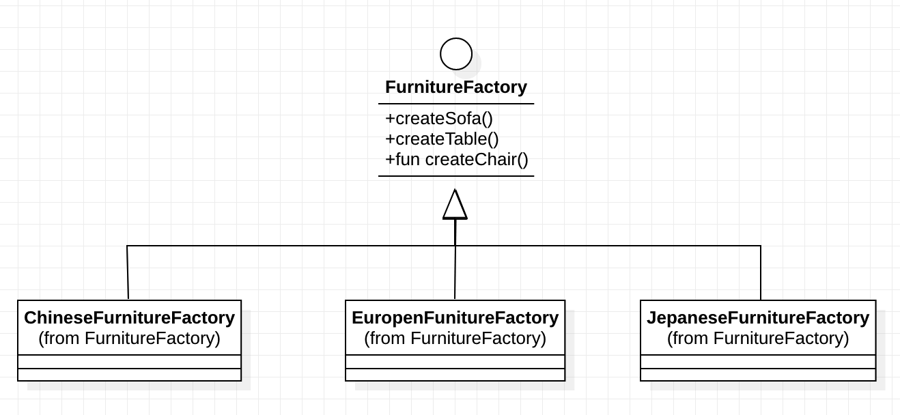

# Abstract Factory

要理解抽象工厂，需要先了解简单工厂，简单工厂并不能算一种设计模式，但是让它是另外两种模式：抽象工厂、工厂方法模式的基础。


所谓工厂，就是能够生产许多产品。映射到软件开发中，将对象比喻产品，在特殊的软件中，也确实有不同类型的产品对象，将软件开发中将产品广义化，可以被其它重复创建出来的方式，就类似于工厂不断生产产品。例如，在一个家具软件中，我们可以 new 一个沙发，在不同的地方不停地 new 一个对象会使对象的创建遍布于各处。当然这是为了使用对象，在不同处获取是不可避免的。但是能不能使用其它方式来获取对象？—— `get 方法`。get 能够获取一个已经存在的对象，类似的，创建一个新对象就可以有一个 `createXXX` 方法。 根据单一责任原则，如果我们将这样一系列家具的创建都转移到一个类中，它就像一个工厂，能够生成不同种类的家具。

```Python
// 家具工厂
class FurnitureFactory:
    // 生产沙发
    fun createSofa() -> Sofa:
        return new Sofa()


    // 生产桌子
    fun createTable() -> Table:
        return new Table()

    
    // 生产椅子
    fun createChair() -> Chari:
        return new Chair()
```

然而简单的将这些创建代码移到别处，并没有什么实质性的改变，所以它并不算一种设计模式。


想象前面的家具工厂，由于效益良好，不断扩大规模，开办了不同的工厂，一个用于成产中国风家具，一个用于生产北欧风家具，一个用于生产日系家具。之所以把不同风格的产品在一个厂生产，而不是一个厂生产同一个家具的不同类型，例如椅子的中国风，北欧风，日系可能因为不同风格的家具的材料使用都很相似，靠近材料产地的工厂能够获得质量更好，价格便宜的材料，甚至成产工人对同一种风格的制作流程或技术能使成产更加高效。

为了更好服务客户，总公司主要来负责服务各个客户，当客户下单一套家具的时候，公司并不自己生产，而是根据客户定的家具风格，下发到相应的工厂负责来生产。

应用的面向对象的软件设计中，总公司映射成为一个工厂的接口，定义了生产不同家具的功能。而不同工厂类似于不同产品的抽象类的实现。



通过接口的引用，调用不同实例的工厂，就能生产不同种类的家具。

除了这些，同一种商品的不同风格，也要具有基础类，抽象工厂返回的是创建的虽然是不同的子类，但返回的却是它们的基类。这样客户调用的时候才能不关心具体的它调用的哪种类型的实现。而在工厂别切换为其它工厂时，客户端不用修改任何其他调用

抽象工厂旨在提供一个创建一系列相关或者相互依赖对象的接口，而不用关心哪些类是相互关联的。通过传入的不同工厂实现，创建的类一定是一套相互关联的对象。


### 缺点：

难以支持新种类的产品。这是因为 AbstractFActory 接口定义了可被创建的产品集合。支持新种类的产品就要扩展该工厂接口，这将涉及到 AbstractFactory 以及所有子类的改变。而且，产品也需要定义抽象产品和它的不同工厂的子类实现。

### 相关模式

AbstractFactory 类通常用工厂方法实现，但他们也可以用 Prototype 实现。

一个具体的工厂通常是一个单间。


