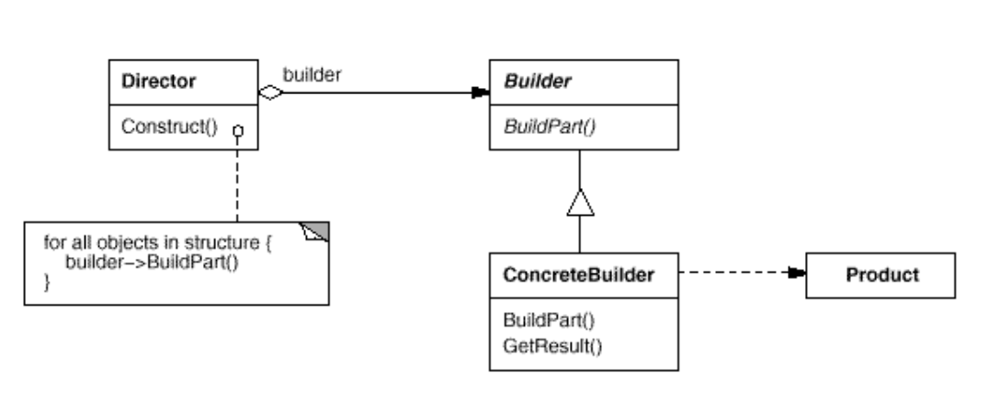

# 构建者/生成器（Builder）

## 目标

将复杂对象的构建过程和它的表示分离，使相同的构建过程能够创建不同的表示。

## 实现方式

有两种不同的实现方式

- 方式一：Builder 实现构建接口，具体的 Builder 通过实现不同，而创建不同的对象。

- 方式二：只有一个具体的 Builder，用于复杂对象的创建，构建的属性存贮在 Builder 中，直到构建时才一次性传给 Product。通常以 Product 内部类的形式出现。

方式二可以看做方式一的简化，当构建的产品只有一种，但是构建方式比较复杂时，就没有必要使用抽象接口，而直接使用 ConcreteBuilder 暴露给 Director。由于 仅有一个 Builder，  Directory 就没有就收不同 Builder 的需求。同时为了构建过程可以让 Client 任意组合，也可以省略，从而将构建接口直接暴露给 Client（此时 Client 就是 Director，构建过程任意组合，构建更加灵活了，产品夜可以根据需要而定制。）。 

- 方式二由于产品的建造是在最有一次性构造的，产品的属性可以定义为 final 的，以保证一个产品的不可变性。

- 方式二能够很好的处理产品构造必须依照某种步骤，而将这种步骤对于 Client 隐藏。而 方式一只能隐藏在 Direcotr 中。

## 适用性

以下情况使用构建者模式：

- 构建复杂对象的算法应该独立于对象的创建和组装方式时。

- 被构造对象的构建过程必须允许有不同形式的表示时。

## 结构

## 组成

- Builder: (TextConverter)

- ConcreteBuilder (ASCIIConverter, TeXConverter, TextWidgetConverter) 

- Director (RTFReader) 

- Product (ASCIIText, TeXText, TextWidget)

## 协作

- 客户端创建 Director 对象，并用它期望的 Builder 对象配置它。

- 每当需要产品的一部分需要被构建时，Director 就通知 Builder。

- Builder 根据 director 的指示给产品添加新的部分。

- 客户端从构建器检索产品

- 主要作用：在用户不知道对象的建造过程和细节的情况下就可以直接创建复杂的对象。

- 如何使用：用户只需要给出指定复杂对象的类型和内容，建造者模式负责按顺序创建复杂对象（把内部的建造过程和细节隐藏起来）

- 解决的问题：
（1）、方便用户创建复杂的对象（不需要知道实现过程）
（2）、代码复用性 & 封装性（将对象构建过程和细节进行封装 & 复用）

注意事项：与工厂模式的区别是：建造者模式更加关注与零件装配的顺序，一般用来创建更为复杂的对象

**通过这个例子，我们可以认识到，设计模式并不是一成不变的，可以根据实际的需求做出相应的调整。**