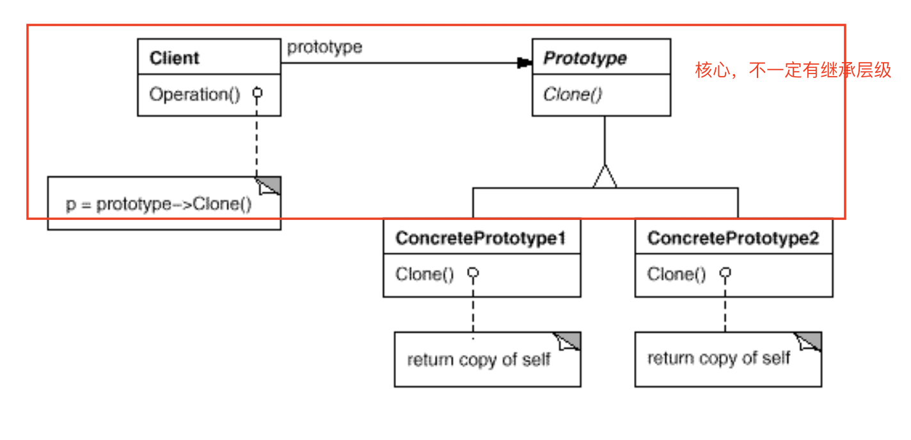

# Prototype

通过已有对象（原型对象）来指定要创建的对象类型，通过拷贝该原型来创建对象。

本质上讲，原型模式是一种复制，即根据现有对象，创建新的对象。通俗的将就像孙悟空的分身术，或者火影忍者的影分身。

目的：

1. 减少类的数量。「通过将相似类使用同一类。该论点存疑，这是类抽象的优点。如果几种类不能抽象为同一个类，那就不可能使用原型复制。」

## 应用场景

当一个系统应该和它的产品的创建、组装、表示分离时使用原型模式（跟抽象工厂、Builder 类似）。以及：

- 当类的实例化在运行时确定，例如动态加载。「创建」

- 避免创建跟对象层级结构一样的类层级结构。「就是减少类的论点，质疑。」

- 当对象仅由几种状态的组合。当通过几种原型的克隆和组装比每次都手工实例化类更方便时。

## 结构

**左侧即为目的系统，它不需要知道右侧的产品是如何创建的，只需要 `clone` 即可创建新对象。即实现了 `创建`、`组装`、`表示` 的分离。**

## 相关模式

Abstract Factory 和 Prototype 在某些方面是竞争的，但是也可以合作应用。竞争是他们都能用于创建对象。合作是，通常使用 Prototype 实现 Abstract Factory 来减少类的定义。

