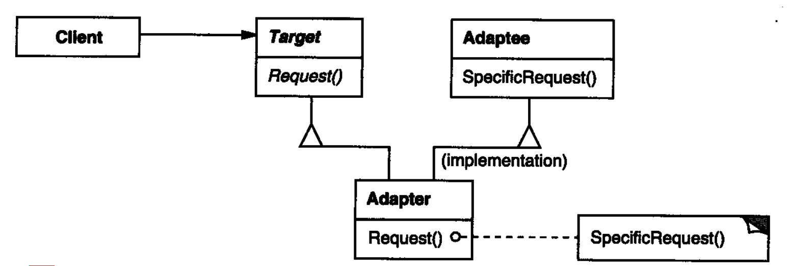
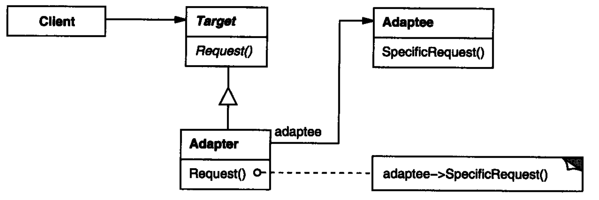

# Adapter(Wrapper)

## 意图

> 将一种类的接口转换成另一种客户端期望的接口，适配器使由于接口不兼容而无法一起工作的类能够协同工作①。

① 类的设计可能是有很多人独立完成的，或者是不同的组织来实现的。这些设计者在设计类时会处于不同的考虑对类的结构设计会不同，由于命名的随机性，对外呈现的命名和参数不同。这使得想要使用多态这种工作方式一起工作的设计不能很好的兼容（一个类的引用不能指向另一个没有继承关系的类，由于接口参数的不同，也不能使用统一的函数名在运行时来动态调用本类族函数或者其他类族函数（具有继承关系的一个类树，这里称为类族）。

Adapter 愿意就是转换器，例如家用电 220V, 手机充电口电压 5V, 手机充电器就是一种电压转换器。

适配器模式有两种实现：

- 类实现型方式：继承两种接口，内部实现调用。

- 对象型适配器：在 TextShape 中组合一个 TextView 实例，并根据 TextView 的接口实现 TextShape。此时的 `TextShape` 就是 `Adapter`, 而 `TextView` 是 `Adaptee`。

但是有很对语言不支持多继承，所以对象型适配器才是更灵活、通用的类型。

**容易误导的地方是一些常见的叫 XXXAdaper 的类，并不一定是 Adapter 模式。** Adapter 的核心是适配两中不同的接口。

## 动机 

有时，为复用而设计的工具箱类不能够被复用的原因仅仅是因为它的接口与专业应用领域所需要的接口不匹配。

【在安卓中，这个方式工作的并不明显。Android 中的适配器是希望将用户写的图形界面，通过适配器，能够被Android Framework 层的接口调用，从而进行显示。】

例如，有一个绘图编辑器，这个编辑器允许用户绘制和排列基本图元(线、多边型和正文等)生成图片和图表。这个绘图编辑器的关键抽象是图形对象。图形对象有一个可编辑的 形状，并可以绘制自身。图形对象的接口由一个称为 Shape 的 抽象类定义。绘图编辑器为每一种图形对象定义了一个 Shape 的子类: LineShape 类对应于直线， PolygonShape类对应于多边型，等等。

像 LineShape 和 PolygonShape这样的基本几何图形的类比较容易实现，这是由于它们的绘图和编辑功能本来就很有限。但是对于可以显示和编辑正文的 TextShape 子类来说，实现相当困难，因为即使是基本的正文编辑也要涉及到复杂的屏幕刷新和缓冲区管理。同时，成品的用户界面工具箱可能已经提供了一个复杂的 TextView 类用于显示和编辑正文。理想的情况是 我们可以复用这个 TextView 类以实现 TextShape 类，但是工具箱的设计者当时并没有考虑 Shape 的存在，因此 TextView 和 Shape 对象不能互换。

一个应用可能会有一些类具有不同的接口并且这些接口互不兼容，在这样的应用中象 TextView这样已经存在并且不相关的类如何协同工作呢?我们可以改变 TextView类使它兼容 Shape 类的接口，但前提是必须有这个工具箱的源代码。然而即使我们得到了这些源代码，修改 TextView 也是没有什么意义的;因为不应该仅仅为了实现一个应用，工具箱就不得不采用 一些与特定领域相关的接口。

## 应用

如下情况使用适配器：

- 想要使用已有的类，但是它的接口跟程序不匹配。

- 你想要创建一个复用的类将来和不相关或者不可预见的类协作。也就是说，那些类不一定有通用的接口。

- (仅使用对象适配器)你需要使用已有几个的几个子类，但是继承每一个类来适配接口显得不切实际。 对象适配器能够适配他们的父类的接口。

## 结构

我们可以不用上面的方法，而定义一个 TextShape类，由它来适配TextView的接口和Shape 的接口。我们可以用两种方法做这件事:

1. 继承Shape类的接口和 TextView的实现。
2. 将一个TextView实例作为 TextShape 的组成部分，并且使用 TextView 的接口实现 TextShape。

这两种方法恰恰对应于 Adapter 模式的`类`和`对象`版本。我们将 TextShape 称之为适配器 Adapter。

【在Java中，由于不支持多继承。所以只能实现对象版本的 Adapter。 设置因为，Adapter 类在实现本家族类的回调接口时，已经占用了一个继承。无法再继承另一个类，所以只能通过内部包含对象的形式实现。】

> 类适配器

> 对象适配器

> 如何选择：

【类适配器】和【对象适配器】有着不同的优缺点，如何选择他们有一个权衡：
1. 适配器的选择首先依赖于实现该功能和语言。有些语言只支持单继承，例如java，则他只能使用对象适配器实现。对象适配器不受语言的限制。

2. 类适配器只能适配单个类，而不能适配一个类及其所有子类。即：不能用一个类适配一个类族。对象适配器则允许匹配整个类族，这是因为多态可以指向子类而使用子类的功能。

3. 类适配器可以重新定义被适配的对象的部分功能。对继承来的功能进行修改，因为子类能够覆盖父类的方法。对象适配器要改变被匹配对象的行为则比较麻烦，这需要先继承，在子类中覆盖父类方法。

4. 不需要定义指向被匹配对象的指针（引用）

5. 对象适配器可是实现可插入的适配器。即：将被匹配对象参数化，通过传入不同的对象实例，来实现不同的行为。这种能够任意传参的方式叫做【可插入】

6. 类适配器甚至可以实现双向适配的。即实现两个类接口的相互转化，而不再是一个接口抓换为另外一个接口。

## 实现

- 普通适配器

- 可插入适配器: 可插入适配器使站在三方库的角度来说的。在定义一个库的时候，为了方便客户端使用。为开发者预留适配器的插入点（即将适配器传入进来）。
    - 可以将可能不同的部分预留为抽象方法，用户来以子类实现。
    - 可以传入代理对象。将调用转发给代理对象(用户实现的适配器)。
    - 可以是参数话的方法。（跟具体的语言有关，有的语言可能不支持。）

- 双向适配器：双向适配器是需要双向来适配的类。用于解决回调，即数据的回传。

## 协作

客户端调适配器的接口，相应的，适配器再调用被适配者的方法执行请求。

## 结果

类适配器：

- 通过适配器将被是配置对接到 Target，但是，一个类适配器无法适配一个类及其所有子类。

- 允许在 Adapter 中复写 adaptee 的方法，因为 Adapter 是 adaptee 的子类。

- 仅引入一个对象，而无需其他指针间接访问 adaptee。

对象适配器：

- 让一个 adapter 与许多 adaptee 一起工作，也就是说，适配器本身和它的所有子类(如果有的话)。适配器还可以一次向所有Adaptee添加功能。

- 想要覆盖 Adaptee 的行为变得复杂。需要新建 Adaptee 的子类来复写其方法，同时将子类的引用传递给 Adapter 而不是 Adaptee 自身。 

## 关联模式

Bridge 拥有和对象型 Adapter 类似的结构，但是 Bridge 拥有不同的目标：想接口和实现进行分离，以便它们能够独立地和方便地变化。而 Adapter 是为了将已有的接口进行转变以适应系统。

Decorator 在不改变现有对象接口的情况下对对象进行增强（增加功能）。装饰器相对于适配器对于系统更加透明。结果，装饰器支持嵌套递归使用，而纯 Adapter 不可能实现。

Proxy 在不改变对象接口的情况下，为其定义一个代表或者代理。

