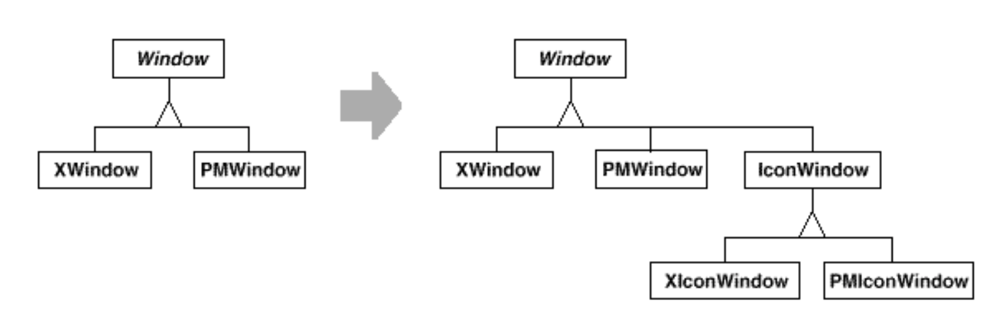
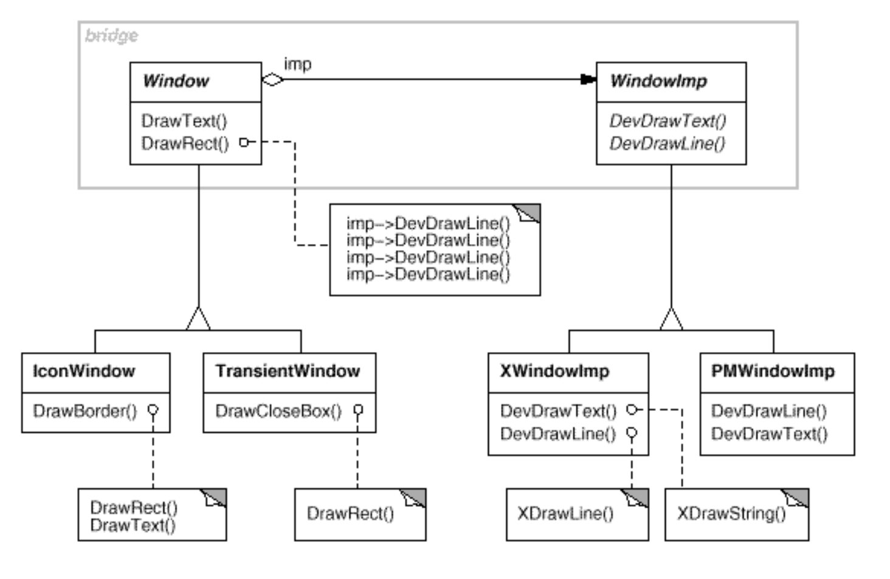
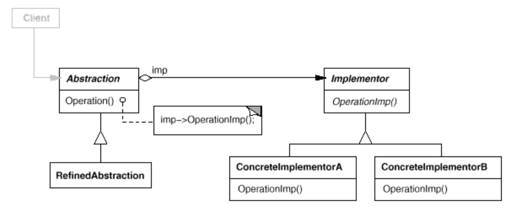

# Bridge(Handle/Body)

## 目的

将抽象和实现进行解耦，以便其可以独立地进行变换。


## 动机

**当一个抽象可以有几种类型的一种实现时**，通常的做法是通过继承。但是继承将抽象与实现永久的绑定，使分别独立地修改、扩展、重用抽象与实现变得困难。

例如，一旦修改一个抽象，各个继承自该抽象的子类都要修改。一旦抽象类型增加一个，就要增加一系列的实现。

例如一个可以在 X Window System 和 IBM's Presentation Manager (PM) 上工作的轻量级的图形工具库，对于用户界面，我们可以定义一个 Window 抽象类表示窗口，子类 XWindow 和 PMWindown 分别实现两个平台的平台依赖部分。但是这种实现有如下两个问题：

1. 扩展抽象 Window 以覆盖不同类型的窗口或新平台是不方便的。加入一个继承自 Window 用于显示 Icon 的 IconWindow. 为了支持两种平台，我们不得不实现两个新的类: XIconWindow and PMIconWindow。更糟的是，我们不得不为每种类型的 Window 都单独的定义两种类型的子类。支持新的平台将需要为每种类型的 Window 都实现一个平台相关的子类。



2. 继承使得客户端代码是平台相关的。每当客户端创建一个 window，都将实例化一个特别实现的类。例如，创建一个 XWindow 的对象将抽象与 XWindow 的实现绑定。这将导致客户端代码难以移植到其他平台。

    客户端应该能够不关联特定平台的创建 window。只有在程序运行时 window 才跟具体的平台产生关联。因此，客户端代码应该继承自 Window 而不涉及具体平台。


桥接模式通过将 window 的抽象和实现分离为独立继承体系来解决问题。 以下方式解决这些问题。一个继承自 Window 的类层次结构(Window, IconWindow, TransientWindow)和一个独立的 继承自 WindowImp 的特定平台实现的类层次结构。例如，子类 XWindowImp 提供了一个基于X窗口系统的实现。



所有 Window 子类的操作都通过 WindowImp 接口的抽象操作完成。这将 window 抽象和不同平台的实现解耦。我们将 Window 和WindowImp 之间的关系称为桥梁，因为它连接了抽象和它的实现，让它们独立地变化。

## 适用性

如下场景使用 Bridge 模式：

- 你想要避免抽象和实现之间的永久绑定。例如，可能的情况是，当必须在运行时选择或切换不同实现。

- 抽象及其实现都需要通过子类进行两个维度的扩展。在这种情况下，桥接模式允许您组合不同的抽象和实现，并独立地扩展它们。

- 抽象实现中的更改应该对客户端不产生影响; 也就是说，它们的代码不必重新编译。

- （C++）您想对客户端完全隐藏抽象的实现。 在C ++中，类的表示形式在类接口中可见。

- 您有一个如前面第一个动机图所示的类增殖。这样的类层次结构表明需要将对象拆分为两个部分。Rumbaugh 使用术语“嵌套泛化”[RBP+91]来指代这样的类层次结构。

- 您希望在多个对象之间共享一个实现(可能使用引用计数)，并且应该对客户机隐藏这个事实。一个简单的例子是Coplien的String类[Cop92]，其中多个对象可以共享相同的字符串表示(StringRep)。

## 结构




## 协作

抽象将客户端的请求转发给实现对象。

## 结果

Bridge 有如下几种结论：

- 将接口与实现解耦。具体的实现不与接口绑定，抽象的实现可以在运行时再指定。甚至可以在运行时修改具体实现。

    解耦同时消除编译时对实现的依赖。更改实现类不需要重新编译抽象类及其客户端。当您必须确保类库的不同版本之间的二进制兼容性时，此属性是必不可少的。

    此外，这种解耦鼓励分层，从而产生结构更好的系统。系统的顶级部分只需要知道抽象和实现者。

- 优化扩展性。你可以独立地扩展抽象和实现的层级结构。 

- 对客户端隐藏实现细节。你可以对客户端屏蔽具体的实现细节。

## 实现

应用 Bridge 模式时考虑如下实现问题：

- 仅有一个 Implementor。当仅有一种 Implementor 时，没有必要创建一个抽象的 Implementor 类。这是一种退化的 Bridge 模式。抽象和实现之间是一对一的关系。尽管如此，当类的实现中的更改必须不影响其现有客户端时这种分离仍然非常有用。客户端不必重新编译，仅需要重新连接。Carolan [Car89]用“柴郡猫”来描述这种分离。在c++中，实现者类的类接口可以在不提供给客户端的私有头文件中定义。这使您可以对类的客户端完全隐藏类的实现。

- 创建正确的Implementor对象。当有多个类时，如何、何时以及在何处决定实例化哪个Implementor类？

    如果Abstraction知道所有的ConcreteImplementor类，则可以在其构造函数中实例化其中的一个。 它可以根据传递给其构造函数的参数在它们之间进行决定。 例如，如果某个集合类支持多种实现，则可以基于集合的大小来做出决定。 链表实现可用于小型集合，而哈希表可用于大型集合。

    另一种方法是首先选择一个默认实现，然后根据使用情况对其进行更改。 例如，如果集合的增长大于某个阈值，则它将其实现切换为更适合大量元素的实现。


    也可以将决策完全委托给另一个对象。 在Window / WindowImp示例中，我们可以引入一个工厂对象（请参见Abstract Factory（99）），其唯一职责是封装特定于平台的对象。 工厂知道要为所使用的平台创建哪种WindowImp对象。 一个Window只是向它询问一个WindowImp，然后它返回正确的种类。 这种方法的好处是，抽象不会直接耦合到任何Implementor类。

- 共享 implementors。 Coplien 说明了 C++ 中 Handle/Body 的习惯用法，可用于在多个对象之间共享实现[Cop92]。 主体存储一个 Handle 类递增和递减的引用计数。 用共享主体分配句柄的代码具有以下一般形式：

```c++
Handle& Handle::operator= (const Handle& other) {
    other._body->Ref();
    _body->Unref();
   if (_body->RefCount() == 0) {
       delete _body;
   }
   _body = other._body;
   return *this;
}
```

- 使用多重继承。可以在 C++ 中使用多继承来合并接口和其实现[Mar91]。 例如，一个类可以从 Abstraction 公有继承，从 ConcreteImplementor 私有继承。 但是由于此方法依赖于静态继承，因此它将实现永久绑定到其接口。 因此，您不能实现具有多重继承的真正的 Bridge —— 至少在 C++ 中无法实现。


## 相关模式

抽象工厂可以创建和配置特定的 Bridge。

适配器模式旨在使不相关的类一起工作。它通常是在系统设计完成后才应用到系统中。相对的，桥接在设计中预先使用，以使抽象和实现独立地变化。


