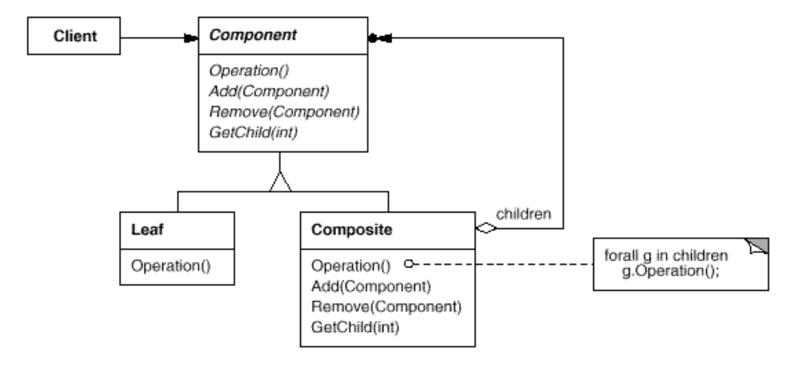
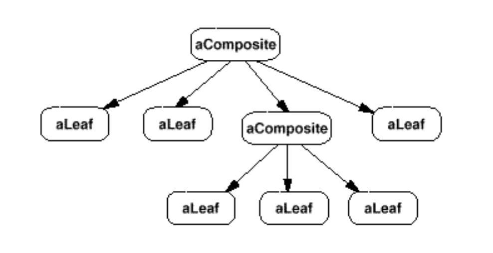

# Composite

树形结构专用模式。

## 目的

通过相同对象的组合形成树层次结构。组合允许客户端统一地处理单个对象和对象的组合。

## 动机

树形结构随处可见。目录结构，公司人事组织，图形界面的嵌套。以图形界面为例，可以展示图片 Picture, 文字 Text，一个矩形 Rectange, 或者简单的线 Line。问题在于这些元素可以任意的组合嵌套，形成复杂的对象，复杂的对象就需要容器来存放这些组成部分。

将普通 View 和容器加一区分的问题是：代码必须对原始对象和容器对象进行不同的处理，即使大多数情况下用户对它们的处理方式相同。区分这些对象使应用程序更加复杂。 Composite模式描述了如何使用递归组合，这样客户端就不必进行这种区分。

Composite 模式的关键是抽象出一个类来同时表示基元和它们的容器。同时定义所有组合元素共有的操作。

## 适用性

- 您希望表示对象的部分-整体层次结构。

- 您希望客户端能够忽略对象组合和单个对象之间的差异。客户端将统一对待复合结构中的所有对象。

## 结构

一个典型的组合对象结构类似如下：

## 协作

客户端使用 Component 类接口与复合结构中的对象进行交互。 如果接收者是叶子，则直接处理请求。如果接收者是复合用户，则通常将请求转发到其子组件，可能在转发之前和/或之后执行其他操作。

## 结果

- 定义由原始对象和复合对象组成的类层次结构。原始对象可以组合成复杂对象，复杂对象又可以组合起来，以此类推。任何客户机需要一个原始对象的地方，也可以接受一个复合对象。

- 使客户端变得简单。 客户端可以统一对待复合结构和单个对象。 客户端通常不知道（也不在乎）他们是在处理叶子还是复合组件。 这简化了客户端代码，因为它避免了必须在定义组合的类上编写 tag-and-case-statement-style 的函数。

- 添加新的组件变得简单。新加的组合或者叶子子类可以无缝地与现有的结构或科幻代码一起工作。客户端不用为新组件修改或添加新类。

- 会使你的设计过于一般化。添加新组件变得容易的一个缺点是，它使限制组件复合变得更加困难。有时您希望一个组合只包含某些组件。使用复合时，不能依赖于类型系统来强制执行这些约束。您将不得不改用运行时检查。

## 实现

实现 Composite 模式有许多问题需要考虑：

比较多，查看设计模式一书的详细解释。

## 相关模式

对父组件的引用通常在责任链模式中使用。

装饰区经常与组合模式一起使用。当其一起使用时，通常定义一个公共的父类。docorators 将不得不支持组件接口的 add、remove、getChild 操作。

Flyweight 允许你共享组件, 但是它不能访问其父元素。

Iterator 可以用于遍历组件。

Visitor 本地化操作和行为，否则这些操作和行为将横跨组合类和叶类。

