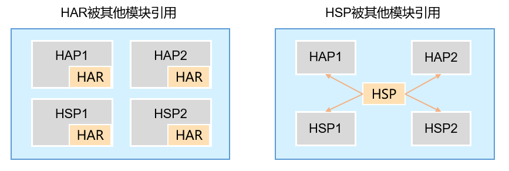

# 入门

4. Entry包、feature 包多设备等特性、多hap, 包及结构相关的概念✔️
3. 页面路由 Router, Ability，概念及使用
TODO
2. 不同屏幕适配
5. 热更新，热修复
1. 考点树，及库应该如何设计，如何对外提供


# [模块](https://developer.huawei.com/consumer/cn/doc/harmonyos-guides/application-package-overview-0000001820999513)

鸿蒙应用提供了模块化开发能力。鸿蒙的模块发开发包含了两方面的含义。

- Ability 模块：用于实现应用的功能和特性。Ability 类型的 Module。编译生成 HAP（Harmony Ability Package）包。
    - entry 类型的 Module：0 或者 1 个，只要包含了 entry 类型的模块才能包含应用的入口界面、入口图标和主功能特性。
    - feature类型的 Module：0 个或者多个，更多是被系统调用的功能。服务卡片、输入法等。
- 仓库模块（Library Model）：用于实现代码和资源的共享。**类似于 Android 项目中的模块**
    - 共享库 HSP（Harmony Shared Package）
    - 静态库 HAR（Harmony Archive）


[HAP 说明：](https://developer.huawei.com/consumer/cn/doc/harmonyos-guides/hap-package-0000001820879541)
- HAP 可以用于不同设备的分包, 每个 HAP 都会标注所支持的设备类型。有些Module支持全部类型的设备，有些 Module 只支持某一种或几种型的设备（比如平板），那么在应用市场分发应用包时，也能够根据设备类型做精准的筛选和匹配，从而将不同的包合理的组合和部署到对应的设备上。**多HAP场景下，App Pack包中同一设备类型的所有HAP中必须有且只有一个Entry类型的HAP**

- 单HAP场景：如果只包含UIAbility组件，无需使用ExtensionAbility组件，优先采用单HAP（即一个entry包）来实现应用开发。虽然一个HAP中可以包含一个或多个UIAbility组件，为了避免不必要的资源加载，推荐采用“一个UIAbility+多个页面”的方式。

- 多HAP场景：如果应用的功能比较复杂，需要使用ExtensionAbility组件，可以采用多HAP（即一个entry包+多个feature包）来实现应用开发，每个HAP中包含一个UIAbility组件或者一个ExtensionAbility组件。在这种场景下，可能会存在多个HAP引用相同的库文件，导致重复打包的问题。


**HAP 主要用于适配设备以及区分应用还是系统调用的小功能。而不是用于在用户使用时动态的加载和扩展功能。**
这其实隐含了一个重要的 Ability 模块特性： **entry 类型的 HAP 必须继承 UIAbility；feature 类型的 HAP 继承自 ExtensionAbility 的子类。** entry 类型的模块等同于安卓应用的 UI 应用。


[仓库模块说明](https://developer.huawei.com/consumer/cn/doc/harmonyos-guides/application-package-overview-0000001820999513)

- 只有针对某个设备的包有多个 HAP 时才需要打共享库(HSP)，这可以避免包体积增大以及运行时多份拷贝占用内存。否则，都应该打成静态库（HAR）。**当有多个库需要被多个 HAP 共享时，可以将其依然保持为静态库，然后添加一个动态库依赖于这些静态库，让 HAP 依赖于这个动态库。**



| 共享包类型 | 编译和运行方式 | 发布和引用方式 |
| -------- | ------------ | ------------ |
| HAR | HAR中的代码和资源跟随使用方编译，如果有多个使用方，它们的编译产物中会存在多份相同拷贝。| HAR除了支持应用内引用，还可以独立打包发布，供其他应用引用。|
| HSP | HSP中的代码和资源可以独立编译，运行时在一个进程中代码也只会存在一份。 | HSP一般随应用进行打包，当前只支持应用内引用，不支持独立发布和跨应用的引用。|


HAP 的其它不重要的限制（不是容易误解的概念，可以不用看）：

- 不支持导出接口和ArkUI组件，给其他模块使用。

- 多HAP场景下，同一应用中的所有HAP的配置文件中的bundleName、versionCode、versionName、minCompatibleVersionCode、debug、minAPIVersion、targetAPIVersion、apiReleaseType相同，同一设备类型的所有HAP对应的moduleName标签必须唯一。HAP打包生成App Pack包时，会对上述参数配置进行校验。

- 多HAP场景下，同一应用的所有HAP、HSP的签名证书要保持一致。上架应用市场是以App Pack形式上架，应用市场分发时会将所有HAP从App Pack中拆分出来，同时对其中的所有HAP进行重签名，这样保证了所有HAP签名证书的一致性。在调试阶段，开发者通过命令行或DevEco Studio将HAP安装到设备上时，要保证所有HAP签名证书一致，否则会出现安装失败的问题。


## Stage 模型

鸿蒙原生应用开发提供了 Stage 模型和 FA（Feature Ability）模型。FA 模型已经不再继续更新，这里只说 Stage 模型。在 Stage 模型中，由于提供了 AbilityStage、WindowStage 等类作为应用组件和 Window 窗口的“舞台”，因此称这种应用模型为Stage 模型。


### 1. Ability

- Ability 是应用所具备能力的抽象，一个应用可以具备多种能力（即可以包含多个Ability）。其分为两种类型：
    - UIAbility： UIAbility组件是一种包含UI的应用组件，主要用于和用户交互。例如，图库类应用可以在UIAbility组件中展示图片瀑布流，在用户选择某个图片后，在新的页面中展示图片的详细内容。同时用户可以通过返回键返回到瀑布流页面。UIAbility组件的生命周期只包含创建/销毁/前台/后台等状态，与显示相关的状态通过WindowStage的事件暴露给开发者。

    - ExtensionAbility： ExtensionAbility组件是一种面向特定场景的应用组件。开发者并不直接从ExtensionAbility组件派生，而是需要使用ExtensionAbility组件的派生类。目前ExtensionAbility组件有用于卡片场景的FormExtensionAbility，用于输入法场景的InputMethodExtensionAbility，用于闲时任务场景的WorkSchedulerExtensionAbility等多种派生类，这些派生类都是基于特定场景提供的。例如，用户在桌面创建应用的卡片，需要应用开发者从FormExtensionAbility派生，实现其中的回调函数，并在配置文件中配置该能力。ExtensionAbility组件的派生类实例由用户触发创建，并由系统管理生命周期。在Stage模型上，三方应用开发者不能开发自定义服务，而需要根据自身的业务场景通过ExtensionAbility组件的派生类来实现。


- **虽然一个 HAP 可以包含多个 Ability, 但官方推荐值包含一个 Ability + 多个 Page 的开发方式（官方推荐这种方式的理由是多 Ability 更耗费资源）。混用 Ability 和 Page 会让页面跳转变得麻烦，Ability 之间，Page 之间的跳转采用的是不同的方式。（Ability 之间的跳转类似于安卓的 Activity 跳转，使用的是 startAbility 方法。Page 之间的跳转使用的 router。）**

- 另一个考虑因素是任务入口的数量: 在设备上上划，显示所有应用时，多个 Ability 显示为多个应用。即便是 Ability destroy 之后也存在。有特殊场景更适合多 Ability，例如微信打开小程序就会显示为多个入口，只是目前在咱们应用没有这种场景。


**虽然 Ability 看起来更像是安卓中的 Activity(1. 每个Activity/Ability 持有一个 Window, 2. 生命周期。3. 注册方式和启动模式设置。4. 跳转方式)。但鸿蒙中的 Ability 应该理解为某种能力，而不是页面，UIAbility 为 UI 显示能力。**

UIAbility 的跳转方式类似于安卓，这里不再总结，可以直接有看[原文档](https://developer.huawei.com/consumer/cn/doc/harmonyos-guides/uiability-intra-device-interaction-0000001820999601)。

- ExtensionAbility 根据使用场景不同，差异较大。可以直接看文档：https://developer.huawei.com/consumer/cn/doc/harmonyos-guides/extensionability-overview-0000001774279654


## Page

Page 是鸿蒙用作为页面的单位。使用 `@Entry` 装饰器修饰的自定义组件，会作为一个页面。

```TS
@Entry      // 作为页面
@Component  // 必须同时是一个组件
struct Second {

}
```

页面需要在 `resources/profile/main_pages.json` 中进行注册

```json
{
  "src": [
    "pages/Index",
    "pages/Second",
    "pages/SecondAbility"
  ]
}
```

在 UIAbility 的 onWindowStageCreate 回调方法中，可以设置默认的页面

```TS
  onWindowStageCreate(windowStage: window.WindowStage): void {
    // 设置默认的 Page.
    windowStage.loadContent('pages/Index', (err) => {
      if (err.code) {
        hilog.error(0x0000, 'testTag', 'Failed to load the content. Cause: %{public}s', JSON.stringify(err) ?? '');
        return;
      }
      hilog.info(0x0000, 'testTag', 'Succeeded in loading the content.');
    });
  }
```

Page 有一些生命周期回调函数，类似于安卓 Acitivity 的生命周期。


普通的组件只有 `aboutToAppear` 和 `aboutToDisappear` 生命周期。

[生命周期的说明](https://www.seaxiang.com/blog/862b85be1463436589d0308bbced6f0d)


## Router

想要在 Ability 中的 Page 中实现跳转，可以使用鸿蒙自带的 Router。
```TS
import router from '@ohos.router';
```

### 跳转
页面跳转的几种方式，根据需要选择一种方式跳转即可。

- 方式一：API9及以上，router.pushUrl()方法新增了mode参数，可以将mode参数配置为router.RouterMode.Single单实例模式和router.RouterMode.Standard多实例模式。
在单实例模式下：如果目标页面的url在页面栈中已经存在同url页面，离栈顶最近同url页面会被移动到栈顶，移动后的页面为新建页，原来的页面仍然存在栈中，页面栈的元素数量不变；如果目标页面的url在页面栈中不存在同url页面，按多实例模式跳转，页面栈的元素数量会加1。

> 说明: 当页面栈的元素数量较大或者超过32时，可以通过调用router.clear()方法清除页面栈中的所有历史页面，仅保留当前页面作为栈顶页面。
```TS
router.pushUrl({
  url: 'pages/Second',
  params: {
    src: 'Index页面传来的数据',
  }
}, router.RouterMode.Single)
```

- 方式二：API9及以上，router.replaceUrl()方法新增了mode参数，可以将mode参数配置为router.RouterMode.Single单实例模式和router.RouterMode.Standard多实例模式。
在单实例模式下：如果目标页面的url在页面栈中已经存在同url页面，离栈顶最近同url页面会被移动到栈顶，替换当前页面，并销毁被替换的当前页面，移动后的页面为新建页，页面栈的元素数量会减1；如果目标页面的url在页面栈中不存在同url页面，按多实例模式跳转，页面栈的元素数量不变。

```TS
router.replaceUrl({
  url: 'pages/Second',
  params: {
    src: 'Index页面传来的数据',
  }
}, router.RouterMode.Single)
```

### 接收参数

通过调用router.getParams()方法获取Index页面传递过来的自定义参数。

```TS
import router from '@ohos.router';

@Entry
@Component
struct Second {
  @State src: string = (router.getParams() as Record<string, string>)['src'];
  // 页面刷新展示
  // ...
}

```

### 返回页面
可以通过调用router.back()方法实现返回到上一个页面，或者在调用router.back()方法时增加可选的options参数（增加url参数）返回到指定页面。

返回上一个页面。
```TS
router.back();
```

返回到指定页面。
```TS
router.back({ url: 'pages/Index' });
```
根据需要，可以在返回时携带数据。
```
router.back({
  url: 'pages/Index',
  params: {
    src: 'Second页面传来的数据',
  }
})
```

### 获取页面返回的数据

页面返回携带的数据也是调用 `router.getParams()` 方法获得，但是需要在合适的生命周期函数内来获取。调用router.back()方法，不会新建页面，返回的是原来的页面，在原来页面中@State声明的变量不会重复声明，以及也不会触发页面的aboutToAppear()生命周期回调，因此无法直接在变量声明以及页面的aboutToAppear()生命周期回调中接收和解析router.back()传递过来的自定义参数。

```TS
import router from '@ohos.router';
class routerParams {
  src:string
  constructor(str:string) {
    this.src = str
  }
}
@Entry
@Component
struct Index {
  @State src: string = '';
  onPageShow() {
    this.src = (router.getParams() as routerParams).src
  }
  // 页面刷新展示
  // ...
}
```

### 自带路由的问题

- 最大的问题就是和页面的文件路径绑定了，无法灵活定义，应该需要改造一下才方便使用
- 无法使用 url 中类似的参数。
- 无法统一 Page 和 Ability 的跳转。


## 不同屏幕适配


> 说明
- 调用router.back()返回的目标页面需要在页面栈中存在才能正常跳转。
- 例如调用router.pushUrl()方法跳转到Second页面，在Second页面可以通过调用router.back()方法返回到上一个页面。
例如调用router.clear()方法清空了页面栈中所有历史页面，仅保留当前页面，此时则无法通过调用router.back()方法返回到上一个页面。
1. 应用包结构

```
.
├── AppScope
├── build-profile.json5               // 应用级配置信息，包括签名、产品配置等。
├── entry
│   ├── build
│   ├── build-profile.json5      // 当前的模块信息 、编译信息配置项，包括buildOption、targets配置等。
│   ├── hvigorfile.ts            // 模块级编译构建任务脚本，开发者可以自定义相关任务和代码实现。
│   ├── obfuscation-rules.txt    // 混淆规则文件。
│   ├── oh-package.json5
│   └── src
│       ├── main
│       │   ├── ets               // ArkTS源码
│       │   │   ├── entryability  // 应用/服务的入口。相当于 AndroidManifest.xml
│       │   │   └── pages         // 页面
│       │   ├── module.json5      // 模块配置文件。主要包含HAP包的配置信息
│       │   └── resources         // 资源文件
│       │       ├── base
│       │       │   ├── element   // 字符颜色资源
│       │       │   │   ├── color.json
│       │       │   │   └── string.json
│       │       │   ├── media     // 媒体文件
│       │       │   │   ├── icon.png
│       │       │   │   └── startIcon.png
│       │       │   └── profile
│       │       │       └── main_pages.json // 页面的路由
│       ├── mock
│       │   └── mock-config.json5
├── hvigorfile.ts          // 应用级编译构建任务脚本。

```
跳转页面
```
router.push({ url: 'pages/second' })
```
返回
```
router.back()
```
