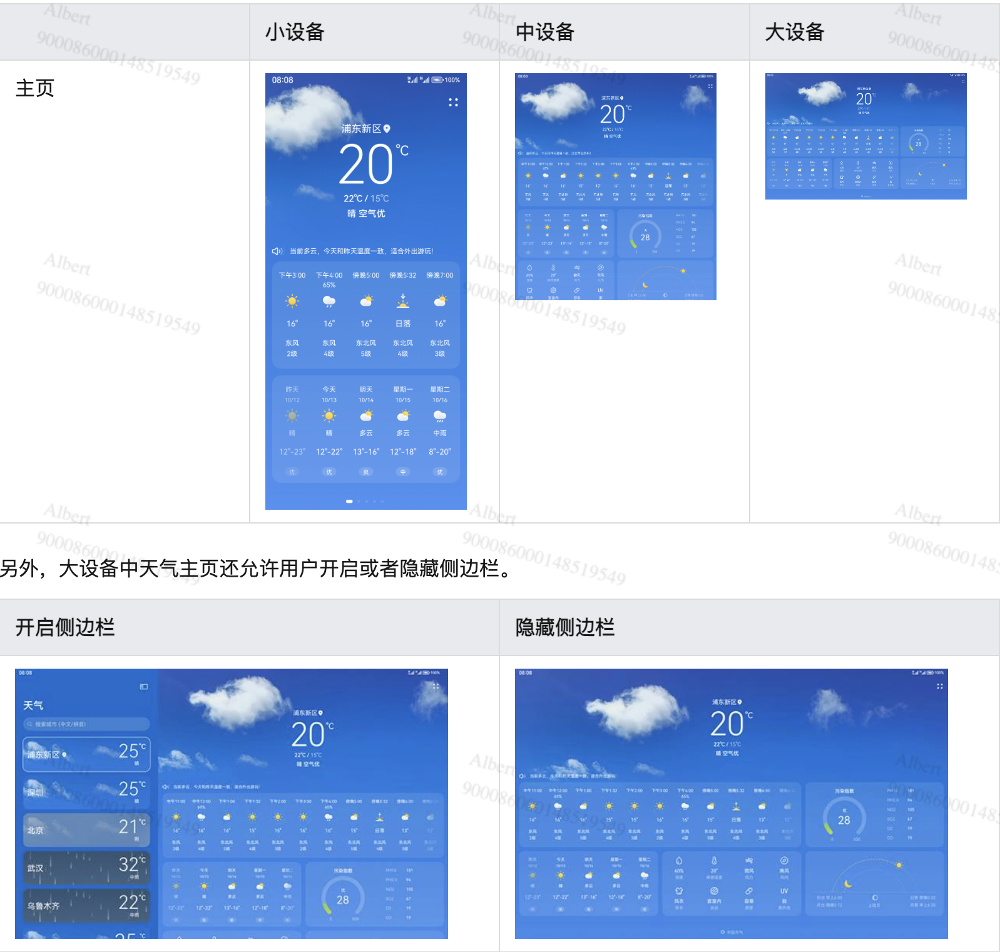
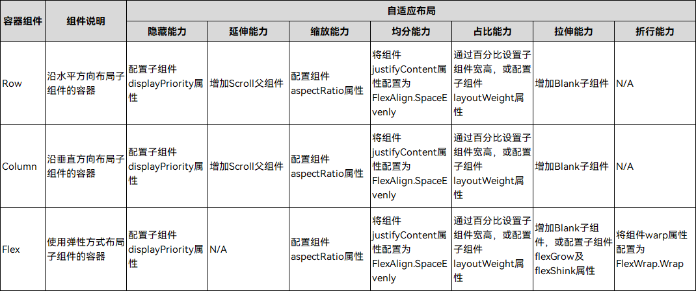
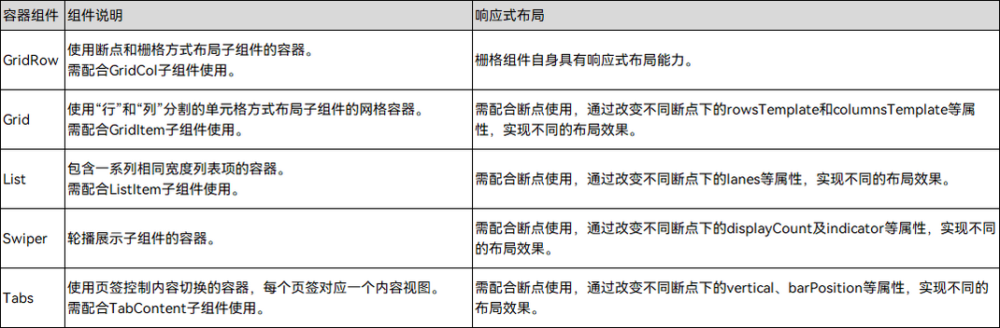

# 屏幕适配

## 部署模型

根据需要，鸿蒙应用可以打包为多 HAP
- 部署模型A：不同类型的设备编译生成相同的HAP（或HAP组合）。

- 部署模型B：不同类型的设备编译生成不同的HAP（或HAP组合）。

开发者可以从应用 `UX设计` 及 `应用功能` 两个维度，结合具体的业务场景，考虑选择哪种部署模型。当然，也可以借助设备类型分类，快速做出判断。

从屏幕尺寸、输入方式及交互距离三个维度考虑，可以将常用类型的设备分为不同泛类：

- 默认设备、平板、车机、智慧屏、智能穿戴……

对于相同泛类的设备，优先选择部署模型A，对于不同泛类设备，优先选择部署模型B。

> 说明
- 应用在不同泛类设备上的UX设计或功能相似时，可以使用部署模型A。

- 应用在同一泛类不同类型设备上UX设计或功能差异非常大时，可以使用部署模型B，但同时也应审视应用的UX设计及功能规划是否合理。

- 本小节引入部署模型A和部署模型B的概念是为了方便开发者理解。实际上在开发多设备应用时，如果目标设备类型较多，往往是部署模型A和部署模型B混合使用。

- 不管采用哪种部署模型，都应该采用一次编译。

## 工程结构

“一多”推荐在应用开发过程中使用如下的“三层工程结构”。

- common（公共能力层）：用于存放公共基础能力集合（如工具库、公共配置等）。

    common层可编译成一个或多个HAR包或HSP包（HAR中的代码和资源跟随使用方编译，如果有多个使用方，它们的编译产物中会存在多份相同拷贝；而HSP中的代码和资源可以独立编译，运行时在一个进程中代码也只会存在一份），其只可以被products和features依赖，不可以反向依赖。

- features（基础特性层）：用于存放基础特性集合（如应用中相对独立的各个功能的UI及业务逻辑实现等）。

    各个feature高内聚、低耦合、可定制，供产品灵活部署。不需要单独部署的feature通常编译为HAR包或HSP包，供products或其它feature使用。需要单独部署的feature通常编译为Feature类型的HAP包，和products下Entry类型的HAP包进行组合部署。features层可以横向调用及依赖common层，同时可以被products层不同设备形态的HAP所依赖，但是不能反向依赖products层。

- products（产品定制层）：用于针对不同设备形态进行功能和特性集成。

    products层各个子目录各自编译为一个Entry类型的HAP包，作为应用主入口。products层不可以横向调用。

代码工程结构抽象后一般如下所示：

```shell
/application
├── common                  # 可选。公共能力层, 编译为HAR包或HSP包
├── features                # 可选。基础特性层
│   ├── feature1            # 子功能1, 编译为HAR包或HSP包或Feature类型的HAP包
│   ├── feature2            # 子功能2, 编译为HAR包或HSP包或Feature类型的HAP包
│   └── ...
└── products                # 必选。产品定制层
    ├── wearable            # 智能穿戴泛类目录, 编译为Entry类型的HAP包
    ├── default             # 默认设备泛类目录, 编译为Entry类型的HAP包
    └── ...

```

> 说明
- 部署模型不同，相应的代码工程结构也有差异。部署模型A和部署模型B的主要差异点集中在products层：部署模型A在products目录下同一子目录中做功能和特性集成；部署模型B在products目录下不同子目录中对不同的产品做差异化的功能和特性集成。

- 开发阶段应考虑不同类型设备间最大程度的复用代码，以减少开发及后续维护的工作量。

- 整个代码工程最终构建出一个APP包，应用以APP包的形式发布到应用市场中。

## UX设计

“一多”建议从设备屏幕宽度的维度，将设备划分为四大类。设计师只需要针对这四大类设备做设计，而无需关心具体的设备形态。

| 设备类型 | 屏幕宽度（vp） |
| ------- | ------------ |
| 超小设备 | [0, 320)     |
| 小设备   | [320, 600)  |
| 中设备   | [600, 840)  |
| 大设备   | [840, +∞)   |


> 说明
- vp是virtual pixel（虚拟像素）的缩写，是常用的长度单位。

- 此处基于设备屏幕宽度划分不同设备是为了读者方便理解。通常智能设备上的应用都是以全屏的形式运行，但随着移动技术的发展，当前部分智能设备支持应用以自由窗口模式运行（即用户可以通过拖拽等操作自由调整应用运行窗口的尺寸），故以应用窗口尺寸为基准进行划分更为合适，本文后续的响应式布局章节中将详细介绍相关内容。




## 布局

布局可以分为自适应布局和响应式布局，二者的介绍如下表所示。

| 名称 | Android 中的类似 |  简介 |
| --- | ----- | ---- | 
| 自适应布局 |  match_parent、dp、sp 等自使用能力   | 当外部容器大小发生变化时，元素可以根据相对关系自动变化以适应外部容器变化的布局能力。相对关系如占比、固定宽高比、显示优先级等。当前自适应布局能力有7种：拉伸能力、均分能力、占比能力、缩放能力、延伸能力、隐藏能力、折行能力。自适应布局能力可以实现界面显示随外部容器大小连续变化。 |
| 响应式布局 | 布局文件资源中的屏幕宽度 values-600 | 响应式布局是指页面内的元素可以根据特定的特征（如窗口宽度、屏幕方向等）自动变化以适应外部容器变化的布局能力。响应式布局中最常使用的特征是窗口宽度，可以将窗口宽度划分为不同的范围（下文中称为断点）。当窗口宽度从一个断点变化到另一个断点时，改变页面布局（如将页面内容从单列排布调整为双列排布甚至三列排布等）以获得更好的显示效果。   |


> 说明
自适应布局多用于解决页面各区域内的尺寸差异，响应式布局多用于解决页面中因屏幕尺寸引起的功能差异。


- 自适应布局常常需要借助Row组件、Column组件或Flex组件实现。



- 响应式布局常常与GridRow组件、Grid组件、List组件、Swiper组件或Tabs组件搭配使用。



### 自适应布局

自适应布局跟安卓上类似，就不再一一粘贴了，这里有一些文档链接：
1. 自适应布局：https://developer.huawei.com/consumer/cn/doc/harmonyos-guides/adaptive-layout-0000001821000385
2. 布局组件：https://developer.huawei.com/consumer/cn/doc/harmonyos-guides/3_2_u5f00_u53d1_u5e03_u5c40-0000001774279794


1. 鸿蒙的尺寸不用指定单位，使用的是 vp，例如： `height(50)`。
2. 宽高使用百分比可以自动适应不同尺寸的屏幕：`width('80%')`。
2. 默认是包裹，但内部设置了 `width('80%')`，如果外层没设置，会导致穿透，直到找到一个设置的，以其为基础。

尺寸设置: https://developer.huawei.com/consumer/cn/doc/harmonyos-references/ts-universal-attributes-size-0000001774280842#ZH-CN_TOPIC_0000001774280842__width


### 响应式布局

自适应布局可以保证窗口尺寸在一定范围内变化时，页面的显示是正常的。但是将窗口尺寸变化较大时（如窗口宽度从400vp变化为1000vp），仅仅依靠自适应布局可能出现图片异常放大或页面内容稀疏、留白过多等问题，此时就需要借助响应式布局能力调整页面结构。


当前系统提供了如下三种响应式布局能力

| 响应式布局能力 |  简介 |
| ------- | --------- |
| 断点    |  将窗口宽度划分为不同的范围（即断点），监听窗口尺寸变化，当断点改变时同步调整页面布局。 |
| 媒体查询 | 媒体查询支持监听窗口宽度、横竖屏、深浅色、设备类型等多种媒体特征，当媒体特征发生改变时同步调整页面布局。 |
| 栅格布局 | 栅格组件将其所在的区域划分为有规律的多列，通过调整不同断点下的栅格组件的参数以及其子组件占据的列数等，实现不同的布局效果。 |


