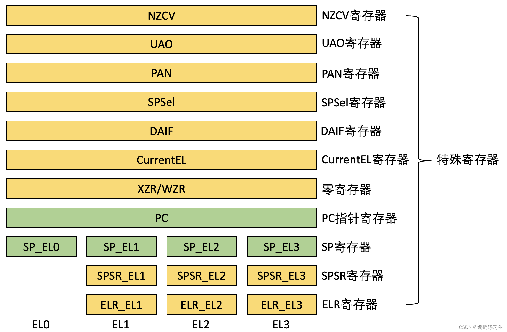
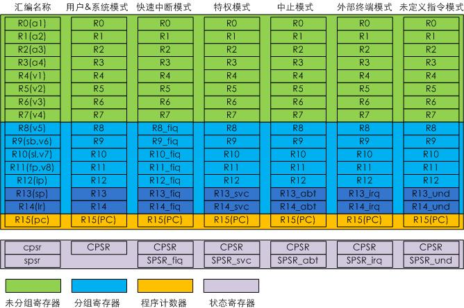

# 寄存器

常用的寄存器缩写：
```
R：Register；寄存器
PC：Program Counter；程序计数器
CPSR：Current Program Status Register；当前程序状态寄存器
SPSR：Saved Program Status Register；保存的程序状态寄存器
SP：Stack Pointer；数据栈指针
LR：Link Register；连接寄存器，return 要返回到的地址。
SB：静态基址寄存器
SL：数据栈限制指针
FP：帧指针
IP：Intra-Procedure-call Scratch Register；内部程序调用暂存寄存器
```

## ARM64 寄存器
[参考](https://blog.csdn.net/lml435035844/article/details/135004077)

### 通用寄存器

ARM 有31个通用寄存器：X0~X30，其中有些寄存器有着特殊的作用。其中 X29 用作 FP 寄存器 x30 用作 LR 寄存器。

```
FP = X29
LR = X30
```
在实际的编译器中，X29 一般作为一个通用寄存器而不是一个栈帧指针，栈帧只在调试程序时需要解析栈的时候有用，对实际的程序运行没有什么影响。有了返回地址 LR 和栈指针 SP 就能进行程序调用。因此编译器为了优化性能和栈空间，通常不会保存 FP。在 Android 的崩溃输出中也是这样：

```
r0 =0x0000000000000000 r1 =0x00000000000058ff r2 =0x0000000000000006 r3 =0x0000000000000008
r4 =0xfeff71647164636d r5 =0xfeff71647164636d r6 =0xfeff71647164636d r7 =0x7f7f7f7f7f7f7f7f
r8 =0x0000000000000083 r9 =0x00000070aa93b3f0 r10=0xfffffff87ffffbdf r11=0x0000000000000001
r12=0x0000006ff83fee40 r13=0xffffffffffffffff r14=0xffffffffff000000 r15=0xffffffffffffffff
r16=0x00000070aa9732a8 r17=0x00000070aa8b1318 r18=0x0000006ff83fe62a r19=0x0000000000005856
r20=0x00000000000058ff r21=0x0000000000000083 r22=0x0000006ff83ff588 r23=0x0000000000000000
r24=0x00000070a9f3d100 r25=0x00000070a9f3d050 r26=0x7fffffffffffffff r27=0x431bde82d7b634db
r28=0x0000000000000000 r29=0x0000006ff83fed60 r30=0x00000070aa8a5ad0
sp =0x0000006ff83fed20 pc =0x00000070aa8a5afc pstate=0x0000000060000000
```

通用寄存器的访问方式有2种：

- 当将其作为 32bit 寄存器的时候，使用 W0 ~ W30 来引用它们。（数据保存在寄存器的低32位）
- 当将其作为 64bit 寄存器的时候，使用 X0 ~ X30 来引用它们。

通用寄存器x0-x30有64bit, 如果用不到64位，可以用低位的32位(w0-w30), 也就是说 x0 和 w0 本质上是一个寄存器，只是利用的位数不一样而已。

### 处理机状态寄存器

- PSTATE: 处理机状态寄存器（processor state）


### 特殊寄存器：



***此外还有一个 `HCR_EL2` 和 一个 `SCR_EL3`。*** HCR_EL2(Hyp Configuration Register) 是 Hypervisor 配置寄存器。`SCR_EL3`(Security Configuration Register) 是安全配置寄存器。

- PC: 在 armv7 上 PC 是一个通用寄存器 R15，在 armv8上 PC 不再是一个通用寄存器，它不能直接被修改。必需使用一些隐式的指令来改变，如 PC-relative load

- SP: 特权级在 ARM 上称为异常级（Exception level）,每个异常级都有自己的 SP 寄存器

- 还有一个零寄存器 `xzr`。xzr/wzr 分别表示64/32位，其做用就是0，写进去表明丢弃结果，读出来是0。

WZR/XZR 是一个特殊的寄存器：
Zero Register: 在大多数情况下，作为源寄存器使用时读出来的值是 0; 作为目标寄存器使用时，丢弃结果。 WZR(word zero rigiser)或者XZR(64位）

```assembly
mov	w0, wzr
``` 

- CurrentEL寄存器: 用于存储当前执行指令的异常级别（Exception Level），如 ELR_EL0、ELR_EL1 等


### 系统寄存器

ARM v8 体系结构包含如下 7 类系统寄存器：

- 通用系统控制寄存器
- 调试寄存器
- 性能监控寄存器
- 活动监控寄存器
- 统计扩展寄存器
- RAS吃醋娶你
- 通用定时器寄存器
  
系统寄存器支持不同的异常登记访问，通常系统寄存器会使用 “Reg_ELn” 的方式表示。
- Reg_EL1: 处理器处于 EL1、EL2 以及 EL3 是可以访问该寄存器。
- Reg_EL2: 处理器处于 EL2 以及 EL3 是可以访问该寄存器。

大部分系统寄存器不支持处理器处于 EL0 时访问，但也有一些例外，如 CRT_EL0。程序可以通过 `MSR` 和 `MRS` 指令访问系统寄存器：

```
msr X0, TTBR0_EL1   // 把 TTBR0_EL1 的值复制到 X0 寄存器
msr TTBR0_EL1, X0   // 把 X0 寄存器的值复制到 TTBR0_EL1 
```

#### 1. 通用系统控制寄存器 

- SCTLR是system control register，系统控制寄存器

有 SCTLR_EL1、SCTLR_EL2、SCTLR_EL3


## ARM32

ARM32 的寄存器



[寄存器](https://blog.csdn.net/weixin_42135087/article/details/111263720)