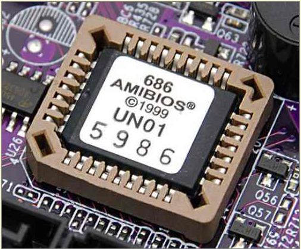
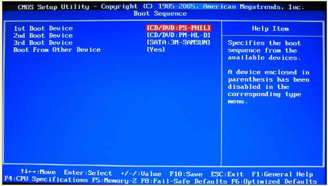
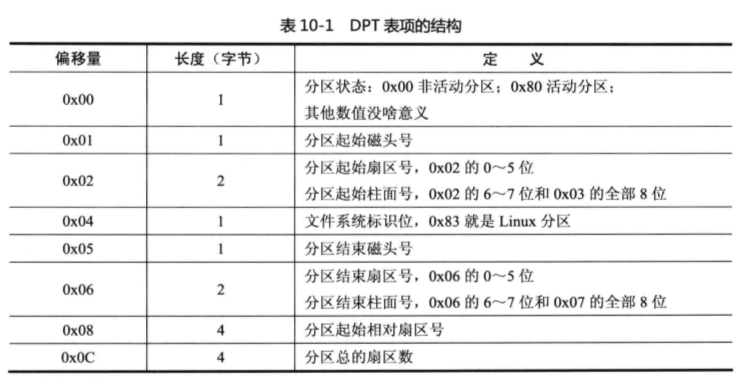

# BIOS

BIOS 的全称为基本输人/输出系统(Basic Imput/Ourput System）其在早期的 8086 系列计算机中占据着重要地位，正如其名，它还带有输入输出功能，其甚至作为操作系统的重要一部分，如微软的MS- DOS，依赖 于BIOS 实现大部分系统调用。随着计算机的发展，技术发生了巨大变化，由于 BIOS 的功能有限，已经被 UEFI 取代。但了解其功能仍然是了解 8086 计算机操作启动系统流程的很好学习途径。

## BIOS 启动

上个世纪70年代初，”只读内存”（read-only memory，缩写为ROM）发明，开机程序被刷入ROM芯片，计算机通电后，第一件事就是读取它：当我们按下电源开关时，电源就开始向主板和其它设备供电，此时电压还不太稳定，主板上的控制芯片组会向CPU发出并保持一个RESET（重置）信号，让 CPU内部自动恢复到初始状态，CPU在此刻不会马上执行指令。当芯片组检测到电源已经开始稳定供电了（当然从不稳定到稳定的过程只是一瞬间的事情）， 它便撤去RESET信号（如果是手工按下计算机面板上的Reset按钮来重启机器，那么松开该按钮时芯片组就会撤去RESET信号），此时CS被初始化为FFFFH,其他所有寄存器都为０，所以CPU马上就从CS:IP指向的地址 FFFF0H处开始执行指令，从前面的介绍可知，这个地址实际上在系统 BIOS 的地址范围内，无论是 `Award BIOS` 还是 `AMI BIOS`，放在这里的只是一条跳转指令，跳到系统BIOS中真正的启动代码处。

BIOS 中主要存放的程序包括：自诊断程序（通过读取CMOS RAM中的内容识别硬件配置，并对其进行自检和初始化）、CMOS设置程序（引导过程中，通过特殊热键启动，进行设置后，存入CMOS RAM中）、系统自动装载程序（在系统自检成功后，将磁盘相对0道0扇区上的引导程序装入内存使其运行）和主要I/O驱动程序和中断服务（BIOS和硬件 直接打交道，需要加载I/O驱动程序）。

###  硬件自检

第一步：系统BIOS的启动代码首先要做的事情就是进行POST（Power－On Self Test，加电后自检），POST的主要任务是检测系统中一些关键设备是否存在和能否正常工作，例如内存和显卡等设备。由于POST是最早进行的检测过程，此时显卡还没有初始化，如果系统BIOS在进行POST的过程中发现了一些致命错误，例如没有找到内存或者内存有问题（此时只会检查640K常规内 存），那么系统BIOS就会直接控制喇叭发声来报告错误，声音的长短和次数代表了错误的类型。在正常情况下，POST过程进行得非常快，我们几乎无法感觉 到它的存在，POST结束之后就会调用其它代码来进行更完整的硬件检测。

 

第二步：接下来系统BIOS将查找显卡的BIOS，前面说过，存放显卡BIOS的ROM芯片的起始地址通常设在C0000H处，系统BIOS在这个地方找到显卡 BIOS之后就调用它的初始化代码，由显卡BIOS来初始化显卡，此时多数显卡都会在屏幕上显示出一些初始化信息，介绍生产厂商、图形芯片类型等内容，不过这个画面几乎是一闪而过。系统BIOS接着会查找其它设备的BIOS程序，找到之后同样要调用这些BIOS内部的初始化代码来初始化相关的设备。

第三步： 查找完所有其它设备的BIOS之后，系统BIOS将显示出它自己的启动画面，其中包括有系统BIOS的类型、序列号和版本号等内容。

第四步： 接着系统BIOS将检测和显示CPU的类型和工作频率，然后开始测试所有的RAM，并同时在屏幕上显示内存测试的进度，我们可以在CMOS设置中自行决定使用简单（耗时少）或者详细（耗时多）的测试方式。 

第五步： 内存测试通过之后，系统BIOS将开始检测系统中安装的一些标准硬件设备，包括硬盘、CD－ROM、串口、并口、软驱等设备，另外绝大多数较新版本的系统BIOS在这一过程中还要自动检测和设置内存的定时参数、硬盘参数和访问模式等。 

第六步： 标准设备检测完毕后，系统BIOS内部的支持即插即用的代码将开始检测和配置系统中安装的即插即用设备，每找到一个设备之后，系统BIOS都会在屏幕上显示出设备的名称和型号等信息，同时为该设备分配中断、DMA通道和I/O端口等资源。 

第七步： 到这一步为止，所有硬件都已经检测配置完毕了，多数系统BIOS会重新清屏并在屏幕上方显示出一个表格，其中概略地列出了系统中安装的各种标准硬件设备，以及它们使用的资源和一些相关工作参数。 
　

第八步： 接下来系统BIOS将更新ESCD（Extended System Configuration Data，扩展系统配置数据）。ESCD是系统BIOS用来与操作系统交换硬件配置信息的一种手段，这些数据被存放在CMOS（一小块特殊的RAM，由主 板上的电池来供电）之中。
　　　　通常ESCD数据只在系统硬件配置发生改变后才会更新，所以不是每次启动机器时我们都能够看到“Update ESCD… Success”这样的信息，不过，某些主板的系统BIOS在保存ESCD数据时使用了与Windows系统不相同的数据格式，于是Windows在它自 己的启动过程中会把ESCD数据修改成自己的格式，但在下一次启动机器时，即使硬件配置没有发生改变，系统BIOS也会把ESCD的数据格式改回来，如此 循环，将会导致在每次启动机器时，系统BIOS都要更新一遍ESCD，这就是为什么有些机器在每次启动时都会显示出相关信息的原因。 

第九步： ESCD更新完毕后，系统BIOS的启动代码将进行它的最后一项工作，即根据用户指定的启动顺序从软盘、硬盘或光驱启动。

硬件自检完成后，BIOS把控制权转交给下一阶段的启动程序。这时，BIOS需要知道，”下一阶段的启动程序”具体存放在哪一个设备。也就是说，BIOS需要有一个外部储存设备的排序，排在前面的设备就是优先转交控制权的设备。这种排序叫做”启动顺序”（Boot Sequence）。打开BIOS的操作界面，里面有一项就是”设定启动顺序”。

第十步：BIOS按照”启动顺序”，把控制权转交给排在第一位的储存设备。**即根据用户指定的引导顺序从软盘、硬盘或是可移动设备中读取启动设备的主引导记录（MBR，Master Boot Record），并放入指定的位置（0x7c000）内存中。这时，计算机读取该设备的第一个扇区，也就是读取最前面的512个字节。如果这512个字节的最后两个字节是0x55和0xAA，表明这个设备可以用于启动；如果不是，表明设备中没有启动程序，将加载启动顺序中下一个设备的第一扇区到0x7c00处，并检测最后两字节。直到遇到一个以0x55AA结尾的，就执行0x7c00处的代码。否则将死机等待了。**

## 第二阶段：主引导扇区

这最前面的512个字节，就叫做”主引导扇区”（Boot Sector，缩写为MBR）。

以从硬盘启动为例，
　　执行0x7c00的第一条指令即将控制权交给了MBR
　　3、MBR运行后，搜索MBR中的分区表，查找活动分区（Active Partition）的起始位置
　　4、MBR将活动分区的第一个扇区中的引导扇区——分区引导记录载入到内存。
　　5、MBR检测当前使用的文件系统是否可用。

这时，计算机的控制权就要转交给硬盘的某个分区了，这里又分成三种情况。

2.1 主引导扇区的结构
“主引导记录”只有512个字节，放不了太多东西。它的主要作用是，告诉计算机到硬盘的哪一个位置去找操作系统。

主引导扇区由三个部分组成：

（1） 第1-446字节：MBR（Master Boot Record),调用操作系统的机器码。
（2） 第447-510字节：共64字节，DPT（Disk Partition Table）。
（3） 第511-512字节：两字节BRID（Boot Record ID,引导记录表示)（0x55AA）。
其中，第二部分”分区表”的作用，是将硬盘分成若干个区。

2.2 分区表DPT
硬盘分区有很多好处。考虑到每个区可以安装不同的操作系统，”主引导记录”因此必须知道将控制权转交给哪个区。

分区表的长度只有64个字节，里面又分成四项，每项16个字节。所以，一个硬盘最多只能分四个一级分区，又叫做”主分区”。

每个分区表项的16字节作用如下所示：

三、第三阶段：硬盘启动
3.1 情况A：卷引导记录
上一节提到，四个主分区里面，只有一个是激活的。计算机会读取激活分区的第一个扇区，叫做”卷引导记录”（Volume boot record，缩写为VBR）。

“卷引导记录”的主要作用是，告诉计算机，操作系统在这个分区里的位置。然后，计算机就会加载操作系统了。

3.2 情况B：扩展分区和逻辑分区
随着硬盘越来越大，四个主分区已经不够了，需要更多的分区。但是，分区表只有四项，因此规定有且仅有一个区可以被定义成”扩展分区”（Extended partition）。

所谓”扩展分区”，就是指这个区里面又分成多个区。这种分区里面的分区，就叫做”逻辑分区”（logical partition）。

计算机先读取扩展分区的第一个扇区，叫做”扩展引导记录”（Extended boot record，缩写为EBR）。它里面也包含一张64字节的分区表，但是最多只有两项（也就是两个逻辑分区）。

计算机接着读取第二个逻辑分区的第一个扇区，再从里面的分区表中找到第三个逻辑分区的位置，以此类推，直到某个逻辑分区的分区表只包含它自身为止（即只有一个分区项）。因此，扩展分区可以包含无数个逻辑分区。

但是，似乎很少通过这种方式启动操作系统。如果操作系统确实安装在扩展分区，一般采用下一种方式启动。

3.3 情况C：启动管理器
在这种情况下，计算机执行”主引导记录”前面446字节的机器码之后，不再把控制权转交给某一个分区，而是运行事先安装的”启动管理器”（boot loader），由用户选择启动哪一个操作系统。

对 BIOS 而言，“约定”接到启动操作系统的命令，“定位识别”只从启动扇区把代码加载到0x07C00 (BOOTSEG)这个位置(参见Seabios 0.6.0/Boot.c文件中的boot_disk函数)。至于这个扇区中是否是启动程序、是什么操作系统，则不闻不问、一视同仁。如果不是启动代码，只会提示错误，其余是用户的责任，与BIOS无关。

这样构建协调机制的好处是站在整个体系的高度，统一设计、统一安排，简单、有效。只要 BIOS 和操作系统的生产厂商开发的所有系统版本全部遵循此机制的约定，就可以各自灵活地设计出具有自己特色的系统版本。

1.2　加载操作系统内核程序并为保护模式做准备
从现在开始，就要执行真正的 boot 操作了，即把软盘中的操作系统程序加载至内存。对于Linux 0.11操作系统而言，计算机将分三批逐次加载操作系统的内核代码。第一批由BIOS中断 int 0x19 把第一扇区 bootsect 的内容加载到内存；第二批、第三批在bootsect的指挥下，分别把其后的4个扇区和随后的240个扇区的内容加载至内存。

1.2.1　加载第一部分内核代码——引导程序（bootsect）

按照我们使用计算机的经验，如果在开机的时候马上按Del键，屏幕上会显示一个 BIOS 画面，可以在里面设置启动设备。现在我们基本上都是将硬盘设置为启动盘。Linux 0.11是1991年设计的操作系统，那时常用的启动设备是软驱以及其中的软盘。站在体系结构的角度看，从软盘启动和从硬盘启动的基本原理和机制是类似的。

经过执行一系列 BIOS 代码之后，计算机完成了自检等操作（这些和我们讲的启动操作系统没有直接的关系，读者不必关心）。由于我们把软盘设置为启动设备，计算机硬件体系结构的设计与BIOS联手操作，会让CPU接收到一个int 0x19中断。CPU接收到这个中断后，会立即在中断向量表中找到int 0x19中断向量。我们在图1-3的左下方可以看到int 0x19中断向量在内存中所在的准确位置，这个位置几乎紧挨着内存的0x00000位置。

接下来，中断向量把CPU指向0x0E6F2，这个位置就是int 0x19相对应的中断服务程序的入口地址，即图1-3所示的“启动加载服务程序”的入口地址。这个中断服务程序的作用就是把软盘第一扇区中的程序（512 B）加载到内存中的指定位置。这个中断服务程序的功能是BIOS事先设计好的，代码是固定的，与Linux操作系统无关。无论Linux 0.11的内核是如何设计的，这段BIOS程序所要做的就是“找到软盘”并“加载第一扇区”，其余的它什么都不知道，也不必知道。

按照这个简单、“生硬”的规则，int 0x19中断向量所指向的中断服务程序，即启动加载服务程序，将软驱0号磁头对应盘面的0磁道1扇区的内容复制至内存0x07C00处。我们可以在图1-4的左边看到第一扇区加载的具体位置。

这个扇区里的内容就是 Linux 0.11 的引导程序，也就是我们将要讲解的bootsect，其作用就是陆续把软盘中的操作系统程序载入内存。这样制作的第一扇区就称为启动扇区（boot sector）。第一扇区程序的载入，标志着Linux 0.11中的代码即将发挥作用了。

这是非常关键的动作，从此计算机开始和软盘上的操作系统程序产生关联。第一扇区中的程序由bootsect.s中的汇编程序汇编而成（以后简称bootsect）。这是计算机自开机以来，内存中第一次有了Linux操作系统自己的代码，虽然只是启动代码。

至此，已经把第一批代码bootsect从软盘载入计算机的内存了。下面的工作就是执行bootsect把软盘的第二批、第三批代码载入内存。

点评

注意：BIOS程序固化在主机板上的ROM中，是根据具体的主机板而不是根据具体的操作系统设计的。

理论上，计算机可以安装任何适合其安装的操作系统，既可以安装 Windows，也可以安装Linux。不难想象每个操作系统的设计者都可以设计出一套自己的操作系统启动方案，而操作系统和BIOS通常是由不同的专业团队设计和开发的，为了能协同工作，必须建立操作系统和BIOS之间的协调机制。

与已有的操作系统建立一一对应的协调机制虽然麻烦，但尚有可能，难点在于与未来的操作系统应该如何建立协调机制。现行的方法是“两头约定”和“定位识别”。

对操作系统（这里指Linux 0.11）而言，“约定”操作系统的设计者必须把最开始执行的程序“定位”在启动扇区(软盘中的0盘面0磁道1扇区)，其余的程序可以依照操作系统的设计顺序加载在后续的扇区中。