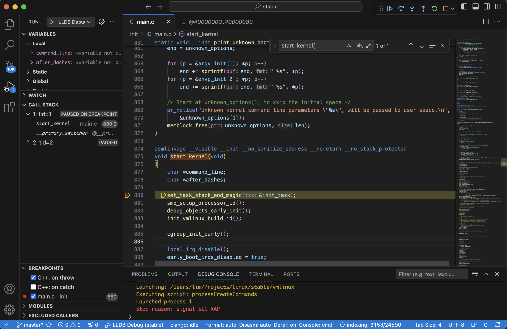

# 断点调试

**不要使用 M 芯片的 Mac 调试 Linux Kernel。有各种问题：1. 硬件加速导致无法打断点。2. 不支持硬件断点。**

本文用于 Mac M 的 Arm 芯片，如果使用的是 X86 平台，可以参考：https://zhuanlan.zhihu.com/p/675453558

Linux kernel 最新版本断点调试方法。在 Mac M 芯片上，采用 QEMU 和 LLDB 方案，根据需要可以自己改为采用 GDB，或者用于 Linux 平台。

## 1. 配置内核编译

去 `kernel.org` 下载最新的内核，然后开始编译。
首先安装依赖
```shell 
sudo apt update && apt install -y \
make \
flex \
bison \
lld \
bc \
libssl-dev \
iputils-ping \
clang \
lldb \
libelf-dev \
dwarves
```

配置编译选项

```shell
$ make menuconfig LLVM=-16
```
然后配置关闭内核地址随机化，并开启内核调试信息。

```
Kernel Features
    |-- Randomize the address of the kernel image 取消选中
Kernel Hacking
    |-- Compile-time checks and compiler options 
        |-- Debug Information 
        |   `-- 选 Generate DWARF Version 5 debuginfor.
        |-- Reduce debugging information 取消选中。
        |-- Produce split debuginfo in .dwo files.
        |-- Provide GDB scripts for kernel debugging. 如果使用 GDB 作为客户端就选中，并使用 `make scripts_gdb` 用于生成 GDB 扩展的 Python 脚本，具体可以查看： https://docs.kernel.org/dev-tools/gdb-kernel-debugging.html
```

保存退出后，开始编译
```shell
$ make -j $(nproc)
```

## 测试断点成功

安装 qemu
```shell
$ brew install qemu
$ qemu-system-aarch64 -machine virt -cpu cortex-a57  \
  -kernel arch/arm64/boot/Image \
  -append "nokaslr"\
  -nographic \
  -m 2G \
  -s \
  -S \
  -smp 2
```

`-s` 选项将使QEMU在 TCP 端口 1234 上侦听来自 GDB 的传入连接，`-S` 将使 QEMU 在 gdb 连接之前不启动客户机。如果需要使用其它端口，使用 `-gdb tcp::<端口号>` 参数，具体查看 [Qemu GDB 调试文档](https://www.qemu.org/docs/master/system/gdb.html)

这里有两点需要注意：
- Mac ARM 平台上使用 qemu-system-aarch64 不能使用 Mac 的虚拟化加速 Hypervisor框架(hvf)，否则会打断点会失败。不知道是因 QEMU 还不支持，还是 bug。报的错误信息是
```shell
warning: failed to set breakpoint site at 0xffff800081b70548 for breakpoint 1.1: error: 34 sending the breakpoint request
Breakpoint 1: where = vmlinux`start_kernel at main.c:876, address = 0xffff800081b70548
```
- arm 架构指定该参数反而导致没有输出 -append "console=ttyS0"

启动 LLDB 测试
```shell
$ lldb vmlinux
(lldb) target create "vmlinux"
Current executable set to '/Users/lim/Projects/linux/stable/vmlinux' (aarch64).
(lldb) settings append target.source-map /home/lim/stable/Users/lim/Projects/linux/stable
(lldb) gdb-remote 1234
Process 1 stopped
* thread #1, stop reason = signal SIGTRAP
    frame #0: 0x0000000040000000
->  0x40000000: ldr    x0, #0x18
    0x40000004: mov    x1, xzr
    0x40000008: mov    x2, xzr
    0x4000000c: mov    x3, xzr
(lldb) command unalias b
(lldb) b s -n start_kernel
Breakpoint 1: where = vmlinux`start_kernel + 32 at main.c:880:2, address = 0xffff800081b70568
(lldb) c
Process 1 resuming
Process 1 stopped
* thread #1, stop reason = breakpoint 1.1
    frame #0: 0xffff800081b70568 vmlinux`start_kernel at main.c:880:2
   877 		char *command_line;
   878 		char *after_dashes;
   879
-> 880 		set_task_stack_end_magic(&init_task);
   881 		smp_setup_processor_id();
   882 		debug_objects_early_init();
   883 		init_vmlinux_build_id();
(lldb)
```
可以看到断点正确的打在了 `start_kernel` 上，并且在断点处停止。 

## 配置 VsCode 可视化断点

### 磁盘镜像

为了让 Linux 运行时有 Linux 的完整文件系统，这样还能调试程序运行和系统调用。可以给 Linux 创建一个系统镜像，方法很多，一般使用 BusyBox，也可以使用 Qemu 已安装系统的系统文件镜像。这里使用更简单的方法，直接使用 syzkaller 的 create-image.sh 脚本。

复制脚本 `https://github.com/google/syzkaller/blob/master/tools/create-image.sh` 到一个 Arm Linux 系统中，然后运行以创建系统磁盘文件镜像。**因为要下载软件，执行之前强烈将系统的仓库替换为国内的镜像源，否则过程会非常漫长。**
```shell
$ ./create-image.sh
```
会生成一个`bullseye.img`，使用 QEMU 的 `-hda` 参数指定该文件。

### 配置 VsCode 
使用命令行没有使用图形化的工具方便，这里配置 VsCode 环境。首先给 VsCode 安装 clangd 和 codelldb。不使用微软官方的 C/C++ 插件 cpptools 是这个插件普遍反馈问题比较多。因为 C 语言有很多宏定义，VsCode 并不知道编译选项选择了什么。为了避免打开后很多地方报红色，找不到符号，可以给 clangd 生成 `compile_commands.json` 指导文件，而 Linux 内核就提供了完成此功能的工具。

```shell
scripts/clang-tools/gen_compile_commands.py
```

使用如下的命令启动 Qemu 调试，一般可以将其放到一个脚本文件中，方便以后使用。
```shell
qemu-system-aarch64 -machine virt -cpu cortex-a57  \
  -kernel ../arch/arm64/boot/Image \
  -append "root=/dev/sda earlyprintk=serial nokaslr"\
  -hda ./bullseye.img \
  -net user,hostfwd=tcp::10021-:22 -net nic \
  -nographic \
  -m 2G \
  -s \
  -S \
  -smp 2 \
  -pidfile vm.pid \
  2>&1 | tee vm.log
```

在 VsCode上 启动 Debug 调试时，先点击 `create a launch.json file` 生成一个文件。修改配置如下。
```json
{
    // Use IntelliSense to learn about possible attributes.
    // Hover to view descriptions of existing attributes.
    // For more information, visit: https://go.microsoft.com/fwlink/?linkid=830387
    "version": "0.2.0",
    "configurations": [
        {
            "name": "LLDB Debug",
            "type": "lldb",
            "request": "launch",
            "program": "${workspaceFolder}/vmlinux",
            "args": [],
            "cwd": "${workspaceFolder}",
            "processCreateCommands": [
                "gdb-remote 1234",
                "settings append target.source-map /home/lim/stable /Users/lim/Projects/linux/stable"
            ]
        }
    ]
}
```
然后运行调试，就可以打断点了，当然 Qemu 的启动，也可以在 VsCode 中编写一个 Task 用于断点调试时自动启动 Qemu，这个可以后期再优化。


