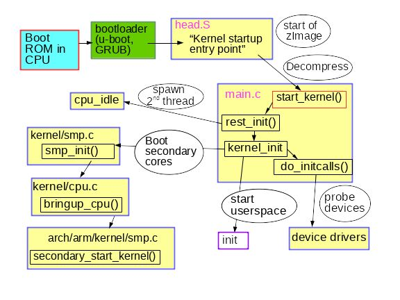

# 系统启动流程

计算机系统启动的流程冗长而复杂，从一个混沌的不可预知的状态逐渐变得井然有序，短短的几秒钟内系统做了非常多的事情，而且需要硬件、固件、软件多方合作。


计算机的启动流程可以分为四个大的阶段：

1. 固件启动

2. 引导程序阶段（该部分可选）

3. 内核阶段

4. init process.

操作系统的启动过程：

加电 --> system startup --> bootloader stage --> kernel stage --> init process.

引导这个词的英文是 bootstrap，其原始含义是 "拉鞋带"。看起来好像风马牛不相及，为什么会引申出引导的含义呢？这要回到计算机刚刚出现的年代。计算机启动是一个很矛盾的过程：计算机启动时为了运行程序，然而必须先运行程序将计算机初始化，进一步找到程序并运行程序。

早期为了解决这个问题，当时的解决办法是把一小段打孔的程序纸条塞给机器执行，然后计算机才能正常运行。所以，工程师们把这个过程叫做”拉鞋带”，工程师们用它来比喻计算机启动，久而久之 bootstrap 就有了引导的含义。与之相关的一个谚语是:

> pull oneself up by one's bootstraps



## 1. 固件启动（Boot ROM 如 BIOS/UEFI/）

现代计算机不再使用塞纸条的启动方式了，然而其启动流程本质上仍然没有变化：计算机启动先要运行一段引导程序。

计算机加电那一刻整个计算机处于一种未知的状态，全靠硬件电路的信号设置。即便是关机状态，开机按键也处于工作状态，当你按下它的那一刻，其向电源控制器发出信号，电源接收到信号后，给主板提供适量的电力。一个重置信号被发送到 CPU, CPU重置寄存器中的所有剩余数据，并为每个寄存器设置预定义值。从哪里开始执行呢？没错，CPU 的寄存器被设置的地址（CPU 要执行的指令由指令的寄存器指定，一般称为IP: Instruction Pointer 或者 PC: Programe Counter。）就是 CPU 开始执行的地方，因此这个地址一定要在开机时就有一段程序。现代计算机将这段程序烧录到被称为只读存储器的芯片中，并将其作为内存的一部分，能够被 CPU 直接访问，即使断电也不会消失。寄存器指向的地址就是[复位向量](https://en.wikipedia.org/wiki/Reset_vector)所在的位置，它一般是一条跳转指令，这样 Boot Rom 中的程序就开始执行了。

ROM 中的程序是只读的，并且在计算机生产是就被固化在内存中，因为不能随意改变，因此也被称为固件（Fireware）。不同类型的计算机上有不同的固件，Windows-Intel 类型的计算机上早期使用 BIOS，现在一般使用 UEFI 作为固件引导程序。安卓、苹果、其它计算机也都有各自的启动固件类型。对应嵌入式设备和其它专用设备，不会任意的改变启动的操作系统，固件也可以直接启动操作系统。例如 BIOS 和 UEFI 都能直接启动操作系统，Linux 内核也可以制作成 UEFI 的应用被直接启动。

固件会对计算机进行基本的自检和初始化工作，例如检查键盘和显示器，根据设置从哪个磁盘/软盘/U盘启动等等，并从其加载数据到内存并执行。不同类型的固件功能差异很大。

## 2. Bootloader

启动器则是操作系统的的固件之间的一个交接程序，负责将操作系统加载进内存。既然固件可以加载程序了，为什么还要加一个中间的 Boolloader 呢？这是因为固件的因为是固化在 ROM 中，不能修改和跟随计算机软件的快速变化。例如，BIOS 不能允许多启动，想要在 BIOS 的系统上安装多个操作系统，并且可以任意切换启动哪一个操作系统。解决办法是先让 BIOS 启动一个加载程序，然后这个程序显示多个系统的入口选项。在选择一个系统后，由 Bootloader 加载操作系统到内核。另一个原因是，操作系统的使用的文件系统格式不同，而且不断地迭代以及出现新的文件系统，固件由于不能改变，并不能支持这些新出现的文件系统。而且操作系统的文件格式以及加载方式可能也各不相同，想要固件尽数支持也是不可能的。因此一个操作系统加载程序的加入成了必然选择。

常见的启动器有 GRUB 和 U-boot，Linux 早期没有那么流行，使用自己实现的 LILO 加载操作系统，现在 Linux 已将这部分剥离出去，在不同的系统上由不同的启动器加载，例如在 Windows-Intel 类型系统上由 GRUB 自持，在嵌入式系统上由 U-boot 启动，还有其它不少类型的启动器都支持加载 Linux 内核。


## 3. 内核

实际上 bzimage 是由 vmlinux + 头文件 + 内核启动代码 被 gzip 压缩之后获得的。

编译好的 Linux 内核 vmlinux 不能被用于直接启动，而是需要压缩为 vmlinuz 等启动Image。 vmlinuz是一个统称，有两种详细的表现形式：zImage和bzImage(big zImage)，两者都是使用 gzip 压缩的，zImage 适用于小内核；bzImage 适用于大内核；vmlinuz 不能直接用 gzip 指令解压，因为在这个文件的开头嵌入了gzip的代码。所以首先用指令C找到真正的压缩文件的头部，这个指令的输出如下：
```
$ od -t x1 -A d vmlinuz-$(uname -r) | grep “1f 8b 08”
0018864 ac fe ff ff 1f 8b 08 00 00 00 00 00 02 03 ec fd
```

Linux 源代码树包含了一个可以解压缩这个文件的工具—— extract-vmlinux：
```shell
$ scripts/extract-vmlinux /boot/vmlinuz-$(uname -r) > vmlinux

$ file vmlinux

vmlinux: ELF 64-bit LSB executable, x86-64, version 1 (SYSV), statically

linked, stripped
```

gdb vmlinux 后加 info files 可显示 ELF 段 init.text。在 init.text 中用 l *(address) 列出程序执行的开头，其中 address 是 init.text 的十六进制开头。用 GDB 可以看到 x86_64 内核从内核文件 arch/x86/kernel/head_64.S 开始启动，在这个文件中我们找到了汇编函数 start_cpu0()，以及一段明确的代码显示在调用 x86_64 start_kernel() 函数之前创建了堆栈并解压了 zImage。


内核的解压缩在不同架构上由不同的主体负责，在 X86 和 ARM32 平台上，是由打包到 Linux 内核的 gzip 解压程序负责的，在 `arch/<type>/boot/compressed` 有负责解压的代码。但是一些架构的内核（例如 arm64）则由引导程序负责解压缩，则不会有 `compressed` 目录。在 [Linux 的邮件列表中讨论了为什么 Arm64 没有添加解压缩，以及 Arm32 添加解压缩是一个错误的选择](https://lore.kernel.org/all/?q=aarch64-kernel-image-decompression)。

当操作系统被加载到内存后，就会跳转到内核的第一条指令，内核开始执行。内核会在获得控制权之后进行各种设备的初始化。虽然固件程序已经初始化了一些设备，但内核会根据自己的需要再次进行初始化，以增强可移植性和健壮性。如内存管理，进程管理等，这个阶段 Linux 内核无法加载模块，这些设备以及文件系统的驱动程序必须同内核编译进同一文件，以便内核使用，不能使用模块方式。

### 预初始化

此时已经从 Bootloader 转移到 Linux 内核执行。在正式的内核初始化之前，由一段预初始化部分，这部分有两个目的：
1. 定义内核的入口地址，这个地址需要固定位置（固定地址或者加载地址的的固定偏移位置）这是 C 语言无法做到的，必须用汇编实现。

2. 已经设置了页表

3. 设置和初始化RAM

3. 传递硬件信息：
    内核需要硬件信息，有两种主要的数据存储方法：设备树device-tree 和 高级配置和电源接口（ACPI）表。内核通过读取这些文件了解每次启动时需要运行的硬件。


### 内核初始化

https://mp.weixin.qq.com/s/puA62ZMmteBPo0uIaHSHqg


架构固定的几个文件：
- head.S：内核的入口文件，定义内核加载的位置
- entry.S: 中断和异常入口
- proc.S: CTO 时间敏感的函数


1. 内核运行，解压缩、初始化硬件。
2. start_kernel() 各种初始化，最后运行 rest_init()
    - rest_init() **产生新进程**以运行 kernel_init(), 产生第二个线程运行 
        - kernel_init() 调用 do_initcalls() 
            - do_initcalls() initcalls 会历经七个连续的级别：early、core、postcore、arch、subsys、fs、device 和 late。initcalls 最为用户可见的部分是所有处理器外围设备的探测和设置：总线、网络、存储和显示器等等，同时加载其内核模块。
        - 

idle 0 有两个儿子
   1 号 systemd
   2 号 kthreadd
 


linux内核启动完成后，将运行启动控制程序，Linux2.6有3种方式进入启动控制程序，
Initramfs: 这是Linux2.6最新引入的启动控制方式。Initramfs是一个使用CPIO格式打包的文件，还原该文件将得到一个小型的Linux系统，linux内核将该系统作为启动系统，并将控制权交给其中的/init程序。
Initrd：Initrd文件是一个小型的文件系统，内部包含了启动所需的命令以及内核模块，内核将把该文件系统镜像到/Dev/ram0设备中，/Dev/ram0是内存磁盘设备，镜像还原后Linux内核会执行其中的/Linuxrc文件，该文件执行结束后返回linux内核，内核将执行权限交给根文件系统中的/sbin/init程序。
/sbin/init是标准的启动控制程序

Linux内核启动时，启动器传递给内核的启动参数中可指定init启动控制程序。即，“init=<程序的绝对路径>"，如设定inti=/bin/bash，内核启动完成后不执行默认的/sbin/init，将直接执行bash命令进入交互界面。
    
Initramfs和initrd都提供了一个小型的系统，该系统可根据不同的硬件环境进行特定的工作，这使得linux系统可以适应更多的硬件平台。
    
在LiveCD中就使用Initramfs或initrd老保证在大多数的同类计算机上正常使用，Initramfs和initrd还可以用来帮助使系统的启动过程更加灵活。启动控制程序也是各种Linux发行版特别照顾的地方，一些精简或专用系统为了提高运行速度，对这方面的优化挖掘是乐此不疲。
        
首先介绍比较传统的/sbin/init，该命令由Sysvinit软件包提供。inti命令有一个专用的配置文件inittab，该文件存放在/etc目录下，inittab文件可对linux系统的启动过程进行配置。常规的Linux系统设置了0~6级的启动方式，其定义如下
0：关闭计算机
1：单用户模式
2：无网络多用户模式
3：有网络多用户模式
4：保留为自定义，如无定义可视为运行级别3
5：同运行级别4，一般用于GUI的登录
6：重启系统

其中0和6在各发行版中的含义是相同的，而2~5级的可能会有所差别。但都是作为启动操作系统使用。在各级别启动模式中，程序根据需要加载执行，有些是共同的功能，比如加载必须的内核模块。还有一些就根据具体的的模式进行运行。现在有一些发行版尝试使用更先进的启动控制程序，比如openrc。与传统启动程序相比，这类启动程序进行各类启动的优化和改进，比如用二进制的程序代替脚本执行，采用并行的方式来提高启动速度。
    不管怎么样的启动控制程序，其目的都是在位用户环境进行准备，包括建立设备文件，启动服务等。完成这些工作之后，启动控制程序会将启动控制权限交给登录控制程序
4，登录控制程序
    linux是多用户系统，用户的登录是安全机制的一部分，也是启动过程中的一部分。在安全要求不高的情况下，有时系统也会使用自动登录的方式。登录控制程序有许多实现，表现形式也多种多样，如文本形式下的login程序，图形模式下的xdm、kdm和gdm等，通常的Linux使用密码的方式进行验证，当然也可以使用身份盘、指纹等验证方式。
        
    当用户顺利通过验证后，登录控制程序会按照相关的设置，为用户启动需要的程序，一般是允许用户跟系统进行交互的程序。如bash。
5，交互环境
    登录控制程序可以根据配置针对不同的用户启动不同的交互环境，比如bash会先去/etc中执行profile文件，之后执行用户目录下的.bashrc文件为用户设置个性化环境。在图形环境中，这个过程更加复杂。


## Doubt:

1. 各个架构的 CPU 复位指令所在的位置的乱七八糟，X86 在末尾的16字节。既然复位向量是要执行的第一条指令，为什么不在地址开始的位置？

2. 像 X86 这样复位向量和 BIOS 分在寻址范围的头和尾部，是不是这些地址都不能用于存储数据？

3.  