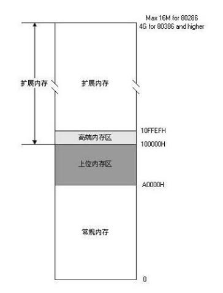
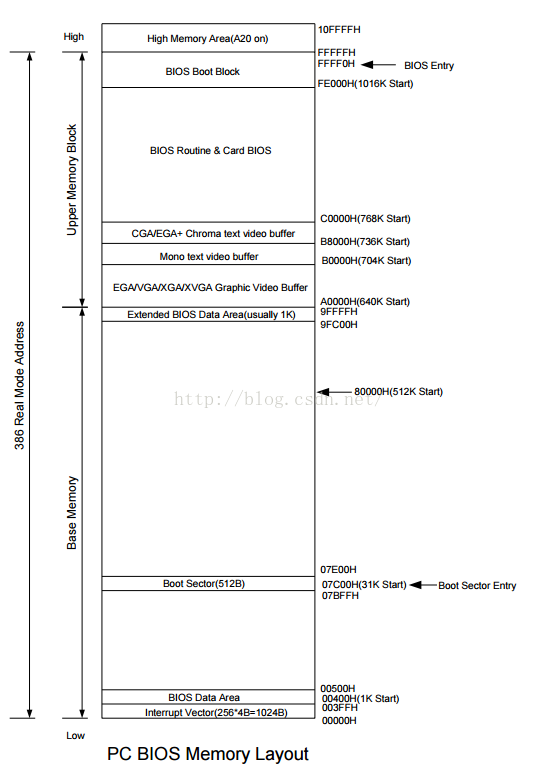

# X86 计算机内存的特殊限制

我们的机器中现在一般安装有1G甚至更大容量的内存。
我们可能经常听到一些只有在PC机上才有的一些关于存储器的专有名词，包括：常规内存（Conventional Memory）、上位内存区（Upper Memory Area）、高端内存区（High Memory Area）和扩展内存（Extended Memory），我尽量把这几个东东说明白，这需要下面这张著名的图。

- 低 1M 内存：因为最初的8086处理器20位地址线能够访问的内存最大只有1MB
    - 常规内存：前 640KB，是相对于上位区内存来说的，用于存放中断向量、BIOS 数据、自己的数据等。

    - 上位区内存：用于ROM和系统设备的地址区域。指的就是20位地址线所能寻址到的1M地址空间的上面384K空间。

- 扩展内存：由于 80286 和 80386 的出现使PC机的地址线从20位变成24位又变成32位，寻址能力极大地增加，1M以上的内存寻址空间，统称为“扩展内存”
    - 高端内存：扩展内存的绝大部分内存区域只能在保护模式下才能寻址到，但有一部分既可以在保护模式下，也可以在实模式下寻址，这就是我们前面提到过的地址100000h--10ffefh之间的这块内存，为了表明其特殊性，我们把这块有趣的内存区叫做“高端内存”

       
前面我们提过由于IBM的愚蠢设计给 PC 机的内存结构埋下了麻烦的伏笔，现在我们来说说这个麻烦。我们都见过PC机上的内存条，但是由于上位内存区的存在，这个内存条上的地址居然不能连续，就是说，这个内存条上要有0--A0000H的地址空间，还要有100000h--最大内存容量的地址空间，中间的384K地址空间必须留出来给ROM用，在现如今一个芯片就好几兆的情况下，你说这个内存条应该怎么做，当然我相信一定是可以做出来的，但肯定很麻烦，如果当初IBM把这个“上位内存区”放在地址低端，就是0--6000h这一部分，岂不是这个麻烦就没有了？！

但是，实际的内存条上地址都是连续的，并没有人把这段地址空间留出来给 ROM 使用，原因很简单，采用技术手段把这段地址空间空出来，比浪费这 384K 内存的成本还要高，所以在这个地址区域就出现了很奇怪的现象，ROM 和 RAM 的地址重叠。实际上，往往ROM并不能完全覆盖整个384K区域，这样就会有一些地址没有被ROM占用，那么这部分地址上的RAM仍然是可以使用的。实际上，和ROM重叠的这384K RAM一般也不会被浪费，说到这里，不得不说所谓的ROM Shadowing了，RAM和ROM的性能是有很大差异的，RAM的存取速度要远远大于ROM，而且RAM可以32位存取，ROM通常只能16位，所以目前的PC机对这块RAM和ROM重叠的区域的处理采用一种ROM Shadowing的技术方式，当机器加电后，先让ROM有效，RAM无效，然后读出ROM内容，再让ROM无效，RAM有效，把读出的ROM内容放到相同地址的RAM中，并把相应位置的RAM设定为只读，这样就把ROM搬到了RAM中，地址完全一样，只是性能比使用ROM要高些，这块RAM就好像ROM的Shadow一样。

前 1M 内存的详细作用：

- 基本内存：0x0 ~ 0x9FFFF 前 640KB
    - 0-3ff     1k 用于中断向量表

    - 400-4ff   256Bbios数据区

    - 500-7Bff  30kb  可自定义区域

    - 7C00-7BFF 512b MBR被bios加载到的内存区域

    - 7E00-9FBFF 608k 自定义区域

    - 9FC00-9FFFF 1kb  扩展bios数据区

- 上位区内存：0xA000H ~ 0xFFFFF 之间内存，用于ROM和系统设备的地址区域

    - A0000H～BFFFFH   要保留给显示卡的显存使用

        - A0000-AFFFF 64k  彩色显示适配器

        - B0000 B7FFF 32k  黑白显示适配器

        - B8000 BFFFF 32k  文本显示适配器。**就是显存的起始地址，向这段内存的第一页写入的内容将会立即显示，文本模式下，一整屏信息的的字符数是80(列)×25(行)＝2000,为了表示字符的不同颜色，每个字符用两个节存储，第一个字节时ASCII码，第二个字节是颜色码。2000*2=4000字节）**

    - C0000H～FFFFFH  **ROM 的映射区域，被保留给BIOS使用**。其中系统 BIOS 一般占用了最后的64KB或 更多一点的空间，显卡BIOS一般在C0000H～C7FFFH处，IDE 控制器的BIOS在C8000H～CBFFFH处。

        - C0000 C7FFF 32k 显示适配器bios

        - C8000 EFFFF 160k 映射硬件适配器的rom或者内存映射i/o

        - F0000 FFFEF 64kb-16b  真正的入口

        - FFFF0 FFFFF 16b bios入口地址(跳转使用.因为空间有限)

**以下在实模式阶段.我们是可以随意使用的区域**

- 7E00-9FBFF 608k 自定义区域

- 500-7Bff  30kb  可自定义区域

