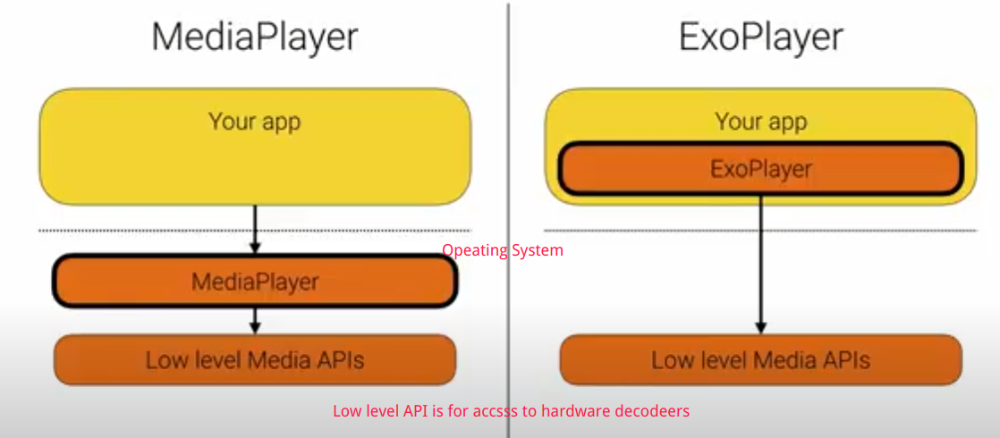
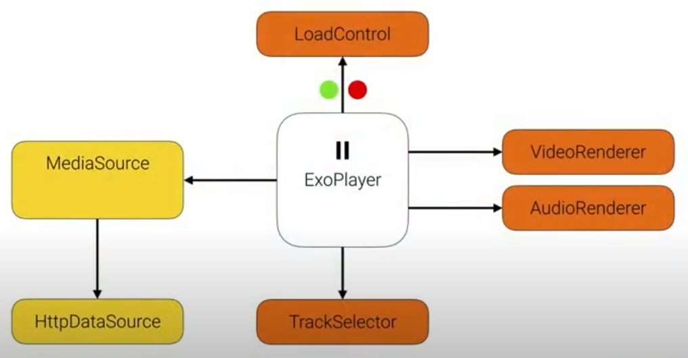

# ExoPlayer

> 是什么？

建立在 Jelly Bean 之上的开源 Media playback library for android.(Java 语言编写)。相比于 MediaPlayer，它是一个应用层的　


> 特性

支持 DASH 和流媒体播放，MultiPeriod DASH。
使用 MP4 作为基础的封装格式
支持常用加密
支持使用 OKHttp 作为网络请求组件

- Core:
    - DRM
    - SimpleExoPlayer
    - Playback UI
    - Tomelines
    - Gapless audio

- Adaptive
    - DASH
    - Smooth Streaming
    - HLS
    - MultiPeriod DASH
- Containers
    - FMP4
    - WebM
    - MPEG-TS
- 字幕
    - TTML
    - WebVTT
    -流媒体、DASHA-608
- Extensions


> 什么时候使用

MediaPlayer 支持到最早，ExoPlayer 支持4.1 开始的系统
MediaPlayer 简单场景，只支持离线播放。ExoPlayer 支持自适应播放、流媒体、DASH、媒体合成、缓存等。
Mediaplay 黑盒封装。ExoPlayer 可定制和扩展。

ExoPlayer 更多的在应用层，只有少部分对硬件的访问，在安卓系统层。而 MediaPlayer 则基本都在系统层。


ExoPlayer 新特性可以完全向后兼容，而 MediaPlayer 新特性仅最一部分发行版起作用。如倍速播放。

Bug 修复能够及时通过更新解决，而 MediaPlayer 由于依赖于系统，则很难修复历史版本中的 Bug。


> 组成部分
> 高级特性

```
MediaSource 数据源。
ExoPlayer 播放器。

```


> 内部机制

内部组件

- Renderers（渲染器）： 当 MediaPlayer 获得到 MediaSource 后，由 Renderers 负责渲染，如 VideoRenderer 负责解码和播放视频，AudioRenderer 负责解码和播放音频。还有其他的 Renderer 负责 text 和 metadata。

- TrackSelector: 一个 MediaSource 可能暴露多个 track 用于回放。特别是对于 HASH MediaSource 和 HLS MediaSource 会在不同的方案中暴露多个视频流。TrackSelector 的作用就是选择这些被缓存和播放的 Tracker 的子集。

- LoadContral: 负责两个部分：1，告诉 MediaSource 当前时间是否需要缓存。第二个作用是告诉播放器从何处开始播放。

- DataSources: MediaSource 实际执行数据加载的组件。




> 如何工作的， 播放如何实现

如何协作的？

1. 刚开始时，还没有缓存任何数据。LoadContral 告诉 MediaSource 应该开始缓存数据了。然后 MediaSource 开始使用 DataSource 加载数据。

2. 当 MediaSource 加载了足够多的数据之后，可能只是开始的一部分数据。MediaSource 检测到可以将其暴露给 player。它使用 TrackGroups 暴露这些数据给 player.
3. TrackSelector 选择播放哪一个 track.

4. TrackSelector 需要一些额外的 Renders 来负责渲染。由于不同设备支持播放的功能不一样，可能需要不同的渲染器。例如，MediaSource 可能提供了 4K 的数据源，但是由于设备分辨率较低，实际上仍然需要转码程低分辨路的视频。每个 Render 对象内部都有一个 RenderCapabilities 对象用于描述它能处理什么。

5. TrackSelector获取到了 TrackGroups 和 RenderCapabilities 后，产生一个 selection 返回给 MediaSource. 

6. MediaSource 此时就知道了该缓存什么，它申请一些缓存，此时还没有加载任何可用的播放数据。

7. 此时 MediaSource 继续加载数据，直到缓存区变满。此时 Renderer 也在不停地消费 Buffer 中的数据。并将数据传给解码器准备播放。

8. 此时， MediaContral 可能开始执行播放。 此时形成一个生产者消费者的循环。

9. 当 MediaSource 缓存有一些数据，当然并不想缓存过多的数据，此时 MediaContral 可能停止 MediaSource 加载数据。当数据逐渐消耗，缓存变少时，MediaContral 又开始通知 MediaSource 开始加载数据。

**需要注意的是，整个流程的复杂还有数据源可能是多个 MediaSource 复合成的，例如多个视频播放。在播放过程中可能产生新的 Selection 返回给 MediaSource**


> 如何定制和微调以适应特殊应用场景

定制：

通过 ProgressiveMediaSource.Factory 在创建是传入不同的内部组件，达到定制的目的。

通过定制不同的组件，来进行微调。