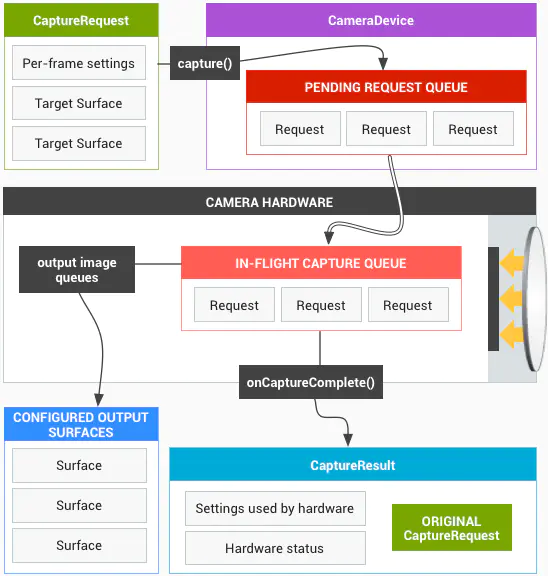

# 摄像头

从 Android 5.0 推出 Camera2，现在又推出了 CameraX 来简化摄像头的开发，CameraX 是建立在 Camera2 上层的 API，开发中我们可以使用 CameraX 开发来简化代码和增强兼容性。但是熟悉底层能更好的理解摄像或者做一些复杂的操作或者优化。至于 Camera1 从 5.0 就被弃用了，现在 5.0 之上的手机已经 95% 了，以后会更多，除非是在维护一个老应用，否则实在没有必要了解了。

## 摄像头技术概览

Android 摄像头使用 CS 设计，有一个专门的服务(服务端)用于拍摄。客户端（app）通过发送请求获取数据。

底层的拍照系统采用了 Pipeine 模型，这是因为，摄像头的命令并不是单个独立的，对于连拍，预览，视频拍摄等，可能在拍摄过程中，需要有调整焦距等设置不断地到来。这些请求都被抽象成 `CaptureRequest` 放在队列中，以流的形式一个接一个被处理。

Camera2 的架构模型

1. App 发送 CaptureRequest 到相机 Service。

2. 服务接收到请求后，它将 CaptureRequest 放在 CameraDevice 的 `Pending request queue` 的队列中。

3. Camera Hardware 在处理完一个 CaptureRequest 后（即 In-flight capture queue 空闲），它从 `Pending request queue` 取若干个待处理请求，放到 `In-flight capture queue` 中，用于处理。程序根据 Request 的参数进行参数调整或者采样数据。

4. 如果是一个图像数据获取请求，将通过硬件采样的图像数据放到 Surface 中，将数据包装到 CaptureResult 中，

5. 应用 (服务端) 通过回调获取到不同的 Serface 可以从中获取图片数据，还会得到一个有关次拍照信息的 RequestResult。

## Camera API 开发流程

## API 宏观流程

1. 声明权限和动态请求权限。

2. 通过 applicationContext.getSystemService(Context.CAMERA_SERVICE) 获取CameraManager.CameraManager 可以用于获取 CameraDevice, CameraId，以及通过 CameraId 查询 camera 所能支持的各个功能。
    1. 通过 CameraId 查询 camera 的 metadata.
    2. 通过 medadata 查询 camera 的各种特性（Characteristics）。通过这些特性来查找符合条件的摄像头，例如先后摄像头，分辨率等。然后返回符合条件的 Camera 的 Id

3. 调用CameraManager.openCamera() 通过 Camera ID 打开摄像头。在设置的回调中得到 CameraDevice。CameraDevice 用于实际的摄像头操作。

4. 通过 CameraDevice.createCaptureSession() 回调中 获得 CameraCaptureSession 链接摄像头的会话。

5. 构建 CaptureRequest, 有预览/拍照/录像等多种模式可选，按照 2 中查询到的功能进行设置。

5. 通过 CameraCaptureSession 会话发送 CaptureRequest 请求。需要创建一个 Surface 用于接收图像数据。`setRepeatingRequest` 用于不断采样数据，这对于预览图像特别有用。 `captureXXX` 用于发送单次执行的请求，适用于拍照。在 CaptureResult 中得到请求的其它相关信息。

### 5.2 capture

因为相机所有的操作都是为了采集图像，要么用于预览，要么用于保存成文件，甚至是视频。所以 Camera2 将包括对相机操作和参数设置的请求都抽象成了 `Capture`， 例如对焦、调节曝光补偿、预览、连拍等，都用发送一个 CaptureRequest 到相机服务。在 Camera1 中有 `setFlashMode`、`setFocusMode`、`takePicture`，Camera2 统一抽象成了 Capture 操作。

**每个 CaptureRequest 都必须设置一个 Surface 作为目标输出。可以重复设置，例如预览的 SurfaceView 要调整参数，其中的 SurfaceView.holder.surface 可以重复使用。**

如果要拍照，创建 `ImageReader` 对象，将 `CaptureRequest` 的 target 设置为 `ImageReader` 的 `Serface` 内部对象。 给 `ImageReader` 设置 `OnImageAvailableListener` 监听，在监听器中获得拍照的数据和当前 Camera 当前的状态。

Capture 从执行方式上又被细分为【单次模式】、【多次模式】和【重复模式】三种，我们来一一解释下：

- **单次模式（Single）**：指的是只执行一次的 Capture 操作，例如设置闪光灯模式、对焦模式和拍一张照片等。多个一次性模式的 Capture 会进入队列按顺序执行。

- **多次模式（Burst）**：指的是连续多次执行指定的 Capture 操作，该模式和多次执行单次模式的最大区别是连续多次 Capture 期间不允许插入其他任何 Capture 操作，例如连续拍摄 100 张照片，在拍摄这 100 张照片期间任何新的 Capture 请求都会排队等待，直到拍完 100 张照片。多组多次模式的 Capture 会进入队列按顺序执行。

- **重复模式（Repeating）**：指的是不断重复执行指定的 Capture 操作，当有其他模式的 Capture 提交时会暂停该模式，转而执行其他被模式的 Capture，当其他模式的 Capture 执行完毕后又会自动恢复继续执行该模式的 Capture，例如显示预览画面就是不断 Capture 获取每一帧画面。该模式的 Capture 是全局唯一的，也就是新提交的重复模式 Capture 会覆盖旧的重复模式 Capture。

- capture	送一个CaptureRequest给Camera底层，通过Handler指定回调线程	    API 21
- captureBurst	送一组CaptureRequest给Camera底层，通过Handler指定回调线程	API 21
- setRepeatingRequest	送一个Repeating CaptureRequest给Camera底层，通过Handler指定回调线程	API 21
- setRepeatingBurst	送一组Repeating CaptureRequest给Camera底层，通过Handler指定回调线程	API 21

上面的 API 通过 Handler 指定线程，Android 28 新增了 4 个使用 Executor 指定线程的 API。跟上面的四个方法一一对应。

- captureSingleRequest	送一个CaptureRequest给Camera底层，通过Executor指定回调线程	API 28
- captureBurstRequests	送一组CaptureRequest给Camera底层，通过Executor指定回调线程	API 28
- setSingleRepeatingRequest	送一个Repeating CaptureRequest给Camera底层，通过Executor指定回调线程	API 28
- setRepeatingBurstRequests	送一组Repeating CaptureRequest给Camera底层，通过Executor指定回调线程	API 28

## AE/AF Region

## 4 CameraManager
Android 可以有多个相机，硬件资源应当由系统负责调度，CameraManager 就是一个负责查询和建立相机连接的系统服务，它的功能不多，这里列出几个 CameraManager 的关键功能：

- 将相机信息封装到 CameraCharacteristics 中，并提获取 CameraCharacteristics 实例的方式。

- 获得所有可用相机的 ID，根据指定的相机 ID 连接相机设备。

- setTorchMode 在不打开相机设备的情况下，设置闪光灯的闪光灯模式。提供将闪光灯设置成手电筒模式的快捷方式

- 注册 AvailabilityCallback 用于监听摄像头可用性回调。可能对于外接摄像头有用，或者当相机中途突然无法使用时处理异常。不用时需要取消注册。

- 注册 TorchCallback 监听闪光灯的状态，对于一些手电筒应该有用。

## CameraDevice

CameraDevice 类是连接到 Android 设备的单个摄像头的表示，允许以高帧速率对图像捕获和后处理进行细粒度控制。CameraDevice 的功能则十分的单一，就是只负责建立相机连接的事务，而更加细化的相机操作则交给了稍后会介绍的

- 根据指定的参数创建 CameraCaptureSession。

- 根据指定的模板创建 CaptureRequest。可以用于调整相机参数和控制相机。创建 `CaptureRequest` 需要指定一个模板参数。类型有：

| 常量名 | 解释 |
| ----- | ---- |
| TEMPLATE_MANUAL |  用于调整相机参数的模板，如焦点，曝光。 |
| TEMPLATE_PREVIEW |  创建一个适合于相机预览窗口的请求。 |
| TEMPLATE_RECORD |  创建一个适合于视频录制的请求。 |
| TEMPLATE_STILL_CAPTURE |  创建一个适合于静态图像捕获的请求。 |
| TEMPLATE_ZERO_SHUTTER_LAG |  创建一个适用于零快门延迟的请求。 |
| TEMPLATE_VIDEO_SNAPSHOT | 在录制视频时创建一个适合静态图像捕捉的请求。 |

- 关闭相机设备。

- 监听相机设备的状态，例如断开连接、开启成功和开启失败等。

## CameraCaptureSession

对摄像头的链接，可以用于发送 Capture 用于操作摄像机。

## 输出格式

Camera2 开始默认支持 YUV 图像格式。此外还有 RAW 和 JPEG。对于YUV格式输出,视频/图像都推荐YUV_420_888

参考 
https://www.jianshu.com/p/9a2e66916fcb
https://blog.csdn.net/sjy0118/article/details/78748941
https://blog.csdn.net/afei__/article/details/85960343
https://www.jianshu.com/p/1e82021b10b4
https://www.jianshu.com/p/23e8789fbc10
[屏幕旋转](https://www.cnblogs.com/raomengyang/p/5426525.html)

底层

https://www.cnblogs.com/blogs-of-lxl/p/10651611.html
