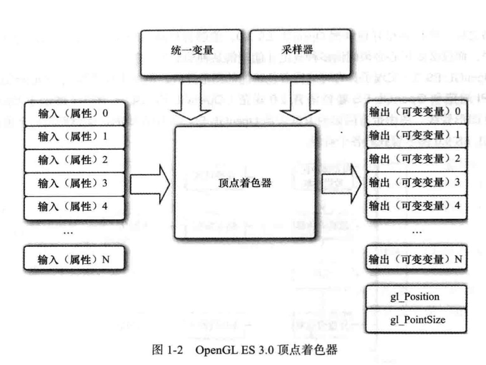

# Vertex Shader



一个顶点着色器的示例。
```c
#version 300 es 
uniform mat4 u_mvpMatrix; // Matrix to convert a_position
                         // from model space to normalized 
                         // devide space.

// attributes input to the vertext shader
in vec4 a_pisition;      // 输入位置属性
in vec4 a_colorl         // 输入颜色属性

// output of the vertex shader --- input to fragment shader.
out vec4 v_color;        // 输出每个顶点着色器的颜色。
void main() { 
    v_color  = a_color;
    gl_Position = u_mvpMatrix * a_pisition;
}
```

1. 所有的着色器的第一行都必须是 `#version 300 es`，用于表示着色器的版本，用于区别版本以处理兼容性。 `300 es` 表示 `openGL ES 3.00` 版本。

2. `uniform` 表示不可变数据，类似 C 语言中的 `const`。

3. 使用 `in`/`out` 标识时输入还是输出。

4. u_mvpMatrix 存储组合模型视图和投射矩阵。

5. `a_pisition` 和 `a_colorl` 描述顶点着色器的输入，被称为顶点属性。

6. `gl_Position` 是内建变量，是自动声明的。每个顶点着色器必须在 gl_Position 中输出一个位置。这个变量定义传递到管线下一个阶段的位置。

7. `main` 函数称为着色器主函数，它是着色器执行的入口点。

> 顶点着色器的输入包括：

- 着色器程序——描述了顶点上执行的操作的顶点着色器程序源代码或者可执行文件。
- 顶点着色器输入（或者属性）：用顶点数组提供的每个顶点的数据。
- 统一变量（uniform）——顶点或者片段着色器使用的不变数据。
- 采样器——代表顶点着色器使用纹理的特殊统一变量类型。 


