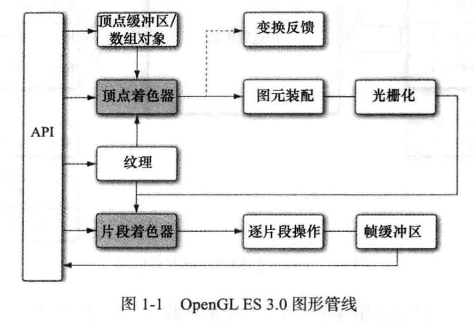
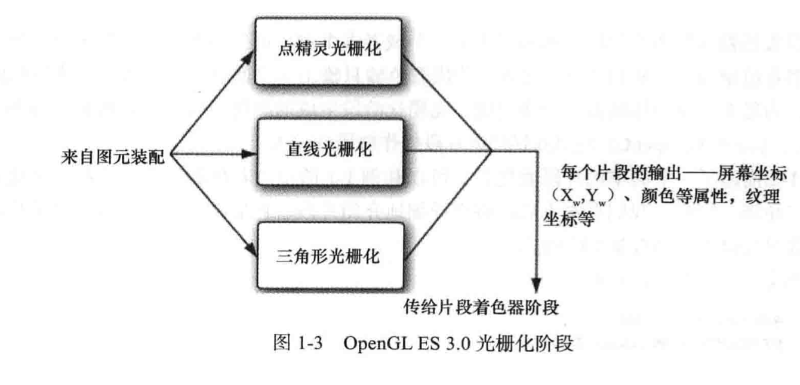
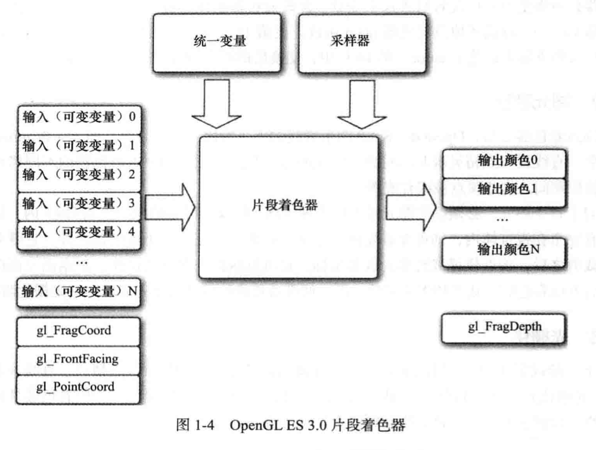

# OpenGL ES


| OpenGL ES版本 | Android版本 | 描述 |
| -------------| ----------- | --- |
| OpenGL ES3.0 | Android 4.3(API 18)+ | 向下兼容OpenGL ES 2.x，Android 4.3(API 18)及更高的版本支持这个API规范。|
| OpenGL ES3.1 | Android 5.0 (API 21)+ | 向下兼容OpenGL ES3.0/2.0，Android 5.0（API 21）和更高的版本支持这个API规范 |

| Vulcan | Android 7.0 (API 24)+ | 与 OpenGL API 不兼容 |

OpenGL ES 3.0 包括两部分：

- OpenGL ES 3.0 API 规范

- OpenGL ES着色语言3.0规范(OpenGL ES SL)。


https://www.jianshu.com/p/79511ef8ac95

三本经典OpenGL ES的著作：

1. OpenGL ES 2. 0 Programming Guide.pdf

2. OpenGL ES Game Development.pdf

3. Mobile 3D Graphics with OpenGL ES and M3G.pdf


## Vulkan 

科纳斯最先把VulkanAPI称为“下一代OpenGL行动”（next generation OpenGL initiative）或“glNext”， [2]  但在正式宣布Vulkan之后这些名字就没有再使用了。就像OpenGL，Vulkan针对实时3D程序（如电子游戏）设计，Vulkan并计划提供高性能和低CPU管理负担（overhead），这也是Direct3D12和AMD的Mantle的目标。Vulkan兼容Mantle的一个分支，并使用了Mantle的一些组件。

[API24 (安卓 7.0)](https://developer.android.com/ndk/guides/graphics/getting-started) 开始支持。鉴于安卓碎片化严重，除了游戏开发者，现在还不是入手的好时机。


## 介绍

OpenGL ES 3.0 实现了具有可编程着色功能的图形管线，由两个规范组成： OpenGL ES API 规范和 OpenGL ES 着色语言规范（OpenGL ES SL）。

图中带阴影的方框表示 OpenGL ES 3.0 中管线的可编程部分。


### 1. 顶点着色

OpenGL 的可编程着器有两种：顶点着色器，片段着色器。他们都使用着色语言描述，SL 是一种类似 C 语言的可编程语言，以此实现通用的对顶点的操作。

一个简单的着色实例：

```c
#version 300 es 
uniform mat4 u_mvpMatrix; // Matrix to convert a_position
                         // from model space to normalized 
                         // devide space.

// attributes input to the vertext shader
in vec4 a_pisition;      // 输入位置属性
in vec4 a_colorl         // 输入颜色属性

// output of the vertex shader --- input to fragment shader.
out vec4 v_color;        // 输出每个顶点着色器的颜色。
void main() { 
    v_color  = a_color;
    gl_Position = u_mvpMatrix * a_pisition;
}
```

它是一种类似 C 语言的可编程语言。仅看一下样子，我们用这些描述顶点和片段。用于组成图元。

### 图元配置

顶点着色器之后，图形管线的下一阶段是图元配置。图元是三角形、直线或者点精灵等几何对象。图元的每个顶点被发送到顶点着色器的不同拷贝。在图元装配期间，这些顶点配装配成图元。

对于每个图元，必须确定图元是否位于视锥体（屏幕上可见的3D 空间区域）内。如果图元没有完全在视椎体内，则有可能需要裁剪。如果图元完全处于视锥体外，它就会被抛弃。

裁剪或者淘汰之后，图元便会准备传递给管线下一阶段——光栅化阶段。

### 光栅化

此阶段绘制对应的图元。光栅化是将图元转化为一组二维片段的过程，然后片段由片段着色器处理。这些二维片段代表着可在屏幕上绘制的像素。




### 片段着色器

片段着色器为片段上的操作实现了通用的可编程方法。对光栅化阶段生成的每个片段执行这个着色器，采用如下输入。

- 着色器程序——描述片段上所执行操作的操作的片段着色器源程序或者可执行文件。
- 输入变量——光栅化的输出。
- 统一变量——片段着色器使用的不变数据。
- 采样器——代表片段着色器所用纹理的特殊统一变量类型。



片段着色器的结构基本和顶点着色器一样。需要注意的是：

- 顶点着色器必须输出和片段着色器读入的同一组变量。


### 逐片段操作

片段着色器之后，下一阶段是逐判断操作。光栅化生成的屏幕坐标为（Xw,Yw）的片段只能修改帧缓冲区中位置为（Xw,Yw）的像素。片段操作其实是对二维图像的像素级操作。是对于绘制到屏幕上的屏幕缓冲区之前的最后操作阶段。


## CMAKE 配置

EGL 在各个平台上不分版本，而 GL ES 需要限定版本。

```cmake
target_link_libraries( # Specifies the target library.
        gl_es
        ${OPENGL_LIB}
        android
        native_app_glue
        EGL
        GLESv3
        # Links the target library to the log library
        # included in the NDK.
        ${log-lib})
```

虽然指定了 ES 3，但是由于向上兼容。ES1 和 ES2 平台的代码也在，在导入文件是。

```
#include <EGL/egl.h>
#include <EGL/eglext.h>

#include <GLES3/gl3.h>
// 而不是, gl3 中定义了 3 中的全部头，如果早期的版本中的定义，在 3 中不存在，应该是已经删除了。
// #include <GLES/gl.h>
```