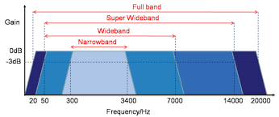

# 声音的物理特性和描述

初中的物理我们就学过，物体震动产生声波，通过介质传播。最初发出振动的物体称为声源。

人耳识别的声（频率在20 Hz~20K Hz之间，不同人会有差异），能被人听到称之为声音。低于 20 Hz 的称为次声波。频率超出 20KHz 的声波称为超声波。

20 Hz~20K Hz之间频宽范围被划分成四个频宽类别：窄带、宽带、超宽带和全带。

声波根据传播的介质不同，传输的速度不同，可以使横向波，也可以是纵向波。在空气中传播的就是纵向波，所谓纵向波就是震动方向和传播方向相同。

通常说来，声波可以在弹性媒介中传播，如空气、液体和固体等，但不能在真空中传播。弹性介质中粒子的运动产生任何振动行为（如振动的平板，扬声器等）都可以当成一个声源。振动的粒子的前后运动使介质产生交替的按正弦变化的稠密（C）和稀疏（R）部分，如下图所示。产生的压力波在介质中以速度c进行传播。

![声音产生的原理][1]
振动导致空气的密度发生变化，空气密度不同，就产生了压强。
![声音产生的原理][2]

对同一位置的压强随时间变化的采集就能够描述声波。
![声音产生的原理][3]

## 声波的特性

波有着一些共同的特性。根据振动是否具有周期性，分为周期性声波和非周期性声波，最简单的周期声波是单频的声波，也称为纯音。它是由简谐振动产生的频率固定、并按正弦变化的声波。

$$A(t) = A_0sin(2\pi ft + \theta)$$

- 其中，$A_0$：振动幅值；

- $f$：每秒钟的循环次数，也等于1/T，$t$为完成一个振动循环所需要的时间；

- $\theta$：初相位。

![sound_wave][4]

**波长** 是指周期声波中相邻的等声压点之间的距离，通常用 $\lambda$ 表示。波长等于声速 $c$ 与声波频率 $f$ 之比，也等于声速 $c$ 与周期 $T$ 之积，即

$$\lambda = \frac{c}{f} = c·T$$

与单频音相对应的是复合声，复合声（也称为复声）是由一些频率不同的单频音组成，由傅立叶变换可知，可将任何复声分解成一系列单频音。

### 振幅

振幅、波长、波峰、波谷、

## 比特率

Bitrate(kb/s)

[1]: ./sound_img/audio1.jpeg
[2]: ./sound_img/audio2.jpeg
[3]: ./sound_img/audio3.jpeg
[4]: ./sound_img/sound_wave.jpeg
[音频算法学习和应用谱图](https://blog.csdn.net/ssdzdk/article/details/75577240)