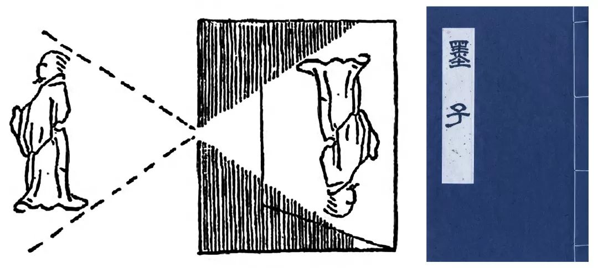
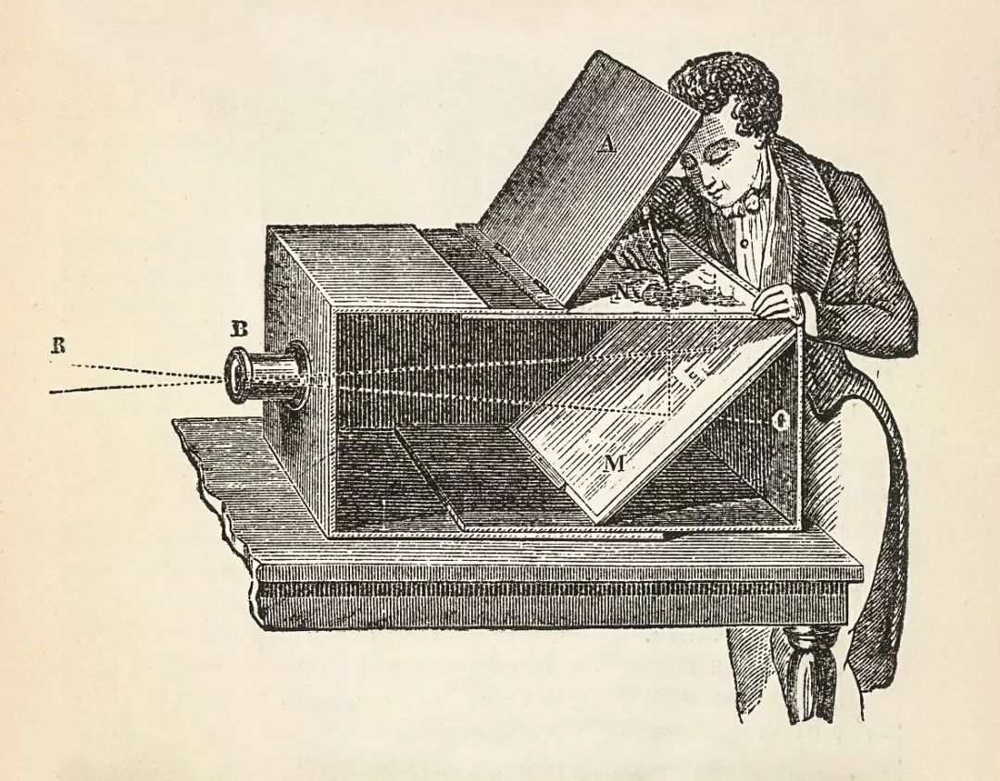
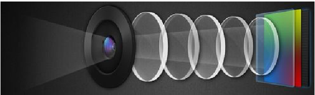

# 采样(Capture)

> 音视频采集

尽管我们直觉上以为视频总是有声音的，但是就跟耳朵和眼睛是两个独立的器官一样，设备上的视频和音频采集也是由两个独立的传感器采集的。具体的采集方式依赖于设备，驱动程序等原生代码，除非做系统层或者驱动程序开发，一般不用接触到音视频采集代码。

## 图像、视频采样

### 图像

懂点生物学的人应该知道人们能看到物体是视网膜细胞能够感受到光，将光转化成电信号传给大脑。在人接受到的信息中大约70%来自眼睛，可见，图像信息信息对于人的重要性。对于图像的采集就类似于人眼睛看到的景象。人们最早可能还没有理解眼睛的工作原理——小孔成像——的时候，通过对自然观察，已经认识到了小孔成像现象。在公元前前5世纪，墨子《墨经·经下》中就记载了小孔成像现象。

古希腊时期（公元前4世纪），哲学家亚里士多德也在他的著作中描述了倒影成像这一自然现象。

而真正最早将小孔成像原理应用到实际生产的，其实是文艺复兴时期的暗箱。由于小孔成像能够等比例的将一个大的场景缩小，暗箱成为画家和绘图者理想工具。

最早的图像仅能靠人绘制下来，绘制的过程缓慢而很难达到完全一致。后来热门对于化学研究开始萌芽后，开始寻求使用其他方式来成像。

1816年，约瑟夫·尼塞福尔·尼埃普斯（ Joseph Nicéphore Nièpce）和他的兄长二人，用暗箱在一张含有氯化银的纸上得到负像，但没有成功获得正像。约1826年，在勃艮第自家庄园阁楼上，尼埃普斯用涂有沥青的白镴板置于暗相中，对着窗外的风景经过长达8个小时的曝光，成功拍摄了摄影史上第一张永久保存的照片。他把这种拍摄法称为“日光蚀刻法”。1829年尼埃普斯遇到达盖尔，两人达成合作共同推进摄影术的研究，可惜的是，1833年尼埃普斯因病去世。1839年以达盖尔摄影法宣布摄影术诞生后，作为摄影术发明人达盖尔获得了每年6000法郎的津贴，尼埃普斯的儿子也获得了每年4000法郎。

经过不断的演进，形成了近代的摄影技术。然而这些摄影技术都是基于物理介质的，在电脑等存储器出现之后，人们开始想将图像存储到电脑中。于是人们图像分成一个一个的点。每个点别成为一个像素。每个像素的颜色单独记录，基于画家对调色经验的理解，人们将颜色记录为[红，绿，蓝]三原色的数据。

类似的还有 YUV 表示方法。YUV(亦称YCrCb)是被欧洲电视系统所采用的一种颜色编码方法。其中“Y”表示明亮度（Luminance或Luma），也就是灰阶值；而“U”和“V” 表示的则是色度（Chrominance或Chroma）

Y'UV的发明是由于彩色电视与黑白电视的过渡时期。黑白视频只有Y（Luma，Luminance）视频，也就是灰阶值。到了彩色电视规格的制定，是以YUV/YIQ的格式来处理彩色电视图像，把UV视作表示彩度的C（Chrominance或Chroma），如果忽略C信号，那么剩下的Y（Luma）信号就跟之前的黑白电视频号相同，这样一来便解决彩色电视机与黑白电视机的兼容问题。Y'UV最大的优点在于只需占用极少的带宽。
因为UV分别代表不同颜色信号，所以直接使用R与B信号表示色度的UV。也就是说UV信号告诉了电视要偏移某象素的的颜色，而不改变其亮度。或者UV信号告诉了显示器使得某个颜色亮度依某个基准偏移。UV的值越高，代表该像素会有更饱和的颜色。
彩色图像记录的格式，常见的有RGB、YUV、CMYK等。彩色电视最早的构想是使用RGB三原色来同时传输。这种设计方式是原来黑白带宽的3倍，在当时并不是很好的设计。RGB诉求于人眼对色彩的感应，YUV则着重于视觉对于亮度的敏感程度，Y代表的是亮度，UV代表的是彩度（因此黑白电影可省略UV，相近于RGB），分别用Cr和Cb来表示，因此YUV的记录通常以Y:UV的格式呈现。

现在的图像传感器可以直接采集数字信号。主要的传感器有两种。

图像传感器（sensor）
传感器：即感光元件CCD或CMOS。

CCD就像传统相机的底片一样的感光系统，是感应光线的电路装置，你可以将它想象成一颗颗微小的感应粒子，铺满在光学镜头后方，当光线与图像从镜头透过、投射到CCD表面产生电流，将感应到的内容转换成数码资料储存起来。CCD像素数目越多、单一像素尺寸越大，收集到的图像就会越清晰。

CMOS则是金属氧化物半导体组件，它和CCD一样负责将光线转变成电荷。只是工艺不同。目前手机摄像头几乎全部使用CMOS传感器。

CCD的优势在于成像质量好，但是制造工艺复杂，成本高昂，且耗电高，应用于摄影摄像方面。在相同分辨率下，CMOS价格比CCD便宜，但图像质量相比CCD来说要低一些。CMOS影像传感器相对CCD具有耗电低的优势，加上随着工艺技术的进步，CMOS的画质水平也不断地在提高，所以目前市面上的手机摄像头都采用CMOS传感器。

传感器每采集一次信号，都记录下一张图像，也就是我们所说的图片。对于运动的物体，由于时间任意两个时刻之间都有无数的时间点，我们无法记录每一时刻的映像，那样的数据将是天文数字。同时也没有必要记录那么多数据，相隔较短时间内的物体基本上不动的。通过研究人们发现，由于视网膜存在图像残留，每秒钟播放的图片帧数达到 70 张时，人就无法分辨出两个图片。

## 声音采样

声音（sound)也是波的一种，是由物体振动产生的，然后通过介质（空气或固体、液体）传播。它能被人或动物听觉器官所感知。可以被人耳识别的声（频率在20 Hz~20000 Hz之间），我们称之为声音。

最初发出振动（震动）的物体叫声源。声音以波的形式振动（震动）传播。声音是声波通过任何介质传播形成的运动。
声音是一种波。