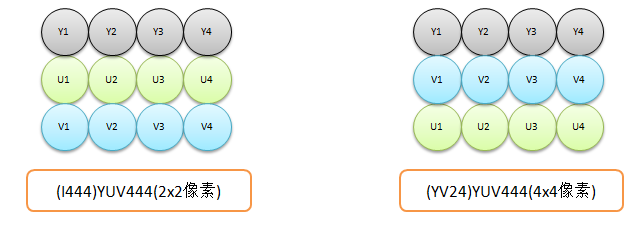

# ImageFormat

定义了图像格式和尺寸等相关的信息。

## 颜色表示

我们知道现在主流的颜色表示有 RGB 和 YUV。对于颜色的研究，花费了一代又一代人的努力，早在还没有电子器件的时代，人们为了绘画就开始研究颜色的组成，人们就发现品红、黄、青(天蓝)(或者多一个黑色CMRK) 混合可以创造出任何颜色。

到了文艺复兴时期，人们发明了各种棱镜，从对光的研究中发现，光不是有一种颜色组成的，而三种颜色RGB）：红、绿、蓝(靛蓝) 通过不同的亮度能后混合成任何颜色的光。为了区分颜料，发光的混合也被色光三原色，由于光是明暗相加的混合，因此光学三原遵守加色法原理。而颜料其实是将光线中的某些颜色吸收，我们看到的是颜料不吸收而反射的光，别吸收的光从光线中减去，因此他们遵循减色原理。

不通颜色的比例混合，产生不同的颜色，为了量化的表示颜色，人们将一种颜色从无到最亮分成 256 级，即 0 ~ 255（对于颜色的表示有不同的数量，现在主流使用的是 256级）。在电脑中正好是一个 8 位表示，因此也常用十六进制表示。例如，三种颜色都没有，表示黑色 OX000000，三种颜色都最多表示白色 `0XFFFFFF`。红色表示 `0XFF0000`。

### YUV

Y'UV的发明是由于彩色电视与黑白电视的过渡时期。电视机刚发明的时候只有黑白色，如果你看一些老的电影或照片的的时候，应该也见过黑白的影片。我小时候还记得全村人去村头看电影，那时候的电影还是黑白的。早期的电视只有黑白色，因此只用一种灰度表示，即 Y（Luma，Luminance），也就是灰阶值。到了彩色电视规格的制定，是以YUV/YIQ的格式来处理彩色电视图像，把UV视作表示彩度的C（Chrominance或Chroma），如果忽略C信号，那么剩下的Y（Luma）信号就跟之前的黑白电视频号相同，这样一来便解决彩色电视机与黑白电视机的兼容问题。Y'UV最大的优点在于只需占用极少的带宽，因为人眼对亮度敏感，对色度不敏感，因此减少部分UV的数据量，但人眼感知不到。

YUV也称为YCbCr，对于每个分量如下：

Y：Luminance, 亮度，也就是灰度值。除了表示亮度信号外，还含有较多的绿色通道量。
U：Cb，蓝色通道与亮度的差值。
V：Cr，红色通道与亮度的差值。

YUV 和 RGB 可以通过公式互转

## RAW

raw 格式是 camera sensor 直接输出的格式，完整保存了传感器的信息，所以数据量较大。但对于后期的处理比较有用。同时记录了由相机拍摄所产生的一些元数据（Metadata，如ISO的设置、快门速度、光圈值、白平衡等）的文件。

目前广泛使用的马赛克分色法，滤光片按Bayer pattern分布。传感器每四个光学原件中，有两个绿色，一个红色，一个蓝色。这种滤色器的排列有50%是绿色，25%是红色，另外25%是蓝色。

主要得益于人类视觉学家的研究结果，人眼对于绿色的敏感度数倍于其它的色彩，从而数字色彩学家学会了将滤色片分成 25% 红色、25% 蓝色、50% 绿色，然后用插值算法把另外的 75% 红色、75% 蓝色、50% 绿色计算出来，就能合成一张拥有完整色彩信息的照片。

Raw数据在输出的时候是有一定的顺序的，一般为以下四种:

00: GR/BG
01: RG/GB
10: BG/GR
11: GB/RG

raw数据几种常用的格式:

RAW8:

Raw8即是用8bits表示G/R/B/G中的一个分量,而不是使用8bits表示RG/GB四个分量。在sensor中，为了降低功耗，使用一个晶体来表示一种颜色，然后利用差值计算出相邻像素的值。

Raw10:

Raw10就是使用10bit表示G/R/B/G的一个分量，但是数据中是16bit的，高6位没用。也就是每个颜色值不止 255 种，可见颜色的多少并不是固定的，而是从 0 到最高中间可以分成任意对级，只不过我们最常见的是 255 级。

Raw12:

Raw12: 就是使用12bit表示G/R/B/G 中的一个分量，也就是每种颜色有 2^12 种。但是数据中是16bit的，高4位没用。这也是 RAW 数据占用内存大的原因。

由于屏幕显示采用三原色加色法原理显示图像，采样数据和显示一个颜色数据不对等，raw格式是无法直接用于图像处理的，因为每个像素点颜色信息都不全，需要经过ISP(插值算法)处理，把raw转成yuv/rgb之类的图像（不只是格式转换，还要做白平衡调整之类的图像处理工作，调整好图像效果），才可以输入到图像处理算法中。

## YUV

传感器不止能传回 RAW 格式的数据，因为 RAW 格式的数据比较大，硬件的转码速度较快，因此摄像头中通常集成了硬件转码器，常用的输出格式为 YUV、JPEG、RGB、RAW。

摄像头的流程是：摄像头采样的原始数据应该是RAW来记录的，里面的数据可能会是RAW RGB来表示，然后sensor模组里面自带的ISP会将数据转换成YUV格式的输出出来，输出到我们的 APP 里面后 DSP 会将YUV格式转换成RGB的，然后在输出到屏上。或者直接输出 JPEG 格式的数据，也是 RGB 表示得颜色。

这就让我们很费解，既然能够输出RGB格式的数据，为什么又几经周折，转换来转换去，费时费力？在这里我们就要在照片质量和处理速度上做一个权衡。一般是低分辨率的，其自带JPEG engine，可以直接输出压缩后的jpg格式的数据

？（首先，如果说数据量最小，那么莫过于RAW格式，但是，数据传输过来要经过一次性大量的计算才能将里面的信息提取出来，如果你想用，一般5M以上sensor就只输出RAW数据以保证比较快的输出速度，后端挂一个DSP来处理输出的数据。其次是JPEG，数据量也很小，但是同样要求较快的处理速度。）

而RGB和YUV一个像素都是占用了2B的大小，但是RGB却可以数据读出来直接刷到屏上，为什么要却要选择YUV的呢？原因在于YUV输出亮度信号没有任何损失，而色度信号人眼并不是特别敏感，RGB565输出格式是R5G3 G3B5会丢掉很多原始信息，所以YUV图像质量和稳定性要比RGB565好的多。

### 常见的 YUV 格式

YUV_420_888,
YUV_422_888,
YUV_444_888,

888 表示 Y、U、V 的每个分量都是用 8 位表示的。区别就在 420、422 和 444 上。他们表示对 UV 的采样度。这里的采样并不是指物理信号的采样，而是在将 RAW 的 RGB 转化成 YUV 后，**对 UV 进行采样，以减少数据量**。

> YUV444 

YUV444 表示保留每个像素中的 Y、U、V。

YUV444 的每个像素的 YUV 在数据存储上或传输上，并不是按照一个像素接一个像素的顺序存储的，而是整张推片，以 2x2 的图像一张图片为例，将四个像素编号为 1、2、3、4，则第一个像素的表示为 $ Y_1U_1V_1 $，在存储上是:

$$ Y_1Y_2Y_3Y_4 \ U_1U_2U_3U_4 \ V_1V_2V_3V_4 $$

**可以看到 Y 全部在前面。这也是 YUV 为什么能兼容黑白电机机的原因，因为黑白电视机在读到图片大小信息后，根据图片大小获取 Y 的说有数据就可以显示了。其他信息它无法识别，相当于冗余信息。**

但是在实际存储数据的顺序上，由于 `Y` 和 `V` 排布不同，又分为 I444 和 UV24。

把并列排列的单个分量称为一个平面(plane)

> YUV422

YUV422 是每个像素点都保留 Y 分量，但 UV 分量每隔一个像素保留一个。实际显示时，UV 分量被两个像素点使用。

Y 分量用叉表示，UV 分量用圆圈表示。

为什么会这样采样呢？这是因为人眼对于亮度比较敏感，而对于色彩的敏感度较低。

例如，将一张图片的Y、U、V数据单独显示就会如下图所示

不要以为这样会丧失了精确度，视觉看到的图像是一个复杂的系统，即便是看到的自然中的事物的反光，物体漫反射光到达眼睛也是有相邻间相互混合的。另一个例子是，在一些图像的图形的边界对比非常清晰时，常常会出现锯齿现象，为了消除锯齿，我们甚至会有意得将相邻像素间的颜色混合。

以 4x4 的一张图片为例。按照实际的存储顺序分为(更大的图片，重复这个)：

交叉存储的：

分为三个平面(plane)的:

Y平面存储，UV 交叉的(sp)：

yuv422 的采样减少了 1/3 的数据量，但是水平和垂直方向的采样率是不一样的，这会导致一些不均匀。为了进一步减少数据量，对垂直方向也进行采样。

> YUV420

具体的有YUV420P、YUV420SP、NV21、YV12等等。

YUV420 即在 2x2 的四个像素中，保留一个 UV 分量，作为四个像素的共同使用。

P 类型：

SP 类型:

**可见每种采样都有几种不同的存储方式，这也是  称“YUV420是一类格式的集合，YUV420并不能完全确定颜色数据的存储顺序。” 的原因**

## 图片信息 Image 类

想要还原出图片，必须知道图片的长宽。Image保存有图片的宽和高，可以通过getWidth()和getHeight()得到。

Android 中的 YUV_420_888 是一类格式，它是如何存储的呢？通过如下的过程我们可以得出几个结论，现在这里给出，方便看的过程中对照:

1. Image 存储的不是标准的 420 某一个格式，而是将三个分量 Plane 分别存储在三个数组里。

2. Image 的 plane 不是标准的 YUV 的 plane，还有其他信息。如果有其他信息，则每个像素后面跟着等长的其他信息。可以通过步长来间隔获取 Y、U、V 的分量。

3. plane 中的每一行末尾可能存在其他信息，拷贝的时候需要跳过这些信息。

> 疑问

1. YUV格式有两大类：planar和packed。

2. 并且，YUV不像RGB那样要求三个独立的视频信号同时传输，所以用YUV方式传送占用极少的频宽。?

3. 有些手机基带芯片只能支持2M以下的YUV sensor，3M以上只能使用JPEG sensor，这里说明YUV输出格式对基带芯片有一定的要求， 那么到底YUV sensor对基带芯片有怎样的要求呢？
2. 如果直接输出RGB，对于LCD的显示是最方便的，那么为何大多数基带芯片都是要求输出为YUV格式的数据再进行处理呢？

5. 在传入参数的时候它是没有指具体的格式的，其对应的具体的格式是根据获得的数据才去确认的。pixelStride代表行内颜色值间隔， 可以根据采集到的数据中的pixelStride值判断具体的格式，再去做数据转换。

6. ImageReader.newInstance 不支持 `NV21`，YuvImage 构造函数只支持 `NV21` 和 `YUY2`。

参考

https://blog.csdn.net/huddheaven/article/details/37807379
https://www.zhihu.com/question/317640914
http://blog.sina.com.cn/s/blog_4b4b54da0102wcyo.html

https://www.cnblogs.com/tid-think/p/10616789.html
[YUV](https://www.jianshu.com/p/5633441e5eb8)
https://blog.csdn.net/j12345678901/article/details/78110640

