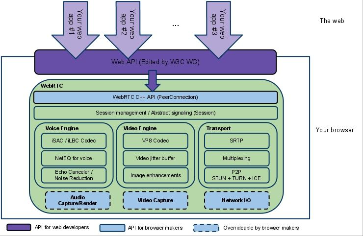

# WebRTC

WebRTC 全称是（Web browsers with Real-Time Communications (RTC)。可以快速在浏览器之间实现音视频通信。WebRTC 的前身是 GIPS，2011 年 google 收购了 GIPS，还收购了On2，得到了VPx系列视频编解码器。GIPS 是一个为 RTC 开发出许多组件的公司，例如编解码和绘声消除技术。Google 融合了GIPS的音视频引擎、VPx视频编解码器，P2P穿洞等技术并将其开源，并将其改为 webrtc，希望将其打造为行业标准。

WebRTC 也确实不负众望，主流浏览器都已经支持 WebRTC。经历了6年的时间，2017 年 11 月 2 日 ，W3C WebRTC 1.0 草案正式定稿，webrtc 正式成为互联网标准一员。WebRTC 最初是用于浏览器间实现实时音视频通信，但是由于其跨平台的架构设计，让其在桌面、移动端（IOS 和安卓）、loT 都可以使用。

需要注意，webrtc的应用和传统的成千上万人的直播应用是不一样的，首先，万人直播，通常观看人数多(依赖CDN的分发能力)，对实时性要求不高，单向推流（不考虑连麦的情况）；实时音视频对实时性要求高，双向通信（一对一或者一对多互动），数据传输一般是p2p直连或者turn服务中转。在线教育、视频客服、视频会议等都要求有实时互动的需求，且人数不是很多，适合使用webrtc。当然基于webrtc的“万人直播”也是可以实现，

WebRTC 是一个包括所有主流平台和服务器的项目，将其放在这里不太合适。既然主要关注于 Android 的 多媒体开发，暂且放在这里。

WebRTC 是一项标准协议，甚至可以在没有浏览器的设备上使用。

## WebRTC 的功能

- 获取音视频流，或者其他数据。
- 获取网络信息，例如 IP 地址和端口，以及为了能够建立连接需要在客户端之间（对等端）交换这些信息。甚至需要穿越 NAT 和防火墙。
- 协调启动/关闭会话,报告错误等信令通信。
- 交换有关媒体和客户端功能的信息，例如分辨率和编解码器。
- 传输音视频流或数据。

为了获取和传输视频流，WebRTC 实现了如下 API.

- MediaStream gets access to data streams, such as from the user's camera and microphone.
- RTCPeerConnection enables audio or video calling with facilities for encryption and bandwidth management.
- RTCDataChannel enables peer-to-peer communication of generic data.

### MediaStream

MediaStream API表示同步的媒体流。例如，从相机和麦克风输入的流具有同步的视频和音频轨道。

## WebRTC or RTMP

虽然 RTMP 历史较早，文档可能更多一些，但WebRTC 是主流趋势。

## WebRTC 的架构

从名字就可以看出 WebRTC 和 web 之间有着千丝万缕的联系， 为了支持不同系统，WebRTC 的核心功能由 C++ 开发，js 接口仅是对核心功能的一层封装。因此，WebRTC 不仅可以用于浏览器的音视频通信，还可以方便移植到各种 native 项目中。

(https://webrtc.github.io/webrtc-org/architecture/)

大的结构分为三层：分别为JS 标准API(紫色部分，如果不是 web 开发，用不到这部分。)、WebRTC 核心功能（绿色部分。而这一层又被分为了四个子核心功能层。分别是C++API层、会话管理层、引擎层、驱动层。），硬件相关代码和网络相关代码（底部蓝色部分，可以进行开发）。

具体的模块划分为：

- **Web API层**：依据 W3C 制定的标准，各个浏览器厂商实现的 JS 标准接口。方便 web 开发者快速实现音视频通信。在这层中开发者无需关心复杂的底层技术，只需了解webRTC的大致流程原理，调其API即可利用webRTC实现实时音视频的通讯功能。

- **C++ API层**：这部分是 C++的接口层。面向浏览器开发者，使浏览器制造商能够快速实现 JS 标准接口的封装。这一层的主要作用就是把WebRTC的核心功能暴露出来，如设备管理，音视频流数据采集等，方便各个软件厂商集成到自家应用中，比如浏览器厂商等。移植到各个软件中也是使用这层接口。

    其中 PeerConnection是该层最核心的一个模块，即对等连接模块；该模块中实现了很多功能，如P2P穿墙打洞、通信链路的建立和优选、流数据传输、非音视频数据传输、传输质量报告和统计等等。

- **会话管理层**（Session management / Abstract signaling (Session)）：这一层提供了会话功能管理功能，可进行创建会话、管理会话、管理上下文环境等。而这一层又会涉及到各种协议，比如说信令服务器的SDP协议等，主要用于进行信令交互和管理 RTCPeerConnection的连接状态。

- **引擎层** 这一层是 WebRTC 最核心的功能。有分为三个模块：

    - **音频引擎（VoiceEngine）**：音频引擎是一系列音频多媒体处理的框架，包括从视频采集卡到网络传输端等整个解决方案。

        - iSAC/iLBC/Opus等编解码。iSAC和iLBC是WebRTC内置的音频编码器。其中iSAC是针对VoIP（Voice over Internet Protocol，即基于IP的语音传输）和音频流在宽带和超宽带环境中进行音频传输的编解码器， 是WebRTC音频引擎的默认的编解码器，技术成熟，且被广泛应用在各种实时通信软件中；而iLBC则是VoIP在窄带环境中的语音编解码器，在网络丢包较为严重的情况下仍能保持较好通话质量。

        - NetEQ for voice。NetEQ是网络语音信号处理的组件，这个算法能自适应网络环境的变化，有效的处理因网络抖动而导致数据丢包所造成的音频质量问题，这一技术可谓是当年WebRTC的前身GIPS的看家本领。

        - 回声消除和降噪（Echo Canceler/Noise Reduction）。Echo Canceler是处理回声消除模块，能有效的消除采集音频带来的回声影响，比如说在实时音视频通话的过程中，打开手机扬声器的话， 本来的需求是录制本人的声音实时发送给对方的，但是由于存在回声，也会把对方说话的声音也录制进去。（市场上的一些手机录音的时候 本身是自带了回音消除功能，而且Android也提供有相关的API，但是好像大多数情况下，这个API都没起作用，可能是由于厂商兼容性问题，甚至有可能是直接阉割掉这个功能了。）因此想要做到录音是全平台适配回声消除功能的话就可以使用WebRTC的这个功能。而iOS平台上的录音是带有回声消除功能的。

            而Noise Reduction则是抑制噪音模块（也就是降噪），如有效的抑制多种噪音（如嘶嘶声，风扇噪音等）。

    - **视频引擎（VideoEngine）**：是一系列视频处理的整体框架，从摄像头采集视频、视频信息网络传输到视频显示整个完整过程的解决方案。

        - VP8编解码。VP8是第八代的On2视频，能以更少的数据提供更高质量的视频，而且只需较小的处理能力即可播放视频，为致力于实现产品及服务差异化的网络电视、IPTV和视频会议公司提供理想的解决方案。
            其数据压缩率和性能方面比市场上其他编解码器高，其功能特点非常适合实时通信，是WebRTC中默认的视频编解码器。
            VP9是Google提供的开源的免费视频codec，是VP8的后续版本，初始开发时命名为下一代开源视频或者VP-NEXT。
            VP9的开发始于2011年Q3，试图降低VP8的50%的码率而保持相同的质量，另外希望VP9比H.265（ High Efficiency Video Coding）有更好的编码效率。

        - jitter buffer：动态抖动缓冲。实时视频通信难免会因为网络的原因导致视频的抖动或者视频数据的丢失， 视频抖动缓冲器依靠独特的算法，有效的解决这类情况对直播会议质量造成较大的影响。

        - Image enhancements：图像增益。这个模块是用来做图像处理以提升视频画面质量的，如图像明暗度检测、颜色增强、降噪处理等。

    - **传输（Transport)**：传输 / 会话层，会话协商 + NAT穿透组件。数据传输除了音视频等流媒体数据之外，还可以传输文件、文本、图片等其他二进制数据，这些功能就是这个模块所提供的。
        - SRTP SRTP属于传输模块中的内容，在了解SRTP之前我们先来了解一下RTP。
            RTP (Real Time Protocol)提供了具有实时特征的、端到端的数据传送服务协议。而我们通常所说的RTCP等则是对RTP的控制协议
            RTP不像http和ftp等可完整的下载整个影视文件，它是以固定的数据格式在网络上发送数据，如果RTP的头部几个字节表示什么，音频数据或者视频数据包含在RTP中那几个字节中等等。
            
        - Multiplexing: 通道复用，即多个流数据传输共用一个通道， 以此提高传输效率。
        
        - P2P传输 STUN+TRUN+ICE实现的网络穿越。前面已经说过WebRTC是一种基于P2P的通信技术。而STUN、TURN、ICE这些则是实现P2P的一些关键技术。
            STUN、TURN、ICE又称为NAT穿透，在现实生活中不同局域网中的内外ip是无法直接通信的，比如说局域网A中192.168.2.1与局域网B中192.168.2.2是无法互相直接发送消息的， 那么如果要在两个不同的局域网中建立起可以直接通信的通道就得依靠STUN+TURN+ICE这些技术。

            而STUN、TURN和ICE又是使用不同方案进行穿透的

- **硬件模块**：音视频的硬件采集以及NetWork IO相关。

[参考 WebRTC架构图说明](https://mp.weixin.qq.com/s/V-oeG9lbx51haRlIEE0EmA)
[Web前端WebRTC攻略(一) 基础介绍](https://mp.weixin.qq.com/s/ev6dMOLIBzZLB4mcMJHVSw)

什么是信令（Signal）？字面来理解就是信号，在计算机眼里，就是一个消息。 

为什么需要信令？这就好比旧社会的男女双方的婚嫁前，需要“媒婆”的中介一样。媒婆需要把男女双方的条件，比如家庭情况，个人的基本情况等信息告知对方，男女双方都觉得可行了，才会进入正式一对一（P2P,无需媒婆中转消息）的交流。这个例子中，男女双方在“媒婆”中介阶段不会直接沟通，所有的意思都可要经过中转，所以，这个阶段的沟通特点就是信息量较小，沟通的内容都是比较关键的，“骚话”是不能讲的，媒婆毕竟也是生意人，她也要服务其他男女；到了男女自行沟通的阶段了，他俩爱讲啥都无所谓了，反正没有经过中转。 例子讲完了，信令也解释完了，信令就是媒婆中介时的“双方的关键的基本信息”，媒婆就是信令服务器，负责正式沟通前的信息中转。当然，为什么实时音视频通信也需要“媒婆”呢？因为，每个计算机的硬件不一样，有的电脑没有声音播放的设备，有的没有摄像头设备， 在通信前，只有知道了对方的情况，才能决定该发送视频的数据还是音频的数据。

P2P： 在webrtc的数据传输模块中会自动优选通信路线，优先使用p2p链路通信，如果p2p不成功，再使用中转通信，而建立P2P链路的过程就是我们俗称的“打洞、穿洞、NAT穿越”。

## 安装 git 扩展 depot_tools

depot_tools 是一个用于和 google 开源库管理平台 Chromium 对接的 git 扩展程序。由于 git 的提交是不具名的，所以为了加强开源项目的管理，google 开发了一套 git 扩展程序用于管理提交。

[安装](https://commondatastorage.googleapis.com/chrome-infra-docs/flat/depot_tools/docs/html/depot_tools_tutorial.html#_setting_up)

## 下载 WebRTC 客户端 Native 代码 / 各平台实现

通常所说的的 WebRTC 是用于 Web 前端的。想要在 Android、ios、Linux、Windos、MaxOS 系统上直接使用 WebRTC，而不是通过浏览器，则只需要下载 Native 部分。因为调用系统硬件需要平台支持，所以 WebRTC 项目开发的时候将将通用的部分使用 Native 代码，web 上使用的指示对 Native 代码的一层封装而已。

[各个平台 native 链接](https://webrtc.googlesource.com/src/+/refs/heads/master/docs/native-code/index.md)

### 安卓 App

安卓 App 想要使用 webrtc 有两种方式。

1. 使用 JNI 封装 webrtc 的 C++ 部分。 

2. WebRTC 为[安卓实现了一个 Java 包](https://webrtc.github.io/webrtc-org/native-code/android/)，方便安卓使用。既可以是使用已经编译好的，也可以自己打包 arr 包引入。这种方法在[新的官方文档](https://webrtc.googlesource.com/src/+/refs/heads/master/docs/native-code/android/index.md)上没有给出来，不知道是不是不在更新了。

## 服务器端

虽然语音通话可以通过建立对等链接（Peer Connection）而直接连接，但是在对等链接之前，建立连接的过程必须有一个中间服务器用于管理。这就是服务器的作用。这个中间服务器也叫信令服务器，负责管理房间，长连接等功能。

- WebRTC 的使用分为三种模式：
P2P(Peer to Peer) 模式：客户端之间建立对等连接（Peer Connection）

- SFU(Selective Forwarding Unit 选择性转发单元)模式:

- MCU(Multi-point Control Unit Multi-point Control Unit)

P2P 模式会尽量在客户端直接建立媒体数据连接，避免使用服务器转发媒体数据（控制，连接等仍要通过服务器）。

SFU 和 MCU 模式则一定会由服务器转发媒体数据。

> 猜测，待继续学习验证：
P2P 适合于音视频通话。
SFU 适合直播，只有一个人录视频，其他人都看。
MCU 适合视频会议，多人视频同时上传和接手。

作为信令服务器的的服务有多种实现，Google 给出的一个 demo 是 AppRTC。 

### 有用的资源

chrome://webrtc-internals/ 是 Chrome 浏览器内置的 WebRTC 调试工具。你可以在进行通话时使用该页面进行调试分析。它能够展示需索通话分析数据，展示通话过程中的内部工作。例如网络丢包、宽带、video 分辨率和大小。以及全部的 WebRTC API 的 log 数据。这些数据可以下载或导出。这些数据可以用户客户端有问题是的调试数据。

https://www.jianshu.com/p/43957ee18f1a
https://blog.csdn.net/lingshengxueyuan/article/details/100519054
https://blog.csdn.net/xiaojax/article/details/105372833

https://blog.csdn.net/momo0853/article/details/85157775

https://blog.csdn.net/tifentan/article/details/53462535
https://rtcdeveloper.com/t/topic/13341

https://blog.csdn.net/jieqiang3/article/details/89604025

